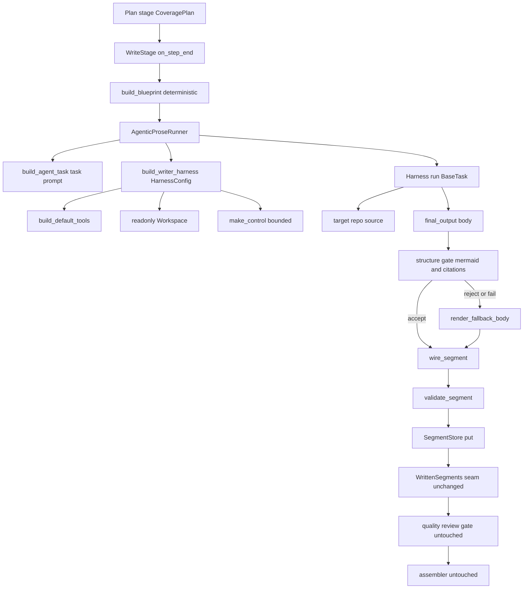
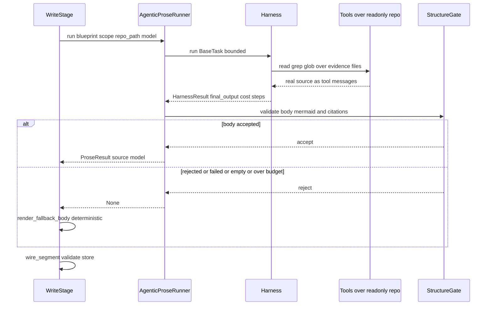

# Design Document

## Overview

**Purpose**: The `agentic-codebase-writer` replaces the `cobesy-writer`'s content-free
single-shot prose step with a bounded, HarnessX-agentic, codebase-grounded writer. Per
planned segment, the Write stage runs a real HarnessX agent (built-in read/grep/glob/bash
tools over a read-only `Workspace` rooted at the target repository, bounded by a Control
budget) that explores the actual source, grounds its prose in real code, and emits a
substantive, `file:line`-cited, Mermaid-diagrammed, COBESY-structured ontology `Segment`.

**Users**: The Wave 2 `quality-review-gate` consumes the written segment set verbatim; the
Wave 3 `mkdocs-site-assembler` publishes it. Documentation readers receive grounded,
diagram-rich pages that a static-site generator cannot produce. deepwiki-open is the quality
bar (strict model-generated Mermaid, mandatory `file:line` citations, source-grounded pages).

**Impact**: Changes the Write stage's prose surface from one `model.complete(messages,
tools=[])` call to a bounded `Harness.run(BaseTask(...))` agentic loop with tools and a
repo-rooted read-only Workspace. The deterministic structure work (COBESY blueprint, segment
wiring, fallback) and the frozen `WrittenSegments`/`Segment` output seam are preserved, so the
change is a single-stage swap of `docuharnessx/stages/write.py` plus one idempotent
`mkdocs.yml` Mermaid-fence enablement. The registry, `make_docgen`, the planner, the review
gate, the assembler page rendering, and the deployer are untouched.

### Goals
- Replace the Write stage's prose step in place (stable `STAGE_NAME='write'`/`WriteStage`/
  `make_write_stage`/module path); registry and `make_docgen` need zero edits.
- Per planned segment, run a real, bounded HarnessX agent that reads the target repo and
  produces a COBESY-structured, `file:line`-cited, Mermaid-diagrammed body.
- Keep determinism in the orchestration (blueprint, task assembly, wiring, segment ordering,
  bounded budgets); gate the agent's prose with a deterministic structure check; fall back to
  the deterministic body on failure/timeout/empty/invalid.
- Keep the run credential-free testable via a scripted fake-agent provider over a crafted
  fixture repo, exercising the real run loop and real read/grep tools, reaching the review
  accept path.
- Enable Mermaid rendering in the assembled Material site with one minimal, idempotent change.

### Non-Goals
- Planner subject-scoping, the home/index page, review-gate recalibration (separate specs).
- Any embedding/RAG/vector index — explicitly not built; HarnessX context is agentic-by-tools.
- Mutating any frozen contract (`CoveragePlan`, `RepoAnalysis`, `Segment`, `Vocabulary`,
  `SegmentStore`, `WrittenSegments`) or the stage registry / `make_docgen` composition.
- Producing the `CoveragePlan`/`RepoAnalysis`, model resolution, or harness composition.

## Boundary Commitments

### This Spec Owns
- The Write stage's per-segment prose surface: building and running a bounded HarnessX agent
  per planned segment and turning its final answer into the segment body.
- The agentic task-prompt assembly that seeds the COBESY blueprint structure and demands
  Mermaid + `file:line` citations, scoped to `PlannedSegment.evidence` + subjects.
- The deterministic structure gate (≥1 valid Mermaid fence, ≥N `file:line` citations) that
  decides whether an agent body is accepted or the deterministic fallback is used.
- The per-segment bounded budget configuration (max steps, max cost, token budget, loop
  detection) and the per-segment agentic telemetry recorded in the bounded journal.
- The scripted fake-agent provider and the crafted fixture repository for offline tests.
- The single `markdown_extensions` Mermaid-fence enablement in `build_mkdocs_yaml`.

### Out of Boundary
- The frozen `WrittenSegments`/`Segment` output seam, the `SegmentStore` port, the
  `CoveragePlan`/`RepoAnalysis`/`Vocabulary` inputs (consumed/produced verbatim).
- The deterministic `composition.blueprint`, `composition.wiring`, `composition.fallback`,
  and `composition.model` modules (reused unchanged).
- The stage registry, `make_docgen` bundle composition, the planner, the review gate, the
  assembler page/role rendering, and the deployer.
- Model resolution / credential handling (the bound model comes from the runtime).

### Allowed Dependencies
- HarnessX agentic APIs: `harnessx.tools.builtin.build_default_tools`,
  `harnessx.workspace.workspace.Workspace`, `harnessx.bundles.context`
  (`context`, `make_window_mgmt`), `harnessx.bundles.control.make_control`,
  `harnessx.core.harness` (`Harness`, `BaseTask`, `HarnessResult`, `HarnessConfig`),
  `harnessx.core.model_config.ModelConfig`.
- The existing composition core (`build_blueprint`, `wire_segment`,
  `render_fallback_body/summary`, `ProseResult`, `WriteFlag`, `WrittenSegments`,
  `WriterInputError`), `RunContext`, the planning model, the ontology
  (`validate_segment`, `Segment`, `SegmentStore`, `Vocabulary`).
- The bound model via `getattr(self, "_model_config", None).main` (the `PlanStage` pattern).

### Revalidation Triggers
- Any change to the `WrittenSegments`/`Segment`/`ProseResult` shape → review gate + assembler
  re-check.
- Any change to `PlannedSegment.evidence` / `CoveragePlan` shape → writer re-check.
- A change to the HarnessX agentic API surface (tool registry, Workspace modes, `Harness.run`
  result fields) → writer re-check.
- A change to the Material Mermaid rendering mechanism → assembler `mkdocs.yml` re-check.

## Architecture

### Existing Architecture Analysis

The merged `cobesy-writer` already established the pattern this spec extends:

- **Thin HarnessX adapter over a pure core.** `WriteStage(NoOpStage)` captures the run
  `State` at `on_task_start`, reads inputs via `RunContext` at `on_step_end`, composes each
  planned segment (blueprint → prose → fallback → wiring → validate → store), publishes
  `WrittenSegments` to `SLOT_WRITTEN_SEGMENTS`, and journals a bounded summary, then yields the
  content-free `StepEndEvent` unchanged.
- **Single model surface.** Only `composition.prose.generate_prose` consults a model. It is
  offloaded with `asyncio.to_thread` so its private loop never nests in the pipeline run loop.
- **Model access pattern.** `WriteStage._writer_model()` reads
  `getattr(self, "_model_config", None).main`, identical to `PlanStage._relevance_model`.
  `Harness.run` binds `_model_config` and `_rt` onto every processor.
- **Deterministic structure work preserved.** `build_blueprint`, `wire_segment`,
  `render_fallback_body/summary`, and the `WriteFlag`/`WrittenSegments` value objects are pure
  and reusable.

This spec changes only *what the model surface does*: from a single `complete(tools=[])` to a
bounded agentic `Harness.run`. The adapter lifecycle, the deterministic core, and the output
seam are preserved.

### Architecture Pattern & Boundary Map



**Architecture Integration**:
- Selected pattern: agentic prose surface behind the existing thin-adapter boundary.
- Domain boundaries: orchestration (deterministic) vs. the single agentic surface (model).
- Existing patterns preserved: the `PlanStage`/`WriteStage` lifecycle, `asyncio.to_thread`
  offload, `_writer_model()` model access, the frozen output seam.
- New components rationale: `composition/agent.py` runs the bounded agent;
  `composition/task_prompt.py` assembles the agentic task; `composition/harness_factory.py`
  builds the bounded `HarnessConfig` + read-only `Workspace`; `composition/structure_gate.py`
  validates Mermaid + citations. Each has one responsibility.
- Steering compliance: model in `ModelConfig` not `HarnessConfig`; compose with `|`; append,
  do not replace; no hardcoded roles/intents/subjects (all from the loaded `Vocabulary`).

### Dependency Direction

`composition.model` (data) → `composition.{blueprint,fallback,wiring,structure_gate,
task_prompt}` (pure) → `composition.harness_factory` (HarnessX config builder) →
`composition.agent` (runs the agent) → `stages/write.py` (adapter). Each layer imports only
from layers to its left; the adapter is the only module that touches the run lifecycle.

### Technology Stack

| Layer | Choice / Version | Role in Feature | Notes |
|-------|------------------|-----------------|-------|
| Agent framework | HarnessX (installed) | Bounded agentic run loop, tools, workspace, control | `build_default_tools`, `Workspace(mode="readonly")`, `make_control`, `Harness.run`/`BaseTask` |
| Runtime | Python 3.12 | Stage adapter + composition core | `asyncio.to_thread` offload (existing pattern) |
| Doc framework | Material for MkDocs | Mermaid rendering | `pymdownx.superfences` custom fence in `mkdocs.yml` |
| Test substrate | scripted fake provider + fixture repo | Credential-free offline e2e | mirrors `tests/_fakes.py` |

## File Structure Plan

### Directory Structure
```
docuharnessx/
├── composition/
│   ├── agent.py            # NEW: AgenticProseRunner — runs the bounded agent per segment,
│   │                       #      returns a ProseResult(source="model") or None
│   ├── task_prompt.py      # NEW: build_agent_task(blueprint, scope, repo_path) -> BaseTask
│   │                       #      seeds COBESY structure + Mermaid + file:line demands,
│   │                       #      scoped to PlannedSegment.evidence + subjects
│   ├── harness_factory.py  # NEW: build_writer_harness(...) -> HarnessConfig + readonly
│   │                       #      Workspace + bounded Control; writer budget constants
│   ├── structure_gate.py   # NEW: validate_agent_body(body, min_citations) -> GateResult
│   │                       #      (>=1 valid mermaid fence, >=N file:line citations)
│   ├── model.py            # REUSED unchanged (ProseResult, WriteFlag, WrittenSegments, errors)
│   ├── blueprint.py        # REUSED unchanged (deterministic COBESY blueprint)
│   ├── wiring.py           # REUSED unchanged (segment_id, wire_segment)
│   ├── fallback.py         # REUSED unchanged (deterministic fallback body/summary)
│   ├── prompt.py           # RETAINED (no longer the active prose path; kept for the core)
│   ├── prose.py            # RETAINED (single-shot gated path; no longer the active path)
│   └── __init__.py         # MODIFIED: re-export the new agentic entry points
├── assembler/
│   └── mkdocs_config.py    # MODIFIED: add markdown_extensions Mermaid superfences block
└── stages/
    └── write.py            # MODIFIED in place: swap the per-segment prose call from
                            # generate_prose to the agentic runner + structure gate;
                            # add agentic telemetry to the bounded journal summary
tests/
├── _fakes.py               # MODIFIED: add ScriptedAgentProvider (tool-call sequence + body)
├── fixtures/
│   └── agentic_repo/       # NEW: crafted fixture repository (deterministic reads/citations)
├── test_composition_agent.py        # NEW: agentic runner + fallback paths
├── test_composition_task_prompt.py  # NEW: deterministic task assembly + scoping
├── test_composition_structure_gate.py # NEW: mermaid/citation validation
├── test_composition_harness_factory.py # NEW: readonly workspace + bounded config
├── test_stage_write_agentic.py      # NEW: stage drives real run loop with the fake
└── test_assembler_mkdocs_mermaid.py # NEW: mermaid fence builds under strict mode
```

### Modified Files
- `docuharnessx/stages/write.py` — replace the model-surface call in `_prose_for`: when a
  model is bound, offload `AgenticProseRunner.run(blueprint, scope, repo_path, model)` via
  `asyncio.to_thread`, validate the returned body through the structure gate, and fall back to
  the deterministic body on `None`/reject. Read the target-repo path via
  `RunContext.target_repo()` and pass per-segment telemetry into the journal summary. Keep the
  stable `STAGE_NAME`/`WriteStage`/`make_write_stage`/module path and the input boundary.
- `docuharnessx/composition/__init__.py` — re-export `AgenticProseRunner`/`build_agent_task`/
  `build_writer_harness`/`validate_agent_body` and the writer budget defaults.
- `docuharnessx/assembler/mkdocs_config.py` — add a deterministic `markdown_extensions` block
  enabling `pymdownx.superfences` with the mermaid custom fence; change no other key.
- `tests/_fakes.py` — add `ScriptedAgentProvider`.

## System Flows

### Per-segment agentic write (happy path + fallback)



Gating notes: the agent run is bounded by `BaseTask(max_steps, max_cost_usd, token_budget)`
plus the Control bundle's loop detection and cost guard. A run that raises, times out, returns
empty, exceeds budget, or returns a body failing the structure gate yields `None`, and the
deterministic fallback keeps the segment usable. Bounds are applied per segment.

## Requirements Traceability

| Requirement | Summary | Components | Interfaces | Flows |
|-------------|---------|------------|------------|-------|
| 1.1 | Stable stage contract | WriteStage | `STAGE_NAME`/`make_write_stage` | — |
| 1.2 | Work on content-free step_end | WriteStage | `on_step_end` | per-segment flow |
| 1.3 | No-state pass-through | WriteStage | `_resolve_run_context` | — |
| 1.4 | Read inputs via RunContext | WriteStage | `_read_inputs` | — |
| 1.5 | No registry/bundle edits | WriteStage | (module path stable) | — |
| 2.1 | Read all input slots incl. repo path | WriteStage | `RunContext.target_repo` | — |
| 2.2 | Missing plan slot fatal | WriteStage | `WriterInputError` | — |
| 2.3 | Unsupported plan version fatal | WriteStage | `WriterInputError` | — |
| 2.4 | Missing vocab/store fatal | WriteStage | `WriterInputError` | — |
| 2.5 | Tolerate absent analysis | WriteStage, build_blueprint | `_read_inputs` | — |
| 2.6 | Missing/invalid repo path → fallback | WriteStage, AgenticProseRunner | `_prose_for` | fallback flow |
| 3.1 | Offer read/grep/glob/bash | harness_factory | `build_writer_harness` | per-segment flow |
| 3.2 | Read-only repo workspace | harness_factory | `Workspace(mode=readonly)` | per-segment flow |
| 3.3 | Scope to evidence + subjects | task_prompt | `build_agent_task` | per-segment flow |
| 3.4 | Tool outputs as context | AgenticProseRunner | `Harness.run` loop | per-segment flow |
| 3.5 | Final answer is the body | AgenticProseRunner | `task_end.final_output` | per-segment flow |
| 3.6 | No RAG/embedding | (architecture) | tools-only | — |
| 4.1 | Seed COBESY blueprint | task_prompt | `build_agent_task` | — |
| 4.2 | Demand valid Mermaid | task_prompt, structure_gate | `build_agent_task`/`validate_agent_body` | — |
| 4.3 | Demand file:line citations | task_prompt, structure_gate | same | — |
| 4.4 | Validate mermaid+citations | structure_gate | `validate_agent_body` | gate |
| 4.5 | Accepted body used verbatim | WriteStage, wiring | `wire_segment` | — |
| 4.6 | No hardcoded vocabulary | task_prompt | blueprint labels | — |
| 5.1 | Per-run step/cost/token + loop caps | harness_factory, AgenticProseRunner | `make_control`/`BaseTask` | per-segment flow |
| 5.2 | Stop at bound, use partial/fallback | AgenticProseRunner | `_run_bounded` | gate/fallback |
| 5.3 | Per-segment bounds | AgenticProseRunner | new `Harness` per segment | — |
| 5.4 | Model from runtime; none → fallback | WriteStage | `_writer_model` | — |
| 5.5 | Off the run loop thread | WriteStage | `asyncio.to_thread` | — |
| 6.1 | Failure/timeout/empty/invalid → fallback | AgenticProseRunner, WriteStage | `_prose_for` | fallback flow |
| 6.2 | Record prose provenance | WriteStage | `ProseResult.source` | — |
| 6.3 | No model → fallback all | WriteStage | `_prose_for` | — |
| 6.4 | Empty plan → empty set | WriteStage | `_write_segments` | — |
| 6.5 | Plan order preserved | WriteStage | `_write_segments` | — |
| 6.6 | Validation/id-conflict flag + continue | WriteStage | `_store_or_flag` | — |
| 7.1 | Same WrittenSegments seam | WriteStage, model | `set_written_segments` | — |
| 7.2 | Store + same identities | WriteStage | `store.put` | — |
| 7.3 | Non-body fields deterministic | wiring | `wire_segment` | — |
| 7.4 | Every segment represented | WriteStage | `WrittenSegments` | — |
| 7.5 | No downstream change | (architecture) | seam unchanged | — |
| 8.1 | Bounded journal summary | WriteStage | `_summary_detail` | — |
| 8.2 | Per-segment telemetry, no bodies | WriteStage, AgenticProseRunner | `AgentRunStats` | — |
| 8.3 | Bounded entries for large plans | WriteStage | caps | — |
| 9.1 | Scripted fake agent provider | ScriptedAgentProvider | `complete` w/ tool_calls | — |
| 9.2 | Real run loop + real tools, no net | tests | fixture repo | per-segment flow |
| 9.3 | Crafted fixture repo | tests/fixtures | — | — |
| 9.4 | Reaches review accept path | tests | full pipeline | — |
| 9.5 | Deterministic core unit-testable | structure_gate, task_prompt, fallback | pure fns | — |
| 10.1 | Enable Mermaid superfence | mkdocs_config | `build_mkdocs_yaml` | — |
| 10.2 | Minimal idempotent change | mkdocs_config | `markdown_extensions` | — |
| 10.3 | Strict build succeeds | tests | assembler build test | — |

## Components and Interfaces

| Component | Domain/Layer | Intent | Req Coverage | Key Dependencies (P0/P1) | Contracts |
|-----------|--------------|--------|--------------|--------------------------|-----------|
| build_agent_task | composition (pure) | Assemble the bounded agentic task prompt scoped to evidence+subjects, demanding COBESY+Mermaid+citations | 3.3, 4.1, 4.2, 4.3, 4.6 | CompositionBlueprint (P0) | Service |
| build_writer_harness | composition (config) | Build bounded HarnessConfig + read-only Workspace + Control | 3.1, 3.2, 5.1 | HarnessX bundles (P0) | Service |
| AgenticProseRunner | composition (runner) | Run the bounded agent, return grounded ProseResult or None | 3.4, 3.5, 5.2, 5.3, 6.1 | Harness.run (P0), structure_gate (P0) | Service |
| validate_agent_body | composition (pure) | Gate: >=1 valid Mermaid fence, >=N file:line citations | 4.4, 9.5 | — | Service |
| WriteStage (modified) | stages (adapter) | Swap prose surface to agentic; fallback; journal telemetry | 1.x, 2.x, 5.4, 5.5, 6.x, 7.x, 8.x | composition core (P0), RunContext (P0) | Service, State |
| build_mkdocs_yaml (modified) | assembler (pure) | Add Mermaid superfence | 10.1, 10.2, 10.3 | yaml (P1) | Service |
| ScriptedAgentProvider | tests | Deterministic tool-call sequence + final body | 9.1, 9.2 | ModelResponseEvent (P0) | Service |

### Composition Core

#### build_agent_task (composition/task_prompt.py)

| Field | Detail |
|-------|--------|
| Intent | Build the deterministic agentic `BaseTask` for one segment |
| Requirements | 3.3, 4.1, 4.2, 4.3, 4.6 |

**Responsibilities & Constraints**
- Pure function over the `CompositionBlueprint` plus an exploration scope (the segment's
  evidence file paths + subject phrases) and the target-repo path. Never consults a model.
- The task `description` instructs the agent to: start from the listed evidence files, read
  the real source with the tools, honor the COBESY structure from the blueprint (SCQA → Minto
  lead → working-memory chunks → REDUCE fast path; andragogy framing when flagged), include at
  least one valid Mermaid diagram (supported type, vertical, short nodes, valid arrows), and
  cite real `file:line` sources for at least the configured minimum number of files.
- All audience/intent framing derives from blueprint labels (loaded `Vocabulary`); no
  hardcoded role/intent/subject literals (4.6).
- Equal `(blueprint, scope, repo_path)` yield an equal task description (deterministic).

##### Service Interface
```python
def build_agent_task(
    blueprint: CompositionBlueprint,
    *,
    repo_path: str,
    min_citations: int = MIN_CITED_FILES,
    max_steps: int = WRITER_MAX_STEPS,
    max_cost_usd: float = WRITER_MAX_COST_USD,
    token_budget: int = WRITER_TOKEN_BUDGET,
) -> BaseTask: ...
```
- Preconditions: `blueprint` is fully populated; `repo_path` resolves to a directory.
- Postconditions: returns a `BaseTask` carrying the bounded caps and the scoped prompt.
- Invariants: pure; never mutates `blueprint`; deterministic for equal inputs.

#### build_writer_harness (composition/harness_factory.py)

| Field | Detail |
|-------|--------|
| Intent | Build the bounded `HarnessConfig` + read-only Workspace for the writer agent |
| Requirements | 3.1, 3.2, 5.1 |

**Responsibilities & Constraints**
- Compose `context | make_window_mgmt() | make_control(loop_threshold=..., max_cost_usd=...,
  include_budget=True, token_threshold=...)` into a `HarnessConfig` with
  `tool_registry=build_default_tools()` and a `Workspace(agent_id="docuharnessx-writer",
  root=repo_path, mode="readonly")`.
- The model is NOT placed in the `HarnessConfig` (steering rule); it is bound by the caller via
  `ModelConfig(main=...).agentic(config)`.
- Read-only workspace blocks writes/edits to the target repo (3.2); the default tool registry
  is offered but writes are jailed.

##### Service Interface
```python
def build_writer_harness(
    repo_path: str,
    *,
    loop_threshold: int = WRITER_LOOP_THRESHOLD,
    max_cost_usd: float = WRITER_MAX_COST_USD,
    token_threshold: int = WRITER_TOKEN_THRESHOLD,
) -> HarnessConfig: ...
```
- Preconditions: `repo_path` resolves to an existing directory.
- Postconditions: returns a model-free `HarnessConfig` with a read-only repo Workspace and a
  bounded Control bundle.
- Invariants: never embeds a model; never enables write tools against the real repo (readonly
  workspace enforces this).

#### AgenticProseRunner (composition/agent.py)

| Field | Detail |
|-------|--------|
| Intent | Run the bounded agent for one segment; return a grounded body or `None` |
| Requirements | 3.4, 3.5, 5.2, 5.3, 6.1, 8.2 |

**Responsibilities & Constraints**
- Build the harness via `build_writer_harness(repo_path)`, bind the model via
  `ModelConfig(main=model).agentic(config)`, build the task via `build_agent_task(...)`, and
  `await harness.run(task)`.
- Take the body from `result.task_end.final_output`; run it through `validate_agent_body`.
- On an accepted body return `ProseResult(body=<verbatim>, summary=<derived>,
  source="model")`; on raise/timeout/empty/over-budget/rejected return `None` (the caller
  renders the deterministic fallback). Never raises — all failures are absorbed and logged.
- Expose per-run telemetry (`AgentRunStats`: `steps`, `cost_usd`, `exit_reason`, `accepted`)
  for the bounded journal; never include the body, tool outputs, or transcript (8.2).
- Synchronous entry point so the stage offloads it with `asyncio.to_thread` (5.5); it drives
  the harness coroutine on its own private loop (mirroring `prose._complete_with_timeout`).

##### Service Interface
```python
@dataclass(frozen=True)
class AgentRunStats:
    steps: int
    cost_usd: float
    exit_reason: str
    accepted: bool

class AgenticProseRunner:
    def run(
        self,
        blueprint: CompositionBlueprint,
        *,
        repo_path: str,
        model: object,
    ) -> tuple[ProseResult | None, AgentRunStats]: ...
```
- Preconditions: `model` is a bound `BaseModelProvider`-shaped object; `repo_path` valid.
- Postconditions: `(ProseResult|None, AgentRunStats)`; `ProseResult.source == "model"` only on
  an accepted body.
- Invariants: never raises; one bounded `Harness.run` per call; the segment body is the final
  assistant answer verbatim when accepted.

#### validate_agent_body (composition/structure_gate.py)

| Field | Detail |
|-------|--------|
| Intent | Deterministic structure gate for an agent body |
| Requirements | 4.4, 9.5 |

**Responsibilities & Constraints**
- Pure function: accept iff the body contains at least one fenced ```` ```mermaid ```` block
  whose first content line names a supported diagram type (`graph`, `flowchart`,
  `sequenceDiagram`, `classDiagram`, `erDiagram`, `stateDiagram`) AND at least `min_citations`
  distinct `file:line` citations (a path token followed by `:<digits>`).
- Returns a `GateResult(accepted: bool, mermaid_blocks: int, cited_files: int, reason: str)`.
- Deterministic; equal body yields an equal result; never raises.

##### Service Interface
```python
@dataclass(frozen=True)
class GateResult:
    accepted: bool
    mermaid_blocks: int
    cited_files: int
    reason: str

def validate_agent_body(body: str, *, min_citations: int = MIN_CITED_FILES) -> GateResult: ...
```
- Preconditions: `body` is a string (possibly empty).
- Postconditions: `accepted` is `True` iff both structural conditions hold.
- Invariants: pure; deterministic; no I/O.

### Stage Adapter

#### WriteStage (modified — stages/write.py)

| Field | Detail |
|-------|--------|
| Intent | Swap the per-segment prose surface to the bounded agent; keep everything else |
| Requirements | 1.1–1.5, 2.1–2.6, 5.4, 5.5, 6.1–6.6, 7.1–7.4, 8.1–8.3 |

**Responsibilities & Constraints**
- Keep the stable contract, the input boundary (`_read_inputs` raising `WriterInputError`),
  the plan-order iteration, the validate/store/flag logic, the `WrittenSegments` publication,
  and the bounded journal — all unchanged in shape.
- Additionally read `RunContext.target_repo()`. If it is unset or does not resolve to a
  directory, skip the agentic attempt and use the deterministic fallback for every segment,
  recording the reason (2.6) — never crash.
- Replace `_prose_for`: when a model is bound and the repo path is valid, offload
  `AgenticProseRunner.run(blueprint, repo_path=..., model=...)` via `asyncio.to_thread`;
  run the returned body (if any) through `validate_agent_body` inside the runner; on an
  accepted `ProseResult` use it, otherwise render the deterministic fallback. When no model is
  bound, render the deterministic fallback without attempting a run (5.4, 6.3).
- Collect each segment's `AgentRunStats` and fold a bounded aggregate (e.g. total agent steps,
  total agent cost, accepted/fallback counts) into the journal summary (8.1, 8.2), never the
  body/transcript.

##### State Management
- State model: same as today — the run `State` captured at `on_task_start`, read via
  `RunContext`; the `SegmentStore` and `SLOT_WRITTEN_SEGMENTS` are the only outputs.
- Concurrency: the agent runs off the pipeline run loop's thread via `asyncio.to_thread`; one
  bounded `Harness` per segment.

**Implementation Notes**
- Integration: reuse `_writer_model()` verbatim for model access; reuse the existing
  `_store_or_flag`/`_aggregate_prose_source` machinery; only the body source changes.
- Validation: the structure gate runs before `wire_segment`; the existing `validate_segment`
  against the `Vocabulary` is unchanged.
- Risks: agent non-determinism (mitigated by gate + fallback); cost (mitigated by per-segment
  bounds); never let an agent error escape the segment loop.

### Assembler

#### build_mkdocs_yaml (modified — assembler/mkdocs_config.py)

| Field | Detail |
|-------|--------|
| Intent | Enable Mermaid rendering via `pymdownx.superfences` custom fence |
| Requirements | 10.1, 10.2, 10.3 |

**Responsibilities & Constraints**
- Add a deterministic `markdown_extensions` entry enabling `pymdownx.superfences` with the
  mermaid custom fence (`name: mermaid`, `class: mermaid`,
  `format: !!python/name:pymdownx.superfences.fence_code_format`). The YAML emitter must
  preserve the Python-name tag (use the appropriate dumper so the `!!python/name:` tag is
  emitted, not quoted), so MkDocs Material renders fenced `mermaid` blocks.
- Change no other key (`site_name`/`site_url`/`theme`/`plugins`/`nav` unchanged); the block is
  a single fixed addition (idempotent). Byte-stable for equal inputs.

##### Service Interface
- Unchanged signature `build_mkdocs_yaml(identity, role_pages, vocab) -> str`; the returned
  YAML gains the `markdown_extensions` block.

**Implementation Notes**
- Integration: the custom-fence `format` value is a Python object reference, so emit it via the
  superfences-compatible representation (a small dumper customization) rather than a quoted
  string; covered by a build test that renders a Mermaid page under `mkdocs build --strict`.

### Tests

#### ScriptedAgentProvider (tests/_fakes.py)

| Field | Detail |
|-------|--------|
| Intent | Drive the real run loop deterministically with no network |
| Requirements | 9.1, 9.2 |

**Responsibilities & Constraints**
- A `BaseModelProvider`-shaped fake whose `complete` returns, in order, one or more
  `ModelResponseEvent`s carrying `tool_calls` (e.g. `read`/`grep` over the fixture repo) with
  `finish_reason != "end_turn"`, then a final `ModelResponseEvent` with `content` set to a
  grounded body (containing a valid Mermaid fence and ≥N `file:line` citations pointing at the
  fixture files) and `finish_reason="end_turn"`.
- The run loop executes the real tools against the fixture repo, appends the results as
  `role=tool` messages, and ends the turn on the final content — exercising 3.1–3.5 offline.
- The final body must satisfy both `validate_agent_body` and the review gate's accept path so
  the assembled site is non-empty (9.4).

## Error Handling

### Error Strategy
- **Fatal input errors** (missing plan/vocab/store, unsupported plan version): raise
  `WriterInputError` at the stage boundary, no partial output (2.2–2.4) — unchanged.
- **Recoverable agentic errors** (raise/timeout/empty/over-budget/invalid body, missing/invalid
  repo path): absorbed inside `AgenticProseRunner`/`WriteStage`; render the deterministic
  fallback and continue (2.6, 6.1, 6.3).
- **Per-segment isolation**: a validation failure or id conflict flags that segment and the
  loop continues (6.6) — unchanged.

### Error Categories and Responses
- **System errors**: agent exceptions / provider failures → logged WARNING, `None`, fallback.
- **Budget exhaustion**: step/cost/token bound or loop halt → stop the run, use partial answer
  if it passes the gate, else fallback (5.2).
- **Business-logic errors**: a body without Mermaid or without enough citations → gate rejects,
  fallback (4.4, 6.1).

### Monitoring
- The bounded journal records per-run `steps`/`cost_usd`/`exit_reason`/`accepted` aggregates
  and the aggregate prose source; never full bodies/tool outputs/transcripts (8.1–8.3).

## Testing Strategy

### Unit Tests
- `validate_agent_body`: accepts a body with one `graph TD` fence + N citations; rejects a body
  with no Mermaid; rejects a body with too few citations; counts distinct cited files (4.4).
- `build_agent_task`: deterministic for equal inputs; scopes to evidence files + subjects;
  embeds COBESY structure; demands Mermaid + citations; uses only blueprint labels (3.3, 4.1,
  4.6).
- `build_writer_harness`: produces a model-free `HarnessConfig` with a read-only Workspace
  rooted at the repo and a bounded Control bundle; a write attempt against the workspace is
  blocked (3.1, 3.2, 5.1).
- `AgenticProseRunner`: returns `source="model"` on an accepted body; returns `None` on
  raise/timeout/empty/rejected; emits `AgentRunStats` without the body (5.2, 6.1, 8.2).

### Integration Tests
- `test_stage_write_agentic`: with the `ScriptedAgentProvider` and the fixture repo, the stage
  drives the real run loop + real read/grep tools, produces a segment whose body has Mermaid +
  `file:line` citations, stores it, and publishes the unchanged `WrittenSegments` seam (3.x,
  7.x, 9.1–9.3).
- Repo-path-missing path: with no `target_repo` slot, the stage falls back deterministically
  for every segment and never crashes (2.6, 6.3).
- No-model path: the stage produces deterministic fallback bodies for every planned segment
  (5.4, 6.3).
- `test_assembler_mkdocs_mermaid`: a site whose page contains a `mermaid` fence builds under
  `mkdocs build --strict` without error (10.1, 10.3).

### E2E Tests
- Full credential-free pipeline (write → review → assemble → build) with the scripted fake
  reaches the review accept path and produces a non-empty built site with a rendered Mermaid
  diagram (9.4, 10.3).
