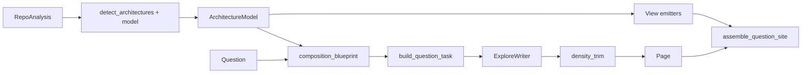

# Design Document

## Overview

**Purpose:** Give generated sites one architecture model, zoomable views,
and question pages whose first screen is a short story at the right
abstraction — using COBESY as authoring infrastructure, not as labels.

**Users:** Adopters (depth 1), architects/operators (2–4), programmers
(5–7).

**Impact:** Extends `ComprehensionSignals` with a frozen architecture
model; derives existing C4/layered/service emitters from that model;
changes explore-first `build_question_task` to include a blueprint;
adds a deterministic density trim on `Page.summary`; does not change
living-page store schema besides using shorter summaries going forward.

### Goals

- Shared node identity across views.
- Abstraction level on nodes and pages.
- COBESY blueprint + prompt + density trim.
- Catalog ordered as architecture story first.

### Non-Goals

- VP/Sparx/Archi/Structurizr products.
- SysML, ReqIF, TOGAF ADM, BPMN, ArchiMate notation.
- Role × Intent pages.
- A second model call to “rewrite more beautifully.”

## Architecture

Detection stays in `docuharnessx/comprehension/`. Writing stays in
`docuharnessx/composition/`. Assemble still owns pictures.

## Data models

### AbstractionLevel

Closed set: `context` | `container` | `component` | `code`.

### ArchitectureNode (frozen)

- `id: str` (stable: `actor:operator`, `system`, `container:{name}`,
  `component:{name}`, `external:{kind}`)
- `label: str`
- `level: AbstractionLevel`
- `kind: str` (actor, system, container, component, external, store)
- `path: str | None`
- `band: str | None` (interface, application, domain, …)

### ArchitectureEdge (frozen)

- `source: str`
- `target: str`
- `verb: str` (runs, reads, publishes, depends on, uses, needs)
- `evidence: str` (detector id or path)

### ArchitectureModel (frozen)

- `system_name: str`
- `nodes: tuple[ArchitectureNode, ...]`
- `edges: tuple[ArchitectureEdge, ...]`
- `styles: tuple[ArchitectureStyle, ...]` (already detected)
- `requirement_links: tuple[tuple[str, str], ...]` (hit path → node id)

Additive on `ComprehensionSignals`: `model: ArchitectureModel | None = None`
(or `architectures` remains and `model` sits beside it). Prefer **one
field** `model` that embeds styles, and keep `architectures` as a
derived tuple for one release to avoid breaking tests — then derive
styles from the model only.

**Decision:** add `ArchitectureModel` and `signals.model`. Keep
`signals.architectures` populated from the same detector so current
layered views do not go blank during the switch. Views that can read
the model must prefer it.

### CompositionBlueprint (frozen, question-scoped)

- `governing_idea: str` (one sentence from question title + subject)
- `audience: str` (adopter | operator | programmer — from kind)
- `purpose: str` (answer the question)
- `opening: tuple[str, str, str]` (actor, happening, stake) — cues,
  not prose
- `skeleton: tuple[str, ...]` (≤5 section heads, kind-specific)
- `abstraction: AbstractionLevel`
- `density: DensityBudget` (summary_sentences=2, summary_chars=280,
  max_h2=5)

Built in `docuharnessx/composition/blueprint_question.py` (new),
model-free. Does not use the retired Role × Intent blueprint.

## Detection

`build_architecture_model(analysis, identity, styles) -> ArchitectureModel`

- Actors: Operator if CLI/main; User otherwise.
- System node from identity.site_name.
- Externals: repo, CI, docs site, compose services (already used).
- Containers: architecture bands or real components (noise filtered).
- Edges: actor→system runs; system→repo reads; CI→system; band
  adjacency depends on; entrypoint→component uses (name match only).
- Level: system+actors+externals = context; band members = container;
  leftover modules = component.

Fail-closed: no edge without a detector reason.

## View emitters

Replace ad-hoc `render_c4_context` / layered render inputs with:

- `view_context(model)`
- `view_container(model)`
- `view_style(model, style_id)` (layered / services / …)
- `view_sequence(model)` (actor → CLI → containers with uses edges)
- `view_use_case(model)` if CLI commands exist
- `view_deployment(model)` if docker/CI deploy jobs exist

Each returns mermaid or `""`. Catalog lists each once.

Per-question file graphs stay at depth 5 and are **not** in the
architecture model.

## Writer path

1. `blueprint = build_question_blueprint(question, model)`
2. `build_question_task` appends a “Composition” block: governing idea,
   opening cues, skeleton heads, “put citations under ## Grounding”,
   “summary: two sentences, no path:line”, “do not write the words
   SCQA/Minto/COBESY”.
3. After the substance gate, `trim_summary(page) -> Page` (replace
   summary if over cap; first two sentences; strip `path:line`).
4. Assemble: depth 1 = trimmed summary; pictures from model at the
   page’s abstraction; body at 5; grounding at 7.

No extra model call for trim.

## Density vs substance

| Gate | When | Pass means |
|---|---|---|
| Substance | after write | citations + real symbols + no template slogans |
| Density | after substance | summary ≤ 2 sentences / 280 chars, no `path:line` in summary |

Substance failure → omit page. Density failure → trim, keep page.

## Requirements links

Join `RequirementHit.text` tokens with node labels / band ids
(casefold whole-word, length ≥ 4). Store pairs on the model. Glossary
or a small “Requirements” subsection on the architecture catalog lists
linked cards.

## Testing

- Model byte-stable on a fixture with CLI + three layered modules.
- Two views share node labels.
- No layered view when fewer than three bands.
- Blueprint deterministic; prompt contains governing idea and forbids
  jargon.
- Trim cuts a 600-char summary with citations to ≤ 280 without
  `path:line`.
- Assembled depth-1 layer has no mermaid file-graph and no `path:line`.
- `mkdocs build --strict` on a fixture that includes context + layered
  views.

## Requirements traceability

| Req | Design |
|---|---|
| 1 | ArchitectureModel + build_architecture_model |
| 2 | AbstractionLevel on nodes and pages |
| 3 | view_* from model; catalog order |
| 4 | allow-listed extra views, omit if empty |
| 5 | CompositionBlueprint + prompt adapter |
| 6 | trim_summary |
| 7 | assemble depth mapping |
| 8 | requirement_links |
| 9 | frozen values, no model in detect, living pages untouched |
| 10 | diagrams.md grouping |

## Risks

- Layer names will mis-file some modules (`pipeline` as application).
  Accept; evidence list stays visible; operator can later override in
  yaml (not in this spec unless cheap).
- Trimming summaries of already-stored living pages only applies on
  **new writes** unless assemble also trims at render. **Decision:**
  assemble trims the displayed depth-1 summary so old living pages
  improve without a regenerate. Store is unchanged unless the writer
  runs.
- Prompt change may shift substance-gate pass rate. Keep citation
  rules; only move them to grounding.
