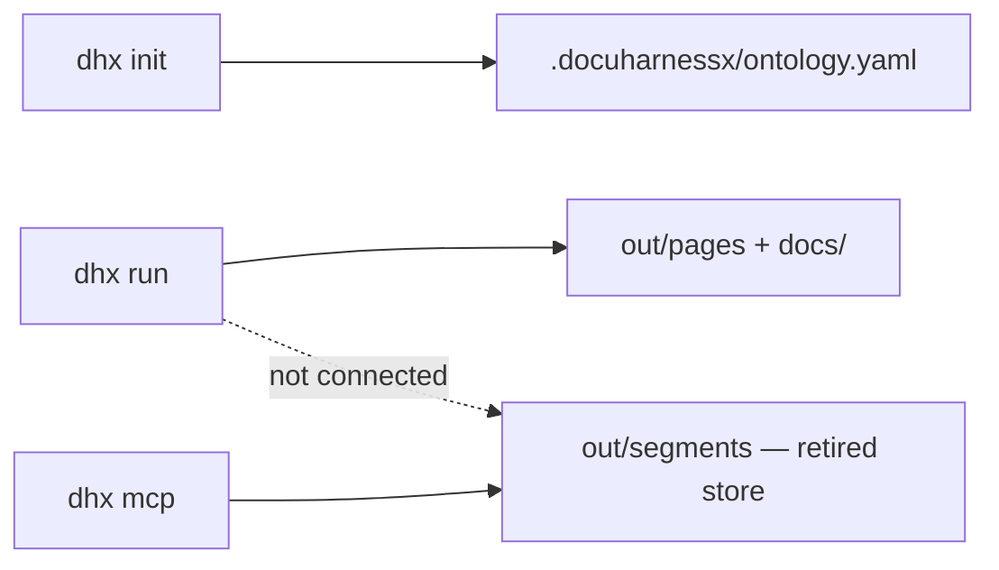
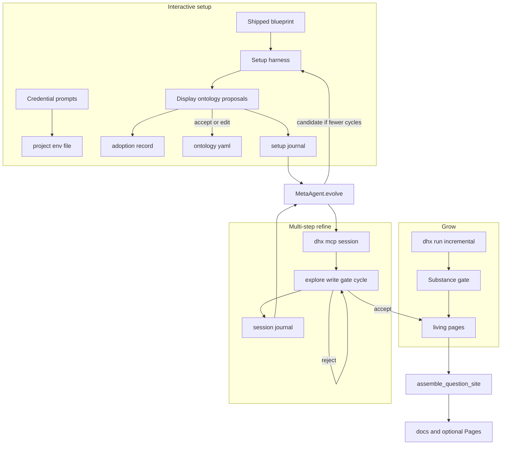
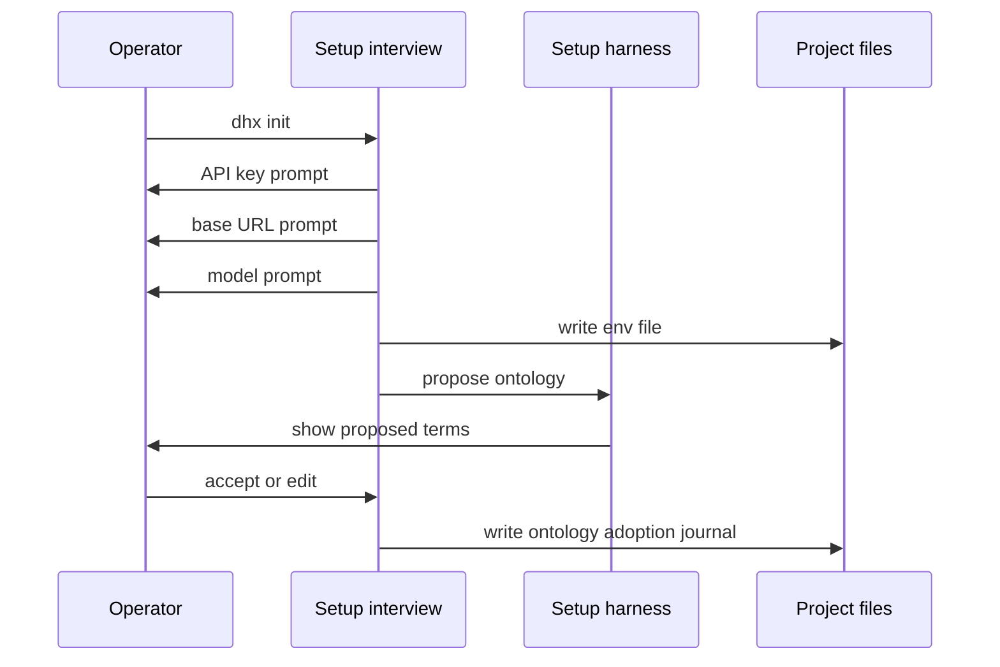

# Design Document

## Overview

This feature turns DocuHarnessX from a one-shot generator into a **project-local adoption loop**. A **setup harness** adopts the shipped blueprint and **manages the ontology** for that repository. The operator grows living pages over time with incremental batch writes plus **multi-step** refine. Refine/setup **traces evolve the harness** so later similar work takes fewer cycles. Living pages stay fail-closed.

**Purpose**: Setup-owned ontology via an interactive interview, multi-step refine, harness evolution from tracked journals aimed at fewer steps.
**Users**: Operators adopting DocuHarnessX on their own repos; readers of the living site.
**Impact**: `dhx init` becomes the default interview (credentials with DeepSeek Enter defaults, then harness-displayed ontology proposals) with a `--default` / no-model YAML fallback. `dhx run` is incremental. `dhx mcp` is a multi-cycle session on living pages. A new evolve pass calls HarnessX `MetaAgent.evolve` on writer/setup configs. Model RL training is not used.

### Goals

- Default `dhx init` is an interview: credentials first (DeepSeek Enter defaults, existing key as `***`), then the setup harness displays ontology proposals for accept or edit.
- Setup harness writes and later manages `.docuharnessx/` ontology from the shipped blueprint, scoped to those files.
- Journals, ontology, living pages, and the adoption record are project files and are not gitignored; `.env` stays gitignored.
- Living pages persist and survive later runs unless explicitly regenerated.
- Refine is a session of several explore/write/gate cycles, not one rewrite.
- Evolution uses session journals to cut median cycles-to-accept; it cannot weaken the substance gate or write pages as a side effect.
- Sufficiency remains an operator declaration plus coverage and step counts.

### Non-Goals

- Training or replacing the underlying LLM (`harnessx.rl` weight training).
- Changing question planning or substance-gate accept rules; evolving the gate away.
- Role × Intent pages; a second writer or RAG index.

## Boundary Commitments

### This Spec Owns

- Blueprint identity (`name` + `version`) shipped with the package.
- Setup interview (credentials + proposal accept/edit) and setup harness that inits and manages ontology under `.docuharnessx/` (write-scoped).
- Project `.env` write for accepted credentials; never print the raw API key.
- Adoption record on disk (blueprint version, sufficiency, timestamps, current harness snapshot pointer).
- Version-control ignore rules for the project store: track journals/ontology/pages/adoption/harness snapshots; ignore secrets and throwaway assemble output.
- Living page store API and filesystem adapter under the target project.
- Incremental skip/regenerate behaviour in the pipeline runner.
- Multi-step refine sessions on living pages (list/get/validate/cycle/reassemble).
- Harness evolution from journals via `harnessx.meta_harness.MetaAgent`, fitness = fewer cycles-to-accept.
- Status report (coverage + step counts) and sufficiency declaration CLI.
- Tests for setup harness, incremental keep, multi-cycle refine, evolution reject-if-gate-weakened, stale sufficiency.

### Out of Boundary

- `RepoAnalysis` detectors and question-kind planning rules.
- Substance-gate accept criteria (reuse as-is; evolution must not remove it).
- HarnessX provider internals and `harnessx.rl` model training.
- MkDocs theme, mermaid companions, and deploy-mode semantics.
- Ontology-engine `Vocabulary` schema (harness writes files the engine validates).
- MCP overview tools (`draft_overview` / `refine_overview` / `get_overview`): fail closed after retarget, not redesigned here.

### Allowed Dependencies

- `default_profile`, `vocabulary_to_config`, `load_vocabulary`, `run_init` (no-model fallback)
- `plan_questions`, `write_questions`, `build_question_task`, `validate_page_body`
- Additive `guidance` on the question-task path
- `assemble_question_site`, `deploy_site`
- `Page` / `Omission` / `RunReport`
- Existing MCP stdio server factory (session becomes a multi-cycle refine)
- `harnessx.meta_harness.MetaAgent`, `compute_changeset`, journal traces already produced by writer runs
- Writer harness factory (`build_writer_harness`) as the genome being evolved

### Revalidation Triggers

- Living page file layout or `Page` field set
- Adoption record schema
- Incremental skip vs regenerate CLI flags
- MCP tool argument names that clients already call
- Sufficiency stale rule
- Default credential prompt values (DeepSeek base URL and shipped model id)
- Which `.docuharnessx/` paths are tracked vs ignored

## Architecture

### Existing Architecture Analysis



Init currently dumps YAML with no harness. Run writes throwaway-or-out pages. MCP is one-shot on a store the current run does not fill. Evolution is unused.

### Architecture Pattern & Boundary Map

Selected pattern: **setup harness + project-local store + multi-step refine + meta-harness evolution**.



Analyze / plan / gate / assemble stay ordinary Python. HarnessX is used for setup, per-page write, refine cycles, and meta-evolution of those harness configs. The substance gate is never inside the evolved genome as something that can be deleted.

### Technology Stack

| Layer | Choice | Role |
|---|---|---|
| CLI | existing `dhx` | `init` = interview then setup harness; `run` incremental; `status`; `sufficient`; `mcp` session; `evolve` |
| Interview | TTY prompts, injectable `input_fn` | API key / base URL / model; then proposal accept or edit |
| Config | YAML next to ontology | adoption record + pointer to current harness snapshot |
| Store | filesystem markdown | living `Page` files |
| Writer / setup | harness factory + write-scope gate on `.docuharnessx/` | batch, refine cycles, ontology management |
| Evolution | `harnessx.meta_harness.MetaAgent` | journals → harness changeset; no `harnessx.rl` |
| Publish | existing deployer | after non-empty assemble |

## File Structure Plan

| Path | Action | Responsibility |
|---|---|---|
| `docuharnessx/blueprint.py` | create | `BLUEPRINT_NAME`, `BLUEPRINT_VERSION`; describe shipped contract |
| `docuharnessx/adoption.py` | create | load/save `AdoptionRecord`; adopt; declare sufficient; stale rule |
| `docuharnessx/pages/store.py` | create | `LivingPageStore` protocol + filesystem adapter |
| `docuharnessx/ontology_setup.py` | modify | no-model fallback still dumps default profile; agentic path delegates to setup harness |
| `docuharnessx/setup_interview.py` | create | credential prompts (DeepSeek Enter defaults, `***` mask/keep) then proposal accept/edit; injectable `input_fn` |
| `docuharnessx/setup_harness.py` | create | build write-scoped setup harness; propose ontology from blueprint + repo signals; write only after interview accept |
| `docuharnessx/pipeline/run.py` | modify | load living store; skip existing unless regenerate; persist; assemble from store |
| `docuharnessx/cli.py` | modify | default `init` runs interview; `--default` skips prompts; `status`; `sufficient`; `run --regenerate*`; `evolve`; load project `.env` |
| `docuharnessx/mcp/session.py` | modify | living store; **session** with cycle count, not one-shot only |
| `docuharnessx/mcp/handlers.py` | modify | list/get/validate/cycle/stop/reassemble; aliases for old tool names |
| `docuharnessx/mcp/planned.py` | modify or thin | `Page` → explore-first writer inputs |
| `docuharnessx/evolve.py` | create | load journals, `MetaAgent.evolve`, compare cycle counts, reject if gate removed, save harness snapshot |
| `tests/test_setup_interview.py` | create | Enter DeepSeek defaults; existing key shown as `***`; typed `***` keeps key; empty key with none present → no-model path; raw secret absent from stdout |
| `tests/test_adoption.py` | create | setup harness / fallback; refuse overwrite; blueprint version; proposal accept vs edit |
| `tests/test_living_page_store.py` | create | round-trip `Page` |
| `tests/test_pipeline_incremental.py` | create | keep existing; fill missing; regenerate |
| `tests/test_mcp_living_pages.py` | create | multi-cycle keep-previous; accept on later cycle; reassemble |
| `tests/test_status_sufficient.py` | create | coverage; declaration; stale |
| `tests/test_harness_evolve.py` | create | insufficient traces → no change; candidate that drops the gate is rejected; snapshot saved only on improved cycle count |
| `.gitignore` | modify | keep `.env` ignored; **remove** the blanket `.docuharnessx/` ignore; ignore only `.docuharnessx/out/` throwaways. Track `journals/`, `pages/`, `ontology.yaml`, `adoption.yaml`, `harnesses/` |
| `README.md` | modify | setup interview → iterate → evolve; uvx install unchanged |

## Data Models

```python
BLUEPRINT_NAME = "docuharnessx-default"
BLUEPRINT_VERSION = "2.0.0"  # shipped with the package; not the git tag by coincidence only

DEEPSEEK_DEFAULT_BASE_URL = "https://api.deepseek.com"
DEEPSEEK_DEFAULT_MODEL_ID = "deepseek-v4-flash"  # shown on the model prompt; Enter accepts
API_KEY_MASK = "***"  # display and keep-existing token; never the raw secret

@dataclass(frozen=True)
class AdoptionRecord:
    blueprint_name: str
    blueprint_version: str
    adopted_at: str  # ISO-8601
    sufficient: bool
    sufficient_at: str | None
    sufficient_stale: bool
    harness_snapshot: str | None  # path under .docuharnessx/harnesses/

@dataclass(frozen=True)
class RefineSessionStats:
    page_id: str
    cycles: int
    accepted: bool
    steps: int

@dataclass(frozen=True)
class CoverageStatus:
    blueprint_name: str | None
    blueprint_version: str | None
    planned_ids: tuple[str, ...]
    living_ids: tuple[str, ...]
    omitted: tuple[Omission, ...]
    missing_ids: tuple[str, ...]
    sufficient: bool
    sufficient_stale: bool
```

Living page files: markdown with the existing question-page frontmatter (`id`, `title`, `subjects`, `summary`, `related`) plus body. Filenames reuse `page_filename(id)`.

Adoption file: `.docuharnessx/adoption.yaml` (not ontology.yaml).

## Components

### Blueprint

Shipped constants. Version bumps when the default vocabulary or page contract the operator is adopting changes. Adopt writes that version; it does not auto-migrate old projects.

### Adoption service

`adopt_project` is invoked by the **setup harness** (or the no-model fallback that calls `run_init`). Writes `AdoptionRecord(sufficient=False)`. `declare_sufficient`. `mark_stale` on living `put`. Optional `harness_snapshot` points at the current evolved config.

### Setup interview

Owns the TTY conversation. Injectable `input_fn` for tests. Does not run the harness itself.

**Order (default `dhx init` on a TTY):**

1. Credentials (before any harness call):
   - API key. If a key is already in the process environment or `<project>/.env`, the prompt shows `***` and never prints the raw secret. Empty answer **or** the literal `***` keeps the existing key. Empty with no existing key → no-model path (do not write a blank `OPENAI_API_KEY`).
   - Base URL. Prompt shows `https://api.deepseek.com` as the suggested default. Empty → that URL.
   - Model id. Prompt shows the shipped DeepSeek default (`deepseek-v4-flash`). Empty → that id.
   - Write accepted values only to `<project>/.env` (gitignored). Process environment still wins on later loads.
2. If a usable key exists, run the setup harness (read-only on the target repo) to **produce** ontology proposals.
3. Display proposed roles, intents, and subject prefixes. Operator accepts the set or edits terms (including adding/removing).
4. Validate with `load_vocabulary`. Write ontology + adoption record + setup journal. Invalid vocabulary is not committed.

`--default` / no TTY: skip all prompts, do not print secrets, seed shipped blueprint YAML (existing no-model path). `dhx init --manage` re-runs the interview + harness on ontology only (living pages untouched).

`dhx run` / `init` / `evolve` load `<project>/.env` then cwd `.env`; existing process env wins.

### Setup harness

A HarnessX harness whose workspace write scope is **only** `.docuharnessx/` (ontology.yaml, adoption.yaml, journals). It starts from `default_profile()` / the shipped blueprint, may read the target repo (and optional `RepoAnalysis`), and **returns proposed roles, intents, and subject prefixes**. It does not commit those files until the interview has accepted or edited them. Invalid vocabulary is rejected by `load_vocabulary` before the files are committed. A setup journal is written under `.docuharnessx/journals/` when the session finishes.

### LivingPageStore

`list()`, `get(id)`, `put(Page)`, `has(id)`. Filesystem root: `<project>/.docuharnessx/pages/`. Credential-free. No model.

### Incremental runner

After `plan_questions`:
- `to_write = [q for q in plan if regenerate_all or q.id in regenerate_ids or not store.has(q.id)]`
- Write only `to_write`; merge with `store.list()` for assemble.
- Persist accepted pages via `store.put`.
- Default `--out` may still receive report + assembled site; living store is in the **target repo**.

### Refine session (multi-step)

A session is bound to one living page (or switches page explicitly). Each **cycle**: take latest guidance → explore-first writer (`build_question_task` + writer harness) → `validate_page_body`. Reject → keep previous page, increment `cycles`, allow another cycle. Accept → `store.put`, record `RefineSessionStats`, mark sufficiency stale. Stop without accept → no store write. Journal the session under **`<project>/.docuharnessx/journals/`** (cycle count, gate outcomes, task/page id). Journals are **not** gitignored. `.env` stays gitignored. Stop ignoring the whole `.docuharnessx/` tree; ignore only secrets and throwaway assemble output (`.docuharnessx/out/`). Track `journals/`, `pages/`, `ontology.yaml`, `adoption.yaml`, and `harnesses/`.

Do **not** use `AgenticProseRunner` / structure gate / outline fallback. Overview MCP tools fail closed.

### Harness evolution

`dhx evolve` (or an automatic pass after N sessions) loads journals from `.docuharnessx/journals/` (tracked in git), calls `MetaAgent.evolve` on the current writer/setup `HarnessConfig`, then **replays** a documented comparison measuring cycles-to-accept. Reject the candidate if the substance gate is absent or if median cycles did not improve. On accept, write a harness snapshot under `.docuharnessx/harnesses/` and point `AdoptionRecord.harness_snapshot` at it. Living pages are not rewritten by evolve. No `harnessx.rl` training.

### Status

`dhx status [project_dir]`: coverage (no secrets), last-session cycle counts if present. Omission reasons from the last `RunReport` at `<project>/.docuharnessx/out` unless `--out`. Planned ids with no living page and no omission entry are **missing**.

## System Flows

Default `dhx init` on a terminal. `--default` and non-TTY skip this flow.



Credential keep-existing: if a key is already present, the API-key prompt displays `***`. Empty input or the literal `***` keeps that key. The raw secret is never written to stdout or to journals.

## CLI

| Command | Behaviour |
|---|---|
| `dhx init` | default interview: credentials (DeepSeek Enter defaults, `***` keep-existing) then harness-displayed ontology proposals; write after accept/edit |
| `dhx init --default` | skip prompts; seed shipped blueprint YAML; no secrets printed |
| `dhx init --manage` | interview + setup harness on ontology only; living pages untouched |
| `dhx run` | incremental against living store |
| `dhx run --regenerate` / `--regenerate-id ID` | rewrite through writer + gate |
| `dhx status` | coverage + blueprint + sufficiency + recent cycle counts |
| `dhx sufficient` / `dhx sufficient --not` | declare |
| `dhx mcp` | multi-cycle refine session on living pages |
| `dhx evolve` | MetaAgent pass; keep or reject candidate harness |

## Requirements Traceability

| Req | Design |
|---|---|
| 1.1–1.7 | setup harness + write scope; fallback `run_init`; `AdoptionRecord` |
| 1.8–1.9 | harness produces proposals; display; accept writes proposal, edit writes operator term |
| 2.1–2.4 | operator overrides; `load_vocabulary`; adoption version sticky |
| 3.1–3.3 | ontology_loader; not-adopted hint |
| 4.1–4.4 | incremental skip; `--regenerate*` |
| 5.1–5.3 | `.docuharnessx/pages/`; assemble from store |
| 6.1–6.8 | multi-cycle session; keep-previous; stats; reassemble; no-model reads |
| 7.1–7.3 | `validate_page_body` every cycle |
| 8.1–8.5 | `CoverageStatus`; sufficient; stale |
| 9.1–9.3 | assemble + existing deploy |
| 10.1–10.6 | `MetaAgent.evolve` from **tracked journals**; cycle comparison; reject gate-weakening; no RL train |
| 11.1–11.4 | no role-intent ids; evolved harness still explores + gates |
| 12.1–12.8 | credential prompts before harness; DeepSeek shown as Enter default; `***` display and keep-existing; empty key with none present → no-model; `.env` only |
| 13.1–13.4 | journals under `.docuharnessx/journals/`; store tracked except secrets and `out/` |

## Testing Strategy

- Adopt on empty project writes ontology + adoption.yaml with `BLUEPRINT_VERSION`; second adopt without force exits non-zero (Req 1).
- Invalid role in ontology.yaml fails the next run with the term named (Req 2.3).
- Edit ontology.yaml roles, keep adoption version (Req 2.4).
- Fixture repo with one living page + a plan of two questions: run without regenerate writes only the missing page; existing body bytes unchanged (Req 4.1, 4.2).
- `--regenerate-id` on the existing page changes body only if the fake writer + gate accept (Req 4.4).
- MCP rewrite with failing gate leaves store bytes identical (Req 6.3).
- MCP rewrite with accepting fake persists new body and sets `sufficient_stale` (Req 6.4, 8.5).
- `status` lists missing ids; after `sufficient`, status shows sufficient; after a put, shows stale (Req 8).
- Empty store: no site shell (Req 9.3).
- Setup harness with a scripted provider writes only under `.docuharnessx/`; a write outside that tree is rejected (Req 1.5).
- Interactive setup with a scripted reader: empty base URL becomes `https://api.deepseek.com`; prompt text includes that URL; existing key is shown as `***` and not in stdout as the raw secret; answering `***` keeps the existing key; `.env` is written and remains gitignored (Req 12).
- Empty API-key answer with no existing key does not write `OPENAI_API_KEY=` and takes the no-model seed path (Req 12.8, 1.6).
- Ontology proposals are printed and an accept/edit answer is required before `ontology.yaml` is written; an edited term is what gets persisted (Req 1.8, 1.9).
- No-model `dhx init --default` still seeds blueprint YAML and does not prompt (Req 1.6, 12.7).
- `.gitignore` does not ignore `.docuharnessx/journals/`; a journal file written after a session is not matched by ignore rules; `.env` is still ignored (Req 13, 12.6).
- Multi-cycle refine: first cycle rejects, second accepts; store updates only after the second; stats.cycles == 2 (Req 6.2–6.4, 6.8).
- Evolve with too few traces: harness snapshot unchanged (Req 10.6).
- Evolve candidate whose processors omit the substance-gate equivalent is rejected (Req 10.3, 11.2).
- Import test: `docuharnessx` may import `harnessx.meta_harness`; it must not import `harnessx.rl` (Req 10.5).
- Credential-free throughout (scripted provider / no network).

## Risks

- Dual copies (`docs/` vs living store): assemble is the only publisher of `docs/`.
- MetaAgent is benchmark-oriented in upstream; wrap it so fitness is **this project's** cycle counts, not ALFWorld.
- Evolved prompts must not teach the writer to skip citations; the gate is the backstop.
- Blueprint version vs package version can diverge; bump `BLUEPRINT_VERSION` only when the adopted default contract changes.
