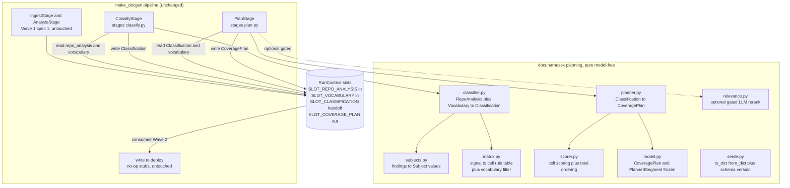

# Design Document

## Overview

**Purpose**: This feature delivers the decision-intelligence core of the DocuHarnessX
pipeline. It turns *what a repository is* (the upstream `RepoAnalysis`) and *who reads
it and why* (the loaded, project-configurable `Vocabulary` of roles × intents × subject
prefixes) into a deterministic, prioritized **`CoveragePlan`**: an ordered list of
planned content segments — each a `(roles[], subjects[], intent, evidence, priority)`
cell keyed to the ontology segment schema — that tells the Wave 2 writer *what* to
document, *for whom*, *why*, and *in what order*.

**Users**: The `cobesy-writer` (Wave 2) is the direct consumer — it reads `CoveragePlan`
from the run context and fills each planned segment into a `Segment`. The `dhx` CLI
operator is the indirect user; they see Classify/Plan participation plus bounded
classification/planning summaries in the HarnessJournal.

**Impact**: Today the `classify` and `plan` stages are no-op stubs that touch nothing.
After this spec, the Classify stage reads `SLOT_REPO_ANALYSIS` + the loaded
`Vocabulary`, maps findings onto typed ontology `Subject` values and onto relevant
role×intent cells, and hands off an intermediate `Classification`; the Plan stage scores
and orders those cells and emits a frozen `CoveragePlan` at a new `SLOT_COVERAGE_PLAN`
slot. The other six stages, `make_docgen`, the stage registry ordering, and the
`RunContext` data seam are unchanged beyond append-only additions.

### Goals

- Replace the Classify and Plan stubs in place with deterministic, model-free
  `Processor` stages that honor the single-stage-replaceability contract.
- Define `CoveragePlan` as a **frozen, serializable, versioned** seam the writer
  consumes — designed for stability and additive evolution, keyed to the segment schema.
- Build the coverage matrix and subject mapping **exclusively from the loaded
  `Vocabulary`** so the plan is project-specific, never templated.
- Add `SLOT_COVERAGE_PLAN` (and an internal handoff slot) to `types.py` append-only, plus
  typed `RunContext` accessors, without changing any existing slot or accessor.
- Keep the planning core unit-testable against crafted analyses and multiple
  vocabularies, byte-identical across runs.
- Keep any LLM relevance assistance optional, gated, and incapable of altering the core.

### Non-Goals

- Generating segment *content* (SCQA/Minto/REDUCE prose) — that is `cobesy-writer`.
- The quality review gate, MkDocs assembly, or deploy.
- The raw repository scan and the `RepoAnalysis` model (owned by
  `repo-ingestion-analysis`) — consumed verbatim, never reimplemented.
- The `Vocabulary` / `Subject` / `AxisTerm` / segment-schema definitions and tag emission
  (owned by `ontology-engine`) — reused, never reimplemented.
- Any change to `make_docgen`, the `STAGES` ordering, `StageName`, or `RunContext`
  structure.

## Boundary Commitments

### This Spec Owns

- The `CoveragePlan` data model and its nested `PlannedSegment` record (the frozen seam),
  its `COVERAGE_PLAN_SCHEMA_VERSION`, and its deterministic serialize/deserialize.
- The intermediate `Classification` value object (Classify→Plan handoff).
- The deterministic planning core: subject derivation from analysis findings, the
  evidence-gated signal→cell rule table, coverage-matrix construction over the loaded
  `Vocabulary`, cell scoring, and total ordering.
- The real bodies of `docuharnessx/stages/classify.py` and `docuharnessx/stages/plan.py`
  (replacing the no-op stubs in place).
- The new `SLOT_COVERAGE_PLAN` constant and the internal `SLOT_CLASSIFICATION` handoff
  constant (both added append-only to `types.py`), plus the matching `RunContext`
  accessor pairs.
- The optional, gated LLM relevance hook and its placement (annotate/re-rank only).

### Out of Boundary

- `RunContext` structure, the existing slot keys, `StageName` / `STAGE_NAMES`, the stage
  base (`NoOpStage` / `PIPELINE_HOOK`), the stage registry ordering, and `make_docgen` —
  all owned by `harness-bundle-skeleton`. This spec extends `types.py` / `context.py`
  append-only and edits only the two target stage modules in place.
- The `RepoAnalysis` model, its serde, `SLOT_REPO_ANALYSIS`, and
  `RunContext.repo_analysis()` — owned by `repo-ingestion-analysis`; consumed verbatim.
- The ontology (`Vocabulary`, `Subject`, `AxisTerm`, `Segment` schema, `emit_tags`,
  `SegmentStore`) — owned by `ontology-engine`; reused, never reimplemented.
- Documentation-content generation, review, assembly, deploy.

### Allowed Dependencies

- `docuharnessx.context.RunContext` (read `repo_analysis()` and `vocabulary()`; add a
  `CoveragePlan` accessor pair and an internal `Classification` accessor pair).
- `docuharnessx.types` (add `SLOT_COVERAGE_PLAN` and `SLOT_CLASSIFICATION` append-only;
  reuse `SLOT_REPO_ANALYSIS`, `SLOT_VOCABULARY`).
- `docuharnessx.stages.base` (`NoOpStage` participation/journaling pattern,
  `PIPELINE_HOOK`); the existing module paths/names for the two stages.
- `docuharnessx._ontology` / `docuharnessx.ontology` (`Vocabulary`, `Subject`, `AxisTerm`,
  `Segment`, `normalize_prefix`) — read-only contract use via the single re-export site.
- The consumed `RepoAnalysis` types from `repo-ingestion-analysis`.
- Python 3.12 standard library only for the deterministic core (`dataclasses`, `json`,
  `re`). No third-party dependency. HarnessX Control/Observe are inherited via
  `make_docgen`; this spec does not import the composition surface directly.

### Revalidation Triggers

- Any change to the `CoveragePlan` / `PlannedSegment` field set, nested shapes, field
  meanings, serialized key names, or `COVERAGE_PLAN_SCHEMA_VERSION` → `cobesy-writer`
  must re-validate against the new contract.
- Any change to `SLOT_COVERAGE_PLAN` (key string / slot type) or to the
  `RunContext.coverage_plan()` / `set_coverage_plan()` signatures.
- Any change to the internal `SLOT_CLASSIFICATION` handoff the Plan stage relies on from
  the Classify stage.
- A change to the stage class names / factory names / module paths of `classify.py` /
  `plan.py` (would break the stage registry imports).
- Upstream: a change to the consumed `RepoAnalysis` contract, `SLOT_REPO_ANALYSIS`, or
  `RunContext.repo_analysis()` → re-validate planner consumption.
- Ontology: a change to `Vocabulary` / `Subject` / `AxisTerm` / segment required-field
  set → re-validate subject derivation and matrix construction.

## Architecture

### Existing Architecture Analysis

The Wave 0 foundation (merged to `main`) and the pinned upstream sibling provide the
seams this spec plugs into, all verified against the real implementation:

- **`RunContext`** (`docuharnessx/context.py`) wraps a HarnessX `State`. Setters call
  `state.set_slot(KEY, slot_type_tag, content)`; getters route through `_get_content(KEY)`
  returning `slot.content` or `None`. New accessors mirror this exactly. The planner
  reads the existing `vocabulary()` and the upstream `repo_analysis()` getters.
- **`types.py`** owns the slot constants and `StageName` / `STAGE_NAMES` with an explicit
  `__all__`. It is owned by `harness-bundle-skeleton`; we ADD `SLOT_COVERAGE_PLAN` and
  `SLOT_CLASSIFICATION` append-only and add them to `__all__`. No existing entry is
  touched. (`repo-ingestion-analysis` already extends the same module the same way for
  `SLOT_REPO_ANALYSIS` / `SLOT_FILE_INVENTORY`.)
- **Stage base** (`docuharnessx/stages/base.py`): `NoOpStage(MultiHookProcessor)` binds
  the runtime via `_bind_runtime`, attaches to `PIPELINE_HOOK = "step_end"`, and from
  `on_step_end` emits a `ProcessorTriggerEvent(action="stage_participated",
  detail={"stage": name})` to the tracer, then yields the `StepEndEvent` unchanged.
  `step_end` is content-free, so a stage cannot mutate generated content — the real
  stages do their work as a side effect (read slots, compute, write slots) and still
  yield the event unchanged.
- **Stage registry** (`docuharnessx/stages/__init__.py`): `STAGES` lists
  `(StageName, factory)` in canonical order; `_STAGE_CLASSES` maps name→class. It imports
  `ClassifyStage`, `make_classify_stage`, `PlanStage`, `make_plan_stage` from the two
  modules. We MUST keep those names and module paths so the registry needs no edit.
- **`make_docgen`** (`docuharnessx/bundle.py`): composes Control + stages + journal. We
  do not touch it. Control cost/loop guards bound the run.
- **Ontology**: `Vocabulary{roles, intents, subject_prefixes}` with `has_role`,
  `has_intent`, `intent_order()`; `Subject.parse(raw, allowed_prefixes)` /
  `Subject.canonical()`; `AxisTerm{id, label, description}` (membership keyed on `id`);
  `Segment` required fields `(id, title, roles, subjects, intent)`. The planner reuses
  these verbatim; it produces the axis values a future `Segment` will carry but does NOT
  build `Segment`s or emit tags.
- **Upstream `RepoAnalysis`**: frozen, `schema_version == 1`, read from
  `SLOT_REPO_ANALYSIS` via `RunContext.repo_analysis()` (returns `None` when unset).
  Consumed verbatim.

**Why work happens as a `step_end` side effect.** `StepEndEvent` carries no
message/content window, so stages cannot (and must not) modify generated content. The
real Classify/Plan stages therefore read inputs and write outputs through `RunContext`
slots (a side effect), then yield the event unchanged — identical lifecycle to
`NoOpStage`, just with real work and a richer journal record. The stages reach the run
`State` through the runtime bound at `_bind_runtime` (the same handle `NoOpStage`
captures).

### Architecture Pattern & Boundary Map

Selected pattern: **deterministic pipeline-stage adapters over a pure planning core**
(the same shape `repo-ingestion-analysis` uses). The two stages are thin adapters
(HarnessX lifecycle + RunContext I/O + journaling); all logic lives in a model-free,
side-effect-free `planning/` package that takes a `RepoAnalysis` + `Vocabulary` and
returns frozen value objects. This keeps the core unit-testable without a harness and
confines HarnessX coupling to the two stage modules.



**Architecture Integration**:
- Selected pattern: pure-core + stage-adapter, deterministic by construction.
- Domain boundaries: classification/planning logic is isolated in
  `docuharnessx/planning/`; only the two stage modules know about HarnessX. The
  `CoveragePlan` model is a standalone seam.
- Existing patterns preserved: `NoOpStage` participation/journaling, module-level stage
  classes, append-don't-replace registry (untouched), RunContext slot I/O, append-only
  `types.py`, two-stage handoff via an internal slot (mirrors ingestion).
- New components rationale: a separate `planning/` package keeps the deterministic core
  testable without a harness and shields the writer-facing `CoveragePlan` from HarnessX
  changes.
- Steering compliance: deterministic + unit-testable core; LLM optional and gated; stages
  read/write via RunContext slots; vocabulary-driven (no hardcoded roles/intents/prefixes);
  reuses the ontology `Subject` and segment schema.

### Dependency Direction

`model` → `serde` → core transforms (`subjects`, `matrix`, `classifier`, `scorer`,
`planner`) → `relevance` (optional) → stage adapters (`classify`, `plan`) → harness
seams (`types`, `context`). Each layer imports only from layers to its left. The pure
core (`planning/`) never imports `stages/` or HarnessX; the stage adapters import the
core. `model.py` and the ontology/`RepoAnalysis` types are the only inbound contract
dependencies of the core.

### Technology Stack

| Layer | Choice / Version | Role in Feature | Notes |
|-------|------------------|-----------------|-------|
| CLI / Pipeline | HarnessX stages on `PIPELINE_HOOK` | Drive classify/plan in the run | No model binding for the core; inherited Control guards |
| Backend / Core | Python 3.12 stdlib (`dataclasses`, `re`, `json`) | Deterministic subject mapping + matrix + scoring | No third-party dependency |
| Data / Model | Frozen `@dataclass(frozen=True)` value objects | `CoveragePlan` seam + `Classification` + serde | JSON-compatible, versioned, tuple-only |
| Ontology | `docuharnessx.ontology` (`Vocabulary`, `Subject`, `AxisTerm`, `Segment`) | Project vocabulary + typed subjects + segment keying | Reused verbatim; read-only |
| Upstream model | `RepoAnalysis` from `repo-ingestion-analysis` | Source evidence for planning | Consumed verbatim, `schema_version == 1` |
| Optional relevance | Bound model via HarnessX (gated) | Annotate/re-rank candidate cells | Off by default; failure-tolerant; never alters core |
| Observability | HarnessJournal (Observe) | Bounded classify/plan summaries | Summary only, never the full plan |

## File Structure Plan

### Directory Structure
```
docuharnessx/
├── planning/                  # NEW — pure, model-free classification + planning core
│   ├── __init__.py            # Public exports: classify_repo, plan_coverage, CoveragePlan, serde fns
│   ├── model.py               # CoveragePlan + PlannedSegment (frozen) + COVERAGE_PLAN_SCHEMA_VERSION + Classification + errors
│   ├── serde.py               # to_dict / from_dict / to_json (deterministic, round-trip, version-checked)
│   ├── subjects.py            # RepoAnalysis findings -> tuple[Subject, ...] with evidence, vocab-prefix filtered
│   ├── matrix.py              # signal->cell rule table; activate vocabulary-valid role x intent cells from evidence
│   ├── classifier.py          # RepoAnalysis + Vocabulary -> Classification (subjects + activated cells + evidence)
│   ├── scorer.py              # deterministic cell scoring + total ordering keys
│   ├── planner.py             # Classification + Vocabulary -> CoveragePlan (score, order, build PlannedSegments)
│   └── relevance.py           # OPTIONAL gated LLM re-rank/annotate; no-op when disabled; never alters core cells
└── stages/
    ├── classify.py            # MODIFIED — real ClassifyStage: read analysis+vocab, classify, write Classification
    └── plan.py                # MODIFIED — real PlanStage: read Classification+vocab, plan, optional relevance, write CoveragePlan
```

### Modified Files
- `docuharnessx/types.py` — ADD `SLOT_COVERAGE_PLAN` and `SLOT_CLASSIFICATION` constants
  (append-only) and add both to `__all__`. No existing line altered. Flagged as a
  **shared-seam extension** of a `harness-bundle-skeleton`-owned module.
- `docuharnessx/context.py` — ADD `set_coverage_plan()` / `coverage_plan()` and
  `set_classification()` / `classification()` accessor pairs (append-only); import the
  two new slot keys. No existing accessor changed.
- `docuharnessx/stages/classify.py` — REPLACE the no-op `ClassifyStage.on_step_end` body
  with the real classification; keep `STAGE_NAME`, `ClassifyStage`, `make_classify_stage`.
- `docuharnessx/stages/plan.py` — REPLACE the no-op `PlanStage.on_step_end` body with the
  real planning; keep `STAGE_NAME`, `PlanStage`, `make_plan_stage`.

> The six other stage modules and `stages/__init__.py` are NOT edited.

## System Flows

```mermaid
sequenceDiagram
    participant Run as Harness run loop
    participant Cls as ClassifyStage.on_step_end
    participant Pln as PlanStage.on_step_end
    participant Core as planning core
    participant RC as RunContext slots

    Run->>Cls: step_end event
    Cls->>RC: repo_analysis()
    Cls->>RC: vocabulary()
    alt analysis missing or vocab missing
        Cls-->>Run: raise PlanningInputError (halt, clear cause)
    else unsupported analysis schema_version
        Cls-->>Run: raise PlanningInputError (halt)
    else valid
        Cls->>Core: classify_repo(analysis, vocab)
        Core-->>Cls: Classification (subjects + activated cells + evidence)
        Cls->>RC: set_classification(classification)
        Cls->>Run: journal stage_participated + classify summary; yield event
    end
    Run->>Pln: step_end event
    Pln->>RC: classification()
    Pln->>RC: vocabulary()
    alt classification missing
        Pln-->>Run: raise PlanningInputError (halt, clear cause)
    else present
        Pln->>Core: plan_coverage(classification, vocab)
        Core-->>Pln: CoveragePlan (scored, ordered)
        opt relevance hook enabled and model bound
            Pln->>Core: apply_relevance(plan, model)
            Core-->>Pln: re-ranked plan (or unchanged on failure)
        end
        Pln->>RC: set_coverage_plan(plan)
        Pln->>Run: journal stage_participated + plan summary; yield event
    end
```

Flow notes: Classify and Plan are separate stages so each is independently swappable; the
`Classification` value object is the inter-stage handoff (Req 1.1, 1.2). Both stages do
their work as a side effect of a content-free `step_end` event and then yield the event
unchanged. A missing input (analysis/vocabulary/classification) or an unsupported
`RepoAnalysis` schema version halts the run with an identifiable cause (Req 2.3, 2.4, 2.5)
rather than emitting a partial/guessed plan. An empty-but-well-formed plan is a valid
outcome when no evidence supports any cell (Req 5.5). The relevance hook is attempted
only when explicitly enabled and a model is bound, and never blocks emission of the
deterministic plan (Req 8.3, 8.4).

## Requirements Traceability

| Requirement | Summary | Components | Interfaces | Flows |
|-------------|---------|------------|------------|-------|
| 1.1–1.5 | Stage replacement, contract preserved | `ClassifyStage`, `PlanStage` | factories/classes unchanged | both flows |
| 2.1–2.5 | Consume RepoAnalysis + Vocabulary, fatal on missing/unsupported | `ClassifyStage`, `classifier` | `repo_analysis()`, `vocabulary()`, `classify_repo()` | Classify flow |
| 3.1–3.5 | Findings → typed Subjects with evidence, vocab-filtered | `subjects` | `derive_subjects()` | Classify flow |
| 4.1–4.5 | Coverage matrix over loaded vocabulary, evidence-gated | `matrix`, `classifier` | `activate_cells()`, `classify_repo()` | Classify flow |
| 5.1–5.5 | Score + total ordering, empty-plan ok | `scorer`, `planner` | `score_cells()`, `plan_coverage()` | Plan flow |
| 6.1–6.6 | Frozen versioned serializable CoveragePlan | `model`, `serde` | `to_dict()`/`from_dict()`/`to_json()` | — |
| 7.1–7.5 | SLOT_COVERAGE_PLAN + accessor (append-only) | `types`, `context` | `set/get coverage_plan`, `set/get classification` | both flows |
| 8.1–8.5 | Deterministic core, optional gated LLM hook | `classifier`, `scorer`, `planner`, `relevance` | `plan_coverage()`, `apply_relevance()` | Plan flow |
| 9.1–9.4 | Bounded journal summaries | both stages | journal `detail` | both flows |

## Components and Interfaces

| Component | Domain/Layer | Intent | Req Coverage | Key Dependencies (P0/P1) | Contracts |
|-----------|--------------|--------|--------------|--------------------------|-----------|
| `model` | Data | Frozen `CoveragePlan` + `PlannedSegment` + `Classification` + version + errors | 6 | stdlib, ontology `Subject` (P0) | State |
| `serde` | Data | Deterministic to_dict/from_dict/to_json | 6 | `model` (P0) | Batch |
| `subjects` | Core | findings → typed `Subject` values + evidence | 3 | `model`, ontology `Subject`/`Vocabulary` (P0) | Service |
| `matrix` | Core | signal→cell rule table; vocab-filtered activation | 4 | `model`, `Vocabulary` (P0) | Service |
| `classifier` | Core | `RepoAnalysis`+`Vocabulary` → `Classification` | 2, 3, 4 | `subjects`, `matrix`, `RepoAnalysis` (P0) | Service |
| `scorer` | Core | deterministic cell scoring + ordering | 5 | `model`, `Vocabulary` (P0) | Service |
| `planner` | Core | `Classification`+`Vocabulary` → `CoveragePlan` | 5, 6, 8 | `scorer`, `model` (P0) | Service |
| `relevance` | Core (gated) | optional LLM re-rank/annotate | 8 | bound model (P1) | Service |
| `ClassifyStage` | Stage adapter | read analysis+vocab, classify, publish handoff | 1, 2, 9 | `classifier`, `RunContext` (P0) | State |
| `PlanStage` | Stage adapter | read handoff+vocab, plan, optional relevance, publish plan | 1, 5, 7, 8, 9 | `planner`, `relevance`, `RunContext` (P0) | State |

### Data Layer

#### `model` — CoveragePlan (the frozen seam)

| Field | Detail |
|-------|--------|
| Intent | The stable, immutable, versioned contract the writer consumes |
| Requirements | 6.1, 6.2, 6.3, 6.6 |

**Responsibilities & Constraints**
- All types are `@dataclass(frozen=True)`. Collections are exposed as `tuple[...]` (never
  `list`) so instances are deeply immutable (Req 6.1).
- `COVERAGE_PLAN_SCHEMA_VERSION: int = 1` is the single version authority (Req 6.3),
  carried on `CoveragePlan.schema_version`.
- Each `PlannedSegment` keys to the ontology segment schema: it carries the axis values a
  writer needs to fill a `Segment` — `roles` (role ids), `subjects` (typed `Subject`),
  `intent` (intent id) — plus a deterministic plan-local `segment_key`, a `priority`
  score, and `evidence` references (Req 6.2). It deliberately does NOT carry title/body
  (the writer authors those).
- Field names/meanings are stable; evolution is additive (new optional fields with
  defaults) and bumps the version only when the frozen field set changes (Req 6.6).
- Deterministic by construction: the planner builds every collection pre-ordered; the
  model performs no ordering itself.

**State Management**
- State model: a single aggregate root `CoveragePlan` with nested frozen records.
- Persistence: none here — serialization is in `serde`; runtime placement is in the
  `SLOT_COVERAGE_PLAN` slot.

**The frozen seam (the writer consumes EXACTLY this):**

```python
COVERAGE_PLAN_SCHEMA_VERSION: int = 1

@dataclass(frozen=True)
class EvidenceRef:
    kind: str          # finding category, e.g. "entrypoint"|"ci"|"test"|"dependency"|"component"|"doc"|"artifact"|"language"
    detail: str        # repo-relative path or canonical finding token, deterministic
    # NOTE: no free-form scores here; weighting lives in the scorer.

@dataclass(frozen=True)
class PlannedSegment:
    segment_key: str                  # deterministic plan-local key, e.g. "<role>__<intent>__<subjects-digest>"
    roles: tuple[str, ...]            # role ids (members of the loaded Vocabulary), declared order
    intent: str                       # intent id (member of the loaded Vocabulary)
    subjects: tuple[Subject, ...]     # typed ontology Subject values, sorted by canonical()
    priority: int                     # deterministic priority score (higher = more important)
    evidence: tuple[EvidenceRef, ...] # sorted (kind, detail); why this segment is planned/ranked
    relevance_note: str = ""          # OPTIONAL annotation from the gated LLM hook; "" by default (Req 8.2)

@dataclass(frozen=True)
class CoveragePlan:
    schema_version: int               # == COVERAGE_PLAN_SCHEMA_VERSION
    repo_path: str                    # provenance: the analysis.repo_path planned over
    vocabulary_fingerprint: str       # deterministic digest of the vocabulary used (roles+intents+prefixes ids)
    segments: tuple[PlannedSegment, ...]  # ordered by priority desc, then role/intent/segment_key (Req 5.2)
    relevance_applied: bool = False   # True iff the optional LLM hook ran and was applied (Req 8.2)
```

```python
# Intermediate Classify -> Plan handoff (owned here, internal slot)
@dataclass(frozen=True)
class CandidateCell:
    roles: tuple[str, ...]            # role ids the cell serves (vocabulary members)
    intent: str                       # intent id (vocabulary member)
    subjects: tuple[Subject, ...]     # typed subjects attached to the cell
    evidence: tuple[EvidenceRef, ...] # findings that activated the cell

@dataclass(frozen=True)
class Classification:
    repo_path: str
    vocabulary_fingerprint: str
    subjects: tuple[Subject, ...]     # all derived subjects, sorted by canonical()
    cells: tuple[CandidateCell, ...]  # activated role x intent cells, deterministically ordered
```

> Every collection field documents its deterministic order. The core builds pre-ordered
> tuples so two runs over equal inputs yield equal objects (Req 5.3, 6.4).

#### `serde` — deterministic serialization

| Field | Detail |
|-------|--------|
| Intent | JSON-compatible, byte-stable serialize + round-trip deserialize |
| Requirements | 6.4, 6.5 |

##### Service Interface
```python
def to_dict(plan: CoveragePlan) -> dict: ...      # ordered, JSON-compatible; Subject -> canonical string
def from_dict(data: dict) -> CoveragePlan: ...     # reconstructs an equal CoveragePlan
def to_json(plan: CoveragePlan) -> str: ...        # json.dumps(to_dict, sort_keys=True, ensure_ascii=False)
```
- Preconditions: `from_dict` requires a `schema_version` it understands; an unknown
  version raises `CoveragePlanVersionError` (Req 6.5).
- Postconditions: `from_dict(to_dict(p)) == p` for any `CoveragePlan p` (Req 6.5).
  `to_json` is byte-identical across runs for equal inputs (Req 6.4).
- Invariants: tuples serialize to JSON arrays preserving the planner's order; each
  `Subject` serializes to its `canonical()` string and `from_dict` rebuilds it via
  `Subject.parse` using the recorded vocabulary prefixes (the prefixes are inferable from
  each subject's own prefix; parsing tolerates the already-canonical form). No
  nondeterministic dict iteration — keys via `dataclasses.fields` order and
  `sort_keys=True`.

### Core Layer

#### `subjects` — findings to typed Subjects

| Field | Detail |
|-------|--------|
| Intent | Deterministically derive typed ontology `Subject` values from analysis findings, filtered by the loaded vocabulary's prefixes |
| Requirements | 3.1–3.5 |

##### Service Interface
```python
def derive_subjects(analysis: RepoAnalysis, vocab: Vocabulary) -> tuple[tuple[Subject, EvidenceRef], ...]:
    ...  # each subject paired with the finding it came from; sorted by subject.canonical()
```
- Mapping (only for prefixes present in `vocab.subject_prefixes`, normalized via
  `normalize_prefix`): components/structural modules → `component:`; primary/detected
  languages and detected frameworks → `tech:`; build files, CI workflows, and
  license/dockerfile/schema/generated artifacts → `artifact:`; cross-cutting concerns
  (e.g. "security", "testing", "ci") inferred from signals → `topic:` (Req 3.2).
- Subjects are built via `Subject.parse(f"{prefix}{local}", allowed_prefixes)` so the
  local name is normalized/case-folded deterministically (Req 3.4). A would-be subject
  whose prefix is absent from the vocabulary is omitted, never emitted with a
  non-vocabulary prefix (Req 3.3).
- Each subject carries an `EvidenceRef` (kind + source path/token) (Req 3.5). Pure and
  deterministic (Req 3.4).

#### `matrix` — coverage-matrix construction

| Field | Detail |
|-------|--------|
| Intent | Activate vocabulary-valid role×intent cells from analysis evidence via a documented signal→cell rule table |
| Requirements | 4.1–4.5 |

##### Service Interface
```python
def activate_cells(
    analysis: RepoAnalysis, vocab: Vocabulary, subjects_by_kind: Mapping[str, tuple[Subject, ...]]
) -> tuple[CandidateCell, ...]:
    ...  # deterministically ordered activated cells
```
- The candidate space is `vocab.roles × vocab.intents` only — never a hardcoded list
  (Req 4.1, 4.2). A cell is *activated* only when an evidence predicate fires for it.
- The signal→cell **rule table** maps an evidence predicate to *(role hint id, intent
  hint id)* pairs. Examples (hints are vocabulary ids; rows whose ids are absent from the
  loaded vocabulary are skipped, Req 4.3):
  - CLI/console entrypoint present → (tech-savvy-user, install), (tech-savvy-user, use),
    (tech-savvy-user, troubleshoot), (possible-adopter, evaluate), (manager, evaluate).
  - CI workflows + build files present → (devops-admin, operate), (support-sre, monitor),
    (devops-admin, configure).
  - tests present / public surface present → (contributor, contribute), (developer, extend).
  - security/forensics signal (e.g. `topic:security`, license/compliance artifacts) →
    (security-compliance-officer, assess-quality).
  - integration surface (package_bin / exported_symbol / API) → (integrator, integrate).
  - docs/README present → (possible-adopter, understand).
- Each activated cell attaches the relevant derived subjects and the activating
  `EvidenceRef`s (Req 3.5, 5.4). Cells are filtered so `vocab.has_role` and
  `vocab.has_intent` hold for every emitted id (Req 4.3). Ordering follows
  `vocab.intent_order()` as a stable secondary key (Req 4.4). Pure and deterministic
  (Req 4.5).

**Implementation Notes**
- The rule table is module-level data (predicates + hint pairs), making "decision
  intelligence" auditable and extendable without code branches per archetype.
- Vocabulary-filtering happens at activation time, so a custom vocabulary (renamed terms,
  fewer/more intents) produces a different cell set with no code change (Req 4.2).

#### `classifier` — RepoAnalysis to Classification

| Field | Detail |
|-------|--------|
| Intent | Compose subject derivation + cell activation into a single deterministic `Classification` |
| Requirements | 2.1, 2.2, 3, 4 |

##### Service Interface
```python
def classify_repo(analysis: RepoAnalysis, vocab: Vocabulary) -> Classification: ...
```
- Preconditions: `analysis.schema_version` is supported (the caller `ClassifyStage`
  validates and raises `PlanningInputError` otherwise, Req 2.3).
- Postconditions: returns a fully-populated `Classification` (subjects + activated cells +
  evidence + vocabulary fingerprint); identical across repeated runs (Req 4.5). Consumes
  the `RepoAnalysis` model verbatim; reimplements nothing (Req 2.2). No model, no network.

#### `scorer` — deterministic scoring and ordering

| Field | Detail |
|-------|--------|
| Intent | Assign each candidate cell a deterministic priority and define the total ordering |
| Requirements | 5.1, 5.2, 5.3 |

##### Service Interface
```python
def score_cell(cell: CandidateCell, vocab: Vocabulary) -> int: ...        # integer priority, higher = more important
def order_key(seg: PlannedSegment, vocab: Vocabulary) -> tuple: ...        # (-priority, role_rank, intent_rank, segment_key)
```
- Priority is an integer derived from: evidence count/strength for the cell, plus a
  documented role weight and intent weight resolved by id position in the vocabulary
  (Req 5.1). All inputs are deterministic; no floats with platform-dependent formatting.
- The total ordering is `priority` desc, then vocabulary role order, then
  `vocab.intent_order()`, then the stable `segment_key` (Req 5.2) — guaranteeing a total,
  reproducible order (Req 5.3).

#### `planner` — Classification to CoveragePlan

| Field | Detail |
|-------|--------|
| Intent | Score, order, and materialize candidate cells into the frozen `CoveragePlan` |
| Requirements | 5.1–5.5, 6, 8.1 |

##### Service Interface
```python
def plan_coverage(classification: Classification, vocab: Vocabulary) -> CoveragePlan: ...
```
- Builds one `PlannedSegment` per activated cell with a deterministic `segment_key`
  (e.g. roles+intent+subject-digest), its scored `priority`, sorted `subjects`, and
  sorted `evidence`; orders the segments by `order_key`; sets `schema_version`,
  `repo_path`, and `vocabulary_fingerprint` (Req 5.2, 6.1–6.3).
- Postconditions: when no cell is activated, returns a well-formed `CoveragePlan` with an
  empty `segments` tuple (Req 5.5); deterministic core, no model, no network (Req 8.1).

#### `relevance` — optional gated LLM re-rank

| Field | Detail |
|-------|--------|
| Intent | Optionally re-rank/annotate the deterministic plan within bounds; never alter core cells |
| Requirements | 8.2, 8.3, 8.4, 8.5 |

##### Service Interface
```python
def apply_relevance(
    plan: CoveragePlan, *, model=None, enabled: bool = False, timeout_s: float = 30.0
) -> CoveragePlan:
    ...  # returns a re-ranked/annotated plan, or the unchanged plan
```
- When `enabled is False` or `model is None`: returns the input unchanged
  (`relevance_applied=False`) — not an error (Req 8.3).
- When enabled and successful: may reorder the existing segments and set per-segment
  `relevance_note`, but MUST NOT add/remove cells or change any segment's
  `roles`/`intent`/`subjects` (the required writer fields) — those are pinned from the
  deterministic core (Req 8.2). Returns `dataclasses.replace(plan, segments=...,
  relevance_applied=True)`.
- On failure/timeout: logs, returns the input unchanged, run continues (Req 8.4).
- Off by default; the gate is a stage-level flag — no env-driven hidden behavior (Req 8.5).
  The bound model, if any, is obtained from the runtime; the core never imports a model.

### Stage Adapter Layer

#### `ClassifyStage` (replaces the stub in `stages/classify.py`)

| Field | Detail |
|-------|--------|
| Intent | Read analysis + vocabulary, run `classify_repo`, publish `Classification`, journal a summary |
| Requirements | 1.1–1.5, 2.1–2.5, 3, 4, 9.1, 9.3 |

**Responsibilities & Constraints**
- Subclasses `NoOpStage`; keeps `STAGE_NAME="classify"`, class name `ClassifyStage`,
  factory `make_classify_stage`, module path unchanged (Req 1.1).
- `on_step_end`: wrap the bound runtime's `State` in a `RunContext`; read
  `repo_analysis()` and `vocabulary()`. If either is `None`, or the analysis declares an
  unsupported `schema_version`, raise `PlanningInputError(slot/cause)` (Req 2.3, 2.4,
  2.5). Else `classify_repo(analysis, vocab)` and `set_classification(...)`; emit the
  participation `ProcessorTriggerEvent` plus a bounded summary detail
  (`{stage, subjects_by_prefix_counts, activated_cells}`), then yield the event unchanged
  (Req 1.2, 1.3, 9.1, 9.3).
- Reaches the run `State` via the runtime bound at `_bind_runtime` (same handle the base
  captures); wraps it in a `RunContext`.

**Contracts**: State [x]

#### `PlanStage` (replaces the stub in `stages/plan.py`)

| Field | Detail |
|-------|--------|
| Intent | Read classification + vocabulary, run `plan_coverage`, optional `apply_relevance`, publish `CoveragePlan`, journal a summary |
| Requirements | 1.1–1.5, 5, 6, 7.2–7.4, 8, 9.2–9.4 |

**Responsibilities & Constraints**
- Subclasses `NoOpStage`; keeps `STAGE_NAME="plan"`, class name `PlanStage`, factory
  `make_plan_stage`, module path unchanged (Req 1.1).
- `on_step_end`: read `classification()`; if `None` raise `PlanningInputError` (Req 2.4);
  read `vocabulary()`; `plan_coverage(classification, vocab)`; optionally
  `apply_relevance(...)` (gated, failure-tolerant, Req 8.2–8.4); `set_coverage_plan(plan)`
  (Req 7.3); emit participation + bounded plan summary detail
  (`{stage, total_segments, top_segment_keys, relevance_applied, empty_reason}`), then
  yield the event unchanged (Req 1.2, 1.3, 9.2, 9.3, 9.4).

**Contracts**: State [x]

### Harness Integration Layer (extensions to skeleton-owned files)

#### `types.py` additions (append-only)
```python
#: Slot key for the internal Classify -> Plan handoff (the Classification value object).
SLOT_CLASSIFICATION: str = "docuharnessx.classification"

#: Slot key for the CoveragePlan produced by the Plan stage (the frozen output seam).
SLOT_COVERAGE_PLAN: str = "docuharnessx.coverage_plan"
```
- Both appended after the existing constants and added to `__all__`. No existing constant,
  `StageName`, or `STAGE_NAMES` entry is modified (Req 7.1, 7.5). Flagged as a
  **shared-seam extension** of a `harness-bundle-skeleton`-owned module.

#### `context.py` additions (append-only)
```python
def set_classification(self, classification) -> None: ...
def classification(self): ...        # None when unset
def set_coverage_plan(self, plan) -> None: ...
def coverage_plan(self):             # None when unset (Req 7.4)
    return self._get_content(SLOT_COVERAGE_PLAN)
```
- Mirror the existing accessor style (slot-type tag + `_get_content`). No existing
  accessor signature/behavior changes (Req 7.2, 7.5).

## Error Handling

### Error Strategy
A small stage-scoped error hierarchy in `docuharnessx/planning/model.py`:
`PlanningError` base; `PlanningInputError` (missing/unsupported input); and
`CoveragePlanVersionError` (deserialization). Stage-level fatal conditions (missing
analysis, missing vocabulary, missing classification, unsupported `RepoAnalysis`
schema version) **halt the run with an identifiable cause** (Req 2.3, 2.4, 2.5). The
core never raises for "no evidence" — an empty plan is a valid, well-formed result
(Req 5.5).

### Error Categories and Responses
- **Input errors** (fatal): `repo_analysis()` / `vocabulary()` unset at Classify, or
  `classification()` unset at Plan → `PlanningInputError` naming the offending slot;
  unsupported `RepoAnalysis.schema_version` → `PlanningInputError`. Halts the run (no
  partial `CoveragePlan`).
- **Empty-plan** (not an error): no cell activated → well-formed empty `CoveragePlan` plus
  a journaled `empty_reason` (Req 5.5, 9.4).
- **Contract errors**: unknown `schema_version` on `CoveragePlan` `from_dict` →
  `CoveragePlanVersionError` (Req 6.5).
- **Relevance errors** (absorbed): any exception/timeout in `apply_relevance` → log, keep
  the deterministic plan, continue (Req 8.4).

### Monitoring
The HarnessJournal records, per stage, the participation trigger plus a bounded summary
detail (subject counts per prefix, activated-cell count, total planned segments,
top-priority segment keys, `relevance_applied`, `empty_reason`). The full `CoveragePlan`
is **never** written to the trace (Req 9.3).

## Testing Strategy

### Unit Tests
- `subjects.derive_subjects`: components→`component:`, languages/frameworks→`tech:`,
  build/CI/license→`artifact:`, cross-cutting→`topic:`; a vocabulary missing a prefix
  omits those subjects; local-name normalization; evidence attached; deterministic order
  (Req 3.1–3.5).
- `matrix.activate_cells`: CLI signal activates install/use/troubleshoot for the
  vocabulary's matching roles; security signal activates assess-quality; rows with ids
  absent from the vocabulary are skipped; only `has_role`/`has_intent` ids emitted;
  `intent_order()` secondary ordering (Req 4.1–4.5).
- `scorer`: higher evidence yields higher priority; deterministic integer scores; total
  ordering breaks ties by role order then intent order then key (Req 5.1–5.3).
- `serde` round-trip: `from_dict(to_dict(p)) == p`; `to_json` byte-stable for equal
  inputs; unknown `schema_version` raises `CoveragePlanVersionError` (Req 6.4–6.6).

### Integration Tests
- `classify_repo` + `plan_coverage` over a crafted `RepoAnalysis` (CLI + CI + tests):
  full `CoveragePlan` populated, segments key to roles/subjects/intent, two runs equal
  (Req 2.2, 4.5, 5.3).
- **Project-specificity (the acceptance signal)**: run the planner over the same
  `RepoAnalysis` with (a) the default profile and (b) a custom `Vocabulary` (renamed
  roles/intents + an extra subject prefix); assert the two plans differ and that the
  custom plan contains only custom ids — proving project-specific, not templated, output
  (Req 4.1, 4.2).
- `ClassifyStage` + `PlanStage` driven via `on_step_end` against a `State`:
  `Classification` then `CoveragePlan` appear in the slots; missing analysis →
  `PlanningInputError`; missing vocabulary → `PlanningInputError`; missing classification
  at Plan → `PlanningInputError`; unsupported `RepoAnalysis` schema version → error;
  participation triggers emitted (Req 1.2, 1.3, 2.3, 2.4, 2.5, 7.3).
- Empty plan: a `RepoAnalysis` with no actionable evidence yields a well-formed empty
  `CoveragePlan` and a journaled `empty_reason` (Req 5.5, 9.4).
- `apply_relevance` gating: disabled → `relevance_applied=False`, segments unchanged;
  simulated failure → deterministic plan retained, run continues; enabled-success →
  reorders/annotates but preserves every segment's roles/intent/subjects (Req 8.2–8.4).
- Stage registry / `make_docgen` smoke: `make_docgen()` still composes; `STAGES` order
  unchanged; the six other stages remain no-ops (Req 1.4, 1.5).

### Reference-Repo-Shaped Tests
- Over a `RepoAnalysis` shaped like `/home/mc/Source/malware_hashes` (Go CLI, `go.mod`,
  GitHub Actions, `*_test.go`, README, forensic-hashing topic): assert the plan activates
  install/use/troubleshoot for a user role, evaluate for adopter/manager, assess-quality
  for security/compliance, and that ordering is deterministic across two runs
  (Req 4.3, 5.2, 5.3).

## Optional Sections

### Performance & Scalability
The planning core operates over the already-bounded `RepoAnalysis` (itself capped by the
ingestion `ScanLimits`), so the candidate space is `|roles| × |intents|` cells — small
and bounded for any realistic vocabulary. All transforms are linear in the number of
findings/cells. The run is additionally bounded by the inherited HarnessX Control
cost/loop guards. The optional relevance hook is the only network-touching path and is
off by default and timeout-bounded.
