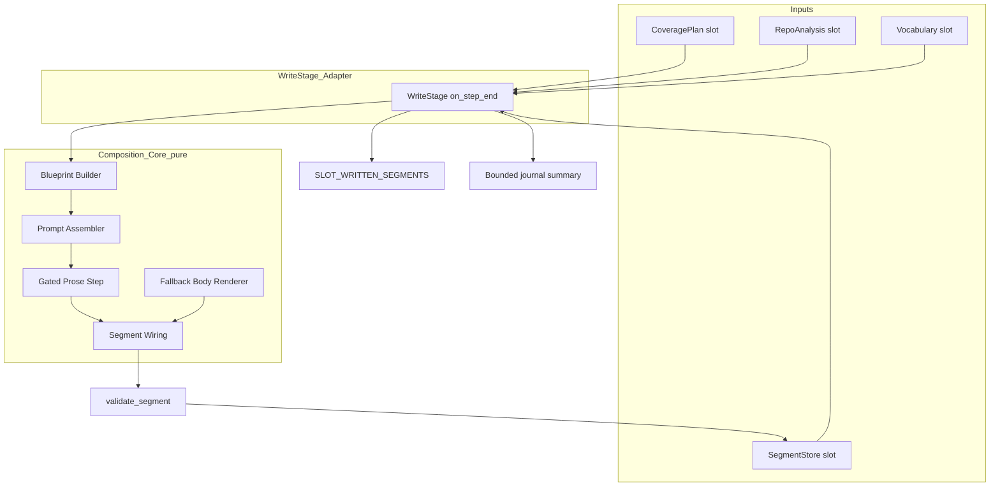
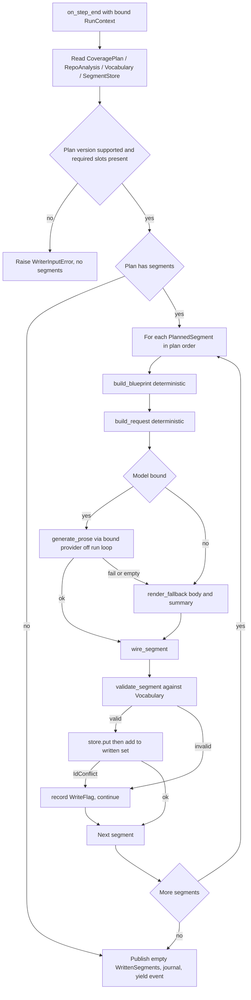

# Design Document

## Overview

**Purpose**: The `cobesy-writer` replaces the no-op `write` stage with a real stage that
turns each `PlannedSegment` of the frozen `CoveragePlan` into a written, COBESY-structured
ontology `Segment`. It fills the `title`/`summary`/`body` the planner deliberately left
blank, grounding the prose in the planner's evidence and the upstream `RepoAnalysis`.

**Users**: The Wave 2 `quality-review-gate` consumes the written segment set; the Wave 3
`mkdocs-site-assembler` ultimately publishes it. Documentation readers receive content
shaped for first success per role and intent.

**Impact**: Changes the current pipeline state by making the `write` stage produce real
content. The stage is a **thin HarnessX adapter over a pure, model-free composition
core** — exactly mirroring the merged `PlanStage` pattern. All structural work (blueprint
construction, prompt assembly, segment wiring, validation, aggregation) is deterministic
and unit-testable without a model; the per-segment prose call is the single
model-dependent step and is credential-free testable through `tests/_fakes.FakeProvider`.

### Goals
- Replace the `write` stub in place (stable `STAGE_NAME`/`WriteStage`/`make_write_stage`/
  module path); registry and `make_docgen` need zero edits.
- Produce one valid ontology `Segment` per `PlannedSegment`, COBESY-structured and
  evidence-grounded, stored in the `SegmentStore` and surfaced via a new
  `SLOT_WRITTEN_SEGMENTS` seam for the review gate.
- Keep the deterministic core (`docuharnessx.composition`) fully unit-testable with no
  model; isolate the only model call behind a gated, fault-tolerant step.
- Adapt to the loaded `Vocabulary`; hardcode no roles/intents/subjects.

### Non-Goals
- Judging/quality-gating prose (review gate), MkDocs assembly/deploy, producing the
  `CoveragePlan`/`RepoAnalysis`, model resolution, or harness composition.
- Mutating any frozen contract (`CoveragePlan`, `RepoAnalysis`, `Segment`, `Vocabulary`,
  `SegmentStore`).
- A write→review remediation loop (that decision belongs to `quality-review-gate`).

## Boundary Commitments

### This Spec Owns
- The real **Write stage adapter** in `docuharnessx/stages/write.py` (replacing the stub
  in place), and the per-segment write orchestration as a `step_end` side effect.
- A new pure, model-free **composition core** package `docuharnessx/composition/`:
  the `CompositionBlueprint` data model, the deterministic blueprint builder, the prompt
  assembler, the deterministic segment wiring (id derivation + field mapping), the
  deterministic fallback-body renderer, and the gated prose step contract.
- The new output seam: the `SLOT_WRITTEN_SEGMENTS` slot key (append-only to `types.py`)
  and the `written_segments()` / `set_written_segments()` accessors (append-only to
  `RunContext`). The **shape** of that slot's content (the `WrittenSegments` value
  object) is a stabilized contract for the review gate.

### Out of Boundary
- Quality judging, MECE/role-fit/falsifiability scoring, accept/reject, remediation loops
  (owned by `quality-review-gate`, which reads `SLOT_WRITTEN_SEGMENTS`).
- MkDocs rendering, nav, tags-driven views, cross-link HTML (owned by Wave 3).
- The `CoveragePlan`/`RepoAnalysis` production, ontology schema/validation internals,
  `Vocabulary` loading, `SegmentStore` adapters, model resolution, `make_docgen`.

### Allowed Dependencies
- **Consume verbatim**: `docuharnessx.planning` (`CoveragePlan`, `PlannedSegment`,
  `EvidenceRef`, `COVERAGE_PLAN_SCHEMA_VERSION`), `docuharnessx.analysis.model`
  (`RepoAnalysis`, `REPO_ANALYSIS_SCHEMA_VERSION` and nested records),
  `docuharnessx.ontology` (`Segment`, `Subject`, `Vocabulary`, `validate_segment`,
  `emit_tags`, `SCHEMA_VERSION`, `SegmentStore`, `IdConflictError`, `AxisTerm`).
- **Reuse**: `docuharnessx.context.RunContext`, `docuharnessx.types` slot keys,
  `docuharnessx.stages.base` (`NoOpStage`, `PIPELINE_HOOK`, `STAGE_PARTICIPATION_ACTION`,
  `_bind_runtime`/tracer pattern).
- **Model**: the bound `ModelConfig.main` provider obtained from the runtime exactly as
  `PlanStage._relevance_model()` does (`getattr(self, "_model_config", None)`), never
  constructed by this spec.

### Revalidation Triggers
- A change to the `CoveragePlan`/`PlannedSegment` shape or `COVERAGE_PLAN_SCHEMA_VERSION`,
  or to the `RepoAnalysis` shape/version (the writer pins both).
- A change to the ontology `Segment` schema, `validate_segment` contract, or
  `SegmentStore.put` semantics.
- **A change to `SLOT_WRITTEN_SEGMENTS` or the `WrittenSegments` value object** forces the
  `quality-review-gate` spec to re-check integration (it is the consumer).
- A change to how the stage base binds the runtime/model (`_bind_runtime`,
  `_model_config`) or the `step_end`/`task_start` lifecycle.

## Architecture

### Existing Architecture Analysis

The merged foundation establishes the exact pattern this spec follows:

- **Stage adapter pattern** (`docuharnessx/stages/plan.py`): a real stage subclasses
  `NoOpStage`, captures the live run `State` in `on_task_start`, wraps it in a
  `RunContext` in `on_step_end`, reads input slots, runs a **pure core**, writes an
  output slot, journals a **bounded summary**, and yields the `step_end` event unchanged.
  It raises an input error only when a run `State` is bound but a required slot is missing;
  driven outside a harness it forwards the event unchanged.
- **Pure core + gated model** (`docuharnessx/planning/`): the deterministic core never
  imports a provider; the optional model surface (`relevance.py`) is duck-typed over a
  `complete(messages, tools, stream_callback=None)`-returning-`.content` provider, absorbs
  all failures, and is driven off the run loop via `asyncio.to_thread` to avoid nesting
  event loops. The writer's prose step reuses this exact bridge shape, but inverts the
  gate: a model is consulted **by default** when one is bound, and a deterministic
  fallback covers the model-less / failed / fake-provider case.
- **Frozen seams**: `Segment`, `SegmentStore`, `Vocabulary`, `CoveragePlan`,
  `RepoAnalysis` are consumed as-is. `types.py`/`context.py` are extended append-only
  (the analyzer and planner already did this; this spec adds one more slot + accessor
  pair the same way).

### Architecture Pattern & Boundary Map

Selected pattern: **deterministic composition core + thin gated stage adapter**
(identical in spirit to `planning` core + `PlanStage`).



**Domain/feature boundaries**: The `composition` package contains zero HarnessX coupling
except the duck-typed provider call in the prose step (mirroring `planning.relevance`).
Only `stages/write.py` knows the harness lifecycle. The model is reached via the
runtime-bound `_model_config`; the core never constructs one.

**Existing patterns preserved**: `NoOpStage` lifecycle + tracer; `RunContext` typed slot
accessors; append-only `types.py`/`context.py` extension; pure-core-over-frozen-seams;
duck-typed provider with absorbed failures and `asyncio.to_thread` bridging.

**New components rationale**: a dedicated `composition` package keeps the COBESY blueprint
logic out of the stage and independently unit-testable, exactly as `planning` is separated
from `PlanStage`.

**Steering compliance**: deterministic core / gated model split; configurable vocabulary
(no hardcoded axes); segments are Markdown with the frozen frontmatter; stages communicate
through slots and the segment store, not globals.

### Dependency Direction

`ontology` / `planning.model` / `analysis.model` (frozen seams)
→ `composition` (pure core: blueprint, prompt, wiring, fallback)
→ `composition.prose` (the only model-touching module, duck-typed provider)
→ `stages/write.py` (harness adapter)
→ `context.py` / `types.py` (extended append-only; imported by the adapter).

Each layer imports only from layers to its left. `composition` never imports `stages`;
`stages/write.py` imports `composition`, `context`, `types`, and the frozen seams.

### Technology Stack

| Layer | Choice / Version | Role in Feature | Notes |
|-------|------------------|-----------------|-------|
| Backend / Services | Python 3.12 (stdlib `dataclasses`, `asyncio`, `hashlib`, `json`, `logging`) | Pure composition core + stage adapter | No new third-party deps |
| Agent framework | HarnessX (installed) | Run loop drives `provider.complete()`; stage lifecycle hooks; journal | Provider is duck-typed; bound model via `ModelConfig(main=...).agentic(make_docgen(...))` |
| Reused internal | `docuharnessx.ontology`, `.planning`, `.analysis`, `.context`, `.types`, `.stages.base` | Frozen seams + adapter base | Consumed verbatim |
| Testing | `pytest`, `tests/_fakes.FakeProvider` | Credential-free model exercise | Assert structure/wiring/validity/gating, not prose |

## File Structure Plan

### Directory Structure
```
docuharnessx/
├── composition/                 # NEW pure, model-free COBESY composition core
│   ├── __init__.py              # Single public namespace (mirrors planning/__init__.py)
│   ├── model.py                 # CompositionBlueprint + nested records; WrittenSegments + WriteFlag; WriterError hierarchy
│   ├── blueprint.py             # build_blueprint(planned, analysis, vocab) -> CompositionBlueprint (deterministic)
│   ├── prompt.py                # build_request(blueprint) -> (messages, tools) (deterministic; no model)
│   ├── wiring.py                # segment_id(planned); wire_segment(planned, blueprint, body, summary) -> Segment
│   ├── fallback.py              # render_fallback_body(blueprint) / render_fallback_summary(blueprint) (deterministic)
│   └── prose.py                 # generate_prose(blueprint, *, model, timeout_s) -> ProseResult (the ONLY model surface)
└── stages/
    └── write.py                 # MODIFIED in place: real WriteStage adapter (stable names/path)
```

### Modified Files
- `docuharnessx/stages/write.py` — Replace the no-op body with the real `WriteStage`
  adapter. Keep `STAGE_NAME = "write"`, class `WriteStage(NoOpStage)`, `make_write_stage`,
  `make_noop_stage` re-export, and `__all__` stable so the registry/bundle are untouched.
- `docuharnessx/types.py` — Append `SLOT_WRITTEN_SEGMENTS` constant and add it to
  `__all__` (append-only; no existing entry changed).
- `docuharnessx/context.py` — Append `set_written_segments()` / `written_segments()`
  accessors and the `_SLOT_TYPE_WRITTEN_SEGMENTS` tag (append-only; TYPE_CHECKING import
  of `WrittenSegments`).

## System Flows

Per-segment write loop inside `on_step_end` (deterministic core in white, gated model in
the dashed branch):



Gating notes: a model is consulted only when `_model_config.main` is reachable; the
model-less, failed, timed-out, or empty-content case deterministically falls back to a
blueprint-derived body so a credential-free `FakeProvider` run still produces valid
segments. Validation and storage are deterministic regardless of prose source.

## Requirements Traceability

| Requirement | Summary | Components | Interfaces | Flows |
|-------------|---------|------------|------------|-------|
| 1.1–1.4 | In-place stable Write stage; side-effect-only; outside-harness pass-through | WriteStage | `STAGE_NAME`, `WriteStage`, `make_write_stage` | Write loop entry |
| 2.1 | Read all four input slots via RunContext | WriteStage | `RunContext.coverage_plan/repo_analysis/vocabulary/segment_store` | ReadPlan |
| 2.2 | Pin CoveragePlan version, halt on mismatch | WriteStage | `COVERAGE_PLAN_SCHEMA_VERSION` | CheckVer |
| 2.3–2.4 | Missing required slot halts with named cause | WriteStage | `WriterInputError` | CheckVer→Raise |
| 2.5 | Absent RepoAnalysis/enrichment still writes from evidence | Blueprint Builder | `build_blueprint` | Build |
| 2.6 | Inputs treated read-only | All core components | (immutable dataclasses) | Build |
| 3.1–3.6 | Deterministic COBESY blueprint (SCQA/Minto/WM/REDUCE/andragogy/evidence) | Blueprint Builder | `build_blueprint`, `CompositionBlueprint` | Build |
| 4.1–4.2 | Deterministic, fact-only prompt | Prompt Assembler | `build_request` | Assemble |
| 4.3–4.5 | Deterministic segment wiring + id derivation | Segment Wiring | `segment_id`, `wire_segment` | Wire |
| 5.1–5.5 | Single gated model prose step; body/summary only; budgeted; fake-testable | Gated Prose Step + WriteStage | `generate_prose`, `_model_config` | Gate→Model |
| 6.1–6.6 | Validate, store, deterministic failure handling, empty plan, order | WriteStage | `validate_segment`, `SegmentStore.put`, `WriteFlag` | Validate/Store/Flag |
| 7.1–7.5 | Surface written set via new slot + accessor; consistent with store; ordered | types/context additions, WriteStage | `SLOT_WRITTEN_SEGMENTS`, `written_segments()`, `WrittenSegments` | Publish |
| 8.1–8.3 | Bounded journal summary incl. fallback/fake marker | WriteStage | `_summary_detail` | Journal |
| 9.1–9.3 | Configurable vocabulary; reproducibility | Blueprint Builder, all core | loaded `Vocabulary` accessors | Build |

## Components and Interfaces

| Component | Domain/Layer | Intent | Req Coverage | Key Dependencies (P0/P1) | Contracts |
|-----------|--------------|--------|--------------|--------------------------|-----------|
| CompositionModel | composition (data) | Blueprint + result + flag + error types | 3, 5, 6, 7 | dataclasses (P0) | State |
| Blueprint Builder | composition (core) | Deterministic COBESY blueprint per planned segment | 2.5, 3, 9 | planning.model, analysis.model, ontology Vocabulary/Subject (P0) | Service |
| Prompt Assembler | composition (core) | Deterministic model request from a blueprint | 4.1, 4.2 | CompositionModel (P0); harnessx Message (P1, lazy) | Service |
| Segment Wiring | composition (core) | Deterministic id + non-body Segment fields | 4.3–4.5, 6 | ontology Segment/Subject/SCHEMA_VERSION (P0) | Service |
| Fallback Renderer | composition (core) | Deterministic body/summary when no/failed model | 6.3, 8.3 | CompositionModel (P0) | Service |
| Gated Prose Step | composition (model) | The only model call; body+summary; fault-tolerant | 5.1–5.5 | duck-typed provider (P0) | Service |
| WriteStage | stages (adapter) | Orchestrate the per-segment write as step_end side effect | 1, 2, 5, 6, 7, 8 | composition (P0), context, ontology store/validation (P0), stages.base (P0) | State, Event |
| types/context additions | skeleton seam | New written-segments slot + accessor | 7.1–7.3 | (append-only) | State |

### composition (data layer)

#### CompositionModel (`composition/model.py`)

| Field | Detail |
|-------|--------|
| Intent | Frozen value objects: the blueprint, the prose result, the write flag, the written set, the error hierarchy |
| Requirements | 3.1, 3.6, 5.1, 6.2, 7.1, 7.4 |

**Responsibilities & Constraints**
- All blueprint/result/written-set types are `@dataclass(frozen=True)` with `tuple`
  collection fields (deep immutability + structural equality → deterministic and testable,
  mirroring `planning.model`).
- `WrittenSegments` is the **stabilized seam** the review gate consumes. It is a thin,
  ordered view; the `Segment` objects it carries are the same identities stored in the
  `SegmentStore`.

**Contracts**: State [x]

##### State Management
- `CompositionBlueprint`: `segment_key: str`, `roles: tuple[str, ...]`,
  `intent: str`, `subjects: tuple[Subject, ...]`, `title: str`,
  `scqa: SCQAOpener`, `key_message: str` (Minto lead conclusion),
  `chunks: tuple[Chunk, ...]` (working-memory ordered support),
  `fast_path: tuple[str, ...]` (REDUCE-barrier steps to first success),
  `andragogy: bool`, `evidence_anchors: tuple[EvidenceAnchor, ...]`,
  `role_labels: tuple[str, ...]`, `intent_label: str`.
- `SCQAOpener`: `situation: str`, `complication: str`, `question: str`, `answer: str`
  (the answer is the Minto lead conclusion echoed into the opener).
- `Chunk`: `heading: str`, `points: tuple[str, ...]` (descriptive subhead + MECE points).
- `EvidenceAnchor`: `kind: str`, `detail: str`, `note: str` (derived from `EvidenceRef`
  and any matching `RepoAnalysis` finding; read-only).
- `ProseResult`: `body: str`, `summary: str`, `source: str`
  (`"model"` | `"fallback"` | `"fake"`).
- `WriteFlag`: `segment_key: str`, `reason: str`, `cause: str` (deterministic, scalar).
- `WrittenSegments`: `segments: tuple[Segment, ...]` (plan order),
  `flags: tuple[WriteFlag, ...]`, `total_planned: int`.
- Errors: `WriterError(Exception)` base; `WriterInputError(WriterError)` (missing/unset
  slot or unsupported plan version — raised at the stage boundary, kept independent of the
  skeleton-wide error family, matching `PlanningError`).

### composition (core layer)

#### Blueprint Builder (`composition/blueprint.py`)

| Field | Detail |
|-------|--------|
| Intent | Turn one `PlannedSegment` (+ analysis + vocab) into a deterministic COBESY `CompositionBlueprint` |
| Requirements | 2.5, 2.6, 3.1, 3.2, 3.3, 3.4, 3.5, 3.6, 9.1, 9.2 |

**Responsibilities & Constraints**
- Pure function, no model. SCQA opener, Minto key message, working-memory chunks, REDUCE
  fast-path, and the andragogy flag are derived from the segment's `roles`/`intent` looked
  up in the loaded `Vocabulary` (`AxisTerm.label`/`description`) — never from a hardcoded
  table (Req 9.1).
- Andragogy is decided per the loaded vocabulary, not a fixed role set: a role is treated
  as expert when its vocabulary `AxisTerm` so indicates (a documented heuristic over the
  loaded term's id/description, configurable, never a closed enum) (Req 3.4, 9.2).
- Evidence anchors come from `planned.evidence` (verbatim `EvidenceRef.kind`/`detail`) and,
  when present, the matching `RepoAnalysis` finding for that detail; absent analysis is
  tolerated (anchors fall back to the evidence ref alone) (Req 2.5, 3.5).
- `title` is derived deterministically from the intent label + the leading subject(s)
  (e.g. intent label applied to the primary subject's local name).

**Dependencies**
- Inbound: WriteStage — supplies one `PlannedSegment` at a time (P0)
- Outbound: `planning.model`, `analysis.model`, `ontology` `Vocabulary`/`Subject`/`AxisTerm` (P0)

**Contracts**: Service [x]

##### Service Interface
```python
def build_blueprint(
    planned: PlannedSegment,
    analysis: RepoAnalysis | None,
    vocab: Vocabulary,
) -> CompositionBlueprint: ...
```
- Preconditions: `planned.roles`/`intent` are vocabulary members (planner guarantees);
  `analysis` may be `None`.
- Postconditions: returns a fully-populated blueprint; equal inputs → equal blueprint.
- Invariants: never consults a model; never mutates inputs.

**Implementation Notes**
- Integration: consumed by the prompt assembler and the wiring/fallback steps.
- Validation: covered by unit tests asserting blueprint shape, SCQA/Minto/chunk/fast-path
  fields, andragogy flag per vocabulary, and evidence anchoring with and without analysis.
- Risks: over-coupling to default-profile role ids — mitigated by deriving expert-ness and
  framing from the loaded `Vocabulary` term, not literals.

#### Prompt Assembler (`composition/prompt.py`)

| Field | Detail |
|-------|--------|
| Intent | Build the deterministic `(messages, tools)` model request from a blueprint |
| Requirements | 4.1, 4.2 |

**Responsibilities & Constraints**
- Pure, model-free. The system prompt instructs the model to honor SCQA → Minto lead →
  working-memory chunks → REDUCE fast path, ground claims in the supplied evidence anchors,
  and return body + summary; the user message carries a compact, deterministic brief built
  only from the blueprint (axis labels, key message, chunk headings/points, fast-path,
  evidence anchors). No raw repository file contents are included (Req 4.2).
- `tools=[]` (single-shot generation, not an agentic loop) — mirrors
  `planning.relevance._build_request`. The `harnessx.core.events.Message` import is lazy
  with a plain-dict fallback (same as the planner) so the core never hard-depends on the
  harness at import time.

**Contracts**: Service [x]

##### Service Interface
```python
def build_request(blueprint: CompositionBlueprint) -> tuple[list[object], list[object]]: ...
```
- Postconditions: equal blueprint → equal request; returns `(messages, tools)`.

#### Segment Wiring (`composition/wiring.py`)

| Field | Detail |
|-------|--------|
| Intent | Deterministically map a planned segment + prose into an ontology `Segment` |
| Requirements | 4.3, 4.4, 4.5, 5.5, 6 |

**Responsibilities & Constraints**
- `segment_id(planned)` derives a deterministic, filesystem-safe, unique id from the
  `PlannedSegment` (e.g. a sanitized `segment_key` plus a short stable hash of
  `segment_key`), so equal plans → equal ids and ids are valid for `FilesystemSegmentStore`
  (no `/`, `\`, `.`/`..`).
- `wire_segment` sets `id`, `roles` (from `planned.roles`), `subjects` (from
  `planned.subjects`, the typed `Subject` tuple), `intent` (from `planned.intent`),
  `related` (deterministically derived, default empty list to avoid unresolved cross-links
  in this stage), `schema_version = ontology.SCHEMA_VERSION`, `title` from the blueprint,
  and `body`/`summary` from the prose result. The model never sets non-body fields
  (Req 5.5).

**Contracts**: Service [x]

##### Service Interface
```python
def segment_id(planned: PlannedSegment) -> str: ...
def wire_segment(
    planned: PlannedSegment,
    blueprint: CompositionBlueprint,
    prose: ProseResult,
) -> Segment: ...
```
- Invariants: deterministic; non-body fields independent of the prose source.

#### Fallback Renderer (`composition/fallback.py`)

| Field | Detail |
|-------|--------|
| Intent | Deterministic body/summary from a blueprint when no/failed/empty model |
| Requirements | 6.3, 8.3 |

**Responsibilities & Constraints**
- Pure, model-free. Renders a valid Markdown body honoring the blueprint structure (SCQA
  opener line, Minto key-message lead, chunk subheads + bullet points, REDUCE fast-path
  list, evidence anchor references) and a short summary. This guarantees a valid `Segment`
  with a `FakeProvider` or a failed model (Req 6.3) and is the deterministic backbone that
  unit tests assert against.

**Contracts**: Service [x]

##### Service Interface
```python
def render_fallback_body(blueprint: CompositionBlueprint) -> str: ...
def render_fallback_summary(blueprint: CompositionBlueprint) -> str: ...
```

#### Gated Prose Step (`composition/prose.py`)

| Field | Detail |
|-------|--------|
| Intent | The single model-dependent step: produce body+summary from a blueprint, fault-tolerantly |
| Requirements | 5.1, 5.2, 5.3, 5.4, 5.5 |

**Responsibilities & Constraints**
- The only module that touches a model. Duck-typed over a HarnessX
  `BaseModelProvider`-shaped object: awaitable `complete(messages, tools, stream_callback=None)`
  returning an object with a `.content` string (a `ModelResponseEvent` in production; a
  `FakeProvider` in tests). Never imports a provider class or constructs one (mirrors
  `planning.relevance` and `analysis.enrich`).
- Bridges sync→async with a private loop under a wall-clock `timeout_s` exactly as
  `relevance._complete_with_timeout` does. Parses the model `.content` into `body` and
  `summary` deterministically; an unparseable/empty/timed-out/raised response yields a
  sentinel (`None`) so the caller falls back. All failures absorbed + logged at WARNING;
  never raises (Req 5.1, 5.4).
- Sets `ProseResult.source` to `"model"` on success; the stage marks `"fallback"`/`"fake"`
  via the fallback renderer when no model is used. Cost/step budgeting is the inherited
  Control bundle's responsibility — the prose step issues exactly one bounded `complete`
  call per segment and adds no loop (Req 5.3).

**Dependencies**
- Inbound: WriteStage — passes the bound provider + request (P0)
- Outbound: duck-typed provider (P0); `harnessx.core.events.Message` (lazy, P1)

**Contracts**: Service [x]

##### Service Interface
```python
def generate_prose(
    blueprint: CompositionBlueprint,
    *,
    model: object | None,
    timeout_s: float = DEFAULT_PROSE_TIMEOUT_S,
) -> ProseResult | None: ...
```
- Returns a `ProseResult(source="model")` on a clean response; `None` on
  model-less/failure/timeout/empty (caller renders the deterministic fallback).
- Invariants: never raises; one `complete` call max; sets only body/summary.

### stages (adapter layer)

#### WriteStage (`stages/write.py`, modified in place)

| Field | Detail |
|-------|--------|
| Intent | Orchestrate the per-segment write as a `step_end` side effect over the pure core |
| Requirements | 1, 2, 5, 6, 7, 8 |

**Responsibilities & Constraints**
- Subclasses `NoOpStage` (inherits `_bind_runtime`, tracer resolution, hook binding).
  Captures the run `State` in `on_task_start` (pure pass-through, like `PlanStage`); does
  the work in `on_step_end` and yields the event unchanged (Req 1.2–1.4).
- Outside a harness (no captured `State`) it forwards the event and writes nothing
  (Req 1.3). With a bound `State`: reads the four input slots; pins
  `COVERAGE_PLAN_SCHEMA_VERSION` and raises `WriterInputError` on an unsupported version
  (Req 2.2) or any missing required slot — plan, vocabulary, or store (Req 2.3, 2.4).
  Empty plan → publish empty `WrittenSegments`, journal, return (Req 6.5).
- Per segment in plan order (Req 6.6): `build_blueprint` → `build_request` → gated
  `generate_prose` (off the run loop via `asyncio.to_thread` when a model is consulted,
  mirroring `PlanStage._maybe_apply_relevance`) → on `None` render the deterministic
  fallback → `wire_segment` → `validate_segment` against the loaded `Vocabulary` → on valid
  `store.put` and add to the written set; on invalid or `IdConflictError` record a
  `WriteFlag` and continue (Req 6.1–6.4).
- Publishes the ordered `WrittenSegments` (same `Segment` identities as stored) to
  `SLOT_WRITTEN_SEGMENTS` via `RunContext.set_written_segments` (Req 7.1, 7.4, 7.5), then
  journals a bounded summary (Req 8).
- Obtains the model via `getattr(self, "_model_config", None)` then `.main`, exactly as
  `PlanStage._relevance_model()`; any failure to reach a provider degrades to fallback
  generation so a misconfigured model never aborts the write (Req 5.2).

**Dependencies**
- Inbound: harness run loop (drives `on_task_start`/`on_step_end`) (P0)
- Outbound: `composition` core (P0); `RunContext` + slot keys (P0); ontology
  `validate_segment`/`SegmentStore`/`IdConflictError` (P0); `stages.base` (P0)

**Contracts**: State [x] / Event [x]

##### State Management
- Reads: `SLOT_COVERAGE_PLAN`, `SLOT_REPO_ANALYSIS`, `SLOT_VOCABULARY`,
  `SLOT_SEGMENT_STORE`. Writes: `SLOT_WRITTEN_SEGMENTS` (and the `SegmentStore` side
  effect). Concurrency: single-run, single-pass; the plan order is the determinism
  authority.

**Implementation Notes**
- Integration: stable `STAGE_NAME`/`WriteStage`/`make_write_stage`/module path; `__all__`
  retains `make_noop_stage`. Registry/bundle untouched (Req 1.1).
- Validation: integration test runs `make_docgen` bound to `FakeProvider.agentic(...)`
  over a seeded `CoveragePlan`/`RepoAnalysis`/`Vocabulary`/`InMemorySegmentStore`, asserting
  one valid stored segment per planned segment, a populated `SLOT_WRITTEN_SEGMENTS`, and a
  bounded journal record — credential-free.
- Risks: nesting `asyncio.run` inside the run loop — mitigated by `asyncio.to_thread`
  exactly as the planner does; a `FilesystemSegmentStore` id-safety constraint — mitigated
  by `segment_id` producing single-segment safe names.

### Skeleton seam additions (append-only)

#### types.py / context.py additions

| Field | Detail |
|-------|--------|
| Intent | Add the new written-segments slot key + typed `RunContext` accessor |
| Requirements | 7.1, 7.2, 7.3 |

**Responsibilities & Constraints**
- `types.py`: add `SLOT_WRITTEN_SEGMENTS: str = "docuharnessx.written_segments"` and add it
  to `__all__`. No existing slot key, `StageName`, or `STAGE_NAMES` entry changes
  (append-only, matching the analyzer/planner extensions).
- `context.py`: add `_SLOT_TYPE_WRITTEN_SEGMENTS = "written_segments"`, a TYPE_CHECKING
  import of `WrittenSegments` from `docuharnessx.composition.model`, and the accessor pair
  `set_written_segments(value)` / `written_segments() -> WrittenSegments | None`. An unset
  slot returns `None` (Req 7.3), matching every other accessor.

**Contracts**: State [x]

## Data Models

### Domain Model
- **Aggregate root for this stage's output**: `WrittenSegments` (the seam the review gate
  reads). It aggregates the ordered `Segment` tuple, the `WriteFlag` tuple, and the planned
  total. Invariant: every `Segment` in `segments` was validated and stored; every planned
  segment is represented either in `segments` or in `flags`.
- **Value objects**: `CompositionBlueprint` and its nested `SCQAOpener`/`Chunk`/
  `EvidenceAnchor`; `ProseResult`; `WriteFlag`. All frozen, all built from frozen inputs.
- **Business rules**: non-body `Segment` fields derive only from the `PlannedSegment` and
  blueprint; the model contributes only `body`/`summary`; a segment that fails validation
  or storage is flagged, never silently dropped without a flag.

### Data Contracts & Integration
- **Consumed (verbatim, pinned)**: `CoveragePlan` v1 (`schema_version == 1`), `RepoAnalysis`
  v1, `Vocabulary`, `SegmentStore` port.
- **Produced seam**: `WrittenSegments` at `SLOT_WRITTEN_SEGMENTS`. Versioning: additive
  fields with defaults if it evolves; any field-set change is a revalidation trigger for
  `quality-review-gate`.
- **Serialization**: stored `Segment`s use the existing ontology serializer (no new format).
  `WrittenSegments` is an in-process value object (slot content), not serialized to disk by
  this spec.

## Error Handling

### Error Strategy
Fail fast on missing inputs at the stage boundary; degrade gracefully per segment.

### Error Categories and Responses
- **Input errors** (fatal, halt run, no partial output): unset `CoveragePlan`/`Vocabulary`/
  `SegmentStore` slot, or unsupported `CoveragePlan` version → raise `WriterInputError`
  naming the offending slot/version (Req 2.2–2.4). Mirrors `PlanningInputError`.
- **Per-segment model errors** (absorbed, non-fatal): a raised/timed-out/empty/unparseable
  model response → `generate_prose` returns `None`, the stage renders the deterministic
  fallback and continues (Req 6.3). Logged at WARNING.
- **Per-segment validation/storage errors** (absorbed, non-fatal): invalid `Segment` or
  `IdConflictError` → record a `WriteFlag` and continue (Req 6.2, 6.4).
- **Absent optional input** (tolerated): missing `RepoAnalysis`/enrichment → blueprint uses
  evidence refs alone; write proceeds (Req 2.5).

### Monitoring
Bounded `ProcessorTriggerEvent` to the run tracer (Req 8): stage name, `total_planned`,
`written_count`, `flagged_count`, capped top-priority written ids, and a `prose_source`
marker (`model`/`fallback`/`fake`) — never full bodies (Req 8.2, 8.3). Reuses the
`NoOpStage` tracer-resolution pattern; no-op when no tracer is bound.

## Testing Strategy

### Unit Tests (deterministic core — no model)
- `build_blueprint`: SCQA opener derived from vocabulary role+intent labels; Minto key
  message present; working-memory chunks and REDUCE fast-path populated; andragogy flag set
  for an expert role per a custom `Vocabulary`; evidence anchors built from `EvidenceRef`
  with and without a matching `RepoAnalysis` finding; equal inputs → equal blueprint
  (Req 3.x, 2.5, 9.x).
- `build_request`: deterministic `(messages, tools)`; carries only blueprint-derived facts,
  no file contents; `tools == []` (Req 4.1, 4.2).
- `segment_id` / `wire_segment`: deterministic, filesystem-safe, unique ids; non-body fields
  mapped from the planned segment; `schema_version == SCHEMA_VERSION`; prose source does not
  affect non-body fields (Req 4.3–4.5, 5.5).
- `render_fallback_body`/`summary`: produces a body that yields a `validate_segment`-valid
  `Segment` for a given `Vocabulary` (Req 6.3).

### Integration Tests (stage + harness, credential-free)
- `WriteStage` via `make_docgen` bound to `FakeProvider.agentic(...)` over a seeded
  `CoveragePlan`/`RepoAnalysis`/`Vocabulary`/`InMemorySegmentStore`: one valid stored
  `Segment` per planned segment; `SLOT_WRITTEN_SEGMENTS` populated and consistent with the
  store; bounded journal record present (Req 1, 5.4, 6.1, 7.1, 7.4, 8).
- Gated prose: with a stub provider returning a clean body → `ProseResult.source == "model"`;
  with `FakeProvider`/no model → deterministic fallback, still one valid segment per planned
  segment, `prose_source` recorded (Req 5.1, 5.4, 6.3, 8.3).
- Failure handling: an invalid-by-construction planned segment (e.g. unknown role under the
  loaded vocab) is flagged and skipped, others still written; an injected `IdConflictError`
  is flagged; an empty plan yields an empty written set with no error (Req 6.2, 6.4, 6.5).
- Stable replaceability: `STAGE_NAME`/`WriteStage`/`make_write_stage`/module path unchanged;
  `register_stages`/`make_docgen` need no edits; outside-harness `process` is a pass-through
  (Req 1.1, 1.3).

### Reproducibility Tests
- Two writer runs over an equal plan with the deterministic fallback (no model) produce an
  equal `WrittenSegments` (equal ids, titles, bodies, summaries, order) (Req 9.3, 6.6).
