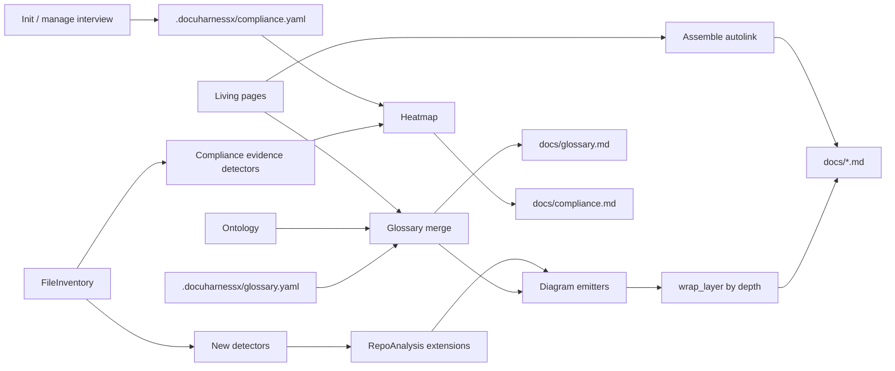

# Design Document

## Overview

**Purpose:** Assemble extra grounded pictures and a Visual Paradigm–style glossary onto the existing depth-layered MkDocs site so adopters, operators, and programmers see different visuals, including pipeline DAGs and entrypoint sankeys on quant/AI/ML repos.

**Users:** Operators running `dhx run` / `dhx ci`; readers using the depth slider and glossary.

**Impact:** Extends analysis detectors and assembler emitters. Does not change living-page prose, the writer harness, or the substance gate’s accept/reject of bodies. Highlighting happens only on assembled `docs/` output.

### Goals

- Depth table implemented as `wrap_layer` around each new figure.
- Glossary YAML + index + autolink + related-term graph.
- Allow-listed DAG detection; coarse fallback; omit if empty.
- Entrypoint sankey with structural weights.
- Deterministic, model-free, fail-closed.

### Non-Goals

- Visual Paradigm import, SysML, ReqIF.
- Vector/embedding search.
- Authoring UI for requirements or glossary (file edit is enough).
- Runtime telemetry as sankey volumes.
- Certification, statements of applicability, or auditor-ready control mappings.

## Boundary Commitments

### This Spec Owns

- New analysis signals: pipeline DAGs, data-lineage hops, requirement-shaped sentence harvest, project-kind hints (quant/ml/software).
- Assembler emitters per diagram kind and depth.
- Glossary model, load/merge, assemble-time autolink, glossary index page, related-nodes figure.
- Compliance topic interview (init / `--manage`), `.docuharnessx/compliance.yaml`, evidence scoring, heatmap page.
- Adding `sankey-beta` to the structure-gate allow-list **only if** assembler-emitted sankeys must pass a writer-side gate (prefer: assembler pictures are not substance-gated; they are prepended like today’s flowcharts). Decision: **assembler pictures are not sent through the substance gate** (same as current `graphs.py`).

### Out of Boundary

- Living page store schema (Page stays slim).
- Ontology vocabulary schema (seed only).
- Site theme (black vs deepwiki) and slider chrome (`site_config`, `theme.py`, `depth.js`).
- Writer explore loop and substance-gate prose rules.

### Allowed Dependencies

- `RepoAnalysis`, detectors, `Page`, `assemble_question_site`, `wrap_layer`, `render_page_diagrams`.
- MkDocs Material `search` plugin (already on). Tags plugin optional for term tags.
- Mermaid via existing `pymdownx.superfences` fence.

### Revalidation Triggers

- Change to `wrap_layer` HTML contract.
- Change to `RepoAnalysis` frozen fields.
- Mermaid fence / `md_in_html` config.
- Structure-gate diagram keyword set (only if writer-emitted sankeys appear).

## Architecture



Existing `render_page_diagrams` stays the depth-5 file flowchart. New emitters return `(min_depth, markdown)` pairs; `render_question_page` wraps each.

### Existing Architecture Analysis

- `graphs.py` is flowchart-only `_Graph` + fences.
- `depth.py` wraps Markdown in `dhx-layer` divs.
- Question assemble writes `docs/`, `extra.css`, `depth.js`, `mkdocs.yml`.
- Detectors are pure-ish, sorted, empty-tuple stable.

## Data Models

### GlossaryTerm (frozen)

- `id: str` (slug)
- `label: str`
- `aliases: tuple[str, ...]`
- `definition: str` (empty allowed → published as “undefined”)
- `related: tuple[str, ...]` (term ids)
- `sources: tuple[str, ...]` (page ids or file paths)

### Glossary (frozen)

- `terms: tuple[GlossaryTerm, ...]` sorted by id

Operator file `.docuharnessx/glossary.yaml`:

```yaml
terms:
  - id: signal
    label: Signal
    aliases: [alpha, forecast]
    definition: Model output used to size a position.
    related: [feature, portfolio]
```

Invalid file → `OntologyConfigError`-style assemble failure naming the path.

### PipelineDag (analysis)

- `source: str` (detector name, e.g. `github-actions` | `makefile` | `coarse`)
- `nodes: tuple[DagNode, ...]` (`id`, `label`, `path | None`)
- `edges: tuple[tuple[str, str], ...]` grounded only

### LineageHop (analysis)

- `source: str`
- `target: str`
- `weight: int`  # structural count
- `kind: str`    # input | transform | store | output

### RepoAnalysis extensions (additive)

Optional tuples default empty so old tests keep constructing analysis without them:

- `pipelines: tuple[PipelineDag, ...]`
- `lineage: tuple[LineageHop, ...]`
- `project_kinds: tuple[str, ...]`  # subset of `software`, `quant`, `ml`
- `requirement_sentences: tuple[RequirementHit, ...]` (`text`, `path`, `term_ids`)

Adding fields to a frozen dataclass is a **compatibility break** for positional constructors in tests. Prefer **optional new frozen value** `ComprehensionSignals` carried beside analysis *or* extend `RepoAnalysis` with defaulted fields at the end. **Decision:** new frozen `ComprehensionSignals` returned by `detect_comprehension(inventory, repo_path) -> ComprehensionSignals` and passed into assemble; do **not** reshape `RepoAnalysis` in this spec (avoids mass test churn and revalidation of analysis consumers).

`assemble_question_site(..., signals: ComprehensionSignals | None = None)`.

### ComplianceSelection (frozen)

Persisted at `.docuharnessx/compliance.yaml`:

```yaml
frameworks: [iso27001, gdpr]   # pci-dss, nis2, cra omitted → gray columns
disclaimer: self-assessment
overrides:
  iso27001.incident: yellow
notes:
  gdpr: EU users; no card data
```

- `frameworks: tuple[str, ...]` from `{iso27001, pci-dss, nis2, cra, gdpr}`
- `overrides: tuple[CellOverride, ...]` (`framework`, `pillar`, `status`, `note`)
- Invalid file fails assemble naming the path
- Missing file ≡ no regimes in scope (omit page)

### ComplianceCell (frozen)

- `framework: str`
- `pillar: str`
- `status: na | fail | partial | pass`  # gray / red / yellow / green
- `evidence: tuple[str, ...]`  # repo-relative paths or detector ids
- `overridden: bool`

Scoring is a pure function `score_matrix(selection, inventory, repo_path) -> tuple[ComplianceCell, ...]`. Pillar catalog is a frozen table in code (see research.md). A pillar marked `n/a` for a framework always scores `na`. A framework not in `selection.frameworks` yields `na` for every pillar.

Init: `prompt_compliance_topics` after site presentation. `--manage` re-asks with previous list as default. `--default` writes empty frameworks.

## Diagram emitters

Each function is pure, returns `""` if ungrounded.

| Emitter | min depth | Source |
|---|---|---|
| `render_c4_context` | 1 | entrypoints, components, artifacts |
| `render_system_mindmap` | 1 | ontology + components (if C4 empty) |
| `render_c4_container` | 2 | components |
| `render_coverage_pie` | 2 | accepted vs planned vs omitted (needs plan counts from assemble caller) |
| `render_adoption_timeline` | 2 | adoption.yaml |
| `render_run_sequence` | 3 | entrypoints + cited files order |
| `render_sankey` | 3 collapsed / 7 detailed | lineage hops |
| `render_dag` | 3 collapsed / 4–7 detailed | PipelineDag |
| `render_public_class` | 4 | public_surface |
| existing flowcharts | 5 | pages + analysis |
| `render_compliance_matrix` | 1 | ComplianceCell table |
| `render_compliance_evidence` | 5 | per-cell paths |

C4: use `C4Context` / `C4Container` Mermaid if the fence renders under current mkdocs-material mermaid; **fallback** to `flowchart TB` with the same nodes if C4 keywords fail `mkdocs build --strict` in CI. Design verification: one fixture build.

Sankey: `sankey-beta` CSV; if mermaid in Material cannot render it, fallback to `flowchart LR` with edge labels `weight`. Verification task owns the choice from a real `mkdocs build`.

Coverage pie needs planned/omitted counts. `assemble_question_site` today only receives accepted pages. Pass optional `CoverageCounts(planned, accepted, omitted)` from the pipeline (it already has `RunReport`). MCP reassemble may omit the pie if counts are unknown.

## Glossary autolink

- Build match list: labels + aliases, longest-first, case-insensitive, whole-word, skip length < 3 unless operator-defined.
- Walk assembled Markdown with a fence-aware scanner (reuse or copy the structure-gate fence splitter).
- Replace with `[label](glossary.md#id)` plus a CSS class `dhx-term`.
- Do not rewrite living pages under `.docuharnessx/pages/`.
- Glossary index: one `docs/glossary.md` with an entry per term (`##` + id anchor), definition, aliases, related mermaid, “Appears on” links.
- `mkdocs.yml` nav: Home, …pages…, Glossary.
- lunr indexes glossary.md automatically.

Highlight CSS in `extra.css` (both themes): underline dotted, same as VP “already a glossary term.”

## Pipeline detectors (allow list)

Implement as separate functions in a new `docuharnessx/analysis/pipelines.py`, called from `detect_comprehension`:

1. GitHub Actions `needs:`
2. Makefile targets
3. `Snakefile` rules
4. `dbt_project.yml` + `models/`
5. Kedro `catalog.yml` / `pipeline.py` (names only, no exec)
6. Airflow `DAG(` / `@dag` (names + `>>` / `task.ext` if regex-safe)
7. Prefect `@flow`/`@task`
8. Dagster `@asset`

Parse with regex/yaml/stdlib only. Malformed file → skip that source, note in signals.

Project kind hints: `ml` if `*.ipynb` in notebooks or files named `train*.py` / `*.pt` / `mlflow`; `quant` if paths match `features/`, `signals/`, `portfolio/`, or notebooks under `research/`; else `software`. Hints only bias sankey stage labels.

## Depth integration

`render_question_page` collects `[(min_depth, block), ...]` and `wrap_layer`s each. Home page gets C4/mindmap + coverage pie + timeline (not per-question file graphs only).

Home diagrams today: question map flowchart. Keep it at depth 3+; put C4/mindmap at 1 on home.

## Error handling

| Case | Behavior |
|---|---|
| No signals | Site builds as v3.1.0 |
| Invalid glossary.yaml | Assemble fails, path in message |
| DAG parse partial | Use recovered nodes/edges |
| Sankey mermaid unsupported | Flowchart fallback, test pins one |
| Empty glossary after seed | Omit glossary nav entry |

## Testing

- Unit: each emitter empty vs fixture analysis; glossary merge operator-wins; autolink skips fences; DAG detectors on tiny fixtures; byte-stable assemble.
- Build: `mkdocs build --strict` on a fixture with C4, sankey-or-fallback, glossary autolink.
- No model, no network.

## Requirements Traceability

| Req | Design |
|---|---|
| 1 | emitter min_depth table + wrap_layer |
| 2 | C4/mindmap, sequence, pie, timeline |
| 3 | LineageHop + render_sankey |
| 4 | PipelineDag detectors + render_dag |
| 5 | render_public_class |
| 6–7 | Glossary model, yaml, autolink, index |
| 8 | RequirementHit harvest |
| 9 | pure emitters, no model |
| 10 | existing site.yaml / depth.js |
| 11 | init / manage prompt + compliance.yaml |
| 12 | score_matrix + heatmap CSS + depth wrap |
