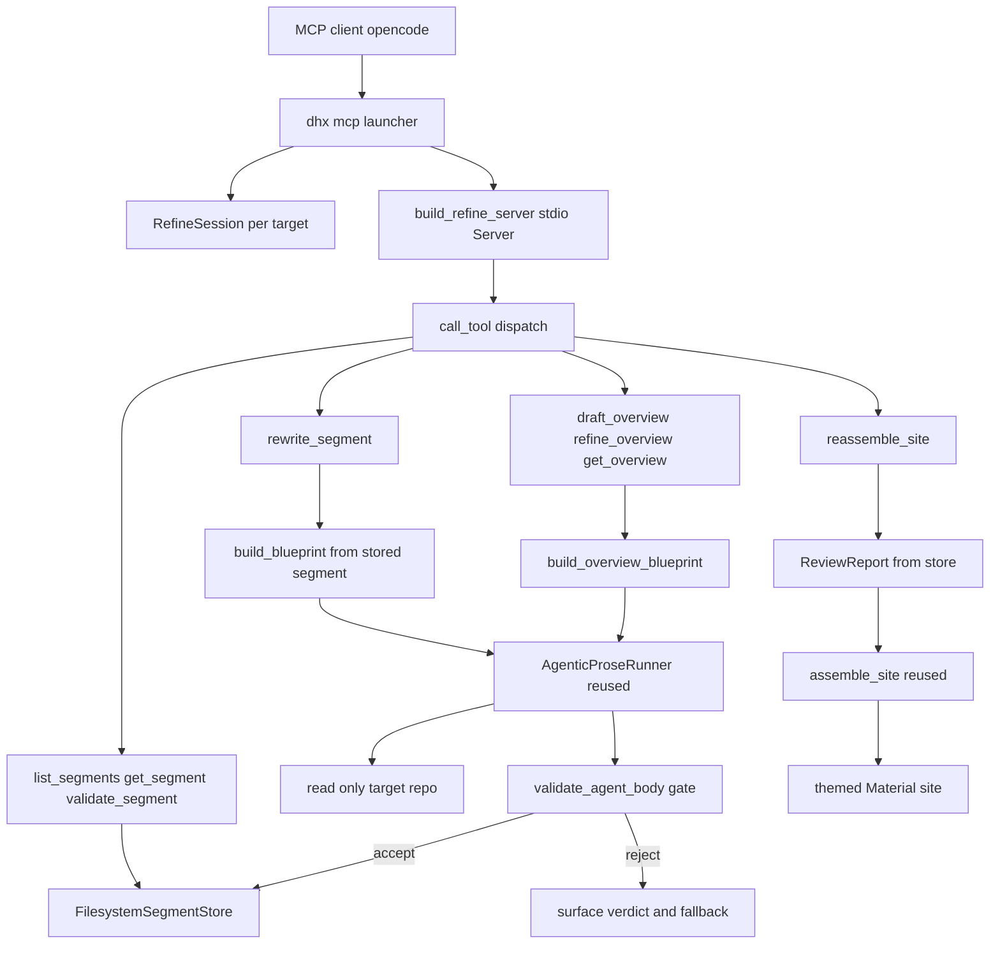
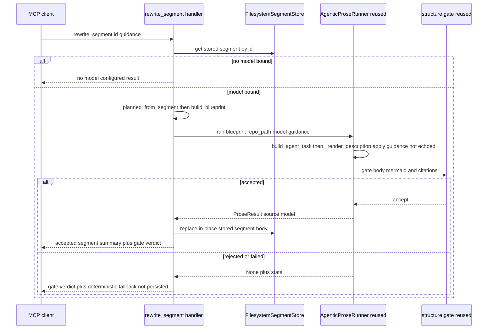
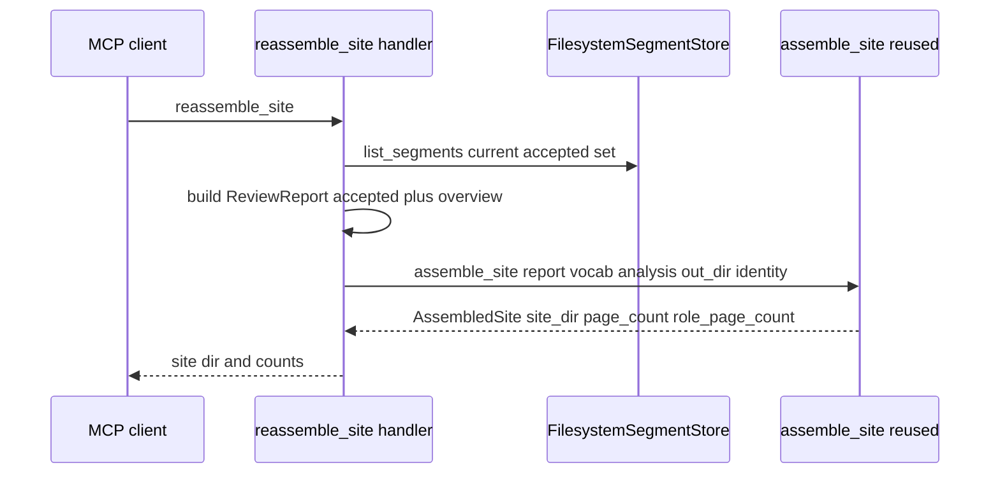

# Design Document

## Overview

**Purpose**: `docuharnessx-mcp-refine` adds a **stdio MCP server** that exposes
DocuHarnessX's own document-refinement tools to an interactive MCP client (opencode
primarily; also Claude Code / Cursor). After a batch `dhx` run produces the role-based draft
(segments under `<out>/segments`, a built site under `<out>/site`), a human opens the output
in opencode and conversationally refines the documentation — listing/reading segments,
rewriting a segment to guidance (re-grounded through the bounded agentic writer and gated by
the structure gate), validating a segment, drafting/refining a grounded narrative overview,
and reassembling the themed Material site. The server is a thin composition layer over the
existing modular core; it builds no second generation engine and no RAG/embedding index.

**Users**: A documentation author drives the eight tools conversationally through an MCP
client. The reusable functions the server composes are owned by `agentic-codebase-writer`
(the writer + gate + blueprint + budgets), `cobesy-writer` (blueprint/wiring/fallback),
`ontology-engine` (`Segment`/`SegmentStore`/`Vocabulary`), `mkdocs-site-assembler`
(`assemble_site`/identity), `quality-review-gate` (`ReviewReport`), and
`harness-bundle-skeleton` (`RunContext`/`model_resolver`/CLI).

**Impact**: Adds one new package `docuharnessx/mcp/` and one new `dhx mcp` CLI subcommand,
plus **one minimal, backward-compatible extension of the writer**: an optional `guidance: str
= ""` parameter threaded through `AgenticProseRunner.run` → `build_agent_task` →
`_render_description` (default `""` = today's behaviour), so the human refinement guidance has
a concrete path into the agent's task. The FROZEN **data** seams (`Segment`,
`WrittenSegments`, the `SegmentStore` Protocol, `ReviewReport`, `AssembledSite`) stay
untouched — the writer extension is a behaviour-preserving widening of a function signature,
not a change to a frozen data type. The existing pipeline stages, the assembler renderers, the
model resolver, and the site-identity resolver are **consumed, never edited**. The anti-slop
guarantees are inherited verbatim by reusing the bounded agentic writer (read-only repo
exploration + Control budgets) and the deterministic structure gate.

### Goals
- A stdio MCP server (low-level `mcp.server.Server`) exposing eight tools — `list_segments`,
  `get_segment`, `rewrite_segment`, `validate_segment`, `reassemble_site`, `get_overview`,
  `draft_overview`, `refine_overview` — launched by a `dhx mcp` subcommand.
- A per-target `RefineSession` carrying the output dir, target repo, loaded `Vocabulary`,
  `FilesystemSegmentStore`, resolved `ModelConfig`, per-target `SiteIdentity`, and optional
  `RepoAnalysis`.
- Anti-slop enforced server-side: every generated/refined body re-grounded through the
  agentic writer and gated by the structure gate before persistence; the gate verdict (and
  any deterministic fallback) surfaced, never silently passed; the store is the single
  source of truth.
- A grounded narrative overview (Purpose/Use cases/Features/Design choices) via an
  overview-shaped blueprint through the same writer + gate.
- Credential-free testability: the protocol + dispatch layer testable without a model; the
  agentic path driven by the scripted provider over the fixture repo.

### Non-Goals
- A second generation engine, RAG/embeddings, or any change to a frozen seam / existing
  stage / the assembler renderers.
- Non-stdio transports; deploy/Pages push from the server; multi-session coordination /
  daemon; a new LLM-judge surface.

## Boundary Commitments

### This Spec Owns
- The `docuharnessx/mcp/` package: the stdio server factory, the eight tool handlers, the
  `RefineSession`, the session resolver, the `PlannedSegment` reconstruction glue, the
  overview-blueprint builder, and the overview persistence.
- The `dhx mcp` CLI subcommand (parsing/validation/session resolution/stdio launch).
- The server-side acceptance policy: gate-before-persist, surface-the-verdict,
  replace-in-place persistence, and the `ReviewReport`-from-store construction for
  reassembly.

### This Spec Also Owns (one intentional writer extension)
- A **minimal, backward-compatible** extension of the bounded agentic writer: an optional
  `guidance: str = ""` parameter threaded through `AgenticProseRunner.run` (composition/agent.py)
  → `build_agent_task` → `_render_description` (composition/task_prompt.py). When `guidance` is
  non-empty, `_render_description` renders it as an explicit **author-guidance instruction near
  the mission** (applied to *what* the agent writes/emphasises, **never** echoed, named, or
  turned into an output section/heading — exactly like the existing role/COBESY anti-echo
  rules). The default `""` reproduces today's byte-identical task, so every existing caller and
  test is unaffected. This is the seam through which `rewrite_segment` and `refine_overview`
  deliver the human guidance to the agent; `draft_overview` passes `guidance=""`. It is **not**
  a change to a frozen data seam.

### Out of Boundary
- The frozen **data** seams (`Segment`/`WrittenSegments`/`SegmentStore` Protocol/`ReviewReport`/
  `AssembledSite`) and their owners — untouched (the writer `guidance` extension above widens a
  function signature, not a frozen data type).
- The bounded agentic writer's run loop, harness, and gate behaviour (`AgenticProseRunner`'s
  `_run_bounded`, the read-only harness, the budgets), the structure gate
  (`validate_agent_body`), the blueprint builder (`build_blueprint`), the wiring
  (`wire_segment`), the fallback renderer — all reused unchanged; only the additive `guidance`
  parameter described above is added.
- The assembler (`assemble_site` + renderers + identity + home + theme), the model resolver
  (`resolve_model`), the ontology loader (`load_project_vocabulary`) — all reused unchanged.
- The existing `dhx run` / `dhx init` paths and the pipeline stages.

### Allowed Dependencies
- The installed MCP SDK: `mcp.server.Server` (`list_tools`/`call_tool` decorators,
  `create_initialization_options`, async `run`), `mcp.server.stdio.stdio_server`,
  `mcp.types` (`Tool`, `TextContent`).
- The DocuHarnessX core: `composition` (`AgenticProseRunner`, `AgentRunStats`,
  `validate_agent_body`, `build_blueprint`, `build_agent_task`, `wire_segment`,
  `render_fallback_body/summary`, `ProseResult`, the `WRITER_*`/`MIN_CITED_FILES` budgets,
  `CompositionBlueprint`, `SCQAOpener`/`Chunk`/`EvidenceAnchor`), `ontology`
  (`FilesystemSegmentStore`, `Segment`, `Vocabulary`, `Subject`, `IdConflictError`,
  `validate_segment`, `serialize_segment`), `ontology_loader.load_project_vocabulary`,
  `assembler` (`assemble_site`, `resolve_site_identity`, `read_origin_remote`,
  `render_home_page`), `review.model` (`ReviewReport`, `ReviewAggregate`,
  `REVIEW_REPORT_SCHEMA_VERSION`), `model_resolver` (`resolve_model`, `ModelResolutionError`),
  `planning.model` (`PlannedSegment`, `EvidenceRef`).

### Revalidation Triggers
- Any change to `AgenticProseRunner.run` / `build_agent_task` / `_render_description` /
  `validate_agent_body` / `GateResult` shape → rewrite + overview handlers (and the additive
  `guidance` threading) re-check.
- Any change to `assemble_site` / `ReviewReport` / `SiteIdentity` shape → reassemble handler
  re-check.
- Any change to the `Segment` / `FilesystemSegmentStore` port → store handlers + the
  `PlannedSegment` reconstruction re-check.
- A change to the installed MCP SDK's `Server`/`Tool`/`stdio_server` API → server factory +
  launcher re-check.

## Architecture

### Existing Architecture Analysis

DocuHarnessX is a HarnessX bundle + `dhx` CLI driving an eight-stage pipeline. Wave 2.5's
`agentic-codebase-writer` already established the exact core this server reuses: a bounded,
synchronous `AgenticProseRunner.run(blueprint, repo_path=, model=)` that explores a
**read-only** workspace rooted at the target repo, bounded by Control budgets, and gates its
body with the deterministic `validate_agent_body` (>=1 Mermaid fence + >=N distinct
`file:line` citations). The CLI already resolves the model (`resolve_model`), loads the
vocabulary (`load_project_vocabulary`), and provisions a `FilesystemSegmentStore` rooted at
`<out>/segments`; the assembler already turns a `ReviewReport` of accepted segments into a
per-target themed Material site (`assemble_site` + `resolve_site_identity`). This server
composes those public functions behind MCP tool handlers — it adds an interactive front end,
not a new pipeline.

### Architecture Pattern and Boundary Map



**Architecture Integration**:
- Selected pattern: a thin MCP server composing the existing gated, bounded core.
- Domain boundaries: the MCP/dispatch layer + session (new) vs. the generation/assembly core
  (reused unchanged).
- Existing patterns preserved: the read-only repo workspace, the Control budgets, the
  structure gate, the deterministic wiring, the per-target site identity, the model-resolver
  seam, the `FilesystemSegmentStore` source of truth.
- New components rationale: `session.py` resolves and holds per-target state; `server.py`
  registers + dispatches the tools; `handlers.py` implements the eight handlers; `overview.py`
  builds the overview blueprint + persists the overview; `planned.py` reconstructs a
  `PlannedSegment` from a stored `Segment`; the CLI gains one `mcp` subcommand; and the writer
  gains one additive `guidance` parameter (`AgenticProseRunner.run` → `build_agent_task` →
  `_render_description`) so the human refinement guidance reaches the agent's task.
- Guidance path rationale: the human `guidance` is **not** representable through the existing
  frozen, blueprint-derived task — `build_blueprint` has no `guidance` field, `CompositionBlueprint`
  is `@dataclass(frozen=True)`, and a blueprint `chunk` renders as an **output section heading**
  (folding guidance into a chunk would leak it as a doc section). The chosen mechanism is the
  minimal additive `guidance` parameter on the writer described under "This Spec Also Owns",
  applied near the mission and never echoed.
- Steering compliance: model bound via `ModelConfig(main=...).agentic(...)` inside the reused
  runner (never in a `HarnessConfig` here); compose existing functions, append-don't-replace;
  no hardcoded roles/intents/subjects (all from the loaded `Vocabulary`); per-target identity.

### Dependency Direction

`mcp.session` (per-target state) -> `mcp.planned` / `mcp.overview` (pure blueprint glue) ->
`mcp.handlers` (tool handlers calling the reused core) -> `mcp.server` (registration +
dispatch) -> `cli.py` (`dhx mcp` launcher). Each layer imports only from layers to its left
and from the reused DocuHarnessX core; only the launcher touches stdio.

### Technology Stack

| Layer | Choice / Version | Role in Feature | Notes |
|-------|------------------|-----------------|-------|
| MCP server | `mcp` 1.28.0 — `mcp.server.Server` over `stdio_server` | Tool registration + dispatch + stdio transport | `list_tools`/`call_tool` decorators; `mcp.types.Tool`/`TextContent` |
| Generation core | DocuHarnessX `composition` (installed) | Bounded agentic rewrite/overview + structure gate | `AgenticProseRunner`, `validate_agent_body`, `build_blueprint`, budgets — reused unchanged |
| Assembly | DocuHarnessX `assembler` (installed) | Rebuild the themed Material site | `assemble_site`, `resolve_site_identity`, `render_home_page` — reused unchanged |
| Persistence | `ontology.FilesystemSegmentStore` | The single source of truth for refined segments | `put`/`list_segments`; replace-in-place for rewrite |
| Runtime | Python 3.12 | Server + handlers | the launcher drives `Server.run` over stdio |
| Test substrate | scripted provider + fixture repo (from agentic-codebase-writer) + in-process dispatch | Credential-free offline e2e + protocol tests | no network, no model for the dispatch layer |

## File Structure Plan

### Directory Structure
```
docuharnessx/
|-- mcp/
|   |-- __init__.py        # NEW: single public namespace — build_refine_server, RefineSession,
|   |                      #      resolve_session, the handlers, run_stdio
|   |-- session.py         # NEW: RefineSession dataclass + resolve_session(target, out, model)
|   |                      #      (validate target, load vocab, provision store, resolve model,
|   |                      #      resolve per-target SiteIdentity, load optional RepoAnalysis)
|   |-- planned.py         # NEW: planned_from_segment(segment) -> PlannedSegment (stable id)
|   |                      #      so build_blueprint can rebuild a stored segment's blueprint
|   |-- overview.py        # NEW: build_overview_blueprint(identity, vocab, analysis, *,
|   |                      #      guidance="") + overview persistence (get/put reserved entry)
|   |-- handlers.py        # NEW: the eight tool handlers over a RefineSession; returns
|   |                      #      structured results; gate-before-persist; surface verdicts
|   |-- schemas.py         # NEW: typed MCP input schemas + structured result/error envelopes
|   `-- server.py          # NEW: build_refine_server(session) -> Server (list_tools +
|                          #      call_tool dispatch); run_stdio(session) drives Server.run
|-- composition/agent.py   # MODIFIED: add optional `guidance: str = ""` to
|                          #           AgenticProseRunner.run; forward to build_agent_task
`-- composition/task_prompt.py # MODIFIED: add optional `guidance: str = ""` to
                           #           build_agent_task + _render_description (applied,
                           #           never-echoed author-guidance line; ""=byte-identical)
`-- cli.py                 # MODIFIED: add the `mcp` subparser + _mcp_command dispatch;
                           #           add "mcp" to _SUBCOMMANDS; route to run_stdio
tests/
|-- _fakes.py             # REUSED: the agentic-writer ScriptedAgentProvider (no new fake engine)
|-- fixtures/agentic_repo/ # REUSED: the crafted fixture repo (deterministic reads/citations)
|-- test_mcp_session.py            # NEW: resolve_session (validation, vocab, store, model, identity)
|-- test_mcp_dispatch.py           # NEW: in-process tool listing + dispatch + error envelopes (no model)
|-- test_mcp_store_tools.py        # NEW: list_segments / get_segment / validate_segment (model-free)
|-- test_mcp_planned.py            # NEW: planned_from_segment stable-id round-trip
|-- test_mcp_overview_blueprint.py # NEW: build_overview_blueprint deterministic, model-free
|-- test_writer_guidance.py        # NEW: guidance="" byte-identical; guidance!="" reaches
|                                  #      BaseTask.description; verbatim guidance not a heading
|-- test_mcp_rewrite.py            # NEW: rewrite_segment with the scripted provider over the fixture
|-- test_mcp_overview.py           # NEW: draft/refine/get_overview with the scripted provider
|-- test_mcp_reassemble.py         # NEW: reassemble_site from the live store (model-free, non-empty)
`-- test_cli_mcp.py                # NEW: `dhx mcp` parsing/validation; stdout-clean launcher
```

### Modified Files
- `docuharnessx/composition/agent.py` — add an optional `guidance: str = ""` keyword to
  `AgenticProseRunner.run` and forward it to `build_agent_task(blueprint, repo_path=...,
  guidance=guidance, ...)`. No other behaviour changes; the default `""` reproduces today's run
  byte-for-byte. The frozen `AgentRunStats` / `ProseResult` data shapes are untouched.
- `docuharnessx/composition/task_prompt.py` — add an optional `guidance: str = ""` keyword to
  `build_agent_task` and to `_render_description`; when `guidance` is non-empty,
  `_render_description` emits one explicit author-guidance instruction near the mission ("Apply
  this refinement guidance to WHAT you write and emphasise; do NOT quote it, name it, or add a
  section/heading for it"), modelled on the existing role/COBESY anti-echo rules. `guidance=""`
  emits no guidance line, so equal `(blueprint, repo_path, caps)` inputs still yield a
  byte-identical task (existing determinism + the agentic-codebase-writer tests preserved).
- `docuharnessx/cli.py` — add `"mcp"` to `_SUBCOMMANDS`; add an `mcp` subparser
  (`target_repo`, `--out`, `--config`, `-v`) mirroring `run`; add `_mcp_command(args)` that
  resolves the session and calls `run_stdio(session)`; route `args.command == "mcp"` in
  `main`. All human/log output for `mcp` goes to **stderr** so stdout stays the MCP channel.
  The `mcp` command path SHOULD guard the `mcp`-SDK import with a typed, dependency-naming
  error (mirroring the existing `_require_harnessx()`), so a stripped install reports the
  missing SDK cleanly rather than an opaque `ImportError`. No other existing function is changed.
- `pyproject.toml` — add `"mcp>=1.28"` to `[project].dependencies`. The SDK is importable in
  the working venv (1.28.0) only because HarnessX pulls it in transitively for its MCP
  *client*; this feature makes `mcp` a **direct** runtime dependency of `docuharnessx`, so it
  must be declared (the only build-config change; a version floor matching the existing
  `mkdocs>=1.6` style, no upper pin).

## System Flows

### Re-grounded segment rewrite (capability A; anti-slop)



### Reassemble the themed site from the live store (model-free)



Gating notes: a rewrite/overview body is persisted **only** when `validate_agent_body`
accepts (>=1 valid Mermaid fence + >=`MIN_CITED_FILES` distinct `file:line` citations). On
raise/timeout/empty/over-budget/reject the handler returns the gate verdict and the
deterministic fallback **without** persisting, so the store never holds an ungrounded body.
Each agentic run is bounded by the reused `BaseTask` caps + `make_control` guards.

## Requirements Traceability

| Requirement | Summary | Components | Interfaces | Flows |
|-------------|---------|------------|------------|-------|
| 1.1 | New mcp package + one subcommand | mcp package, cli | mcp module, `mcp` subparser | — |
| 1.2 | No edits to stages/seams/assembler | (architecture) | reuse only | — |
| 1.3 | run/init/bare form unchanged | cli | `_SUBCOMMANDS` + dispatch | — |
| 1.4 | Reuse core, no new engine/RAG | handlers, overview | reused functions | rewrite/overview |
| 1.5 | Single package namespace | mcp/__init__ | re-exports | — |
| 2.1 | mcp accepts target/out/config | cli, session | `_mcp_command`/`resolve_session` | — |
| 2.2 | Validate target before launch | cli, session | `_validate_target_repo` reuse | — |
| 2.3 | Resolve per-target session | session | `resolve_session` | — |
| 2.4 | Per-target identity, not DHX | session | `resolve_site_identity`/`read_origin_remote` | — |
| 2.5 | Start stdio server | server, cli | `run_stdio`/`stdio_server` | — |
| 2.6 | Start even with no model | session, handlers | `model_config or None` | — |
| 2.7 | Per-target vocab load | session | `load_project_vocabulary` | — |
| 3.1 | Register the eight tools | server, schemas | `list_tools` | — |
| 3.2 | List tools w/ schemas | server | `list_tools` | — |
| 3.3 | Dispatch valid calls | server | `call_tool` | all |
| 3.4 | Structured error on bad args | server, schemas | error envelope | — |
| 3.5 | Structured error on unknown tool | server | dispatch guard | — |
| 3.6 | Dispatch testable w/o model | server, tests | in-process call | — |
| 4.1 | list_segments by-id w/ axes | handlers | `store.list_segments` | reasm/read |
| 4.2 | get_segment full body | handlers | `store` lookup | read |
| 4.3 | Missing id -> tool error | handlers | error envelope | read |
| 4.4 | list/get model-free | handlers | no model | read |
| 4.5 | Store is on-disk truth | session, handlers | `FilesystemSegmentStore` | read |
| 5.1 | Rewrite via agentic writer | handlers | `AgenticProseRunner.run` | rewrite |
| 5.2 | Seed structure + guidance, no free-write | handlers, planned, writer `guidance` ext | `build_blueprint`/`run(guidance=)`/`build_agent_task(guidance=)`/`_render_description(guidance=)` | rewrite |
| 5.3 | Gate the body | handlers | `validate_agent_body` | rewrite |
| 5.4 | Persist accepted in place | handlers | store replace | rewrite |
| 5.5 | Reject -> verdict+fallback, no persist | handlers | `render_fallback_body` | rewrite |
| 5.6 | No model -> explicit result | handlers | guard | — |
| 5.7 | Bounded by Control budgets | handlers | reused budgets | rewrite |
| 5.8 | Only body/summary change | handlers, planned, wiring | `wire_segment` | rewrite |
| 5.9 | Guidance applied near mission, never echoed; ""=byte-identical | writer `guidance` ext | `_render_description(guidance=)` | rewrite |
| 6.1 | validate_segment verdict | handlers | `validate_agent_body` | — |
| 6.2 | validate model-free | handlers | no model | — |
| 6.3 | Missing id -> error | handlers | error envelope | — |
| 6.4 | Same threshold as rewrite | handlers, budgets | `MIN_CITED_FILES` | — |
| 7.1 | draft_overview grounded 4-section | overview, handlers | `build_overview_blueprint(...,guidance="")`/`run(guidance="")` | overview |
| 7.2 | refine_overview re-grounded | overview, handlers, writer `guidance` ext | `build_overview_blueprint(...,guidance=)`/`run(guidance=)` | overview |
| 7.3 | Gate the overview | handlers | `validate_agent_body` | overview |
| 7.4 | Persist as first-class entry | overview | overview persistence | overview/reasm |
| 7.5 | get_overview or none | handlers, overview | overview store | — |
| 7.6 | Reject -> verdict, no persist | handlers | fallback surface | overview |
| 7.7 | No model -> explicit result | handlers | guard | — |
| 7.8 | Reuse writer+gate only | overview, handlers | runner/gate | overview |
| 8.1 | ReviewReport-from-store -> assemble_site | handlers | `assemble_site` | reasm |
| 8.2 | Return site dir + counts | handlers | `AssembledSite` | reasm |
| 8.3 | Reflects current bodies + overview | handlers | store + overview | reasm |
| 8.4 | reassemble model-free | handlers | no model | reasm |
| 8.5 | Per-target identity, out-dir only | handlers, session | identity reuse | reasm |
| 8.6 | Empty store -> empty site, 0 pages | handlers | `assemble_site` empty | reasm |
| 9.1 | Never free-write; guidance applied not echoed | handlers, writer `guidance` ext | runner-only bodies; `_render_description` anti-echo guidance line | rewrite/overview |
| 9.2 | Gate before persist | handlers | `validate_agent_body` | rewrite/overview |
| 9.3 | Surface verdict, no silent pass | handlers | result envelope | rewrite/overview |
| 9.4 | Store + overview single truth | session, overview | store | all |
| 9.5 | Read-only repo workspace | (reused) | `build_writer_harness` | rewrite/overview |
| 9.6 | Bounded runs | (reused) | budgets | rewrite/overview |
| 9.7 | Guidance applied, not echoed (no leak) | handlers, writer `guidance` ext | `run(guidance=)` -> `_render_description` anti-echo line | rewrite/overview |
| 10.1 | Scripted provider drives writer | tests | `ScriptedAgentProvider` | rewrite/overview |
| 10.2 | Real run loop over fixture | tests | runner + fixture repo | rewrite/overview |
| 10.3 | Dispatch testable w/o model | tests, server | in-process | — |
| 10.4 | e2e refine -> non-empty site | tests | rewrite/overview -> reasm | all |
| 10.5 | Session unit-testable w/ injected model | tests, session | `resolve_session` | — |

## Components and Interfaces

| Component | Domain/Layer | Intent | Req Coverage | Key Dependencies (P0/P1) | Contracts |
|-----------|--------------|--------|--------------|--------------------------|-----------|
| RefineSession + resolve_session | mcp (state) | Per-target session: out dir, repo, vocab, store, model, identity, analysis | 2.x, 10.5 | ontology_loader, model_resolver, assembler.identity, FilesystemSegmentStore (P0) | Service, State |
| build_refine_server / run_stdio | mcp (server) | Register the eight tools; dispatch; drive stdio | 1.5, 2.5, 3.x, 10.3 | mcp.server.Server, stdio_server (P0) | Service |
| handlers (8 tool handlers) | mcp (handlers) | Read/rewrite/validate/overview/reassemble over a session | 4.x-9.x | AgenticProseRunner, validate_agent_body, assemble_site (P0) | Service |
| planned_from_segment | mcp (pure) | Reconstruct a stable-id PlannedSegment from a stored Segment | 5.2, 5.8 | planning.model.PlannedSegment (P0) | Service |
| build_overview_blueprint | mcp (pure) | Overview-shaped CompositionBlueprint (4 sections) | 7.1, 7.8 | composition.model (P0) | Service |
| overview persistence | mcp (state) | Get/put the reserved overview entry | 7.4, 7.5 | FilesystemSegmentStore / sidecar (P1) | Service |
| schemas / result envelopes | mcp (pure) | Typed input schemas + structured result/error envelopes | 3.1, 3.4, 3.5 | mcp.types (P1) | Service |
| writer `guidance` extension | composition (writer) | Additive `guidance: str = ""` threaded run → build_agent_task → _render_description; rendered as an applied, never-echoed author instruction near the mission | 5.2, 7.2, 9.1, 9.3 | composition.agent, composition.task_prompt (P0) | Service |

### Session

#### RefineSession + resolve_session (mcp/session.py)

| Field | Detail |
|-------|--------|
| Intent | Resolve and hold the per-target refine state |
| Requirements | 2.1-2.7, 10.5 |

**Responsibilities and Constraints**
- `resolve_session(target_repo, out_dir, *, model_config=None)` validates the target is an
  existing directory (reusing the `run`-path validation semantics), resolves the output dir
  (default per-target path when omitted), loads the project `Vocabulary` via
  `load_project_vocabulary` (default profile when absent), provisions a
  `FilesystemSegmentStore(<out>/segments, vocab)`, resolves the per-target `SiteIdentity` via
  `resolve_site_identity(target_repo, read_origin_remote(target_repo), {})`, optionally loads
  a persisted `RepoAnalysis` when one exists under the output dir, and resolves the model:
  when `model_config` is injected (tests) it is used as-is; otherwise `resolve_model(config.model)`
  is attempted and a `ModelResolutionError` is **swallowed to `None`** (the server must start
  without a model — Req 2.6) rather than aborting.
- The `RefineSession` is a small dataclass holding `out_dir`, `target_repo`, `vocab`,
  `store`, `model_config` (or `None`), `identity`, `analysis` (or `None`), and a
  `min_citations` (defaulting to `MIN_CITED_FILES`).

##### Service Interface
```python
@dataclass
class RefineSession:
    out_dir: str
    target_repo: str
    vocab: Vocabulary
    store: FilesystemSegmentStore
    model_config: object | None
    identity: SiteIdentity
    analysis: object | None
    min_citations: int = MIN_CITED_FILES

    def model(self) -> object | None: ...  # model_config.main or None

def resolve_session(
    target_repo: str,
    out_dir: str | None,
    *,
    model_config: "ModelConfig | None" = None,
) -> RefineSession: ...
```
- Preconditions: `target_repo` is an existing directory (else an identifiable error before
  any work).
- Postconditions: a fully-populated session; `model()` is `None` when no model resolves.
- Invariants: per-target identity (never DocuHarnessX's); the store is the on-disk truth.

### Server

#### build_refine_server / run_stdio (mcp/server.py)

| Field | Detail |
|-------|--------|
| Intent | Register the eight tools and dispatch them; drive stdio |
| Requirements | 1.5, 2.5, 3.1-3.6, 10.3 |

**Responsibilities and Constraints**
- `build_refine_server(session) -> Server` constructs a low-level `mcp.server.Server`,
  registers a `@server.list_tools()` returning the eight `mcp.types.Tool` descriptors (name,
  description, typed `inputSchema` from `schemas.py`), and an async `@server.call_tool(name,
  arguments)` that validates arguments against the schema, dispatches to the matching handler
  over the bound `session`, wraps the handler result as `TextContent`, and returns a
  **structured tool error** (never an uncaught raise) on a missing/malformed argument (Req
  3.4) or an unknown tool (Req 3.5). The model-touching handlers (`rewrite_segment`,
  `draft_overview`, `refine_overview`) call the synchronous `AgenticProseRunner.run` off the
  async dispatch via `asyncio.to_thread`, mirroring the Write stage, so the runner's private
  event loop never nests in the server's loop.
- `run_stdio(session)` opens `stdio_server()`, builds the server, and awaits
  `server.run(read_stream, write_stream, server.create_initialization_options())`. The
  launcher (`dhx mcp`) calls it via `asyncio.run`.
- The factory and `call_tool` are exercisable in-process (import `build_refine_server`, call
  the registered handler / `call_tool`) with no stdio subprocess and no model (Req 3.6, 10.3).

##### Service Interface
```python
def build_refine_server(session: RefineSession) -> "Server": ...
def run_stdio(session: RefineSession) -> None: ...  # blocks; drives Server.run over stdio
```

### Handlers

#### Tool handlers (mcp/handlers.py)

| Field | Detail |
|-------|--------|
| Intent | Implement the eight tools over a `RefineSession` |
| Requirements | 4.x-9.x |

**Responsibilities and Constraints (per tool)**
- `list_segments()` -> `session.store.list_segments()` mapped to `{id, title, roles, intent,
  subjects}` in by-id order (Req 4.1, model-free).
- `get_segment(id)` -> the stored segment's `{id, title, roles, intent, subjects, summary,
  body}`; a missing id -> a structured tool error naming the id (Req 4.2, 4.3, model-free).
- `validate_segment(id)` -> `validate_agent_body(segment.body,
  min_citations=session.min_citations)` mapped to `{accepted, mermaid_blocks, cited_files,
  reason}`; missing id -> tool error (Req 6.1-6.4, model-free).
- `rewrite_segment(id, guidance)` -> load the stored segment; if `session.model()` is `None`
  return an explicit "no model configured" result (Req 5.6); else
  `planned = planned_from_segment(segment)`, `blueprint = build_blueprint(planned,
  session.analysis, session.vocab)`, run `AgenticProseRunner().run(blueprint,
  repo_path=session.target_repo, model=session.model(), guidance=guidance,
  min_citations=session.min_citations)` — the human `guidance` reaches the agent through the
  writer's additive `guidance` parameter (run → build_agent_task → _render_description, rendered
  as an applied, never-echoed author instruction near the mission), **not** through the frozen
  blueprint; gate via the runner's internal `validate_agent_body`; on an accepted `ProseResult`
  **replace-in-place** the stored segment via `wire_segment(planned, blueprint, prose)` (same
  id) and return the accepted summary + verdict (Req 5.1-5.4, 5.7, 5.8); on `None` return the
  gate verdict + the deterministic `render_fallback_body(blueprint)` **without persisting** (Req
  5.5, 9.3).
- `draft_overview()` / `refine_overview(guidance)` -> build the overview blueprint
  (`build_overview_blueprint(session.identity, session.vocab, session.analysis,
  guidance=guidance)`), run the same `AgenticProseRunner` + gate; `draft_overview` runs with
  `guidance=""`, `refine_overview` forwards the human guidance to
  `AgenticProseRunner().run(..., guidance=guidance)` (the same never-echoed writer seam as
  rewrite); on accept persist the overview entry; on reject surface the verdict + fallback
  without persisting; no model -> explicit result (Req 7.1-7.8).
- `get_overview()` -> the persisted overview body or an explicit "no overview drafted yet"
  result (Req 7.5).
- `reassemble_site()` -> build `ReviewReport(schema_version=REVIEW_REPORT_SCHEMA_VERSION,
  entries=(), accepted=tuple(session.store.list_segments()) (+ the overview entry),
  aggregate=ReviewAggregate(judged=N, accepted=N, rejected=0, unavailable=0,
  criterion_tally=()))`, call `assemble_site(report, session.vocab, session.analysis,
  session.out_dir, session.identity)`, and return `{site_dir, page_count, role_page_count}`
  (Req 8.1-8.6, model-free).

**Implementation Notes**
- The rewrite/overview runs reuse `AgenticProseRunner` verbatim, so the read-only workspace,
  the Control budgets, and the structure gate are inherited (Req 9.5, 9.6, 9.2). The handler
  never free-writes a body (Req 9.1).
- Replace-in-place persistence overwrites the existing `<out>/segments/<id>.md`. This is
  load-bearing: the `SegmentStore` Protocol has **no `update`** method and
  `FilesystemSegmentStore.put` raises `IdConflictError` on an existing id, so a rewrite cannot
  re-`put` the same id. The handler therefore validates the wired segment against the vocab
  (mirroring `put`'s validate-then-write order) and re-serialises it to the existing
  `<id>.md` path with the store's own format (`ontology.serialize_segment`), overwriting in
  place. Because `FilesystemSegmentStore` reads the directory **lazily on every call**, the
  next `list_segments` / `get_segment` reflects the new body immediately, and the id stays
  stable (Req 5.4, 5.8). The reserved overview id is the one exception that uses `put` — only
  on the **first** `draft_overview` (a fresh id), then `refine_overview` re-serialises
  `<overview-id>.md` in place the same way.

### Pure glue

#### planned_from_segment (mcp/planned.py)

| Field | Detail |
|-------|--------|
| Intent | Reconstruct a stable-id `PlannedSegment` from a stored `Segment` |
| Requirements | 5.2, 5.8 |

**Responsibilities and Constraints**
- Pure: copies the stored segment's `roles`/`intent`/`subjects` and derives a **stable**
  `segment_key` such that `segment_id(planned) == segment.id` (so a rewrite re-wires the same
  id). Evidence is reconstructed best-effort (empty tuple tolerated by `build_blueprint`; the
  agent then explores from the repo root). Never consults a model.

#### build_overview_blueprint (mcp/overview.py)

| Field | Detail |
|-------|--------|
| Intent | Build the overview-shaped `CompositionBlueprint` |
| Requirements | 7.1, 7.8 |

**Responsibilities and Constraints**
- Pure, deterministic, model-free (mirrors `build_blueprint`): emits a `CompositionBlueprint`
  whose `title` is the project overview title (from `identity.site_name`), whose `chunks` are
  the four overview sections (Purpose / Use cases / Features / Design choices) as the overview's
  chunk headings, whose `subjects` are the project's salient subjects, and whose
  `evidence_anchors` are derived from the optional `RepoAnalysis`'s salient
  entrypoints/components as available (empty tuple when absent). All labels derive from the
  loaded `Vocabulary` / identity; no hardcoded role/intent literals.
- The reconciled signature is
  `build_overview_blueprint(identity, vocab, analysis, *, guidance: str = "") -> CompositionBlueprint`.
  The `guidance` parameter is **not** folded into the blueprint (a frozen `CompositionBlueprint`
  has no guidance field and its chunks render as output headings); the builder ignores it for
  blueprint shape and exists only so the call sites read uniformly — the guidance reaches the
  agent via `runner.run(..., guidance=...)`, not via the blueprint. `draft_overview()` calls it
  with `guidance=""`; `refine_overview(guidance)` passes the human guidance, which the handler
  forwards to `AgenticProseRunner().run(..., guidance=guidance)`.

##### Service Interface
```python
def build_overview_blueprint(
    identity: SiteIdentity,
    vocab: Vocabulary,
    analysis: object | None,
    *,
    guidance: str = "",
) -> CompositionBlueprint: ...
```

#### Writer `guidance` extension (composition/agent.py + composition/task_prompt.py)

| Field | Detail |
|-------|--------|
| Intent | Give the human refinement guidance a concrete, never-echoed path to `BaseTask.description` |
| Requirements | 5.2, 7.2, 9.1, 9.3 |

**Responsibilities and Constraints**
- An **additive, backward-compatible** `guidance: str = ""` parameter is threaded through the
  three writer functions. The default `""` reproduces today's byte-identical task, so every
  existing caller and test is unaffected (the agentic-codebase-writer suite must still pass).
- `_render_description`, when `guidance` is non-empty, renders it as an explicit
  **AUTHOR-GUIDANCE INSTRUCTION near the mission**: the agent must *apply* the guidance to WHAT
  it writes and emphasises, and must **never** quote it, name it, or add a section/heading for
  it — modelled on the existing role/COBESY anti-echo rules already in `_render_description`
  (the role is a targeting signal that never appears in the page; the COBESY method names are
  never written). When `guidance` is empty, no guidance line is emitted at all.
- This is the seam the rewrite/overview handlers use: the human guidance flows
  `rewrite_segment` / `refine_overview` → `runner.run(..., guidance=...)` →
  `build_agent_task(..., guidance=...)` → `_render_description(..., guidance=...)` → the rendered
  `BaseTask.description`. It does **not** flow through the blueprint (a frozen
  `CompositionBlueprint` has no guidance field, and a `chunk` renders as an output heading, so
  routing guidance through a chunk would leak it as a doc section — explicitly avoided).

##### Service Interface (after — the additive `guidance` parameter is the only change)
```python
# composition/agent.py — AgenticProseRunner
def run(
    self,
    blueprint: "CompositionBlueprint",
    *,
    repo_path: str,
    model: Any | None,
    guidance: str = "",
    min_citations: int = MIN_CITED_FILES,
    max_steps: int = WRITER_MAX_STEPS,
    max_cost_usd: float = WRITER_MAX_COST_USD,
    token_budget: int = WRITER_TOKEN_BUDGET,
) -> tuple[ProseResult | None, AgentRunStats]: ...

# composition/task_prompt.py
def build_agent_task(
    blueprint: "CompositionBlueprint",
    *,
    repo_path: str,
    guidance: str = "",
    min_citations: int = MIN_CITED_FILES,
    max_steps: int = WRITER_MAX_STEPS,
    max_cost_usd: float = WRITER_MAX_COST_USD,
    token_budget: int = WRITER_TOKEN_BUDGET,
) -> Any: ...

def _render_description(
    blueprint: "CompositionBlueprint",
    *,
    repo_path: str,
    min_citations: int,
    guidance: str = "",
) -> str: ...  # when guidance != "", emit one applied, never-echoed author-guidance line near the mission
```
- Preconditions: none beyond today's; `guidance` is plain text (may be empty).
- Postconditions: `guidance=""` yields today's byte-identical `description`; a non-empty
  `guidance` appears as an applied instruction inside `BaseTask.description` and never as an
  output heading/section.
- Invariants: still pure / model-free / deterministic; never mutates `blueprint`.

## Error Handling

### Error Strategy
- **Launcher / session errors** (missing/invalid target): raise the existing
  `TargetRepoError`-shaped error before launching the server (Req 2.2), mapped to a non-zero
  CLI exit exactly like `run`.
- **No model**: not an error — the session resolves with `model_config=None`; the
  model-touching tools return an explicit "no model configured" result (Req 2.6, 5.6, 7.7).
- **Tool-call errors** (bad/missing argument, unknown tool, missing segment id): returned as
  **structured tool errors** from `call_tool`, never raised out of the dispatch loop (Req
  3.4, 3.5, 4.3, 6.3).
- **Agentic failure** (raise/timeout/empty/over-budget/reject): absorbed by the reused
  `AgenticProseRunner` (returns `None`); the handler surfaces the gate verdict + the
  deterministic fallback and persists nothing (Req 5.5, 7.6, 9.3).

### Error Categories and Responses
- **Protocol/dispatch**: malformed args / unknown tool -> structured tool error.
- **Domain**: missing segment id / no overview -> explicit structured result.
- **Generation**: gate reject / runner `None` -> verdict + fallback, no persist.

### Monitoring
- Each rewrite/overview run carries the reused `AgentRunStats` (steps, cost, exit reason,
  accepted) which the handler can surface to the human in its result (scalar only, never the
  transcript). The server logs to **stderr** so stdout stays the MCP channel.

## Testing Strategy

### Unit Tests
- `resolve_session`: validates the target, loads the vocab, provisions the store, resolves
  the per-target identity, and resolves the model — including the injected-`None` model path
  (Req 2.x, 10.5).
- `planned_from_segment`: `segment_id(planned_from_segment(seg)) == seg.id` for stored
  segments (stable-id round-trip; Req 5.8).
- `build_overview_blueprint`: deterministic for equal inputs; four overview chunks; only
  vocabulary/identity-derived labels; model-free (Req 7.1).
- `validate_segment` / `list_segments` / `get_segment`: model-free, correct shapes, missing-id
  error envelopes (Req 4.x, 6.x).

### Integration Tests
- `test_mcp_dispatch`: in-process `build_refine_server(session)` lists the eight tools with
  schemas; `call_tool` dispatches; bad args and unknown tool return structured errors — all
  without a model or a stdio subprocess (Req 3.x, 10.3).
- `test_mcp_rewrite`: with the scripted provider over the fixture repo and a fixture store,
  `rewrite_segment` drives the real `AgenticProseRunner`, accepts a gate-passing body, and
  replaces the stored segment in place (same id, body changed) (Req 5.x, 10.1, 10.2).
- `test_mcp_overview`: `draft_overview` then `refine_overview` produce gate-passing overviews
  via the scripted provider; `get_overview` returns the persisted body; a reject surfaces the
  verdict + fallback without persisting (Req 7.x).
- `test_mcp_reassemble`: `reassemble_site` builds a `ReviewReport` from the live store and
  produces a non-empty site reflecting the current bodies + overview; an empty store yields a
  well-formed empty site (Req 8.x, model-free).
- `test_cli_mcp`: `dhx mcp <repo>` parses, validates the target, and the launcher writes
  nothing to stdout except the protocol stream (logs to stderr) (Req 2.x).

### E2E Tests
- A credential-free refine loop: rewrite (or draft_overview) via the scripted provider ->
  `reassemble_site` -> the rebuilt site is non-empty and contains the gate-passing body, with
  no network access (Req 10.4).
