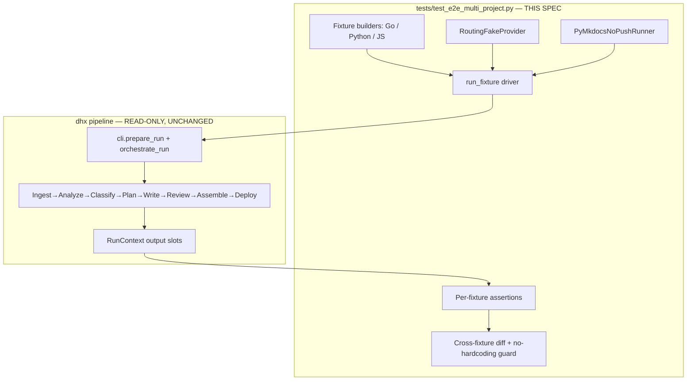
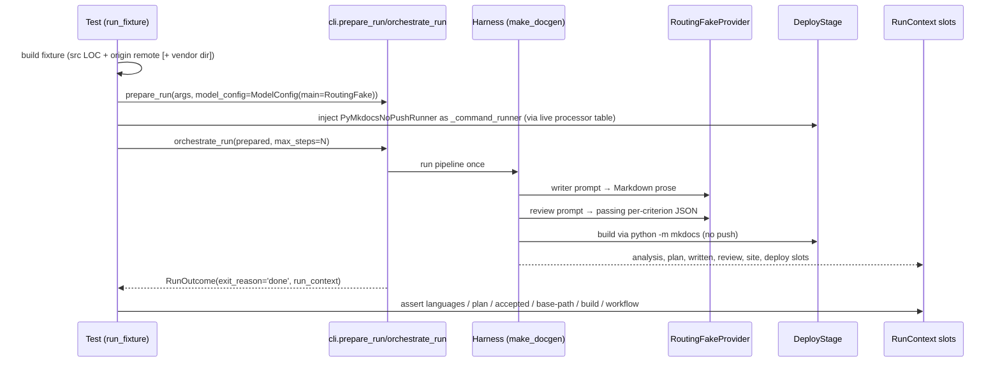

# Design Document

## Overview

**Purpose**: This feature delivers a permanent, tested guarantee that the full `dhx` pipeline generates a correct, publishable, per-project Material for MkDocs site for **arbitrary** software projects — not just the `malware_hashes` reference target. It adds **no pipeline behavior**; it adds a hermetic, credential-free end-to-end test suite plus a one-off real-repo validation that lock generality in.

**Users**: DocuHarnessX maintainers and CI consume this — the suite fails any future change that reintroduces an example-specific (Go-only / `malware_hashes`-only) assumption, and the one-off run is session evidence that the pipeline already works on five real diverse repositories.

**Impact**: No production code changes. The pipeline (Ingest → Analyze → Classify → Plan → Write → Review → Assemble → Deploy) is driven read-only through its existing programmatic seam (`cli.prepare_run` + `cli.orchestrate_run`) with an injected fake `ModelConfig`. The deliverable is one new test module, its crafted fixtures and helpers, and a captured generalization report.

### Goals
- A `tests/test_e2e_multi_project.py` that runs the full pipeline on crafted Go, Python, and JS fixtures via the programmatic path with a content-routing fake provider, asserting per-fixture correctness end to end.
- A cross-fixture difference assertion and a no-example-hardcoding guard (including active vendor/build exclusion).
- The full test suite stays green (currently 2119 tests).
- A documented one-off run across five representative real targets with a captured generalization report.

### Non-Goals
- Modifying any pipeline stage, core package, `make_docgen`, the stage registry, the CLI argument surface, the ontology APIs, or the model resolver.
- Running any `gh-deploy` network push (tests or one-off).
- Adding the external clones or any network dependency to the persistent suite.
- New documentation-pipeline features of any kind.

## Boundary Commitments

### This Spec Owns
- The new test module `tests/test_e2e_multi_project.py` and everything it contains: crafted multi-language fixture builders, the per-fixture full-pipeline driver, per-fixture assertions, the cross-fixture difference assertion, and the no-example-hardcoding guard.
- A reusable **content-routing fake provider** (review-prompt → passing JSON verdict; otherwise → Markdown prose) and a reusable **`python -m mkdocs` build runner that refuses any push**. These live in the test scope (added to `tests/_fakes.py`, reusing the existing `FakeProvider` base and mirroring the deploy build-E2E `_NoPushRealRunner`).
- The one-off real-repo validation script/run for this session and its captured generalization report (delivered as session evidence; any throwaway script under `/tmp`, not committed pipeline code).

### Out of Boundary
- Every pipeline stage and core package (`analysis/`, `planning/`, `composition/`, `review/`, `assembler/`, `deployer/`, `stages/*`), `bundle.make_docgen`, the stage registry, `cli.py`'s argument surface and orchestration logic, `context.py`, the ontology APIs, and `model_resolver.py` — all consumed read-only, none modified.
- `tasks.md` of this spec is not edited during the validation run (per task constraint).
- Real-remote pushes; non-MkDocs backends; multi-repo aggregation; model evolution; docs i18n.

### Allowed Dependencies
- The programmatic run seam: `cli.build_parser`, `cli.prepare_run(args, model_config=...)`, `cli.orchestrate_run(prepared, max_steps=...)`, and `cli.PreparedRun` / `cli.RunOutcome`.
- `RunContext` accessors for run outputs: `repo_analysis()`, `coverage_plan()`, `written_segments()`, `review_report()`, `assembled_site()`, `deploy_result()`.
- The existing test scaffolding: `tests/_fakes.FakeProvider`, the deploy build-E2E `_NoPushRealRunner` pattern, `docuharnessx.review.COBESY_CRITERIA`, `docuharnessx.deployer.commands.DefaultCommandRunner`, `docuharnessx.stages.deploy.DeployStage` (only to locate the live processor for runner injection, mirroring `cli._thread_deploy_mode`).
- The installed `mkdocs` + `mkdocs-material` (declared runtime deps), invoked as `python -m mkdocs`.
- `pytest`, `yaml`, stdlib `subprocess`/`git` (for fixture `origin` remotes), `tmp_path`.

### Revalidation Triggers
- A change to the programmatic run seam signature (`prepare_run` / `orchestrate_run` / `PreparedRun` / `RunOutcome`).
- A change to the scanner exclusion set (`DEFAULT_EXCLUDED_DIRS`).
- A change to the `AssembledSite` / `SiteIdentity` field set, `DeployResult`, `ReviewReport`, `CoveragePlan`, or `RepoAnalysis` shape, or any of their schema-version bumps.
- A change to the language-detection table (`analysis/languages.py`).
- A change to how the Deploy stage resolves its `CommandRunner` (`_command_runner`) or deploy mode (`_deploy_mode`).

## Architecture

### Existing Architecture Analysis

The pipeline is already complete and verified on `main`. The relevant, stable seams this spec rides on:

- **Programmatic credential-free run**: `cli.prepare_run(args, model_config=<fake>)` validates the target, loads the vocabulary (default profile when absent, with a `dhx init` hint), loads config, and binds the injected `ModelConfig` via `.agentic(make_docgen(...))` — bypassing the real model resolver entirely. `cli.orchestrate_run(prepared, max_steps=...)` populates the run-context slots (target repo, output dir, vocabulary, a `FilesystemSegmentStore` under `<out>/segments`), threads the deploy mode onto the live `DeployStage`, runs the composed pipeline once, and returns a `RunOutcome` whose `run_context` exposes every stage's output slot.
- **Content-routing requirement (from spike)**: a plain fake returning `"done"` makes the Review gate fail closed (every segment `unavailable`, empty accepted set, empty site). A routing fake that returns a passing per-criterion JSON verdict for review prompts and Markdown prose otherwise produces a non-empty accepted set and a real site (spike: 9 planned → 9 written → 9 accepted, site assembled at `base_path=/tool/`).
- **Build invocation (from spike)**: the `DeployStage` builds via its `CommandRunner` issuing `["mkdocs", "build", ...]`. With no `mkdocs` console script on `PATH` this crashes (`No such file or directory: 'mkdocs'`). The deploy build-E2E suite already solves this with `_NoPushRealRunner`, a `DefaultCommandRunner` subclass that rewrites a leading `mkdocs` token to `[sys.executable, "-m", "mkdocs", ...]` and raises on any `gh-deploy`. This spec reuses that pattern, injecting the runner onto the live `DeployStage` the same way `cli._thread_deploy_mode` injects the mode.
- **Per-target identity**: `assembler.identity.resolve_site_identity` derives `site_url`/`base_path` from the target's `origin` remote; `stages/assemble.py` reads the remote via the mockable `read_origin_remote`. So fixtures need a real `origin` remote (set with `git init` + `git remote add origin https://github.com/<owner>/<repo>.git`) to get a GitHub `/<repo>/` base-path.
- **Vendor exclusion**: `scanner.DEFAULT_EXCLUDED_DIRS` already covers `.git`, `.venv`, `node_modules`, `vendor`, `target`, `__pycache__`, `dist`, `build`, `site`. The spike confirmed zero vendor leakage across the four real targets; the suite asserts this **actively** by planting a `node_modules`/`vendor`/`target` dir in a fixture and checking nothing under it appears in the inventory.

### Architecture Pattern & Boundary Map



**Architecture Integration**:
- Selected pattern: **black-box end-to-end validation through the public programmatic seam** — the pipeline is exercised exactly as a credential-free production-shaped caller would, and only its observable outputs (run-context slots, written files, built site, emitted workflow, exit reason) are asserted.
- Boundaries: all new code lives in `tests/`; production packages are imported read-only. The only "injection" touches the live `DeployStage` instance to set its `_command_runner`, mirroring the existing `cli._thread_deploy_mode` and the deploy build-E2E suite.
- Steering compliance: model goes in `ModelConfig` (the injected fake), never `HarnessConfig`; the planner is exercised deterministically; the LLM-judge path is gated and reproducible via the routing fake.

### Technology Stack

| Layer | Choice / Version | Role in Feature | Notes |
|-------|------------------|-----------------|-------|
| Frontend / CLI | `docuharnessx.cli` programmatic API | Drives the pipeline (`prepare_run`/`orchestrate_run`) | Bare console script never used |
| Backend / Services | Full `dhx` pipeline (Waves 0–3) | Under test, read-only | Unchanged |
| Test framework | `pytest` (Python 3.12) | Hosts the suite | New module `tests/test_e2e_multi_project.py` |
| Fake model | `RoutingFakeProvider` (subclass of `tests._fakes.FakeProvider`) | Accept-path judge + writer prose | No network, no credentials |
| Build runner | `PyMkdocsNoPushRunner` (subclass of `DefaultCommandRunner`) | `python -m mkdocs build`, refuses push | Mirrors deploy build-E2E `_NoPushRealRunner` |
| Doc build | `mkdocs` + `mkdocs-material` | Real build under per-target base-path | Invoked via `python -m mkdocs` |
| Fixtures | crafted tmp repos + `git` `origin` remotes | Go/Python/JS targets | Created at test time under `tmp_path` |

## File Structure Plan

### Directory Structure
```
tests/
├── test_e2e_multi_project.py   # NEW — the hermetic multi-language full-pipeline E2E suite:
│                               #   fixture builders, run_fixture driver, per-fixture
│                               #   assertions, cross-fixture diff, no-hardcoding guard
└── _fakes.py                   # MODIFIED (append-only) — add RoutingFakeProvider and
                                #   PyMkdocsNoPushRunner alongside the existing FakeProvider
```

### Modified Files
- `tests/_fakes.py` — **append-only**: add `RoutingFakeProvider` (content-routing accept-path judge + writer prose) and `PyMkdocsNoPushRunner` (rewrites `mkdocs`→`python -m mkdocs`, raises on `gh-deploy`), each added to `__all__`. The existing `FakeProvider`, `ReplacementStage`, and `make_replacement_stage` are untouched.

### One-off (not committed pipeline code)
- A throwaway driver script under `/tmp` (e.g. `/tmp/dhx_oneoff.py`) reused for the five real targets, plus the captured generalization report delivered as session evidence. No file under `docuharnessx/` is created or modified.

> Each file has one clear responsibility. No production source file is created or modified.

## System Flows

Per-fixture full-pipeline run + assertion flow:



After per-fixture runs, the suite compares two-or-more fixtures' plans and identities (Requirement 9) and runs the no-hardcoding guard, including the vendor-exclusion check (Requirement 10).

Deploy-mode choice per fixture: **emit-ci-workflow** is exercised on at least one fixture into a throwaway target tree (to assert the emitted workflow + isolation), and **build-only** is acceptable for the others (build under base-path, target untouched). Both modes drive a real `python -m mkdocs build`; neither reaches the push.

## Requirements Traceability

| Requirement | Summary | Components | Flows |
|-------------|---------|------------|-------|
| 1.1–1.5 | Hermetic multi-language fixtures, programmatic path, green suite | Fixture builders, `run_fixture` | Per-fixture run |
| 2.1–2.5 | Content-routing fake accept-path + prose | `RoutingFakeProvider` | writer/review prompts |
| 3.1–3.4 | Per-fixture primary language | `run_fixture`, `RunContext.repo_analysis()` | Analyze slot assertion |
| 4.1–4.3 | Project-specific, vocab-valid, reproducible plan | `RunContext.coverage_plan()` | Plan slot assertion |
| 5.1–5.3 | Written + accepted non-empty segments | `RunContext.written_segments()/review_report()` | Write/Review slots |
| 6.1–6.3 | Per-target assembled site + base-path | `RunContext.assembled_site()` | Assemble slot assertion |
| 7.1–7.4 | Real build under base-path, no push | `PyMkdocsNoPushRunner`, `RunContext.deploy_result()` | Deploy build |
| 8.1–8.4 | Emitted workflow + clean exit | DeployStage emit-ci-workflow, `RunOutcome.exit_reason` | Deploy emit, outcome |
| 9.1–9.3 | Cross-fixture difference | Cross-fixture diff assertion | Post-run comparison |
| 10.1–10.3 | No-hardcoding guard + vendor exclusion | Guard assertion, planted vendor dir | Inventory + identity checks |
| 11.1–11.5 | One-off five-target validation + report | One-off driver, generalization report | Session evidence |

## Components and Interfaces

| Component | Layer | Intent | Req Coverage | Key Dependencies | Contracts |
|-----------|-------|--------|--------------|------------------|-----------|
| `RoutingFakeProvider` | Test fake | Accept-path judge + writer prose | 2.1–2.5, 5.x | `FakeProvider`, `COBESY_CRITERIA` | Provider |
| `PyMkdocsNoPushRunner` | Test fake | Real build via `python -m mkdocs`, no push | 7.1, 7.3 | `DefaultCommandRunner` | CommandRunner |
| Fixture builders | Test helpers | Crafted Go/Python/JS repos + remotes | 1.1, 1.5, 10.2 | `git`, `tmp_path` | — |
| `run_fixture` driver | Test helper | One full-pipeline run, returns outputs | 1.2, 1.3, 7.x, 8.x | `cli.*`, `DeployStage` | — |
| Per-fixture assertions | Test cases | Languages/plan/segments/site/build/workflow | 3–8 | `RunContext` accessors | — |
| Cross-fixture + guard | Test cases | Difference + no-hardcoding + vendor | 9, 10 | run outputs | — |

### Test Fakes

#### RoutingFakeProvider

| Field | Detail |
|-------|--------|
| Intent | Bind a credential-free provider that accepts review prompts and emits prose otherwise |
| Requirements | 2.1, 2.2, 2.3, 2.4, 2.5 |

**Responsibilities & Constraints**
- Subclass `tests._fakes.FakeProvider` (itself a `BaseModelProvider`) so binding via `ModelConfig(main=...).agentic(...)` works and provider type checks pass.
- Classify each `complete(messages, ...)` call: if the joined message text contains COBESY criterion markers (the names in `docuharnessx.review.COBESY_CRITERIA`) or judge/criteria phrasing, it is a **review** prompt; otherwise a **writer** prompt. (The spike validated this heuristic — review prompts carry the criterion names.)
- Review → return JSON `{"criteria": {name: {"score": >=threshold, "passed": true, "reason": ...} for each criterion}, "passed": true, "reason": ...}` exactly in the shape the deterministic verdict parser accepts (mirrors `tests/test_stage_review_integration._passing_verdict_json`).
- Writer → return JSON `{"body": <non-trivial Markdown>, "summary": <one line>}` so the composition prose path produces a non-empty body.
- Return a single end-turn `ModelResponseEvent(finish_reason="end_turn")` (so the run reaches `done`); perform no network/credential access.

**Contracts**: State [ ] / Service [x] (provider `complete`/`count_tokens`)

#### PyMkdocsNoPushRunner

| Field | Detail |
|-------|--------|
| Intent | Run a real `mkdocs build` through the project interpreter while refusing any push |
| Requirements | 7.1, 7.3 |

**Responsibilities & Constraints**
- Subclass `docuharnessx.deployer.commands.DefaultCommandRunner`; record every argv.
- On `run(args, cwd, timeout)`: if `args[0:2] == ["mkdocs", "gh-deploy"]`, set `pushed = True` and raise `AssertionError` (never touch the network). If `args[0] == "mkdocs"`, rewrite to `[sys.executable, "-m", "mkdocs", *args[1:]]` before delegating to the real runner. Otherwise delegate unchanged (so `git` reads still work).
- Expose `build_count()` and `pushed` so assertions confirm exactly one build and no push (mirrors `_NoPushRealRunner`).

**Contracts**: Service [x] (`CommandRunner.run`)

### Driver

#### run_fixture(fixture_dir, *, deploy_mode, out_dir, target_tree=None) → RunOutcome

**Responsibilities & Constraints**
- Build the run namespace via `cli.build_parser().parse_args(["run", fixture_dir, "--out", out_dir, "--deploy-mode", deploy_mode])`.
- `prepared = cli.prepare_run(args, model_config=ModelConfig(main=RoutingFakeProvider()))`.
- Inject `PyMkdocsNoPushRunner` onto every live `DeployStage` on `prepared.harness._rt.processors` (the same processor-table walk `cli._thread_deploy_mode` uses); for emit-ci-workflow also point the deploy target at the throwaway `target_tree`.
- `outcome = cli.orchestrate_run(prepared, max_steps=N)`; return it. Callers read outputs through `outcome.run_context`.
- Preconditions: `fixture_dir` exists, has source LOC dominating its language, and has an `origin` remote. Postconditions: `outcome.exit_reason == "done"`; all stage slots populated.

> The driver opens no socket of its own and binds only the fake provider — no production model resolution occurs.

## Error Handling

### Error Strategy
This is a test suite; "errors" are assertion failures that must point at the exact generality regression. Each assertion names the fixture and the property (language, plan non-emptiness, accepted count, base-path, build, workflow, exit reason) so a failure localizes the regression.

### Error Categories and Responses
- **Empty-site regression** (review gate fails closed): caught by the accepted-count assertion (Requirement 5.3) and the routing-fake accept-path test (Requirement 2.2) — surfaces as `accepted == 0`.
- **Build tooling absent / base-path wrong**: caught by Requirement 7.2 (sitemap under `/<repo>/`) and the `python -m mkdocs` runner; a bare-`mkdocs` `FileNotFoundError` is eliminated by the runner rewrite.
- **Example hardcoding**: caught by the no-hardcoding guard (Requirement 10) — a `malware_hashes`/DocuHarnessX identity string appearing for a non-matching fixture fails the assertion.
- **Vendor leakage**: caught by the planted-vendor-dir inventory check (Requirement 10.2).

### Monitoring
The HarnessJournal trace under each fixture's output dir records the per-stage participation summaries (the spike showed `ingest/analyze/classify/plan/write/review/assemble` triggers); the suite may read the located journal path from the `RunOutcome` for diagnostics but asserts primarily on the typed run-context slots.

## Testing Strategy

### Unit-ish helper checks
- `RoutingFakeProvider` returns a parseable passing verdict for a review-shaped prompt and a `{body, summary}` payload for a writer-shaped prompt (Requirement 2.2, 2.3).
- `PyMkdocsNoPushRunner` rewrites `mkdocs` → `python -m mkdocs` and raises on `gh-deploy` (Requirement 7.1, 7.3).

### Integration / E2E (the core of this suite — per fixture: Go, Python, JS)
- Full pipeline reaches `done`; primary language is the fixture's ecosystem language (Requirement 3).
- Coverage plan non-empty and vocab-valid; reproducible across two runs (Requirement 4).
- Written count > 0, every body non-empty, accepted == written > 0, none `unavailable` (Requirement 5).
- Assembled `mkdocs.yml` carries `/<repo>/` base-path + per-target site URL; no DocuHarnessX identity (Requirement 6).
- Real `python -m mkdocs build` succeeds; sitemap URLs under `/<repo>/`; exactly one build; no push (Requirement 7).
- emit-ci-workflow on ≥1 fixture writes `mkdocs.yml`+`docs/`+`.github/workflows/docs.yml` into the throwaway target tree; workflow is valid YAML with push trigger + Pages permissions + build/deploy jobs; writes stay scoped; `done` (Requirement 8).

### Cross-fixture + guard
- Two different-ecosystem fixtures produce non-identical planned-segment sets and differing base-paths/site URLs; primary-language set differs across Go/Python/JS (Requirement 9).
- A non-Go, non-`malware_hashes` fixture (Python/JS) builds correctly with no `malware_hashes` value required; a planted `node_modules`/`vendor`/`target` dir is excluded from the inventory; no DocuHarnessX identity in any fixture's site identity or deploy result (Requirement 10).

### One-off real-repo validation (session evidence, not CI)
- Drive the five targets (`malware_hashes`, DocuHarnessX, `click`, `express`, `ripgrep`) through the programmatic path with the routing fake into throwaway copies/out dirs; confirm per-target primary language, non-empty accepted set, per-target base-path, and successful build; confirm vendor/build exclusion; never push; capture the generalization report (Requirement 11).
