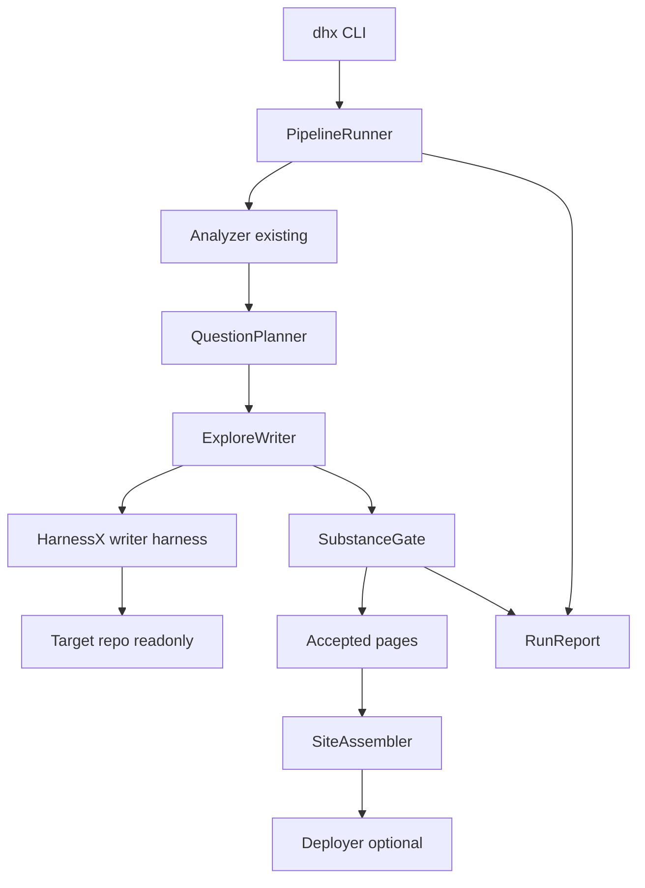
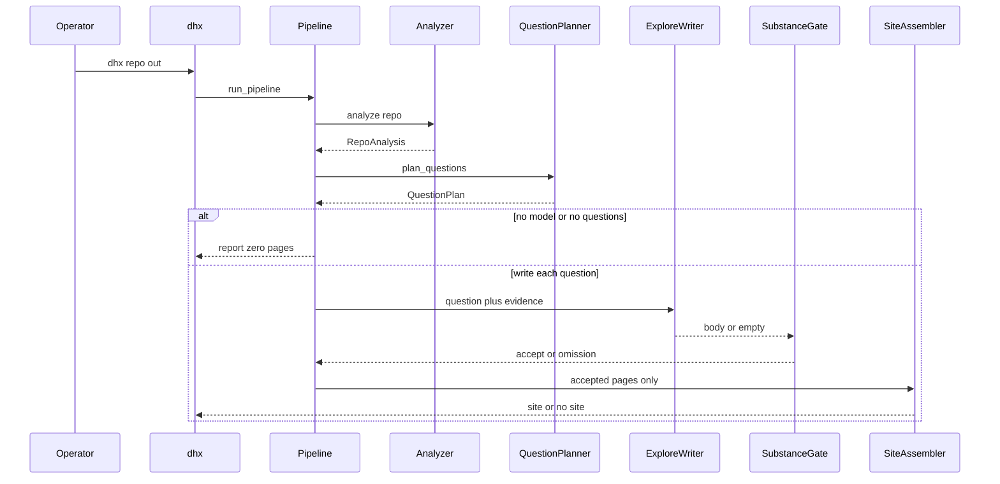

# Design Document

## Overview

This feature inverts DocuHarnessX authoring. The operator still runs `dhx <repo> --out DIR`. Internally the dummy `DONE` harness is replaced by an ordinary Python pipeline: analyze the repository, plan a bounded list of software questions, write each page with a nested HarnessX agent that must read source, omit anything ungrounded, assemble only accepted pages into a question-organised MkDocs site, and write a run report.

**Purpose**: Deliver developer-useful, source-grounded pages instead of Role × Intent outlines.
**Users**: The operator who runs `dhx`; developers who read the generated site.
**Impact**: Retires the 8-stage `step_end` bus, publishable fallback, COBESY blueprint-as-prose, and per-role landings. Reuses `RepoAnalysis`, the inner writer harness, MkDocs emit, and deploy modes.

### Goals

- Page unit is a software question derived from scan signals.
- HarnessX is constructed only for per-page writing.
- Ungrounded pages are omitted; outline text is never published.
- Default run does not require a role vocabulary.
- The project gets smaller: retired authoring code and tests that pin template dumps are deleted after the CLI switch.

### Non-Goals

- Rewriting HarnessX, adding RAG/AST, or a second writer runtime.
- Updating `dhx mcp` refine (will break; follow-up).
- Redesigning GitHub Pages hosting or the Material theme beyond dropping role-nav.
- Keeping a hidden fallback path “for safety.”

## Boundary Commitments

### This Spec Owns

- The documentation pipeline runner and its CLI orchestration (`prepare_run` / `orchestrate_run` behaviour).
- The `Question` / `QuestionPlan` / `Page` / `RunReport` seams.
- Question planning rules and caps over `RepoAnalysis`.
- The explore-first writer task prompt and the fail-closed handoff (no substitute body).
- The substance gate (accept vs omit).
- Question-organised home/nav emit; deletion of per-role landings from the default site.
- Deletion of the dummy outer harness, publishable fallback, Role × Intent matrix as page author, and COBESY form-judge as the publish gate.
- Tests that prove grounded accept and no-explore omit on the shipped fixture.

### Out of Boundary

- Scanner internals (`docuharnessx.analysis` detectors), except consuming `RepoAnalysis`.
- HarnessX provider/workspace/control implementation; only the call site is in scope.
- Model resolution policy already in `model_resolver.py` (native OpenAI for tool-calling).
- Deploy mode semantics (`build-only`, `emit-ci-workflow`, `gh-deploy`).
- MCP refine server.
- `dhx init` ontology file format (unused by the default run; not deleted in this spec).

### Allowed Dependencies

- `docuharnessx.analysis.analyze` / scanner → `RepoAnalysis`
- `docuharnessx.composition.harness_factory.build_writer_harness`
- `docuharnessx.composition.agent.AgenticProseRunner` (return `None` means omit)
- `docuharnessx.model_resolver.resolve_model`
- Assembler identity, MkDocs config, page-file writer, theme (not role renderer)
- `docuharnessx.deployer` after assemble
- `tests/fixtures/agentic_repo` and scripted fake provider

### Revalidation Triggers

- `Question` / `Page` / `RunReport` field set changes
- Substance-gate accept rules
- Pipeline step order or CLI exit meaning of a zero-page run
- Writer task-prompt contract (question + evidence only)
- Question id scheme (downstream page filenames)

## Architecture

### Existing Architecture Analysis

Today: `cli.orchestrate_run` binds `ModelConfig.agentic(make_docgen())`, slots ontology + segment store, runs a skeleton `BaseTask` that forbids tools. Eight `step_end` processors scan, classify Role × Intent, write (agent or **fallback outline**), COBESY-judge, assemble role landings, deploy.

What still works: `RepoAnalysis`; nested writer harness with read-only workspace; MkDocs emit; deploy modes; model resolver.

What must not survive the default path: dummy outer task, `render_fallback_body` as publish, `planning.matrix` as page author, `assembler.roles`, review-as-publish-gate.

### Architecture Pattern & Boundary Map

Selected pattern: **sequential pipeline with a single agentic adapter**.



- Domain boundaries: planner and gate are model-free; writer adapter is the only HarnessX construct site; assembler does not invent pages.
- Existing patterns preserved: frozen dataclasses, localized HarnessX imports, `ModelConfig` outside harness config.
- New components exist because the old ones author the page before reading code.
- Steering: Python pipeline + HarnessX writer; no publishable fallback.

### Technology Stack

| Layer | Choice / Version | Role in Feature | Notes |
|-------|------------------|-----------------|-------|
| CLI | Python 3.12, existing `dhx` | Operator entry | `orchestrate_run` calls `run_pipeline` |
| Pipeline | stdlib | Step sequence + report | No dummy agent |
| Writer | HarnessX (git dep, already declared) | Per-question explore/write | Reuse factory + runner |
| Site | mkdocs, mkdocs-material (already declared) | Emit accepted pages | Role nav removed |
| Data | Markdown files under `<out>/pages` and `<out>/site` | Page store + MkDocs tree | Slim frontmatter |

## File Structure Plan

```
docuharnessx/
├── pipeline/
│   ├── __init__.py          # run_pipeline, RunReport public
│   ├── run.py               # sequential steps
│   └── report.py            # RunReport serialize + write
├── planning/
│   ├── question_model.py    # Question, QuestionPlan, QuestionKind
│   └── questions.py         # plan_questions(analysis) -> QuestionPlan
├── composition/
│   ├── question_task.py     # build_question_task (replaces blueprint task prompt)
│   ├── substance_gate.py    # validate_page_body
│   ├── agent.py             # keep; caller must not fallback
│   └── harness_factory.py   # keep
├── pages/
│   ├── __init__.py
│   └── model.py             # Page, Omission
├── assembler/
│   ├── home.py              # question index, not roles
│   ├── pages.py             # keep filename + body emit
│   └── ...                  # identity, mkdocs_config, writer, theme keep
├── cli.py                   # orchestrate_run -> run_pipeline
└── analysis/                # keep; called as functions
```

### New files

- `docuharnessx/pipeline/run.py` — `run_pipeline`
- `docuharnessx/pipeline/report.py` — report write
- `docuharnessx/planning/question_model.py` — question types
- `docuharnessx/planning/questions.py` — planner
- `docuharnessx/composition/question_task.py` — writer task description
- `docuharnessx/composition/substance_gate.py` — gate
- `docuharnessx/pages/model.py` — `Page`, `Omission`

### Modified files

- `docuharnessx/cli.py` — stop binding `make_docgen` as the run; call `run_pipeline`; no skeleton `BaseTask`
- `docuharnessx/composition/agent.py` — gate via substance gate; stats still returned; no change to “never raise”
- `docuharnessx/assembler/home.py` — list accepted question titles
- `docuharnessx/assembler/writer.py` / `mkdocs_config.py` — nav from pages, not roles
- `tests/_fakes.py` — scripted inspect vs no-inspect providers
- Steering already updated (`product.md`, `tech.md`, `structure.md`, `roadmap.md`)

### Deleted after CLI switch (this spec)

- Publish path: `composition/fallback.py`, `composition/blueprint.py` as page author, `composition/prompt.py` single-shot, `composition/task_prompt.py` COBESY task
- Pipeline bus: `bundle.py` `make_docgen` as default run, `stages/*.py` as `step_end` bus (analysis **functions** remain under `analysis/`)
- Persona author: `planning/matrix.py`, `planning/classifier.py` as page author, `planning/planner.py` `PlannedSegment` for default run
- Publish gate: `review/` as required accept path
- Role site: `assembler/roles.py` and calls from home/nav
- Tests that pin `Locate the CLI.`, fallback headings, role landings, dummy harness participation

Do not delete `analysis/`, `model_resolver.py`, `harness_factory.py`, deployer, assembler identity/theme, `tests/fixtures/agentic_repo`.

## System Flows



Key decisions: no substitute body on the reject arrow; assemble is skipped when accepted count is 0 (Req 8.4); deploy runs only if assemble ran and the operator asked for a publish mode.

## Requirements Traceability

| Requirement | Summary | Components | Interfaces | Flows |
|-------------|---------|------------|------------|-------|
| 1.1 | Run to out dir | CLI, PipelineRunner | `run_pipeline` | happy path |
| 1.2 | Invalid target refused | CLI | `_validate_target_repo` | error |
| 1.3 | No model: zero pages + report | PipelineRunner, RunReport | `run_pipeline` | no-model |
| 1.4 | Roles not required | PipelineRunner, Page | — | happy path |
| 2.1 | Plan software questions | QuestionPlanner | `plan_questions` | plan |
| 2.2 | One page per question | PipelineRunner, Page | — | write |
| 2.3 | Title is the question | QuestionPlanner, SiteAssembler | — | assemble |
| 2.4 | No role-intent page identity | QuestionPlanner | `Question.id` | plan |
| 3.1 | Startup question from entrypoints | QuestionPlanner | `plan_questions` | plan |
| 3.2 | Component questions from names | QuestionPlanner | `plan_questions` | plan |
| 3.3 | Public-surface question | QuestionPlanner | `plan_questions` | plan |
| 3.4 | Build/CI question | QuestionPlanner | `plan_questions` | plan |
| 3.5 | No signals: zero questions | QuestionPlanner, PipelineRunner | `plan_questions` | plan |
| 3.6 | Default roles do not activate pages | QuestionPlanner | — | plan |
| 4.1 | Component cap | QuestionPlanner | caps | plan |
| 4.2 | Max questions | QuestionPlanner | caps | plan |
| 4.3 | No invented questions | QuestionPlanner | — | plan |
| 5.1 | Prompt is question + evidence | ExploreWriter | `build_question_task` | write |
| 5.2 | Accepted page has path:line | SubstanceGate, Page | `validate_page_body` | gate |
| 5.3 | No inspect: omit | ExploreWriter, PipelineRunner | stats.steps | omit |
| 5.4 | No filled outline in prompt | ExploreWriter | `build_question_task` | write |
| 6.1 | Writer failure omits, no substitute | PipelineRunner | no fallback | omit |
| 6.2 | All omitted: report, no crash | PipelineRunner, RunReport | — | omit |
| 6.3 | No locate/smallest-action pages | SubstanceGate | phrase reject | gate |
| 6.4 | Uninspectable repo omits all | PipelineRunner | `inspection_impossible` | omit |
| 7.1 | Two distinct real path:line files | SubstanceGate | `validate_page_body` | gate |
| 7.2 | Real identifier in body | SubstanceGate | `validate_page_body` | gate |
| 7.3 | Citations must exist on disk | SubstanceGate | `validate_page_body` | gate |
| 7.4 | Diagram optional | SubstanceGate | `validate_page_body` | gate |
| 7.5 | Question restatement omitted | SubstanceGate | `validate_page_body` | gate |
| 8.1 | Home lists accepted questions | SiteAssembler | `render_home_page` | assemble |
| 8.2 | No per-role landing nav | SiteAssembler | — | assemble |
| 8.3 | No stubs for omitted questions | SiteAssembler, PipelineRunner | — | assemble |
| 8.4 | Zero accepts: no role shell site | PipelineRunner, SiteAssembler | — | assemble |
| 8.5 | Optional Pages after accepts | CLI, Deployer | deploy_mode | assemble |
| 9.1 | Counts in report | RunReport | write report | all |
| 9.2 | Closed-set omission reasons | RunReport | OmissionReason | all |
| 9.3 | Report has no bodies | RunReport | — | all |
| 9.4 | Verbose still bounded | RunReport, CLI | — | all |
| 10.1 | Default run has no role/COBESY pages | CLI, SiteAssembler | — | default run |
| 10.2 | No published outline fallback | PipelineRunner | — | default run |
| 10.3 | No role list required | CLI, PipelineRunner | — | default run |
| 10.4 | No retired slogans in pages | SubstanceGate | phrase reject | gate |
| 11.1 | Fixture inspect → grounded page | tests, ExploreWriter, SubstanceGate | fixture | e2e |
| 11.2 | Fixture no-inspect → zero pages | tests, PipelineRunner | fixture | e2e |
| 11.3 | Stable question ids | QuestionPlanner | `plan_questions` | plan |

## Components and Interfaces

| Component | Domain | Intent | Req Coverage | Key Dependencies | Contracts |
|-----------|--------|--------|--------------|------------------|-----------|
| PipelineRunner | pipeline | Drive steps, never publish outlines | 1, 6, 8.4, 9, 10 | Analyzer, QuestionPlanner, ExploreWriter, SubstanceGate, SiteAssembler | Service |
| QuestionPlanner | planning | Analysis to bounded questions | 2, 3, 4, 11.3 | RepoAnalysis | Service |
| ExploreWriter | composition | One agent per question | 5, 6 | harness_factory, AgenticProseRunner, question_task | Service |
| SubstanceGate | composition | Accept or omit a body | 7, 11 | repo path, Question | Service |
| Page | pages | Slim accepted document | 2, 8 | — | State |
| RunReport | pipeline | Operator counts + reasons | 9, 1.3, 6.2 | — | State |
| SiteAssembler | assembler | Question home + pages | 8 | Page, identity | Service |
| CLI | cli | Validate, resolve model, run pipeline | 1, 10 | PipelineRunner, model_resolver | Service |

### Pipeline

#### PipelineRunner

| Field | Detail |
|-------|--------|
| Intent | Run analyze → questions → write/gate → assemble/deploy; record report |
| Requirements | 1.1, 1.3, 6.1, 6.2, 6.4, 8.4, 9.1, 10.2 |

**Responsibilities & Constraints**
- Owns step order and the rule “no accepted pages → no site shell.”
- Must not call `render_fallback_body` or any outline renderer.
- No-model: still analyze + plan, skip write, report `no_model` for each question or a single run-level reason if zero writes attempted.

**Dependencies**
- Outbound P0: Analyzer, QuestionPlanner, ExploreWriter, SubstanceGate, SiteAssembler, RunReport
- Outbound P1: Deployer when assemble succeeded and mode ≠ skip

**Contracts**: Service

##### Service Interface

```python
def run_pipeline(
    *,
    repo_path: str,
    out_dir: str,
    model: object | None,
    deploy_mode: str,
) -> RunOutcome:
    ...
```

- Preconditions: `repo_path` is an existing directory (CLI already validated).
- Postconditions: `RunReport` written under `out_dir`; pages only for gate-accepted bodies; site only if accepted count ≥ 1.
- Invariants: no published body originates from a planning outline.

#### RunReport

Frozen value: `planned: int`, `accepted: int`, `omitted: int`, `questions: tuple[QuestionId, ...]`, `omissions: tuple[Omission, ...]`.

`Omission`: `question_id`, `reason: OmissionReason`.

`OmissionReason`: `not_inspected` | `empty` | `gate_rejected` | `no_model` | `inspection_impossible`.

Write as YAML or Markdown under `<out>/report.md` (human) plus optional `<out>/report.json` (machine). No bodies.

### Planning

#### QuestionPlanner

| Field | Detail |
|-------|--------|
| Intent | Deterministic questions from RepoAnalysis |
| Requirements | 2.1, 2.2, 2.4, 3.1–3.6, 4.1–4.3, 11.3 |

**Rules (data, not persona table)**

| Signal | Question kind | Title shape | Evidence |
|--------|---------------|-------------|----------|
| entrypoints | `startup` | How does this program start? | entrypoint paths |
| each component (up to cap) | `component` | What does {name} do? | component representative files |
| public_surface | `public_surface` | How is the public surface used or extended? | symbol source paths |
| build_files or ci_workflows | `build` | How is this project built and verified? | those paths |
| tests.present | `tests` | How are tests organized? | representative test paths |

**Caps**: `MAX_QUESTIONS = 12`, `MAX_COMPONENT_QUESTIONS = 6`. Extra components omitted from the plan; report records `capped_components` in notes if useful, without violating 9.3 (no bodies).

**Id**: `{kind}:{slug}` where slug is the component/entrypoint basename, filesystem-safe, stable.

Equal `RepoAnalysis` → equal `QuestionPlan` (same ids, order).

```python
def plan_questions(analysis: RepoAnalysis) -> QuestionPlan: ...
```

Empty analysis → empty plan (Req 3.5). Never reads a role vocabulary.

### Writer

#### ExploreWriter

| Field | Detail |
|-------|--------|
| Intent | Bounded agent per question; return body or None |
| Requirements | 5.1–5.4, 6.1, 6.4 |

**Task prompt (`build_question_task`)** contains: mission to answer the question by reading the repo; repo root; evidence file list; instruction to cite `path:line` and name real symbols; prohibition on template slogans and on reciting a filled outline; instruction that the final message is the Markdown body. It does **not** contain SCQA sentences, key-message templates, or fast-path steps.

**Inspection**: treat as not-inspected when `AgentRunStats.steps <= 1` (answered without a tool loop) or when the substance gate later finds no real paths. Pipeline maps that to `not_inspected`.

**No fallback**: `None` is omission, never a rendered blueprint.

Reuses `build_writer_harness` and `AgenticProseRunner.run` (guidance kw remains for out-of-scope MCP; default `""`).

### Gate

#### SubstanceGate

| Field | Detail |
|-------|--------|
| Intent | Deterministic accept/omit |
| Requirements | 7.1–7.5, 11.1–11.2 |

```python
def validate_page_body(
    body: str,
    *,
    repo_path: str,
    question: Question,
) -> GateResult: ...
```

Accept iff all of:

1. ≥ 2 distinct `path:line` citations whose paths exist under `repo_path`
2. ≥ 1 identifier from the question’s subject/evidence basenames or analysis-derived names appears as a whole token in the body
3. Body does not match retired phrases (case-insensitive): `fastest path for`, `who this is for:`, `run the smallest action`, `verify you reached first success`, `locate {subject}` as the only imperative pattern
4. Body is not merely the question title restated (token overlap with title only, no extra identifiers)

Mermaid fences are ignored for the decision (Req 7.4).

`GateResult.accepted` false → `gate_rejected` unless inspection stats already said `not_inspected`.

### Pages and site

#### Page

Frozen: `id` (question id), `title`, `summary` (first paragraph or derived one-liner), `body`, `subjects: tuple[str, ...]`, `related: tuple[str, ...]`, `cited_files: tuple[str, ...]`.

No `roles`, no `intent`.

Stored as `<out>/pages/<id-slug>.md` with YAML frontmatter.

#### SiteAssembler

Home page: heading = target repo name (existing identity); list of accepted page titles as links. No “pick your role.”

Nav in `mkdocs.yml`: home + each page. Drop role directories.

If accepted is empty: write report only; do not emit role-based `docs/` shell (Req 8.4). `deploy_mode` is skipped.

Existing identity/base-path from git remote stays.

### CLI

`prepare_run`: keep target validation, out dir, model resolution. Stop loading vocabulary as a write prerequisite. Stop `ModelConfig.agentic(make_docgen())` as the run harness.

`orchestrate_run`: `run_pipeline(repo, out, model=model_config.main if present else None, deploy_mode=...)`. Exit 0 on completed run including zero accepted pages (honest empty is success). Non-zero only for invalid target, orchestration exceptions, or deploy hard failure.

Verbose flag still exists; report stays bounded.

## Data Models

### Domain Model

- **QuestionPlan** aggregate: ordered `Question`s + `repo_path`.
- **Question**: id, kind, title, subject_name, evidence_paths.
- **Page**: accepted answer for one Question.
- **Omission**: question id + reason.
- **RunReport**: counts + omissions.

Invariant: every Page.id equals a planned Question.id; every Omission.question_id likewise; planned = accepted + omitted.

### Logical Data Model

On disk under `out_dir`:

- `pages/*.md` — accepted pages only
- `report.md` / `report.json`
- `site/` — MkDocs source + build when accepted ≥ 1
- writer journal fragments may still appear from HarnessX; not the operator report

## Error Handling

| Case | Response |
|------|----------|
| Invalid target | CLI non-zero, no out writes (existing) |
| No model | Zero pages, report `no_model`, exit 0 |
| Repo not inspectable at write | All omit `inspection_impossible` |
| Writer raise/timeout/empty | Omit `empty` or `not_inspected`; continue other questions |
| Gate reject | Omit `gate_rejected`; continue |
| All omitted | Report only; exit 0 |
| Assemble/deploy failure after accepts | Non-zero; pages + report already on disk |

No outline substitution in any row.

## Testing Strategy

### Unit

- `plan_questions` on fixture analysis: expected kinds/ids; empty analysis → empty plan; component cap; determinism (Req 11.3, 3, 4)
- `validate_page_body`: accept grounded fixture-like body; reject template slogans; reject missing paths; reject title-only restatement; mermaid-only without citations reject; mermaid extra does not cause reject (Req 7)
- `build_question_task`: contains question + evidence paths; does not contain `Situation:`, `fastest path for`, REDUCE/SCQA/Minto labels (Req 5.1, 5.4)
- `run_pipeline` with no model: zero pages, report reason `no_model` (Req 1.3)

### Integration

- Scripted provider that **reads** fixture files then returns cited, symbol-named body → ≥1 accepted page citing `app.py` / `engine.py` / `config.py` and naming `Engine` or `load_config` (Req 11.1)
- Scripted provider that returns outline text with `steps=0` → zero accepted pages, omissions `not_inspected` or `gate_rejected` (Req 11.2)
- Home page lists question titles, not role labels (Req 8)

### E2E

- `dhx` against fixture `--deploy-mode build-only`: either grounded site or honest empty+report; never `Locate` / `smallest action` in `pages/` or `site/docs/`
- Invalid path: non-zero, no pages

### Explicitly forbidden tests

- Asserting fallback heading `## Fast path` or `Locate cli.` as success
- Asserting per-role `docs/<role>/index.md` as success
- Asserting dummy harness `DONE` participation as the documentation run

## Migration Strategy


No dual-run flag. After B, default `dhx` is explore-first. MCP refine may break at B; accepted.

Rollback: git revert of the switch commit. No data migration of old Role × Intent segments.

## Supporting References

- Gap and options: `research.md`
- Retired dummy task text: `docuharnessx/cli.py` `_SKELETON_TASK_DESCRIPTION`
- Production tool-loop incident: `docuharnessx/model_resolver.py`
