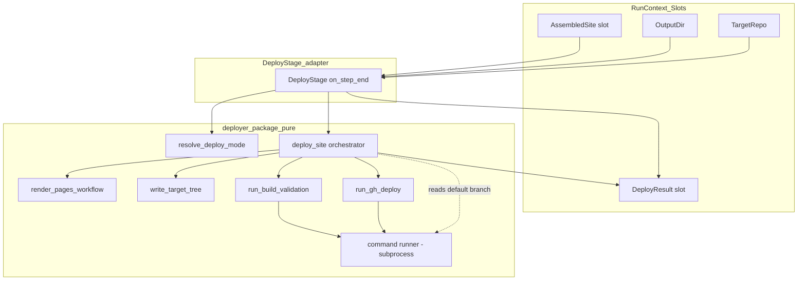
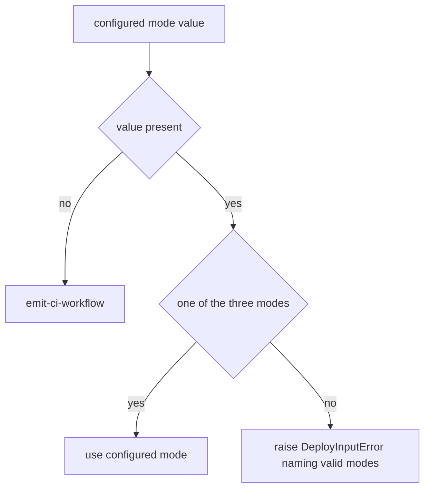

# Design Document — github-pages-deploy

## Overview

**Purpose**: This feature delivers a real **Deploy** pipeline stage that publishes the assembled Material for MkDocs site to the **target project's** GitHub Pages — for *any* target project, in one of three configurable modes — making DocuHarnessX a reusable, publishing documentation generator.

**Users**: Operators running `dhx <target-repo>` who want the generated docs published (or made publishable) for their own project; the target project's maintainers, whose repository self-publishes Pages on push (default mode); and maintainers auditing a run through the `DeployResult` recorded in the journal.

**Impact**: Replaces the `docuharnessx/stages/deploy.py` no-op stub **in place**. It consumes the frozen `AssembledSite` on `SLOT_ASSEMBLED_SITE` (verbatim, read-only) — the site source dir, `docs/` dir, `mkdocs.yml` path, and the already-resolved per-target `SiteIdentity` (`site_url`, `base_path` = `/<repo>/`, `repo_url`, `repo_name`, `edit_uri`, `site_name`) — plus the output dir and target repo path. It runs the selected deploy mode (default **emit-ci-workflow**, plus **gh-deploy** and **build-only**), runs `mkdocs build` as build validation under the per-target base-path, and records a frozen `DeployResult` (mode, written/built paths, target Pages URL, status) in the journal and a new append-only `SLOT_DEPLOY_RESULT` slot. The stage registry, the bundle, and every sibling stage are untouched.

### Goals
- Replace the deploy stub in place, preserving the stable single-stage-swap contract (Req 1).
- Consume the frozen `AssembledSite` + its `SiteIdentity` verbatim and read-only — never re-derive the layout or re-parse the remote (Req 2, 4.4).
- Implement three configurable deploy modes — `emit-ci-workflow` (default), `gh-deploy`, `build-only` — selected from config/flags (Req 3, 4, 5, 6).
- Emit `mkdocs.yml` + `docs/` + `.github/workflows/docs.yml` into the target working tree with the per-target identity threaded in and no auto-push (Req 4); push via `mkdocs gh-deploy` only on the gh-deploy path (Req 5).
- Run `mkdocs build` as build validation under the per-target `site_url`/`/<repo>/` base-path before declaring success, credential-free (Req 7).
- Own the frozen `DeployResult` value object + `SLOT_DEPLOY_RESULT` seam, append-only, and journal a bounded summary (Req 8).
- Enforce per-project isolation — exactly one target, never DocuHarnessX's own repo/Pages — and declare the `mkdocs` deps (Req 9).

### Non-Goals
- Assembling the site (`docs/*.md`, role landing pages, tags index, `mkdocs.yml` content, `SiteIdentity` resolution) — owned by `mkdocs-site-assembler`, consumed verbatim.
- Exercising the `mkdocs gh-deploy` network push in tests (the only network action; asserted only structurally / via a mockable command runner).
- `mike` doc-versioning, multi-target aggregation, or any change to the `AssembledSite`/`SiteIdentity`/`ReviewReport`/`Vocabulary` contracts.

## Boundary Commitments

### This Spec Owns
- The real `DeployStage` (a thin harness adapter) that replaces the stub in `docuharnessx/stages/deploy.py` in place.
- A new deterministic, harness-free `docuharnessx/deployer/` package: the deploy-mode resolver, the GitHub Actions workflow renderer, the target-tree writer, the build-validation runner, the `gh-deploy` runner, and the deploy orchestrator.
- The frozen `DeployResult` value object and its `DEPLOY_RESULT_SCHEMA_VERSION`.
- The append-only additions: `SLOT_DEPLOY_RESULT` in `types.py` and the `set_deploy_result`/`deploy_result` accessors in `RunContext`.
- The deploy error family (`DeployError`/`DeployInputError`).
- A `deploy_mode` field on the CLI config (`.docuharnessx/` config / `dhx` flag) threaded into the run for the stage to read.

### Out of Boundary
- The `AssembledSite` / `SiteIdentity` value objects, `ASSEMBLED_SITE_SCHEMA_VERSION`, the emitted `docs/*.md` / `mkdocs.yml` content, and the `AssemblerError` family (`mkdocs-site-assembler`, consumed read-only).
- The `ReviewReport` shape, the `Vocabulary` loader, `build_role_view`, `emit_tags`, the `SegmentStore` port (upstream specs, not consumed by this stage — the assembler already produced the site).
- The stage registry (`STAGES`), `make_docgen`, and every sibling stage module (untouched).
- The `mkdocs` / `mkdocs-material` packages themselves (declared as deps; invoked as a subprocess, not vendored).

### Allowed Dependencies
- `docuharnessx.assembler.model` — `AssembledSite`, `SiteIdentity`, `ASSEMBLED_SITE_SCHEMA_VERSION` (read only; the consumed seam).
- `docuharnessx.context` / `docuharnessx.types` — extended **append-only** for the new `DeployResult` seam.
- `docuharnessx.stages.base` — `NoOpStage`, `PIPELINE_HOOK`, `STAGE_PARTICIPATION_ACTION`, `make_noop_stage`.
- `docuharnessx.config` — extended **append-only** with a `deploy_mode` (+ deploy override) field.
- `subprocess` (stdlib) for `git -C <target> ...` (read the default branch) and for invoking `mkdocs build` / `mkdocs gh-deploy` — all isolated behind one mockable command-runner surface.
- `mkdocs` + `mkdocs-material` — runtime deps (declared); invoked as a CLI subprocess, never imported.

### Revalidation Triggers
- A change to the consumed `AssembledSite` / `SiteIdentity` frozen field set, or a bump of `ASSEMBLED_SITE_SCHEMA_VERSION` upstream → this spec must re-check the consumed shape (this is the assembler-declared revalidation trigger).
- A change to the slot key `SLOT_ASSEMBLED_SITE` or the `assembled_site()` accessor name upstream → this spec must re-check.
- A change to this spec's own `DeployResult` / `DEPLOY_RESULT_SCHEMA_VERSION` field set, or the `SLOT_DEPLOY_RESULT` key / accessor names → any downstream consumer must re-check.
- A change to the `deploy_mode` config field name/values → the CLI flag wiring must re-check.

## Architecture

### Existing Architecture Analysis
- **Stage-replacement contract (proven by Plan/Write/Review/Assemble)**: keep `STAGE_NAME`, the `<Title>Stage` class, the `make_<stage>_stage` factory, the `make_noop_stage` re-export, the `__all__` set, and the module path stable; subclass `NoOpStage`; capture run `State` in `on_task_start`; do work in `on_step_end`; yield the event unchanged; record a bounded journal summary via the inherited tracer resolution. The `STAGES` registry and `make_docgen` then need no edits (Req 1). `ReviewStage` is the closest precedent and this stage mirrors its `on_task_start`/`on_step_end`/`_resolve_run_context`/`_read_inputs`/`_journal_participation` structure.
- **Append-only seam extension (proven seven times)**: `types.py` and `RunContext` are extended by appending a slot constant + a typed accessor pair, never editing existing entries (Req 8.4). The assembler adds `SLOT_ASSEMBLED_SITE` + `set_assembled_site`/`assembled_site`; this spec adds `SLOT_DEPLOY_RESULT` + `set_deploy_result`/`deploy_result` after it.
- **Pure-core + thin-adapter pattern**: deterministic work lives in a harness-free package (`review/`, `assembler/`); the stage is a thin adapter. This design follows that pattern with `deployer/`.
- **Run-context inputs already provisioned**: `orchestrate_run` populates `SLOT_TARGET_REPO`, `SLOT_OUTPUT_DIR` before the run; the Assemble stage publishes `SLOT_ASSEMBLED_SITE`. The deploy stage reads only existing slots plus the `deploy_mode` it gets from the bound config, so the **only** CLI change needed is threading the `deploy_mode` config field to the stage (via an existing slot/config surface; see "Deploy mode wiring").

### Architecture Pattern & Boundary Map



**Architecture Integration**:
- Selected pattern: **pure core + thin gated-free stage adapter** (no model in this stage). The `deployer` package is deterministic for the emit-ci-workflow / build-only file outputs; the process-touching surface (`git` branch read, `mkdocs build`, `mkdocs gh-deploy`) is isolated behind one mockable command runner so the tested paths are credential-free.
- Domain/feature boundaries: mode resolution, workflow rendering, target-tree writing, build validation, gh-deploy, and the orchestrator are separate single-responsibility components; the stage only orchestrates them and bridges slots.
- Existing patterns preserved: in-place stub replacement, append-only seam, content-free `step_end` side effect, frozen versioned output seam, command-runner isolation (mirrors the assembler's single mockable `read_origin_remote`).
- New components rationale: the `deployer` package isolates deterministic emission + isolated process calls from harness wiring; `DeployResult` gives an auditable seam.
- Steering compliance: configurable mode (read from the loaded config, never hardcoded); deterministic + unit-testable emit-ci-workflow/build-only; credential-free testable (the only network push, `gh-deploy`, is invoked only via the mockable runner and not exercised in tests); single-stage swap; per-project isolation (the only write targets are the run output dir and the resolved target repo, never DocuHarnessX's own repo).

### Technology Stack

| Layer | Choice / Version | Role in Feature | Notes |
|-------|------------------|-----------------|-------|
| CLI / Stage | HarnessX `MultiHookProcessor` (`step_end`) | The `DeployStage` adapter | Same hook/binding as Plan/Write/Review/Assemble |
| Backend / Services | Python 3.12 stdlib (`pathlib`, `shutil`, `subprocess`, `dataclasses`) | Deterministic file emission + isolated process calls | No template engine; byte-stable f-string/IO for the workflow YAML |
| Data / Storage | Filesystem — `<target>/mkdocs.yml`, `<target>/docs/`, `<target>/.github/workflows/docs.yml` (emit mode); `<out>/site/site/` build output | Emitted self-publish files + built static site | emit mode writes into the target tree; build output stays under the output dir |
| Build / publish | `mkdocs` + `mkdocs-material` (latest compatible) CLI | `mkdocs build` validation; `mkdocs gh-deploy` push | Declared as deps; invoked as subprocess via the mockable runner |
| Config | `docuharnessx.config.DocgenConfig` (append-only `deploy_mode`) | Mode + override selection | `.docuharnessx/` config / `dhx` flag |

## File Structure Plan

### Directory Structure
```
docuharnessx/
├── deployer/                       # NEW pure, harness-free deploy core
│   ├── __init__.py                 # Public surface re-export (DeployResult, DeployMode, resolvers, runners, orchestrator, errors)
│   ├── model.py                    # Frozen DeployResult + DeployMode literal + DEPLOY_RESULT_SCHEMA_VERSION + DeployError family
│   ├── mode.py                     # resolve_deploy_mode(configured) -> DeployMode (default emit-ci-workflow; validate)
│   ├── workflow.py                 # render_pages_workflow(identity, default_branch) -> str (.github/workflows/docs.yml content)
│   ├── tree.py                     # write_target_tree(site, target_repo, workflow_yaml) -> tuple[str, ...] (written paths)
│   ├── commands.py                 # CommandRunner protocol + DefaultCommandRunner; read_default_branch(); run_mkdocs_build(); run_mkdocs_gh_deploy()  (the only process-touching surface)
│   └── deploy.py                   # deploy_site(site, target_repo, out_dir, mode, runner) -> DeployResult (orchestrates per mode)
└── stages/
    └── deploy.py                   # MODIFIED in place: real DeployStage wiring deployer.deploy.deploy_site
```

### Modified Files
- `docuharnessx/stages/deploy.py` — Replace the no-op body with the real `DeployStage` (capture state on `on_task_start`; read `assembled_site`/`output_dir`/`target_repo` slots + the configured `deploy_mode`, pin `ASSEMBLED_SITE_SCHEMA_VERSION`, call `deploy_site`, publish `DeployResult`, journal a bounded summary, yield event unchanged). Keep `STAGE_NAME`/`DeployStage`/`make_deploy_stage`/`make_noop_stage`/`__all__`/module path unchanged.
- `docuharnessx/types.py` — Append `SLOT_DEPLOY_RESULT` constant + add to `__all__` (append-only).
- `docuharnessx/context.py` — Append `set_deploy_result`/`deploy_result` accessors + slot-type tag + TYPE_CHECKING import of `DeployResult` (append-only).
- `docuharnessx/config.py` — Append a `deploy_mode` field (default `"emit-ci-workflow"`) to `DocgenConfig` and accept it from YAML config + a `--deploy-mode` CLI override (append-only).
- `docuharnessx/cli.py` — Add the `--deploy-mode` flag to the `run` subparser and thread the resolved `deploy_mode` into the run so the stage can read it (append-only; see "Deploy mode wiring").
- `pyproject.toml` — Add `mkdocs` and `mkdocs-material` to `[project].dependencies` (idempotent with the assembler's declaration — declared once).

> Each file has one responsibility. `commands.py` isolates the only process-touching surface (git read, `mkdocs build`, `mkdocs gh-deploy`) behind one mockable runner. The stage file is the only harness-coupled module.

**Dependency direction** (left imports never from right): `types` → `model` → `mode`/`workflow`/`tree`/`commands` → `deploy` → `stages/deploy` (adapter). `context` depends on `types` + (TYPE_CHECKING) `model`. The pure `deployer` package never imports `stages` or the harness. `deployer.model` imports the consumed `AssembledSite`/`SiteIdentity` from `assembler.model` (and `ASSEMBLED_SITE_SCHEMA_VERSION` is pinned in the stage), but the assembler never imports the deployer (one-directional dependency).

### Deploy mode wiring
The stage needs the operator-selected mode. The CLI already binds a `DocgenConfig` and provisions run-context slots in `orchestrate_run`. The mode is threaded by: (a) appending a `deploy_mode` field to `DocgenConfig` (config/flag), and (b) having `orchestrate_run` place the resolved mode where the stage reads it — preferred: set it on the bound `ModelConfig`/processor instance the same way the model config is injected, OR carry it through a small append-only run-context accessor pair if no instance-injection seam exists. The stage reads the configured mode with a safe default to `emit-ci-workflow` when absent (Req 3.2), so a bare `dhx <repo>` run (no flag) deploys in the default mode. This wiring is append-only and touches no existing CLI behaviour.

## System Flows

### Deploy stage run flow

```mermaid
sequenceDiagram
    participant Loop as Run loop
    participant Stage as DeployStage
    participant Ctx as RunContext
    participant Core as deployer.deploy_site
    participant Run as CommandRunner
    participant FS as Target tree / Output dir

    Loop->>Stage: on_task_start(TaskStartEvent)
    Stage->>Stage: capture run State
    Loop->>Stage: on_step_end(StepEndEvent)
    Stage->>Ctx: read assembled_site, output_dir, target_repo, deploy_mode
    alt assembled_site / output_dir / target_repo unset OR unsupported version OR bad mode
        Stage-->>Loop: raise DeployInputError (no deploy)
    else inputs present
        Stage->>Core: deploy_site(site, target_repo, out_dir, mode, runner)
        alt mode == emit-ci-workflow
            Core->>Run: read_default_branch(target_repo)
            Core->>FS: write mkdocs.yml + docs/ + .github/workflows/docs.yml into target tree (no push)
            Core->>Run: run_mkdocs_build (validation, per-target base-path)
        else mode == build-only
            Core->>Run: run_mkdocs_build (validation, per-target base-path)
        else mode == gh-deploy
            Core->>Run: run_mkdocs_gh_deploy (network push to target gh-pages)
        end
        Core-->>Stage: DeployResult(mode, written, built, pages_url, status)
        Stage->>Ctx: set_deploy_result(DeployResult)
        Stage->>Loop: journal bounded summary
        Stage-->>Loop: yield StepEndEvent unchanged
    end
```

Gating notes: a missing required slot, an unsupported `AssembledSite` version, or an unsupported mode halts loudly with no deploy action and no partial publish (Req 2.3, 2.4, 2.5, 3.4); a `mkdocs build` failure on the validated modes yields a failure `DeployResult`/`DeployError` and never declares success (Req 7.3); driven outside a harness (no bound state) the stage forwards the event and does nothing (Req 1.3). The `gh-deploy` push is the only network action and is invoked only via `run_mkdocs_gh_deploy` (Req 5.4) — never on the validated modes' paths.

### Deploy-mode resolution (deterministic)



## Requirements Traceability

| Requirement | Summary | Components | Interfaces | Flows |
|-------------|---------|------------|------------|-------|
| 1.1, 1.2 | Stable stub replacement, no registry/bundle edits | DeployStage | `STAGE_NAME`/`DeployStage`/`make_deploy_stage` unchanged | Run flow |
| 1.3, 1.4 | Harness-free pass-through; content-free side effect | DeployStage | `on_task_start`/`on_step_end` | Run flow |
| 2.1, 2.2 | Read slots; consume AssembledSite verbatim read-only | DeployStage | RunContext accessors | Run flow |
| 2.3, 2.4, 2.5 | Fatal input errors; version pin; no deploy | DeployStage, DeployError | `DeployInputError` | Run flow |
| 3.1-3.4 | Three modes; default; configured; reject bad mode | Deploy-mode resolver | `resolve_deploy_mode` | Mode flow |
| 4.1-4.6 | emit-ci-workflow: write files, no push, per-target, target-only | Workflow renderer, Target-tree writer, deploy orchestrator | `render_pages_workflow`, `write_target_tree`, `deploy_site` | Run flow |
| 5.1-5.4 | gh-deploy: push to target gh-pages; prereq errors; network only here | gh-deploy runner, deploy orchestrator | `run_mkdocs_gh_deploy`, `deploy_site` | Run flow |
| 6.1, 6.2 | build-only: build, no publish, no target writes | Build runner, deploy orchestrator | `run_mkdocs_build`, `deploy_site` | Run flow |
| 7.1-7.4 | Build validation under per-target base-path; fail-loud; no network | Build runner, deploy orchestrator | `run_mkdocs_build` | Run flow |
| 8.1, 8.2, 8.3 | DeployResult seam, versioned, journaled bounded | DeployResult model, DeployStage | `set_deploy_result` + journal | Run flow |
| 8.4 | Append-only slot + accessor; absent → None | types/context additions | `set_deploy_result`/`deploy_result` | Run flow |
| 9.1, 9.2 | One target; never DocuHarnessX's repo; per-target params | deploy orchestrator, Target-tree writer | `deploy_site` | Run flow |
| 9.3 | Declare mkdocs deps | pyproject | — | — |
| 9.4 | No model; deterministic except gh-deploy push | DeployStage, deploy orchestrator | `deploy_site` | Run flow |

## Components and Interfaces

| Component | Domain/Layer | Intent | Req Coverage | Key Dependencies (P0/P1) | Contracts |
|-----------|--------------|--------|--------------|--------------------------|-----------|
| DeployResult model | Data | Frozen output seam + mode + version + errors | 8.1, 8.3, 2.3 | assembler.model (P1 typing) | State |
| Deploy-mode resolver | Core | Default/validate the configured deploy mode | 3.1-3.4 | model (P0) | Service |
| Workflow renderer | Core | Render `.github/workflows/docs.yml` content | 4.2, 4.3, 4.4 | model SiteIdentity (P0) | Service |
| Target-tree writer | Core | Write mkdocs.yml + docs/ + workflow into target tree | 4.1, 4.5, 4.6, 9.1 | site (P0) | Service |
| Command runner | Core | Isolated git read + mkdocs build + gh-deploy | 4.3, 5.1, 5.3, 7.1-7.4 | subprocess (P1) | Service |
| Deploy orchestrator | Core | Run the selected mode; build-validate; build DeployResult | 4.x, 5.x, 6.x, 7.x, 8.1, 9.x | all of the above (P0) | Service |
| DeployStage | Adapter | Read slots+mode, run core, publish seam, journal | 1.1-1.4, 2.1-2.5, 8.1, 8.2 | RunContext, deployer (P0), NoOpStage (P0) | State |
| types/context additions | Data seam | Append-only slot + accessors | 8.4 | model (P1) | State |
| config/cli additions | Config | deploy_mode field + `--deploy-mode` flag wiring | 3.2, 3.3 | DocgenConfig (P0) | State |

### Data / Core Layer

#### DeployResult model (`deployer/model.py`)

| Field | Detail |
|-------|--------|
| Intent | The frozen output seam recorded in the journal/slot, plus the deploy-mode literal, the version authority, and the deploy error family |
| Requirements | 8.1, 8.3, 2.3 |

**Responsibilities & Constraints**
- Define `DEPLOY_RESULT_SCHEMA_VERSION: int = 1` as the single version authority for the seam.
- Define the `DeployMode` literal (`"emit-ci-workflow" | "gh-deploy" | "build-only"`) and the `DeployStatus` literal (`"emitted" | "built" | "published" | "failed"`).
- Define frozen value objects; deeply immutable (all-string/int/tuple members); compares by value.
- Define the deploy error family, independent of other specs' error families (mirrors `AssemblerError`/`ReviewError`).

**Contracts**: State [x]

##### State Management
```python
DEPLOY_RESULT_SCHEMA_VERSION: int = 1

DeployMode = Literal["emit-ci-workflow", "gh-deploy", "build-only"]
DeployStatus = Literal["emitted", "built", "published", "failed"]

@dataclass(frozen=True)
class DeployResult:
    schema_version: int          # == DEPLOY_RESULT_SCHEMA_VERSION
    mode: DeployMode             # the resolved deploy mode
    status: DeployStatus         # outcome of this run
    target_pages_url: str        # AssembledSite.identity.site_url (per-target Pages URL; "" when unknown)
    written_paths: tuple[str, ...]   # files written into the target tree (emit mode); () otherwise
    built_path: str              # static-site dir produced by mkdocs build ("" when not built)
    detail: str                  # one-line human-readable outcome/cause (no page bodies)

class DeployError(Exception): ...
class DeployInputError(DeployError): ...   # missing slot / unsupported version / bad mode (Req 2.3-2.5, 3.4)
```
- Preconditions: constructed only by the deploy orchestrator from validated inputs.
- Postconditions: instances are immutable; `schema_version == DEPLOY_RESULT_SCHEMA_VERSION`; paths are absolute when present.
- Invariants: `status == "failed"` ⇒ the orchestrator raised/recorded a `DeployError` cause in `detail`; a non-failed status means the mode's action completed.

#### Deploy-mode resolver (`deployer/mode.py`)

| Field | Detail |
|-------|--------|
| Intent | Default and validate the configured deploy mode |
| Requirements | 3.1, 3.2, 3.3, 3.4 |

**Responsibilities & Constraints**
- `resolve_deploy_mode(configured: str | None) -> DeployMode`: `None`/empty → `"emit-ci-workflow"` (Req 3.2); a recognised value → that value (Req 3.3); any other value → raise `DeployInputError` naming the bad value and the three valid modes (Req 3.4). Pure, total, deterministic.

**Contracts**: Service [x]
```python
def resolve_deploy_mode(configured: "str | None") -> DeployMode: ...
```

#### Workflow renderer (`deployer/workflow.py`)

| Field | Detail |
|-------|--------|
| Intent | Render the `.github/workflows/docs.yml` GitHub Actions Pages workflow content |
| Requirements | 4.2, 4.3, 4.4 |

**Responsibilities & Constraints**
- `render_pages_workflow(identity: SiteIdentity, default_branch: str) -> str`: emit a byte-stable GitHub Actions workflow YAML that (1) triggers on push to `default_branch` (Req 4.3), (2) sets up Python + installs `mkdocs` + `mkdocs-material`, (3) runs `mkdocs build`, and (4) uploads + deploys the built site to GitHub Pages via the standard `actions/upload-pages-artifact` + `actions/deploy-pages` jobs with the required `pages: write` / `id-token: write` permissions. The site config carries the per-target `site_url`/base-path from the assembled `mkdocs.yml` already in the target tree, so the workflow itself does not re-parse the remote (Req 4.4). Pure string emission; deterministic for equal inputs.

**Contracts**: Service [x]
```python
def render_pages_workflow(identity: SiteIdentity, default_branch: str) -> str: ...
```

#### Target-tree writer (`deployer/tree.py`)

| Field | Detail |
|-------|--------|
| Intent | Copy `mkdocs.yml` + `docs/` and write the workflow into the target repository's working tree (emit mode), no push |
| Requirements | 4.1, 4.5, 4.6, 9.1 |

**Responsibilities & Constraints**
- `write_target_tree(site: AssembledSite, target_repo: str, workflow_yaml: str) -> tuple[str, ...]`: copy the assembled `mkdocs.yml` to `<target>/mkdocs.yml` and the assembled `docs/` tree to `<target>/docs/`; write `workflow_yaml` to `<target>/.github/workflows/docs.yml`; return the absolute written paths in deterministic order. Never pushes, never commits, never invokes git write commands (Req 4.5). Writes only under the passed `target_repo` (Req 4.6, 9.1) — the caller guarantees `target_repo` is the run's resolved target, never DocuHarnessX's own repo.

**Contracts**: Service [x]
```python
def write_target_tree(
    site: "AssembledSite", target_repo: str, workflow_yaml: str
) -> tuple[str, ...]: ...
```

#### Command runner (`deployer/commands.py`)

| Field | Detail |
|-------|--------|
| Intent | Isolate the only process-touching surface: git default-branch read, `mkdocs build`, `mkdocs gh-deploy` |
| Requirements | 4.3, 5.1, 5.3, 7.1, 7.3, 7.4 |

**Responsibilities & Constraints**
- A `CommandRunner` `Protocol` with `run(args, cwd) -> CompletedResult` and a `DefaultCommandRunner` using `subprocess`. Tests inject a fake runner so no real `git`/`mkdocs` process is spawned and the `gh-deploy` push is never exercised (Req 5.4, 7.4).
- `read_default_branch(target_repo, runner) -> str`: read the target's default branch (`git -C <target> symbolic-ref --short HEAD`, falling back to `git remote show origin` / `"main"`); swallow failures to the `"main"` fallback so a git-less environment degrades gracefully (Req 4.3).
- `run_mkdocs_build(site, runner) -> built_path`: run `mkdocs build` with the assembled `mkdocs.yml` (the per-target `site_url`/base-path is already in it, Req 7.2); raise `DeployError` on non-zero exit or missing tooling (Req 7.3). No network (Req 7.4).
- `run_mkdocs_gh_deploy(site, runner) -> None`: run `mkdocs gh-deploy` (the one network push, Req 5.1); raise `DeployError` naming the missing prerequisite when the remote/tooling is unavailable (Req 5.3). Never invoked on the validated modes' paths.

**Contracts**: Service [x]
```python
class CommandRunner(Protocol):
    def run(self, args: "Sequence[str]", cwd: str) -> "CompletedResult": ...

def read_default_branch(target_repo: str, runner: CommandRunner) -> str: ...
def run_mkdocs_build(site: "AssembledSite", runner: CommandRunner) -> str: ...
def run_mkdocs_gh_deploy(site: "AssembledSite", runner: CommandRunner) -> None: ...
```
- Preconditions: `site.mkdocs_yml_path` exists; `target_repo` is an existing dir.
- Postconditions: `run_mkdocs_build` returns the absolute built-site dir on success; failures raise `DeployError`.
- Invariants: only `run_mkdocs_gh_deploy` performs network access.

#### Deploy orchestrator (`deployer/deploy.py`)

| Field | Detail |
|-------|--------|
| Intent | Run the selected mode end to end, build-validate, and return the frozen `DeployResult` |
| Requirements | 4.1-4.6, 5.1-5.4, 6.1, 6.2, 7.1-7.4, 8.1, 9.1, 9.2, 9.4 |

**Responsibilities & Constraints**
- `deploy_site(site, target_repo, out_dir, mode, runner) -> DeployResult`:
  - `emit-ci-workflow`: `read_default_branch` → `render_pages_workflow` → `write_target_tree` → `run_mkdocs_build` validation → `DeployResult(status="emitted", written_paths=..., built_path=..., target_pages_url=site.identity.site_url)`.
  - `build-only`: `run_mkdocs_build` validation only → `DeployResult(status="built", written_paths=(), built_path=...)`; no target writes, no push (Req 6.2).
  - `gh-deploy`: `run_mkdocs_gh_deploy` (the only network push) → `DeployResult(status="published", target_pages_url=site.identity.site_url)`.
  - On any `DeployError` from a step, return — or re-raise as — a failed result naming the cause; never declare success on a failed build/push (Req 5.3, 7.3).
  - All per-target parameters come from `site.identity` and `target_repo`; never a hardcoded DocuHarnessX value (Req 9.2). The only write targets are `target_repo` (emit mode) and `out_dir`/the assembled site dir (build) — never DocuHarnessX's own repo (Req 9.1).
  - No model call (Req 9.4).

**Contracts**: Service [x]
```python
def deploy_site(
    site: "AssembledSite",
    target_repo: str,
    out_dir: str,
    mode: DeployMode,
    runner: "CommandRunner | None" = None,
) -> DeployResult: ...
```
- Preconditions: `mode` already resolved/validated; `site.schema_version` already pinned by the stage.
- Postconditions: a `DeployResult` whose `mode`/`status`/paths/`target_pages_url` reflect the action taken; emit mode wrote exactly the three artifact paths under `target_repo`.
- Invariants: the only network action is the `gh-deploy` push; the only target-tree writes happen in emit mode under `target_repo`.

### Adapter Layer

#### DeployStage (`stages/deploy.py`, modified in place)

| Field | Detail |
|-------|--------|
| Intent | Thin harness adapter: read slots + mode, run `deploy_site`, publish `DeployResult`, journal a bounded summary |
| Requirements | 1.1, 1.2, 1.3, 1.4, 2.1, 2.2, 2.3, 2.4, 2.5, 8.1, 8.2 |

**Responsibilities & Constraints**
- Preserve the stable surface: `STAGE_NAME="deploy"`, `DeployStage`, `make_deploy_stage`, `make_noop_stage` re-export, `__all__`, module path (Req 1.1, 1.2).
- Subclass `NoOpStage`; capture run `State` in `on_task_start`; in `on_step_end` read `assembled_site`/`output_dir`/`target_repo` via `RunContext` and the configured `deploy_mode`; pin `ASSEMBLED_SITE_SCHEMA_VERSION`; raise `DeployInputError` on a missing required slot, an unsupported version, or a bad mode, with no deploy action (Req 2.1-2.5); outside a harness, forward the event and do nothing (Req 1.3).
- Call `resolve_deploy_mode` then `deploy_site`; `set_deploy_result` (Req 8.1); yield the event unchanged (Req 1.4).
- Journal a bounded participation summary (mode, status, `target_pages_url`, written-path count, built flag) — no page bodies — reusing `NoOpStage` tracer resolution. Mirrors `ReviewStage._journal_participation`/`_summary_detail`.

**Dependencies**: Inbound: run loop. Outbound: `deployer.deploy.deploy_site`, `deployer.mode.resolve_deploy_mode` (P0), `RunContext` (P0), `NoOpStage` (P0).

**Contracts**: State [x] (publishes `DeployResult` to `SLOT_DEPLOY_RESULT`)

**Implementation Notes**
- Integration: mirror `ReviewStage`'s `on_task_start`/`on_step_end`/`_resolve_run_context`/`_read_inputs`/`_journal_participation` structure; inject the `CommandRunner` via a named per-instance accessor (default `DefaultCommandRunner`) so tests can substitute a fake (no real subprocess) the way `ReviewStage._judge_model` is overridable.
- Validation: a credential-free bundle run over a seeded `AssembledSite` in the default mode writes the three target-tree files, runs the (mocked) build, and publishes a well-formed `DeployResult`, with the registry/bundle unedited.
- Risks: ensure the `gh-deploy` push is never reachable on the default/test path — it is invoked only through the injected runner on the explicit gh-deploy mode.

### Data seam additions (`types.py`, `context.py`)

**Responsibilities & Constraints**
- `types.py`: append `SLOT_DEPLOY_RESULT: str = "docuharnessx.deploy_result"` + add to `__all__` (Req 8.4).
- `context.py`: append `set_deploy_result(result)` / `deploy_result() -> DeployResult | None` + a slot-type tag + a TYPE_CHECKING import; an unset slot returns `None` (Req 8.4). No existing entry edited.

**Contracts**: State [x]

### Config / CLI additions (`config.py`, `cli.py`)

**Responsibilities & Constraints**
- `config.py`: append a `deploy_mode: str` field (default `"emit-ci-workflow"`) to `DocgenConfig`, populated from the YAML config and the `--deploy-mode` CLI override; validated downstream by `resolve_deploy_mode` (so a bad value surfaces as a `DeployInputError` at the stage, consistent with the run-time gate). Append-only — no existing field changed.
- `cli.py`: add a `--deploy-mode` flag to the `run` subparser; thread the resolved `deploy_mode` into the run so the `DeployStage` reads it (per "Deploy mode wiring"). Append-only — `dhx run`/`dhx init`/bare-form behaviour unchanged; omitting the flag yields the default mode.

**Contracts**: State [x]

## Data Models

### Domain Model
- **Aggregate root**: `DeployResult` (frozen) — the deploy seam recorded in the journal and the `SLOT_DEPLOY_RESULT` slot. Owned solely by this spec.
- **Value objects**: `DeployMode` / `DeployStatus` literals; internal command-result tuples (not persisted as a contract).
- **Read-only consumed aggregates**: `AssembledSite` (+ its nested `SiteIdentity`) — never mutated; the per-target identity (`site_url`, `base_path`, `repo_url`, `repo_name`, `edit_uri`, `site_name`) is read verbatim.
- **Invariants**: exactly one target per run; the only target-tree writes happen in emit mode under the resolved `target_repo`; the only network action is the `gh-deploy` push; success is declared only after the mode's action completes (and, for the validated modes, after `mkdocs build` succeeds).

### Data Contracts & Integration
- **Consumed seam**: `AssembledSite` on `SLOT_ASSEMBLED_SITE` (slot key `"docuharnessx.assembled_site"`), schema `ASSEMBLED_SITE_SCHEMA_VERSION` — read via `RunContext.assembled_site()`; the stage pins the version and halts on a mismatch (Req 2.4). Fields consumed: `site_dir`, `docs_dir`, `mkdocs_yml_path`, and `identity.{site_url, base_path, repo_url, repo_name, edit_uri, site_name}`.
- **Published seam**: `DeployResult` on `SLOT_DEPLOY_RESULT` (slot key `"docuharnessx.deploy_result"`), schema `DEPLOY_RESULT_SCHEMA_VERSION = 1`. Evolution is additive (new optional fields with defaults); any field-set change bumps the version and is a revalidation trigger for downstream consumers.
- **Emitted filesystem contract** (emit-ci-workflow mode, into the target tree): `<target>/mkdocs.yml`, `<target>/docs/**`, `<target>/.github/workflows/docs.yml` (build + deploy-pages jobs, push trigger on the target default branch, `pages: write`/`id-token: write` permissions). No git push/commit.

## Error Handling

### Error Strategy
- **Fail fast at the stage boundary**: a missing `assembled_site`/`output_dir`/`target_repo` slot, an unsupported `AssembledSite.schema_version`, or an unsupported deploy mode raises `DeployInputError` naming the cause and performs no deploy action (Req 2.3-2.5, 3.4) — mirrors `ReviewInputError`/`AssemblerInputError`.
- **Fail loud on a broken build/push**: `mkdocs build` non-zero or missing tooling, or a `gh-deploy` prerequisite failure, raises `DeployError` naming the cause; success is never declared on a failed build/push (Req 5.3, 7.3). The orchestrator may capture this as a `DeployResult(status="failed", detail=...)` for the journal while re-raising at the stage boundary so the run records the failure honestly.
- **Graceful default-branch read**: `read_default_branch` swallows `subprocess`/`FileNotFoundError`/non-zero exit and falls back to `"main"`, so a git-less environment still emits a usable workflow rather than aborting (Req 4.3).
- **Isolated process surface**: every `git`/`mkdocs` call goes through the injected `CommandRunner`, so tests run credential-free and the `gh-deploy` network push is never exercised (Req 5.4, 7.4).

### Error Categories and Responses
- **Input errors** (fatal): missing required slot / unsupported version / bad mode → `DeployInputError`, no deploy.
- **Build/publish errors** (fatal to success): `mkdocs build` / `gh-deploy` failure → `DeployError`, no success declared.
- **Default-branch edge cases** (non-fatal): no git / odd HEAD → `"main"` fallback.
- **Out-of-harness drive** (non-fatal): no bound state → pass-through, no deploy.

### Monitoring
- The stage records a bounded journal participation marker (mode, status, `target_pages_url`, written-path count, built flag) via the `NoOpStage` tracer; no page bodies are written to the trace. No-op when no tracer is bound.

## Testing Strategy

### Unit Tests
- **Deploy-mode resolver**: `None`/empty → `"emit-ci-workflow"` (3.2); each valid mode passes through (3.3); an unknown value raises `DeployInputError` naming the valid modes (3.4).
- **Workflow renderer**: the emitted `.github/workflows/docs.yml` triggers on the passed default branch (4.3), installs `mkdocs`+`mkdocs-material`, runs `mkdocs build`, and has the `deploy-pages` job with `pages: write`/`id-token: write` (4.2); byte-stable for equal inputs; carries no DocuHarnessX identity (9.1).
- **Target-tree writer**: writes `mkdocs.yml` + `docs/` + `.github/workflows/docs.yml` under the passed `target_repo` and returns those paths (4.1); writes nothing outside `target_repo` and performs no git push/commit (4.5, 4.6, 9.1); for the reference target `norandom/malware_hashes` the workflow/site config reflects `/malware_hashes/` and never DocuHarnessX (9.1, 9.2).
- **Command runner / build validation**: `run_mkdocs_build` raises `DeployError` on a fake non-zero exit (7.3); a fake runner records the build invocation and is never asked to push on the validated modes (7.4); `read_default_branch` falls back to `"main"` on a fake git failure (4.3).
- **DeployResult model**: `schema_version == DEPLOY_RESULT_SCHEMA_VERSION`; frozen/immutable; status/mode literals enforced.

### Integration Tests
- **Stage via the bundle (credential-free, fake runner)**: a seeded `AssembledSite` + output dir + target path in slots, default mode → the stage writes the three target-tree files, runs the (mocked) build, and publishes a well-formed `DeployResult(status="emitted", target_pages_url=...)` into `SLOT_DEPLOY_RESULT`, with the registry/bundle unedited (1.1, 1.2, 2.1, 2.2, 4.x, 8.1).
- **Mode coverage (fake runner)**: `build-only` runs the (mocked) build, writes nothing into the target tree, and yields `status="built"` (6.1, 6.2); `gh-deploy` invokes the (mocked) `run_mkdocs_gh_deploy` exactly once and yields `status="published"` — the real push is never spawned (5.1, 5.2, 5.4).
- **Fatal input paths**: missing assembled-site/output-dir/target-repo slot and an unsupported `AssembledSite` version each raise `DeployInputError` with no deploy (2.3-2.5); an unsupported configured mode raises `DeployInputError` (3.4); out-of-harness drive forwards the event and does nothing (1.3).
- **Append-only seam**: `set_deploy_result`→`deploy_result` round-trips; a fresh state returns `None`; existing slots/accessors/exports unchanged (8.4).

### Build / E2E
- **`mkdocs build` succeeds** on a real assembled tree (default vocabulary) with the per-target base-path, asserting the static site is produced under the per-target `/<repo>/` subpath and the emit-ci-workflow files are present in the target tree (7.1, 7.2, 4.1, 4.2). The `gh-deploy` push is not exercised.
- **Isolation**: across the three modes the only writes are under the run output dir / the resolved target repo, and the identity/Pages URL is always the per-target value, never DocuHarnessX's (9.1, 9.2).

## Security Considerations
- The only network action is the optional `mkdocs gh-deploy` push, invoked solely on the explicit gh-deploy mode through the injected `CommandRunner`; it is never reached on the default/test paths and is not exercised in tests. The emit-ci-workflow mode performs **no** push/commit — it only writes files for the operator to review, so DocuHarnessX never needs the target's push credentials. Per-project isolation: the only write targets are the run output dir and the resolved target repo; the deploy identity/Pages URL is always per-target (from `AssembledSite.identity`), never DocuHarnessX's. The emitted workflow grants only the minimal `pages: write`/`id-token: write` permissions GitHub Pages deployment requires.
