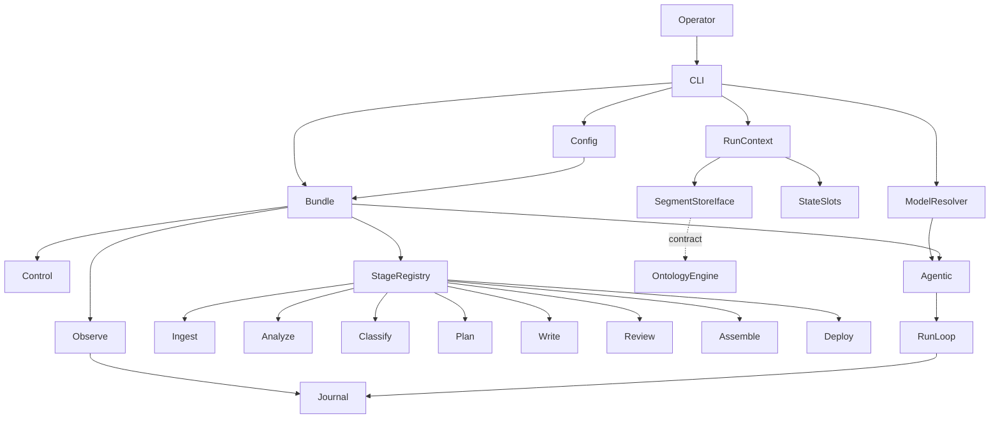
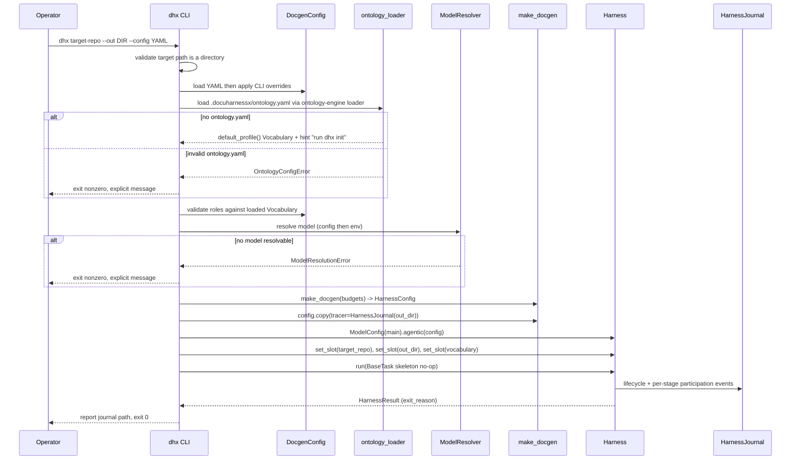

# Design Document — harness-bundle-skeleton

## Overview

**Purpose**: This feature delivers the runnable DocuHarnessX skeleton — an installable
`docuharnessx` package whose `make_docgen()` composes a HarnessX `HarnessConfig` (baseline
Control + Observe/Journal), whose `dhx` CLI binds a model and runs an empty pipeline
end-to-end, and whose eight stage sub-packages are registered no-ops.

**Users**: DocuHarnessX maintainers and Wave 1+ stage authors who will replace each no-op
stub with real behavior, and operators who run `dhx` against a target repository.

**Impact**: Establishes the composition point (`make_docgen`), the run lifecycle, the
stage-registration contract, and the state/slots + segment-store data-passing contract that
every later spec depends on. No documentation-generation behavior ships in this spec.

### Goals
- `make_docgen()` returns a model-free `HarnessConfig` with baseline Control and Observe.
- `dhx <target-repo> [--out DIR] [--config YAML]` runs an empty pipeline and emits a
  HarnessJournal trace, exiting cleanly on success.
- `dhx init` writes a per-project `.docuharnessx/ontology.yaml` (interactive or default
  profile) via the `ontology-engine` vocabulary/default-profile API.
- Run-start loading of `.docuharnessx/ontology.yaml` through the `ontology-engine` loader
  into a `Vocabulary` placed in the `RunContext` so stages can read it.
- A stable, append-don't-replace stage-registration contract over ordered processors.
- A single data-passing seam: harness state/slots + the segment store interface and the
  loaded `Vocabulary`, both consumed from `ontology-engine`.

### Non-Goals
- Any real ingest/analyze/classify/plan/write/review/assemble/deploy behavior.
- The ontology/segment frontmatter schema and the segment store **implementation**.
- The **ontology vocabulary schema, the default profile content, and the vocabulary YAML
  loader/serializer** — all owned by `ontology-engine`; this spec only invokes them.
- MkDocs assembly and GitHub Pages deployment.

## Boundary Commitments

### This Spec Owns
- **Sole ownership of the package root**: `pyproject.toml` and `docuharnessx/__init__.py`
  (the `ontology-engine` spec creates only `docuharnessx/ontology/*` and must not touch
  these) (1.1–1.5, 3.1).
- The `docuharnessx` package scaffold and `uv` packaging depending on `harnessx` (1.1–1.4).
- `make_docgen() -> HarnessConfig` composition, including baseline Control and Observe and
  the no-model invariant (2.1–2.6).
- Model binding and resolution precedence in the CLI layer (3.1–3.4).
- The `dhx` CLI: argument parsing, run orchestration, output/journal location, exit codes
  (4.1–4.8, 8.3–8.5), and the `dhx init` subcommand (9.1–9.6).
- The stage-registration contract and the eight no-op stage stubs (5.1–5.6).
- The data-passing contract (`RunContext` over state/slots + segment-store handle +
  loaded `Vocabulary` slot) (6.1–6.6, 10.2).
- Run-start ontology loading: invoking the `ontology-engine` loader / default-profile API
  and placing the `Vocabulary` into the `RunContext` (10.1–10.5).
- The configuration surface and its precedence rules, with roles derived from the loaded
  `Vocabulary` (7.1–7.6).
- Observability wiring of HarnessJournal and the journal-content expectations (8.1–8.2).

### Out of Boundary
- The segment store **interface definition** and any storage implementation —
  owned by `ontology-engine`; consumed here at the contract level only (6.3).
- The **`Vocabulary` model, the vocabulary YAML loader/serializer, and the default-profile
  content/API** — owned by `ontology-engine`; this spec only calls them to build/load a
  vocabulary and never reimplements the schema or default profile (9.4, 10.5).
- All stage business logic; stubs must remain no-ops (5.3).

### Allowed Dependencies
- `harnessx` (builder, `ModelConfig`, providers, control bundle/processors,
  `HarnessJournal`, `State`/slots, `BaseTask`/`Harness`).
- From `ontology-engine` (contract level only, no coupling to internals):
  - `SegmentStore` imported from `docuharnessx.ontology.store`; `AxisFilter` and `Segment`
    co-imported from `docuharnessx.ontology` (or `.ontology.store`).
  - The `Vocabulary` model, its YAML loader, the inverse serializer, and the
    default-profile API: `Vocabulary`, `load_vocabulary(path)`,
    `vocabulary_to_config(vocab) -> dict`, and `default_profile()`
    (ontology-engine exports only `default_profile()` and `default_profile_config()`).
- Python 3.12 standard library; a YAML parser/emitter used for `--config` parsing and for
  writing the `vocabulary_to_config(vocab)` dict to `.docuharnessx/ontology.yaml` in
  `dhx init`. The vocabulary YAML is *parsed* (read) only by the `ontology-engine` loader,
  and the config dict is *serialized from a `Vocabulary`* only by `ontology-engine`
  `vocabulary_to_config`; the skeleton merely dumps the resulting dict to YAML.
- Dependency direction (left imports only): `errors`/`types` → `config` → `context` →
  `stages` → `bundle` → `cli`. The `ontology.py` re-export module and the ontology-loading
  helpers sit alongside `context`. No upward imports.

### Revalidation Triggers
- Change to the segment store interface shape published by `ontology-engine`
  (the pinned `put`/`query`/`list_segments`/`resolve_cross_links` signatures).
- Change to the `ontology-engine` `Vocabulary` model, its YAML loader signature, or the
  default-profile API.
- Change to HarnessX composition, model-binding, journal, or state-slot APIs.
- Change to the stage hook point or canonical stage ordering.
- Change to state-slot keys used to pass the target repo path / output dir / vocabulary
  between stages.

## Architecture

### Architecture Pattern & Boundary Map

DocuHarnessX is a **library-consumer bundle** over HarnessX. The skeleton composes existing
HarnessX bundles/processors rather than reinventing them; stages are expressed as ordered
no-op processors on a single pipeline hook, leveraging HarnessX's intra-hook ordering.



**Architecture Integration**:
- Selected pattern: ordered no-op processors on one pipeline hook + a thin stage registry.
- Domain/feature boundaries: each stage in its own sub-package; the registry owns ordering;
  the bundle owns composition; the CLI owns orchestration and model binding.
- Existing patterns preserved: HarnessX `|` composition with conflict detection;
  append-don't-replace processor hooks; model in `ModelConfig`, not `HarnessConfig`.
- New components rationale: `RunContext` is the single auditable data seam; `StageRegistry`
  makes ordering explicit and stages individually replaceable.
- Steering compliance: declarative `make_docgen`; behavior lives in processors; stages
  communicate via state/slots + segment store, not globals; core never imports benchmark libs.

### Technology Stack

| Layer | Choice / Version | Role in Feature | Notes |
|-------|------------------|-----------------|-------|
| Frontend / CLI | Python `argparse` (3.12) | `dhx` entry point, flags, exit codes | Console-script entry point named `dhx` |
| Backend / Services | `harnessx` (pinned compatible) | Builder, `ModelConfig`, control bundle, `HarnessJournal`, state/slots, `Harness`/`BaseTask` | All HarnessX imports centralized in bundle module |
| Data / Storage | Filesystem (output dir) | Journal JSONL + run artifacts | Segment store impl is NOT owned here |
| Infrastructure / Runtime | `uv` + `pyproject.toml`, Python 3.12 | Packaging, editable install, env | Matches HarnessX convention |
| Config | YAML parser | `--config` parsing | Stdlib-friendly; values overridden by CLI args |

## File Structure Plan

### Directory Structure
```
pyproject.toml                     # OWNED HERE: uv packaging; name, py3.12, depends on harnessx; dhx entry point
docuharnessx/
├── __init__.py                    # OWNED HERE (package root): package marker; re-exports make_docgen, dhx version
├── errors.py                      # explicit error types (ConfigError, ModelResolutionError, TargetRepoError, DependencyError, OntologyConfigError)
├── types.py                       # shared types: StageName, slot-key constants (incl. SLOT_VOCABULARY). NO RoleId alias — roles come from the loaded Vocabulary
├── config.py                      # DocgenConfig dataclass + load/merge (YAML file < CLI args); roles validated against loaded Vocabulary; budgets
├── model_resolver.py             # resolve ModelConfig from config then env; fail fast (Req 3)
├── ontology.py                   # contract-level re-export ONLY: SegmentStore (from docuharnessx.ontology.store), AxisFilter, Segment, Vocabulary, load_vocabulary, vocabulary_to_config, default_profile — NO storage/schema/loader logic
├── ontology_setup.py             # dhx-init helpers: build Vocabulary interactively or seed default profile, call ontology-engine vocabulary_to_config(vocab)->dict, then write that dict to .docuharnessx/ontology.yaml as YAML (NO schema/profile reimpl; serialization delegated)
├── ontology_loader.py            # run-start: load .docuharnessx/ontology.yaml via ontology-engine loader -> Vocabulary; fall back to default profile when absent
├── context.py                     # RunContext: typed state/slot helpers + segment_store handle accessor + vocabulary() accessor
├── stages/
│   ├── __init__.py                # STAGES ordered list + register_stages(builder); canonical order
│   ├── base.py                    # stage processor base / no-op stage factory; PIPELINE_HOOK constant
│   ├── ingest.py                  # no-op IngestStage processor (replaceable in Wave 1)
│   ├── analyze.py                 # no-op AnalyzeStage (same pattern as ingest)
│   ├── classify.py                # no-op ClassifyStage
│   ├── plan.py                    # no-op PlanStage
│   ├── write.py                   # no-op WriteStage
│   ├── review.py                  # no-op ReviewStage
│   ├── assemble.py                # no-op AssembleStage
│   └── deploy.py                  # no-op DeployStage
├── bundle.py                      # make_docgen(): HarnessBuilder | control | observe + register_stages; tracer=HarnessJournal
└── cli.py                         # dhx: argparse (run + `init` subcommand), validate target, load vocabulary, build config, resolve model, agentic(make_docgen()), run, report, exit codes
tests/
├── test_bundle.py                 # make_docgen returns model-free HarnessConfig with control+observe; conflict surfaced
├── test_stages.py                 # 8 stages registered in canonical order; append-don't-replace; no-op
├── test_config.py                 # YAML load + CLI override; role default from Vocabulary; unknown role rejected; malformed config error
├── test_model_resolver.py        # config>env precedence; fail-fast when unresolved
├── test_ontology.py              # ontology.py re-exports SegmentStore/AxisFilter/Segment/Vocabulary and adds no storage logic
├── test_ontology_setup.py        # dhx init writes a valid .docuharnessx/ontology.yaml (default profile + interactive answers); no-overwrite guard
├── test_ontology_loader.py       # loads ontology.yaml -> Vocabulary; falls back to default profile + hint when absent; invalid file errors
├── test_context.py                # state/slot round-trip; absent slot returns None; segment store handle accessor; vocabulary() accessor
└── test_cli_e2e.py                # dhx <repo> --out DIR runs empty pipeline, journal emitted, exit 0; bad path exit != 0; dhx init produces valid ontology.yaml
```

### Modified Files
- None. This is a greenfield package; all files are new. The package root (`pyproject.toml`,
  `docuharnessx/__init__.py`) is created and owned solely here; `ontology-engine` creates
  only `docuharnessx/ontology/*`, so the two specs do not collide.

> Each file has one responsibility. Stage stubs share one pattern (`base.py` no-op
> factory); only `ingest.py` is described in full — the rest follow the same pattern.

## System Flows

### End-to-end empty run (Requirement 4.8)


Gating notes: target-path validation precedes any run (4.7); a missing ontology file falls
back to the default profile with a `dhx init` hint (10.3) while an invalid file fails fast
(10.4); role selection is validated against the loaded `Vocabulary` (7.2, 7.3); model
resolution failure exits before composing the bundle (3.4); `budget_exceeded` exit reason
maps to a non-zero CLI status with the outcome recorded in the journal (8.4).

### `dhx init` ontology setup (Requirement 9)
```mermaid
sequenceDiagram
    participant Op as Operator
    participant CLI as dhx init
    participant OS as ontology_setup
    participant OE as ontology-engine API
    Op->>CLI: dhx init [project-dir] [--default] [--force]
    CLI->>CLI: resolve project dir; check .docuharnessx/ontology.yaml
    alt file exists and no --force
        CLI-->>Op: refuse to overwrite; exit nonzero
    end
    alt interactive
        CLI->>Op: ask roles? intents? tags/subjects?
        Op-->>CLI: answers
        CLI->>OS: build Vocabulary from answers (ontology-engine API)
    else --default / declined
        CLI->>OS: default_profile() (ontology-engine API)
    end
    OS->>OE: vocabulary_to_config(vocab) -> config dict
    OS->>OS: write config dict to .docuharnessx/ontology.yaml as YAML
    CLI->>OE: load_vocabulary(path) round-trip check
    CLI-->>Op: report written path, exit 0
```

Gating notes: `dhx init` never overwrites an existing file without `--force`/confirmation
(9.6); the vocabulary schema, default profile, and schema serialization (`vocabulary_to_config`)
are all called from `ontology-engine`, never reimplemented — the skeleton only writes the
returned dict to disk as YAML (9.4); a post-write load round-trip proves validity (9.5).

## Requirements Traceability

| Requirement | Summary | Components | Interfaces | Flows |
|-------------|---------|------------|------------|-------|
| 1.1, 1.2, 1.3 | Installable package, `dhx` on path, sub-packages | pyproject, package layout | console entry point | — |
| 1.4 | Missing dependency fails explicitly | errors, bundle | DependencyError | — |
| 1.5 | Package-root sole ownership | pyproject, `__init__.py` | — | — |
| 2.1–2.6 | make_docgen composition, no model, conflict, append | bundle, stages | make_docgen, register_stages | — |
| 3.1–3.4 | Model binding + resolution precedence + fail fast | model_resolver, cli | resolve_model | E2E run |
| 4.1–4.8 | CLI args, run, journal, exit codes, acceptance | cli, bundle | dhx | E2E run |
| 5.1–5.6 | Stage registration contract, order, replaceable | stages, bundle | STAGES, register_stages, PIPELINE_HOOK | E2E run |
| 6.1–6.6 | Data-passing via state/slots + pinned segment store iface | context, ontology | RunContext, SegmentStore/AxisFilter/Segment | E2E run |
| 7.1–7.6 | Config surface, roles from Vocabulary, override, budgets, errors | config, cli, ontology_loader | DocgenConfig, Vocabulary | E2E run |
| 8.1–8.5 | Journal content, report, budget/error exit | bundle, cli | HarnessJournal wiring | E2E run |
| 9.1–9.6 | `dhx init` writes valid `.docuharnessx/ontology.yaml` | cli, ontology_setup, ontology | dhx init, ontology-engine vocabulary/default-profile API | init flow |
| 10.1–10.5 | Run-start vocabulary load into RunContext + fallback | ontology_loader, context, cli | load_vocabulary, default_profile, RunContext.vocabulary | E2E run |

## Components and Interfaces

| Component | Domain/Layer | Intent | Req Coverage | Key Dependencies (P0/P1) | Contracts |
|-----------|--------------|--------|--------------|--------------------------|-----------|
| DocgenConfig | Config | Load/merge config + budgets + roles-from-Vocabulary | 7.1–7.6 | YAML parser (P0), Vocabulary (P1) | Service, State |
| ModelResolver | Config | Resolve model config>env, fail fast | 3.1–3.4 | harnessx ModelConfig (P0) | Service |
| make_docgen | Bundle | Compose model-free HarnessConfig | 2.1–2.6, 8.1 | harnessx builder/control/journal (P0), StageRegistry (P0) | Service |
| StageRegistry | Stages | Ordered append of stage processors | 5.1–5.6 | harnessx builder (P0) | Service |
| Stage stub (×8) | Stages | No-op processor per pipeline stage | 5.2, 5.3 | harnessx processor base (P0) | State |
| RunContext | Context | State/slot + segment-store + vocabulary seam | 6.1–6.6, 10.2 | harnessx State (P0), segment store iface (P1), Vocabulary (P1) | State |
| ontology (re-export) | Context | Contract-level re-export of SegmentStore/AxisFilter/Segment/Vocabulary | 6.3, 6.4, 6.6 | ontology-engine (P0, external) | Service |
| OntologyLoader | Context | Run-start load ontology.yaml -> Vocabulary; default fallback | 10.1–10.5 | ontology-engine loader/default-profile (P0, external) | Service |
| OntologySetup (dhx init) | CLI | Build/seed vocabulary, write ontology.yaml | 9.1–9.6 | ontology-engine vocabulary/default-profile API (P0, external) | Service |
| dhx CLI | CLI | Orchestrate run + init, exit codes, report | 4.1–4.8, 8.3–8.5, 9.x, 10.x | all above (P0) | Service |

### Bundle Layer

#### make_docgen
| Field | Detail |
|-------|--------|
| Intent | Compose and return a model-free `HarnessConfig` with baseline Control and Observe and registered stages |
| Requirements | 2.1, 2.2, 2.3, 2.4, 2.5, 2.6, 8.1 |

**Responsibilities & Constraints**
- Build via `HarnessBuilder()` composed with the control bundle and stage registry using `|`.
- Include cost-guard and loop-detection control tuned for 25–40k LOC repos.
- Wire Observe by setting the config tracer to a `HarnessJournal` (output-dir rooted).
- Must NOT bind a model; returns `HarnessConfig` only.
- Rely on HarnessX conflict detection; never silently overwrite a singleton capability.

**Dependencies**
- Outbound: StageRegistry — append stage processors (P0)
- External: `harnessx` builder, `make_control`/cost-guard/loop-detection, `HarnessJournal` (P0)

**Contracts**: Service [x]

##### Service Interface
```python
def make_docgen(
    max_cost_usd: float | None = None,
    max_steps: int | None = None,
    journal_dir: str | None = None,
) -> HarnessConfig: ...
```
- Preconditions: `harnessx` importable; budgets non-negative when provided.
- Postconditions: returns a `HarnessConfig` with control + observe + 8 ordered stages and
  no model binding.
- Invariants: composition uses `|`; conflicts raise `HarnessConflictError`.

**Implementation Notes**
- Integration: `journal_dir` defaults to the CLI-resolved output dir; tracer wired via
  `config.copy(tracer=HarnessJournal(...))`.
- Validation: a unit test asserts the returned config has no model and exposes the stage hook.
- Risks: HarnessX API drift — centralize all HarnessX imports here.

### Stages Layer

#### StageRegistry
| Field | Detail |
|-------|--------|
| Intent | Define canonical stage order and append stage processors without replacing existing ones |
| Requirements | 5.1, 5.2, 5.4, 5.5, 5.6 |

**Responsibilities & Constraints**
- Hold `STAGES`: an ordered list of `(StageName, factory)` in canonical pipeline order:
  ingest → analyze → classify → plan → write → review → assemble → deploy.
- `register_stages(builder)` appends each stage processor on `PIPELINE_HOOK` preserving
  any processors already present (append-don't-replace).
- Expose hook + order so a Wave 1+ stage can swap its factory without editing `make_docgen`.

**Contracts**: Service [x]

##### Service Interface
```python
PIPELINE_HOOK: str
STAGES: list[tuple[StageName, Callable[[], Processor]]]

def register_stages(builder: HarnessBuilder) -> HarnessBuilder: ...
```
- Preconditions: builder is a valid `HarnessBuilder`.
- Postconditions: returns a builder with all 8 stage processors appended in order on
  `PIPELINE_HOOK`; pre-existing processors on that hook are retained ahead of them.
- Invariants: stage order is exactly the canonical pipeline order.

**Implementation Notes**
- Integration: uses `{**processors, PIPELINE_HOOK: [...existing, proc]}` append semantics.
- Validation: a test asserts journal records the 8 stages in canonical order.
- Risks: order encoded as a list convention — covered by the ordering test.

#### Stage stub (ingest; others identical pattern)
| Field | Detail |
|-------|--------|
| Intent | A no-op processor that participates in the run lifecycle and modifies no generated content |
| Requirements | 5.2, 5.3 |

**Responsibilities & Constraints**
- Implement the HarnessX processor hook as a pass-through (yields the event unchanged).
- May read run context (target repo / output dir) for future use but must not produce
  documentation output in this spec.

**Contracts**: State [x]

**Implementation Notes**
- Integration: created by the shared no-op factory in `stages/base.py`; one file per stage
  so later specs replace exactly one stub.
- Validation: a test asserts each stage is a pass-through (no state mutation of content).

### Context Layer

#### RunContext
| Field | Detail |
|-------|--------|
| Intent | Single auditable data seam: typed state/slot access + segment-store handle + loaded Vocabulary |
| Requirements | 6.1, 6.2, 6.4, 6.5, 10.2 |

**Responsibilities & Constraints**
- Provide typed setters/getters over `state.set_slot`/`get_slot` for the target-repo path
  and output dir using the slot-key constants in `types.py`.
- Return an explicit `None` for absent slots (no undefined values).
- Provide a `segment_store()` accessor returning a handle typed as the segment store
  interface imported from `ontology-engine` (the pinned `put`/`query`/`list_segments`/
  `resolve_cross_links` Protocol).
- Provide a `vocabulary()` accessor returning the loaded `Vocabulary` (imported from
  `ontology-engine`) placed at `SLOT_VOCABULARY`; stages read valid roles/intents/subjects
  from it (10.2).

**Contracts**: State [x]

##### State Management
- State model: free-form harness slots keyed by the constants `SLOT_TARGET_REPO`,
  `SLOT_OUTPUT_DIR`, `SLOT_VOCABULARY` (and a slot for the segment-store handle).
- Persistence & consistency: slots live on the harness `State`; journal records lifecycle.
- Concurrency strategy: single-run, single-threaded skeleton; no shared mutable globals.

**Implementation Notes**
- Integration: CLI populates slots before `harness.run(...)`; stages read via `RunContext`.
- Validation: round-trip and absent-slot tests.
- Risks: segment store interface not yet frozen — see SegmentStore component.

#### ontology (interface re-export, consumed)
| Field | Detail |
|-------|--------|
| Intent | Single contract-level re-export site for the `ontology-engine` surfaces this skeleton consumes |
| Requirements | 6.3, 6.4, 6.6, 10.5 |

**Responsibilities & Constraints**
- Re-export, in `docuharnessx/ontology.py`, **exactly** these `ontology-engine` symbols and
  add **no** storage, schema, loader, or profile logic:
  - `from docuharnessx.ontology.store import SegmentStore`
  - `AxisFilter` and `Segment` co-imported from `docuharnessx.ontology` (or `.ontology.store`)
  - `Vocabulary`, the vocabulary loader (`load_vocabulary`), the inverse serializer
    (`vocabulary_to_config`), and the default-profile API (`default_profile`) from
    `ontology-engine`.
- The `SegmentStore` handle this skeleton relies on has **exactly** these signatures
  (verbatim from `ontology-engine`):
  ```python
  class SegmentStore(Protocol):
      def put(self, segment: Segment) -> None: ...
      def query(self, where: AxisFilter) -> tuple[Segment, ...]: ...
      def list_segments(self) -> tuple[Segment, ...]: ...
      def resolve_cross_links(self, segment_id: str) -> tuple[Segment, ...]: ...
  ```
- If `ontology-engine` has not yet published `SegmentStore` (or `Vocabulary`/loader), this
  module may declare a **typing-only** fallback Protocol/alias under the same symbol that
  **mirrors the four signatures verbatim**, to be replaced by the real import. This is a
  recorded revalidation trigger; the fallback adds no behavior.

**Dependencies**
- External: `ontology-engine` `SegmentStore`/`AxisFilter`/`Segment` interface and the
  `Vocabulary` model + loader + default-profile API (P0, external, contract-level only).

**Contracts**: Service [x]

**Implementation Notes**
- Integration: `RunContext.segment_store()` returns the `SegmentStore`-typed handle;
  `RunContext.vocabulary()` returns the loaded `Vocabulary`. No implementation bound here.
- Boundary: package-root note — `ontology-engine` owns `docuharnessx/ontology/*` (the real
  package); this `docuharnessx/ontology.py` is only a thin re-export and must not collide
  with that package. (If `ontology-engine` ships `docuharnessx/ontology/` as a package, this
  re-export lives in `docuharnessx/ontology/__init__.py`'s consumer-facing imports or a
  `docuharnessx/_ontology.py` shim — single import site either way; do not duplicate the
  store/schema.)
- Risks: contract drift — single import site limits blast radius.

#### OntologyLoader (run-start)
| Field | Detail |
|-------|--------|
| Intent | Load the per-project `.docuharnessx/ontology.yaml` into a `Vocabulary` at run start |
| Requirements | 10.1, 10.2, 10.3, 10.4, 10.5 |

**Responsibilities & Constraints**
- Locate `.docuharnessx/ontology.yaml` for the project; call the `ontology-engine` loader to
  build a `Vocabulary` (10.1). Reimplements neither the schema nor the loader (10.5).
- When the file is absent, return the `ontology-engine` default-profile `Vocabulary` and
  surface a hint that the operator should run `dhx init` (10.3).
- When the file exists but the loader rejects it, raise `OntologyConfigError` mapped to a
  non-zero CLI exit with an explicit message (10.4).
- Provide the resulting `Vocabulary` to the CLI for placement into the `RunContext` slot
  (`SLOT_VOCABULARY`) before the run (10.2).

**Dependencies**
- External: `ontology-engine` `load_vocabulary` + default-profile API (P0).

**Contracts**: Service [x]

##### Service Interface
```python
def load_project_vocabulary(project_dir: str) -> tuple[Vocabulary, bool]: ...
# returns (vocabulary, used_default); used_default=True triggers the `dhx init` hint
```
- Preconditions: `project_dir` is an existing directory.
- Postconditions: returns a `Vocabulary`; `used_default` is True when no config file was
  found; raises `OntologyConfigError` when a present file fails to load.

**Implementation Notes**
- Integration: CLI calls this after target validation and before model resolution; stores
  the result in `RunContext`.
- Risks: loader signature drift — recorded revalidation trigger.

#### OntologySetup (`dhx init`)
| Field | Detail |
|-------|--------|
| Intent | Build or seed a project vocabulary and write `.docuharnessx/ontology.yaml` |
| Requirements | 9.1, 9.2, 9.3, 9.4, 9.5, 9.6 |

**Responsibilities & Constraints**
- Resolve the project directory and the target `.docuharnessx/ontology.yaml` path (9.1).
- Interactive path: prompt for roles, intents, and tags/subjects, and assemble them into a
  `Vocabulary` via the `ontology-engine` vocabulary API (9.2).
- Default path: seed the shipped default profile via the `ontology-engine`
  default-profile API when the operator declines interactive entry or passes `--default`
  (9.3).
- Convert the `Vocabulary` into a config dict via the `ontology-engine`
  `vocabulary_to_config(vocab) -> dict` API (the inverse of `load_vocabulary`, returning a
  dict matching the `.docuharnessx/ontology.yaml` schema), then write that dict to
  `.docuharnessx/ontology.yaml` as YAML. Schema serialization is delegated to
  `vocabulary_to_config`; the skeleton owns only writing the file and never assembles the
  config schema itself or reimplements the schema or default profile (9.4).
- Refuse to overwrite an existing file without an explicit `--force`/confirmation (9.6).
- After writing, round-trip-load the file via the `ontology-engine` loader to prove it is
  valid (9.5).

**Dependencies**
- External: `ontology-engine` vocabulary builder, `vocabulary_to_config`, loader,
  default-profile API (P0).

**Contracts**: Service [x]

##### Service Interface
```python
def run_init(
    project_dir: str,
    *,
    use_default: bool = False,
    force: bool = False,
    answers: VocabularyAnswers | None = None,
) -> str: ...   # returns the written ontology.yaml path
```
- Preconditions: `project_dir` exists; no existing config unless `force=True`.
- Postconditions: a valid `.docuharnessx/ontology.yaml` exists that the loader can load;
  returns its path.

**Implementation Notes**
- Integration: invoked by the `dhx init` subcommand in `cli.py`; the vocabulary build and the
  `vocabulary_to_config` call are the only ontology touchpoints — the skeleton then writes the
  returned dict to disk as YAML.
- Risks: default-profile / `vocabulary_to_config` API drift — recorded revalidation trigger.

### CLI Layer

#### dhx CLI
| Field | Detail |
|-------|--------|
| Intent | Parse args (run + `init`), validate, load vocabulary, resolve model, run the empty pipeline, report, set exit codes |
| Requirements | 4.1–4.8, 3.4, 7.3, 8.3, 8.4, 8.5, 9.1–9.6, 10.1–10.4 |

**Responsibilities & Constraints**
- Provide two invocations: `dhx <target-repo> [--out DIR] [--config YAML] [--roles ...]`
  and `dhx init [project-dir] [--default] [--force]`.
- `init`: delegate to `OntologySetup.run_init(...)`; never overwrite an existing
  `.docuharnessx/ontology.yaml` without `--force`/confirmation; report the written path.
- Run path: validate the target path is an existing directory before any run (else non-zero
  exit). Load the project vocabulary via `OntologyLoader` (default-profile fallback + hint
  when absent; `OntologyConfigError` exit on invalid file). Load config (YAML then CLI
  overrides) and validate `--roles`/config roles against the loaded `Vocabulary`.
- Resolve the model (config then env, fail fast).
- Compose `make_docgen(...)`, wire the journal to the output dir, bind the model via
  `ModelConfig(main=...).agentic(...)`, populate run-context slots (target repo, output dir,
  vocabulary), run one `BaseTask`.
- Report the journal path on success; map exit reasons to exit codes:
  `done` → 0; `budget_exceeded`/error/invalid input/unresolved model/bad config/invalid
  ontology/unknown role → non-zero.

**Contracts**: Service [x]

##### Service Interface
```python
def main(argv: list[str] | None = None) -> int: ...   # process exit code; dispatches run vs `init`
```
- Preconditions: argv parseable.
- Postconditions: run returns 0 on a clean empty run with a journal written under the output
  dir; `init` returns 0 after writing a valid `.docuharnessx/ontology.yaml`; returns
  non-zero with an explicit message on any validation/resolution/ontology/run failure.
- Invariants: target validated before run; vocabulary loaded before slots are populated;
  model never placed in `HarnessConfig`.

**Implementation Notes**
- Integration: default output location used when `--out` omitted (documented default);
  `init` and run share argument parsing via subcommands.
- Validation: E2E test covers the acceptance command, the bad-path failure, and that
  `dhx init` produces a loadable `.docuharnessx/ontology.yaml`.
- Risks: empty pipeline still needs a runnable task — drive a minimal skeleton `BaseTask`.

## Error Handling

### Error Strategy
Fail fast at boundaries with explicit, typed errors mapped to non-zero CLI exit codes;
every failure path surfaces a message naming the cause.

### Error Categories and Responses
- **User/Input errors**: invalid target path → `TargetRepoError`, exit non-zero before run
  (4.7); malformed/unknown config → `ConfigError`, exit non-zero (7.6); role not in the
  loaded `Vocabulary` → `ConfigError` listing valid roles, exit non-zero (7.3).
- **Ontology errors**: present-but-invalid `.docuharnessx/ontology.yaml` →
  `OntologyConfigError`, exit non-zero (10.4); existing file on `dhx init` without `--force`
  → refuse and exit non-zero (9.6). A missing file is **not** an error: fall back to the
  default profile with a `dhx init` hint (10.3).
- **Configuration errors**: no model resolvable → `ModelResolutionError`, exit non-zero
  (3.4); missing runtime dependency → `DependencyError` naming the dependency (1.4).
- **Run-outcome errors**: `budget_exceeded` exit reason → non-zero exit, journal records the
  outcome (8.4); unexpected run error → non-zero exit with explicit message (8.5).

### Monitoring
HarnessJournal JSONL trace per run records run start/end and each stage's participation
(8.1, 8.2); the journal path is reported on success (8.3).

## Testing Strategy

### Unit Tests
- `make_docgen()` returns a `HarnessConfig` with no model binding and includes control
  (cost-guard + loop-detection) and an Observe/journal tracer (2.2, 2.3, 2.4).
- `register_stages` appends all 8 stages in canonical order and does not drop pre-existing
  processors on the hook (5.4, 5.5).
- `DocgenConfig` derives valid roles from the loaded `Vocabulary` and defaults role
  selection to all roles in it; CLI args override YAML values; an unknown role raises
  `ConfigError` listing valid roles; malformed/unknown config raises `ConfigError`
  (7.2, 7.3, 7.4, 7.6).
- `ModelResolver` prefers config over env and raises `ModelResolutionError` when unresolved
  (3.2, 3.3, 3.4).
- `RunContext` slot round-trip returns stored values; absent slot returns `None`; the
  `vocabulary()` accessor returns the slotted `Vocabulary` (6.2, 6.5, 10.2).
- `ontology.py` re-exports `SegmentStore`/`AxisFilter`/`Segment`/`Vocabulary` and contains
  no storage/schema/loader logic (6.3, 6.6, 10.5).

### Integration Tests
- Composition conflict: composing two cost-guard/loop-detection capabilities surfaces
  `HarnessConflictError` rather than overwriting (2.5).
- Stage replaceability: swapping one stage factory changes only that stage in the registry
  without editing `make_docgen` (5.6).
- Segment-store seam: `RunContext.segment_store()` returns a handle typed by the consumed
  interface symbol, conforming to the pinned `put`/`query`/`list_segments`/
  `resolve_cross_links` signatures (6.3, 6.4).
- `dhx init`: writes a valid `.docuharnessx/ontology.yaml` from the default profile and from
  interactive answers; refuses to overwrite without `--force`; the written file round-trips
  through the `ontology-engine` loader (9.2, 9.3, 9.5, 9.6).
- Ontology loading: an existing valid file loads into a `Vocabulary`; an absent file falls
  back to the default profile with a `dhx init` hint; a present-but-invalid file raises
  `OntologyConfigError` (10.1, 10.3, 10.4).

### E2E Tests
- Acceptance: `dhx <target-repo> --out DIR` runs the empty pipeline, writes a HarnessJournal
  JSONL trace under DIR, journal records the 8 stages, and the process exits 0 (4.8, 8.1,
  8.2, 8.3).
- Acceptance (init): `dhx init` in a fresh project produces a `.docuharnessx/ontology.yaml`
  that the `ontology-engine` loader loads without error (9.1, 9.5).
- Failure path: `dhx <nonexistent-path>` exits non-zero with an explicit error before any
  run (4.7).
