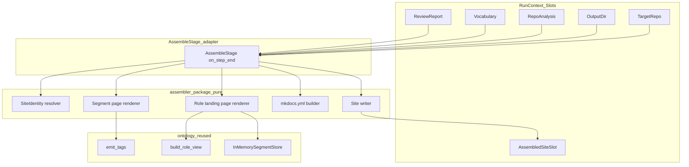
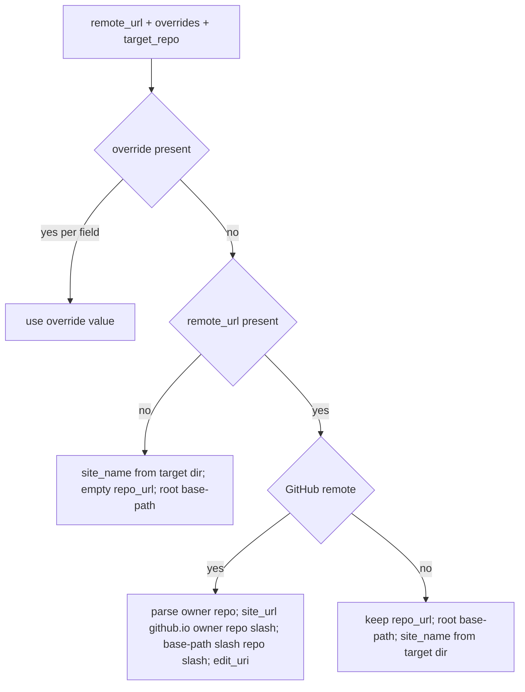

# Design Document — mkdocs-site-assembler

## Overview

**Purpose**: This feature delivers a real **Assemble** pipeline stage that turns the quality-gated content segments into a publishable, aesthetic **Material for MkDocs** site source tree — the bridge from "accepted segments in a store" to "a website" — for *any* target project.

**Users**: Operators running `dhx <target-repo>` to document an arbitrary project; the downstream `github-pages-deploy` stage that consumes the assembled site; and readers who later browse the per-role, COBESY-structured site.

**Impact**: Replaces the `docuharnessx/stages/assemble.py` no-op stub **in place**. It consumes the frozen `ReviewReport.accepted` set (verbatim, read-only), the loaded `Vocabulary`, and the optional `RepoAnalysis`, and emits a `docs/*.md` tree + per-role landing pages + a `mkdocs.yml` under the run's output directory, with site identity (`site_name`/`repo_url`/`site_url` + the `/<repo>/` Pages base-path) derived per-target from the target git remote. It introduces one new frozen seam — `AssembledSite` on `SLOT_ASSEMBLED_SITE` — for the deploy stage. The stage registry, the bundle, and every sibling stage are untouched.

### Goals
- Replace the assemble stub in place, preserving the stable single-stage-swap contract (Req 1).
- Consume `ReviewReport.accepted` + `Vocabulary` + optional `RepoAnalysis` and reuse the ontology `build_role_view`/`emit_tags` APIs read-only (Req 2, 4, 5).
- Derive per-target site identity (name/repo_url/site_url/`/<repo>/` base-path/edit_uri) from the target git remote, override via config/flags, fall back gracefully (Req 3).
- Emit a Material for MkDocs source tree — per-segment pages, per-role landing pages with intent-ordered COBESY agendas, tags nav, cross-links, content-tabs/admonitions, and a `mkdocs.yml` (Req 4, 5, 6) — deterministically and buildable under `mkdocs-material` (Req 8).
- Own the frozen `AssembledSite` value object + `SLOT_ASSEMBLED_SITE` seam, append-only (Req 7).

### Non-Goals
- Publishing, GitHub Actions workflow emission, or `mkdocs gh-deploy` (owned by `github-pages-deploy`).
- Running `mkdocs build` at stage run time (the deploy stage runs it as publish validation; the assembler asserts buildability in tests only).
- Any model call or network access; any change to the `ReviewReport`, `Vocabulary`, `Segment`, or `RepoAnalysis` contracts.

## Boundary Commitments

### This Spec Owns
- The real `AssembleStage` (thin harness adapter) that replaces the stub in `docuharnessx/stages/assemble.py` in place.
- A new deterministic, harness-free `docuharnessx/assembler/` package: the site-identity resolver, the per-segment page renderer, the per-role landing-page renderer, the `mkdocs.yml` builder, and the site writer.
- The frozen `AssembledSite` value object (with nested `SiteIdentity`) and its `ASSEMBLED_SITE_SCHEMA_VERSION`.
- The append-only additions: `SLOT_ASSEMBLED_SITE` in `types.py` and the `set_assembled_site`/`assembled_site` accessors in `RunContext`.
- The `mkdocs` + `mkdocs-material` runtime dependency declarations.

### Out of Boundary
- Publishing / Pages deployment / workflow emission / `gh-deploy` (`github-pages-deploy`).
- The segment frontmatter schema, the `Vocabulary` loader, `build_role_view`, `emit_tags`, the `SegmentStore` port (`ontology-engine`, reused read-only).
- The `ReviewReport` shape (`quality-review-gate`, consumed verbatim) and `RepoAnalysis` shape (`repo-ingestion-analysis`, consumed verbatim).
- The stage registry (`STAGES`), `make_docgen`, and every sibling stage module (untouched).

### Allowed Dependencies
- `docuharnessx.review.model` — `ReviewReport`, `REVIEW_REPORT_SCHEMA_VERSION` (read).
- `docuharnessx.ontology` — `Segment`, `Vocabulary`, `InMemorySegmentStore`, `build_role_view`, `emit_tags` (read/reuse only).
- `docuharnessx.analysis.model` — `RepoAnalysis` (read; optional site-identity context).
- `docuharnessx.context` / `docuharnessx.types` — extended **append-only** for the new seam.
- `docuharnessx.stages.base` — `NoOpStage`, `PIPELINE_HOOK`, `STAGE_PARTICIPATION_ACTION`, `make_noop_stage`.
- `subprocess` (stdlib) for a read-only `git remote get-url origin` — isolated in one mockable helper.
- `mkdocs` + `mkdocs-material` — runtime deps (declared); not invoked by the stage at run time.

### Revalidation Triggers
- Any change to the frozen `AssembledSite` / `SiteIdentity` field set, or a bump of `ASSEMBLED_SITE_SCHEMA_VERSION` → the `github-pages-deploy` spec must re-check.
- A change to the slot key `SLOT_ASSEMBLED_SITE` or the run-context accessor names → deploy must re-check.
- A bump of `REVIEW_REPORT_SCHEMA_VERSION` upstream → this spec must re-check the consumed shape.
- A change to `build_role_view` / `emit_tags` / `Vocabulary` signatures upstream → this spec must re-check.

## Architecture

### Existing Architecture Analysis
- **Stage-replacement contract (proven by Plan/Write/Review)**: keep `STAGE_NAME`, the `<Title>Stage` class, the `make_<stage>_stage` factory, the `make_noop_stage` re-export, the `__all__` set, and the module path stable; subclass `NoOpStage`; capture run `State` in `on_task_start`; do work in `on_step_end`; yield the event unchanged; publish to a slot. The `STAGES` registry and `make_docgen` then need no edits (Req 1).
- **Append-only seam extension (proven six times)**: `types.py` and `RunContext` are extended by appending a slot constant + a typed accessor pair, never editing existing entries (Req 7.5).
- **Run-context inputs already provisioned**: `orchestrate_run` populates `SLOT_TARGET_REPO`, `SLOT_OUTPUT_DIR`, `SLOT_VOCABULARY`, `SLOT_SEGMENT_STORE` before the run; the Review stage publishes `SLOT_REVIEW_REPORT`; Analyze publishes `SLOT_REPO_ANALYSIS`. The assembler reads only existing slots, so **no CLI change is required**.
- **Pure-core + thin-adapter pattern**: deterministic work lives in a harness-free package (`review/`, `composition/`, `planning/`); the stage is a thin adapter. This design follows that pattern with `assembler/`.

### Architecture Pattern & Boundary Map



**Architecture Integration**:
- Selected pattern: **pure core + thin gated-free stage adapter** (no model in this stage). The `assembler` package is fully deterministic and unit-testable without a harness.
- Domain/feature boundaries: identity resolution, page rendering, role-page rendering, yaml building, and writing are separate single-responsibility components; the stage only orchestrates them and bridges slots.
- Existing patterns preserved: in-place stub replacement, append-only seam, content-free `step_end` side effect, frozen versioned output seam.
- New components rationale: the `assembler` package isolates deterministic Markdown/YAML emission from harness wiring; `AssembledSite`/`SiteIdentity` give the deploy stage a stable contract.
- Steering compliance: configurable vocabulary (nav/agendas from the loaded `Vocabulary`, never hardcoded roles/intents); deterministic + unit-testable; credential-free; single-stage swap; per-project isolation.

### Technology Stack

| Layer | Choice / Version | Role in Feature | Notes |
|-------|------------------|-----------------|-------|
| CLI / Stage | HarnessX `MultiHookProcessor` (`step_end`) | The `AssembleStage` adapter | Same hook/binding as Plan/Write/Review |
| Backend / Services | Python 3.12 stdlib (`pathlib`, `io`, `subprocess`, `dataclasses`) | Deterministic file emission + read-only git remote read | No template engine; byte-stable f-string/IO Markdown |
| Data / Storage | Filesystem (`<out>/site/docs/*.md`, `<out>/site/mkdocs.yml`) | Emitted Material for MkDocs source tree | Written under the run's output dir only |
| Doc framework | `mkdocs` + `mkdocs-material` (latest compatible) | Theme + tags plugin; build target | Declared as deps; `mkdocs build` run in tests + by deploy stage |
| Ontology reuse | `build_role_view`, `emit_tags`, `InMemorySegmentStore`, `Vocabulary` | Role agendas, tags, accepted-only role views | Imported read-only |

## File Structure Plan

### Directory Structure
```
docuharnessx/
├── assembler/                      # NEW pure, harness-free assembly core
│   ├── __init__.py                 # Public surface re-export (AssembledSite, SiteIdentity, resolvers, renderers, writer)
│   ├── model.py                    # Frozen AssembledSite + SiteIdentity + ASSEMBLED_SITE_SCHEMA_VERSION + AssemblerError family
│   ├── identity.py                 # resolve_site_identity(target_repo, remote_url, overrides) + read_origin_remote() (mockable git read)
│   ├── pages.py                    # render_segment_page(segment, vocab, accepted_ids) -> (filename, content); page_filename(segment_id)
│   ├── roles.py                    # render_role_landing_page(role_term, store, vocab) -> (filename, content); SCQA opener; agenda links
│   ├── mkdocs_config.py            # build_mkdocs_yaml(identity, role_pages, vocab) -> yaml string (theme + tags plugin + nav)
│   └── writer.py                   # assemble_site(report, vocab, analysis, out_dir, identity) -> AssembledSite (orchestrates + writes)
└── stages/
    └── assemble.py                 # MODIFIED in place: real AssembleStage wiring assembler.writer.assemble_site
```

### Modified Files
- `docuharnessx/stages/assemble.py` — Replace the no-op body with the real `AssembleStage` (capture state on `on_task_start`; read slots, resolve identity + overrides, call `assemble_site`, publish `AssembledSite`, journal a bounded summary, yield event unchanged). Keep `STAGE_NAME`/`AssembleStage`/`make_assemble_stage`/`make_noop_stage`/`__all__`/module path unchanged.
- `docuharnessx/types.py` — Append `SLOT_ASSEMBLED_SITE` constant + add to `__all__` (append-only).
- `docuharnessx/context.py` — Append `set_assembled_site`/`assembled_site` accessors + slot-type tag + TYPE_CHECKING import of `AssembledSite` (append-only).
- `pyproject.toml` — Add `mkdocs` and `mkdocs-material` to `[project].dependencies`.

> Each file has one responsibility. `identity.py` isolates the only process-touching surface (git read) from the pure resolver. The stage file is the only harness-coupled module.

**Dependency direction** (left imports never from right): `types` → `model` → `identity`/`pages`/`roles`/`mkdocs_config` → `writer` → `stages/assemble` (adapter). `context` depends on `types` + (TYPE_CHECKING) `model`. The pure `assembler` package never imports `stages` or the harness.

## System Flows

### Assemble stage run flow

```mermaid
sequenceDiagram
    participant Loop as Run loop
    participant Stage as AssembleStage
    participant Ctx as RunContext
    participant Core as assembler.assemble_site
    participant FS as Output dir

    Loop->>Stage: on_task_start(TaskStartEvent)
    Stage->>Stage: capture run State
    Loop->>Stage: on_step_end(StepEndEvent)
    Stage->>Ctx: read review_report, vocabulary, repo_analysis, output_dir, target_repo
    alt review_report or vocabulary or output_dir unset
        Stage-->>Loop: raise AssemblerInputError (no site)
    else inputs present
        Stage->>Stage: read overrides (config slot/flags); read_origin_remote(target_repo)
        Stage->>Core: assemble_site(report, vocab, analysis, out_dir, identity)
        Core->>Core: resolve identity, render pages, build role views, build mkdocs.yml, write tree
        Core-->>Stage: AssembledSite
        Stage->>Ctx: set_assembled_site(AssembledSite)
        Stage->>Loop: journal bounded summary
        Stage-->>Loop: yield StepEndEvent unchanged
    end
```

Gating notes: an absent `RepoAnalysis` is tolerated (graceful identity fallback, Req 2.5); a missing required slot or an unsupported `ReviewReport` version halts loudly with no partial output (Req 2.3, 2.4, 2.6); driven outside a harness (no bound state) the stage forwards the event and produces nothing (Req 1.3).

### Site-identity resolution (deterministic)



## Requirements Traceability

| Requirement | Summary | Components | Interfaces | Flows |
|-------------|---------|------------|------------|-------|
| 1.1, 1.2 | Stable stub replacement, no registry/bundle edits | AssembleStage | `STAGE_NAME`/`AssembleStage`/`make_assemble_stage` unchanged | Run flow |
| 1.3, 1.4 | Harness-free pass-through; content-free side effect | AssembleStage | `on_task_start`/`on_step_end` | Run flow |
| 2.1, 2.2 | Read slots; consume accepted verbatim read-only | AssembleStage | RunContext accessors | Run flow |
| 2.3, 2.4, 2.6 | Fatal input errors; version pin; no partial output | AssembleStage, AssemblerError | `AssemblerInputError` | Run flow |
| 2.5 | Tolerate absent RepoAnalysis | AssembleStage, SiteIdentity resolver | `resolve_site_identity` | Identity flow |
| 3.1-3.8 | Per-target identity from remote; overrides; fallback | SiteIdentity resolver, identity.py | `resolve_site_identity`, `read_origin_remote` | Identity flow |
| 4.1-4.5 | Per-segment pages, tags, cross-links, determinism | Segment page renderer | `render_segment_page`, `page_filename` | — |
| 5.1-5.6 | Role landing pages + intent-ordered SCQA agendas | Role landing page renderer | `render_role_landing_page` + `build_role_view`/`emit_tags` | — |
| 6.1-6.4 | Nav, tags plugin, role-switching, Material theme | mkdocs.yml builder, Role renderer | `build_mkdocs_yaml` | — |
| 7.1-7.5 | AssembledSite seam, versioned, append-only slot | AssembledSite model, Site writer, types/context additions | `set_assembled_site`/`assembled_site` | Run flow |
| 8.1, 8.2, 8.5 | Deterministic, byte-stable, single-target isolation | Site writer | `assemble_site` | Run flow |
| 8.3 | Declare mkdocs deps | pyproject | — | — |
| 8.4 | Buildable under mkdocs-material | mkdocs.yml builder, Site writer | `mkdocs build` (test) | — |

## Components and Interfaces

| Component | Domain/Layer | Intent | Req Coverage | Key Dependencies (P0/P1) | Contracts |
|-----------|--------------|--------|--------------|--------------------------|-----------|
| AssembledSite model | Data | Frozen output seam + identity + version + errors | 7.1, 7.2, 7.3, 2.3 | none (P0) | State |
| SiteIdentity resolver | Core | Per-target identity from remote/overrides/fallback | 3.1-3.8, 2.5 | model (P0), subprocess (P1) | Service |
| Segment page renderer | Core | One Markdown page per accepted segment | 4.1-4.5 | ontology emit_tags (P0) | Service |
| Role landing page renderer | Core | Per-role SCQA landing + intent-ordered agenda | 5.1-5.6 | build_role_view, InMemorySegmentStore, Vocabulary (P0) | Service |
| mkdocs.yml builder | Core | Material theme + tags plugin + nav + site_url/base-path | 3.3, 6.1-6.4 | model SiteIdentity (P0) | Service |
| Site writer | Core | Orchestrate renderers + write tree + build AssembledSite | 4.1, 5.1, 7.1, 8.1, 8.2, 8.5 | all renderers (P0) | Service |
| AssembleStage | Adapter | Read slots, run core, publish seam, journal | 1.1-1.4, 2.1-2.6, 7.1 | RunContext, writer (P0), NoOpStage (P0) | State |
| types/context additions | Data seam | Append-only slot + accessors | 7.4, 7.5 | model (P1) | State |

### Data / Core Layer

#### AssembledSite model (`assembler/model.py`)

| Field | Detail |
|-------|--------|
| Intent | The frozen output seam the deploy stage consumes, plus the resolved per-target identity, the version authority, and the assembler error family |
| Requirements | 7.1, 7.2, 7.3, 2.3 |

**Responsibilities & Constraints**
- Define `ASSEMBLED_SITE_SCHEMA_VERSION: int = 1` as the single version authority for the seam.
- Define frozen value objects; deeply immutable (all-string/int members); compares by value.
- Define the assembler error family, independent of other specs' error families (mirrors `ReviewError`).

**Contracts**: State [x]

##### State Management
```python
ASSEMBLED_SITE_SCHEMA_VERSION: int = 1

@dataclass(frozen=True)
class SiteIdentity:
    site_name: str        # display name (override > repo > target-dir basename)
    repo_name: str        # "owner/repo" for GitHub, else "" (or remote-derived)
    repo_url: str         # remote URL ("" when no remote)
    site_url: str         # "https://<owner>.github.io/<repo>/" for GitHub project Pages, else "" or override
    base_path: str        # "/<repo>/" for GitHub project Pages, else "/"
    edit_uri: str         # Material edit_uri (e.g. "edit/main/docs/") or "" when unknown

@dataclass(frozen=True)
class AssembledSite:
    schema_version: int       # == ASSEMBLED_SITE_SCHEMA_VERSION
    site_dir: str             # absolute path to the emitted site root (<out>/site)
    docs_dir: str             # absolute path to <site>/docs
    mkdocs_yml_path: str      # absolute path to <site>/mkdocs.yml
    identity: SiteIdentity    # the resolved per-target identity
    page_count: int           # number of per-segment pages emitted
    role_page_count: int      # number of per-role landing pages emitted

class AssemblerError(Exception): ...
class AssemblerInputError(AssemblerError): ...   # missing slot / unsupported version (Req 2.3, 2.4, 2.6)
```
- Preconditions: constructed only by the site writer / identity resolver from validated inputs.
- Postconditions: instances are immutable; equal inputs yield equal instances.
- Invariants: `schema_version == ASSEMBLED_SITE_SCHEMA_VERSION`; paths are absolute.

#### SiteIdentity resolver (`assembler/identity.py`)

| Field | Detail |
|-------|--------|
| Intent | Compute the per-target `SiteIdentity` from the (optional) origin remote, overrides, and the target dir; isolate the only process-touching surface |
| Requirements | 3.1, 3.2, 3.3, 3.4, 3.5, 3.6, 3.7, 3.8, 2.5 |

**Responsibilities & Constraints**
- `read_origin_remote(target_repo) -> str | None`: a thin, mockable helper running `git -C <target> remote get-url origin` read-only; returns the URL or `None` (no remote / git unavailable). The only subprocess in this spec.
- `resolve_site_identity(target_repo, remote_url, overrides)` is **pure**: GitHub HTTPS/SSH parse (strip `.git`), project-Pages `site_url` + `/<repo>/` base-path; non-GitHub keeps `repo_url` with root base-path; no remote → target-basename `site_name` + root base-path; per-field override wins (Req 3.7).
- Never emits DocuHarnessX's own identity — always derived from the passed target (Req 3.8).

**Dependencies**: Outbound: `model.SiteIdentity` (P0). External: `subprocess` git read (P1, isolated, mockable).

**Contracts**: Service [x]
```python
def read_origin_remote(target_repo: str) -> str | None: ...
def resolve_site_identity(
    target_repo: str,
    remote_url: str | None,
    overrides: "Mapping[str, str]",
) -> SiteIdentity: ...
```
- Preconditions: `target_repo` is an existing dir; `overrides` keys ⊆ `{site_name, site_url, repo_url, edit_uri}`.
- Postconditions: a total, deterministic `SiteIdentity` for every input combination; no exception on missing/non-GitHub remote.
- Invariants: GitHub project remote → `base_path == "/<repo>/"` and `site_url` ends with `/<repo>/`.

#### Segment page renderer (`assembler/pages.py`)

| Field | Detail |
|-------|--------|
| Intent | Render one Material Markdown page per accepted segment with tags + cross-links |
| Requirements | 4.1, 4.2, 4.3, 4.4, 4.5 |

**Responsibilities & Constraints**
- `page_filename(segment_id) -> str`: stable, deterministic, filesystem-safe filename derived from the id.
- `render_segment_page(segment, vocab, accepted_ids)`: YAML frontmatter `tags:` from `emit_tags(segment, vocab)`; the title as an H1; the body preserved verbatim; a "Related" section of Markdown links built from `segment.related`, filtered to ids present in `accepted_ids` (Req 4.4). Read-only over the segment.
- Byte-stable for equal inputs (Req 4.5).

**Dependencies**: Outbound: `ontology.emit_tags` (P0, read-only).

**Contracts**: Service [x]
```python
def page_filename(segment_id: str) -> str: ...
def render_segment_page(
    segment: Segment, vocab: Vocabulary, accepted_ids: "frozenset[str]"
) -> tuple[str, str]:  # (relative_docs_path, page_markdown)
    ...
```

#### Role landing page renderer (`assembler/roles.py`)

| Field | Detail |
|-------|--------|
| Intent | Per-role SCQA landing page + intent-ordered guided agenda over the accepted role view |
| Requirements | 5.1, 5.2, 5.3, 5.4, 5.5, 5.6, 6.3 |

**Responsibilities & Constraints**
- For each role `AxisTerm` in `vocab.roles`, call `build_role_view(accepted_store, role.id, vocab)`; emit a landing page **only** when the view is non-empty (Req 5.1, 5.5).
- The agenda is the role view (already intent-ordered by `vocab.intent_order()` with id tie-break) rendered as ordered links to the per-segment pages — no body duplication (Req 5.2, 5.4).
- The SCQA opener uses the role `AxisTerm.label` + `description` from the loaded vocabulary (Req 5.3, 5.6); a role-switching affordance (Material content-tabs/admonition) lists the other available role landing pages (Req 6.3).

**Dependencies**: Outbound: `ontology.build_role_view`, `ontology.InMemorySegmentStore`, `Vocabulary`, `pages.page_filename` (all P0, read-only).

**Contracts**: Service [x]
```python
def render_role_landing_page(
    role: AxisTerm, accepted_store: SegmentStore, vocab: Vocabulary, all_role_pages: "tuple[tuple[str, str], ...]"
) -> tuple[str, str]:  # (relative_docs_path, page_markdown); all_role_pages = (label, filename) for role-switch tabs
    ...
```

#### mkdocs.yml builder (`assembler/mkdocs_config.py`)

| Field | Detail |
|-------|--------|
| Intent | Emit the `mkdocs.yml` (Material theme, tags plugin, nav, per-target `site_url`/base-path) |
| Requirements | 3.3, 6.1, 6.2, 6.4 |

**Responsibilities & Constraints**
- Set `site_name` from identity; `site_url` to the per-target Pages URL; `use_directory_urls: true`; `repo_url`/`edit_uri` when present (Req 3.3).
- `theme: {name: material, features: [navigation.tabs, content.tabs.link]}`; `plugins: [search, tags]` (Req 6.2, 6.4).
- `nav`: deterministic — role landing pages (in `vocab.roles` order, filtered to emitted ones) then a Tags index page (Req 6.1).
- Pure string emission; byte-stable.

**Contracts**: Service [x]
```python
def build_mkdocs_yaml(
    identity: SiteIdentity, role_pages: "tuple[tuple[str, str], ...]", vocab: Vocabulary
) -> str: ...
```

#### Site writer (`assembler/writer.py`)

| Field | Detail |
|-------|--------|
| Intent | Orchestrate the renderers, write the byte-stable tree, return the frozen `AssembledSite` |
| Requirements | 4.1, 5.1, 7.1, 8.1, 8.2, 8.5 |

**Responsibilities & Constraints**
- `assemble_site(report, vocab, analysis, out_dir, identity)`: build a fresh `InMemorySegmentStore(vocab)` from `report.accepted`; render every per-segment page; render every non-empty role landing page; build a Tags index page; build `mkdocs.yml`; write all under `<out_dir>/site/` (`docs/` + `mkdocs.yml`); return `AssembledSite`.
- Writes only under the run's resolved output dir for this one target (Req 8.5); no model/network (Req 8.1); byte-stable (Req 8.2).
- `analysis` is accepted for site-identity context but its absence is tolerated (Req 2.5).

**Dependencies**: Outbound: all renderers + identity model (P0); `ontology.InMemorySegmentStore`/`build_role_view` (P0).

**Contracts**: Service [x]
```python
def assemble_site(
    report: ReviewReport,
    vocab: Vocabulary,
    analysis: "RepoAnalysis | None",
    out_dir: str,
    identity: SiteIdentity,
) -> AssembledSite: ...
```
- Preconditions: `out_dir` exists/creatable; `report.schema_version` already validated by the stage.
- Postconditions: `<out_dir>/site/mkdocs.yml` + one `docs/*.md` per accepted segment + one per non-empty role + a tags index exist; `mkdocs build` succeeds.
- Invariants: identical inputs → identical bytes; the write target is always under `out_dir`.

### Adapter Layer

#### AssembleStage (`stages/assemble.py`, modified in place)

| Field | Detail |
|-------|--------|
| Intent | Thin harness adapter: read slots, resolve identity+overrides, run `assemble_site`, publish `AssembledSite`, journal a bounded summary |
| Requirements | 1.1, 1.2, 1.3, 1.4, 2.1, 2.2, 2.3, 2.4, 2.5, 2.6, 7.1 |

**Responsibilities & Constraints**
- Preserve the stable surface: `STAGE_NAME="assemble"`, `AssembleStage`, `make_assemble_stage`, `make_noop_stage` re-export, `__all__`, module path (Req 1.1, 1.2).
- Subclass `NoOpStage`; capture run `State` in `on_task_start`; in `on_step_end` read `review_report`/`vocabulary`/`repo_analysis`/`output_dir`/`target_repo` via `RunContext`; pin `REVIEW_REPORT_SCHEMA_VERSION`; raise `AssemblerInputError` on a missing required slot or unsupported version with no partial output (Req 2.1-2.4, 2.6); tolerate absent analysis (Req 2.5); outside a harness, forward the event and produce nothing (Req 1.3).
- Read identity overrides from the config (an overrides mapping placed by the CLI config layer / flags; absent → empty mapping) and the origin remote via `read_origin_remote`; call `resolve_site_identity`; call `assemble_site`; `set_assembled_site` (Req 7.1); yield the event unchanged (Req 1.4).
- Journal a bounded participation summary (page/role-page counts, `site_name`, `base_path`) — no page bodies — reusing `NoOpStage` tracer resolution.

**Dependencies**: Inbound: run loop. Outbound: `assembler.writer.assemble_site`, `assembler.identity` (P0), `RunContext` (P0), `NoOpStage` (P0).

**Contracts**: State [x] (publishes `AssembledSite` to `SLOT_ASSEMBLED_SITE`)

**Implementation Notes**
- Integration: mirror `ReviewStage`'s `on_task_start`/`on_step_end`/`_resolve_run_context`/`_read_inputs`/journal structure.
- Validation: a credential-free bundle run over a seeded `ReviewReport` publishes a well-formed `AssembledSite` and a buildable tree, with the registry and bundle unedited.
- Risks: ensure `git remote get-url` failures degrade to `None` (no remote) rather than raising.

### Data seam additions (`types.py`, `context.py`)

**Responsibilities & Constraints**
- `types.py`: append `SLOT_ASSEMBLED_SITE: str = "docuharnessx.assembled_site"` + add to `__all__` (Req 7.5).
- `context.py`: append `set_assembled_site(site)` / `assembled_site() -> AssembledSite | None` + a slot-type tag + a TYPE_CHECKING import; an unset slot returns `None` (Req 7.4). No existing entry edited.

**Contracts**: State [x]

## Data Models

### Domain Model
- **Aggregate root**: `AssembledSite` (frozen) — the published seam; embeds the `SiteIdentity` value object. Owned solely by this spec; consumed read-only by `github-pages-deploy`.
- **Value objects**: `SiteIdentity` (per-target identity); the `(relative_docs_path, page_markdown)` render tuples (internal, not persisted as a contract).
- **Read-only consumed aggregates**: `ReviewReport` (+ its `Segment` set), `Vocabulary`, `RepoAnalysis` — never mutated.
- **Invariants**: every accepted segment ⇒ exactly one page; every vocabulary role with ≥1 accepted segment ⇒ exactly one landing page; identical inputs ⇒ identical bytes; the only write target is `<out_dir>/site`.

### Data Contracts & Integration
- **Published seam**: `AssembledSite` on `SLOT_ASSEMBLED_SITE` (slot key `"docuharnessx.assembled_site"`), schema `ASSEMBLED_SITE_SCHEMA_VERSION = 1`. Evolution is additive (new optional fields with defaults); any field-set change bumps the version and is a revalidation trigger for deploy.
- **Emitted site contract** (filesystem, for the deploy stage / `mkdocs build`): `<out>/site/mkdocs.yml` (Material theme + tags plugin + nav + per-target `site_url`/`use_directory_urls`), `<out>/site/docs/<segment-page>.md` (frontmatter tags + body + related links), `<out>/site/docs/<role>/index.md` (SCQA + agenda), `<out>/site/docs/tags.md` (tags index).

## Error Handling

### Error Strategy
- **Fail fast at the stage boundary**: a missing `review_report`/`vocabulary`/`output_dir` slot, or an unsupported `ReviewReport.schema_version`, raises `AssemblerInputError` naming the cause and produces no partial site (Req 2.3, 2.4, 2.6) — mirrors `ReviewInputError`.
- **Graceful degradation for identity**: no remote / non-GitHub remote / absent `RepoAnalysis` never raise — the resolver returns a buildable fallback identity (root base-path; target-derived `site_name`) (Req 2.5, 3.5, 3.6).
- **Isolated, swallowed git read**: `read_origin_remote` catches `subprocess`/`FileNotFoundError`/non-zero exit and returns `None`, so a git-less environment degrades to the no-remote fallback rather than aborting the run.

### Error Categories and Responses
- **Input errors** (fatal): missing required slot / unsupported version → `AssemblerInputError`, no site.
- **Identity edge cases** (non-fatal): no/odd remote → fallback identity.
- **Out-of-harness drive** (non-fatal): no bound state → pass-through, no site.

### Monitoring
- The stage records a bounded journal participation marker (page count, role-page count, `site_name`, `base_path`) via the `NoOpStage` tracer; no page bodies are written to the trace. No-op when no tracer is bound.

## Testing Strategy

### Unit Tests
- **SiteIdentity resolver**: GitHub HTTPS and SSH remotes → `owner/repo`, `site_url=https://<owner>.github.io/<repo>/`, `base_path=/<repo>/`, `.git` stripped (3.1, 3.2, 3.4); no remote → target-basename `site_name`, root base-path (3.5); non-GitHub remote → kept `repo_url`, root base-path (3.6); per-field overrides win (3.7); reference target `norandom/malware_hashes` → `/malware_hashes/` and never DocuHarnessX's identity (3.2, 3.8).
- **Segment page renderer**: frontmatter tags equal `emit_tags(segment, vocab)` (4.3); body preserved (4.2); `related` rendered as links, dangling references dropped (4.4); stable filename + byte-stable output (4.1, 4.5).
- **Role landing page renderer**: agenda order equals `build_role_view` (intent order) (5.2); SCQA opener uses the vocab label/description (5.3); a role with no accepted segment yields no page (5.1, 5.5); a renamed/reordered custom vocab changes pages with no code change (5.6); role-switch tabs list the other roles (6.3).
- **mkdocs.yml builder**: Material theme + tags plugin present (6.2, 6.4); `site_url`/`use_directory_urls`/base-path set per-target (3.3); nav is deterministic over emitted role pages + tags (6.1).

### Integration Tests
- **Stage via the bundle (credential-free)**: a seeded `ReviewReport` + `Vocabulary` + output dir + target path published into slots → the stage publishes a well-formed `AssembledSite` (correct counts, identity) into `SLOT_ASSEMBLED_SITE`, with the registry/bundle unedited (1.1, 1.2, 2.1, 2.2, 7.1).
- **Fatal input paths**: missing review-report/vocabulary/output-dir slot and an unsupported `ReviewReport` version each raise `AssemblerInputError` with no site (2.3, 2.4, 2.6); absent `RepoAnalysis` still produces a site (2.5); out-of-harness drive forwards the event and produces nothing (1.3).
- **Append-only seam**: `set_assembled_site`→`assembled_site` round-trips; a fresh state returns `None`; existing slots/accessors/exports unchanged (7.4, 7.5).

### Build / E2E
- **`mkdocs build` succeeds** on the emitted tree across the default vocabulary, a custom vocabulary, and varying target remotes (GitHub project, no remote, non-GitHub), with the per-target base-path and no broken internal links among generated pages (8.4).
- **Determinism / isolation**: two assembly runs over equal inputs produce byte-identical trees (8.2); the write target is only `<out_dir>/site` and the identity is never DocuHarnessX's for a target run (8.5).

## Security Considerations
- The only process call is a **read-only** `git remote get-url origin`; no writes to the target repo's git, no network, no credentials. Failures are swallowed to a safe fallback. Per-project isolation: the single write target is the run's output dir; identity is always per-target, never DocuHarnessX's.
