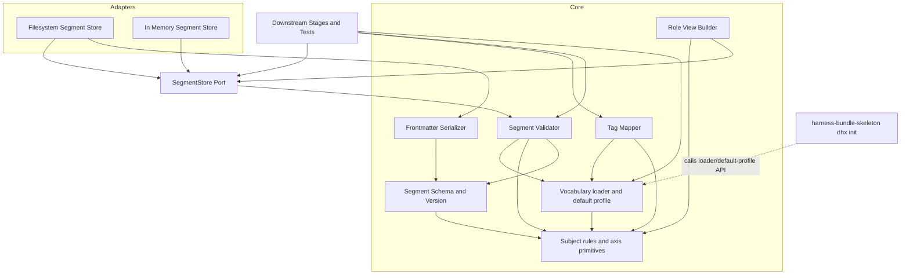
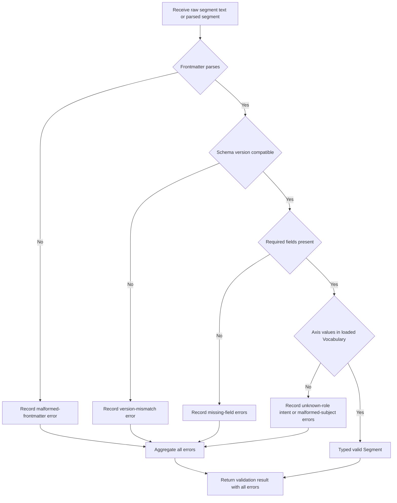
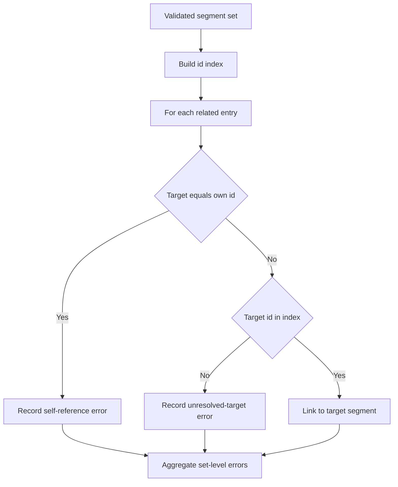
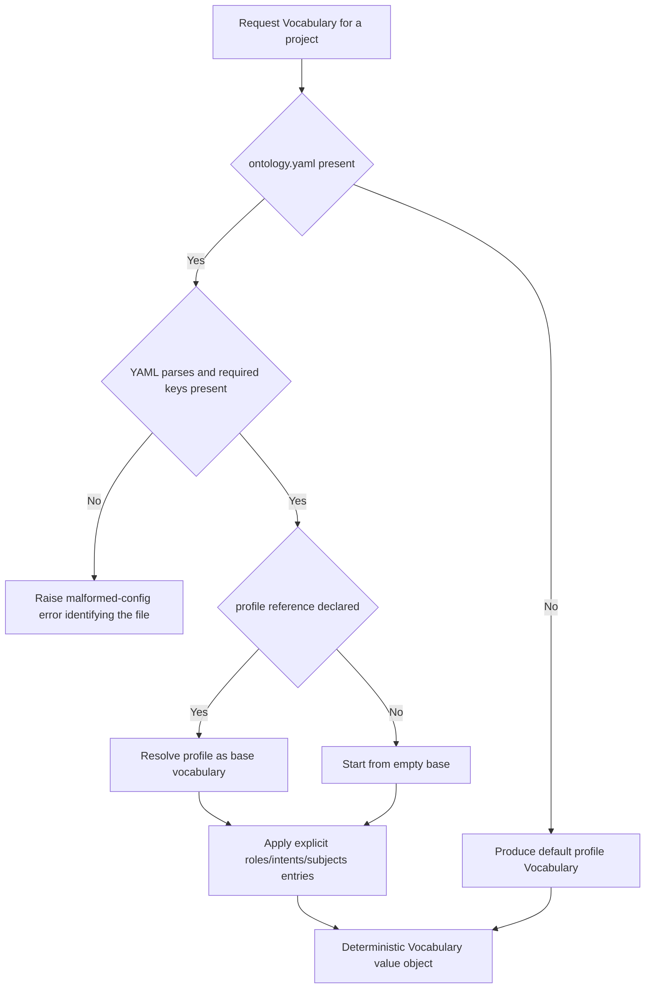

# Design Document — ontology-engine

## Overview

**Purpose**: The ontology-engine delivers the tri-modal ontology (Role × Intent × Subject) and the versioned segment frontmatter contract that every downstream DocuHarnessX stage reads and writes. The ontology *vocabulary* is **project-configurable**: roles, intents, and subject prefixes are loaded at runtime from a per-project config (`.docuharnessx/ontology.yaml`) into a `Vocabulary` value object, with a shipped **default profile** as the preset. The engine provides the config schema and loader, the default profile, a typed segment model, deterministic validation *against the loaded vocabulary* (including cross-link resolution), namespaced MkDocs tag emission derived from the vocabulary, a segment store interface with filesystem and in-memory adapters, and role-view derivation.

**Users**: The classification-coverage-planner, cobesy-writer, quality-review-gate, and mkdocs-site-assembler stages consume this engine through four stable surfaces — the segment frontmatter schema, the `Vocabulary` loader / default-profile API, the namespaced tag strings, and the `SegmentStore` port. harness-bundle-skeleton additionally calls the loader / default-profile API to run the `dhx init` interaction and persist the config file (that interaction is NOT owned here). Maintainers exercise the engine directly through unit tests.

**Impact**: This is Wave 0 foundation #1. It establishes the cross-spec contract and the storage seam on which all later waves depend, so its primary design objective is contract stability (the *schema* and *store port*) with explicit versioning, while the *vocabulary* stays configurable per project so the harness is reusable.

### Goals
- A project-configurable ontology vocabulary: a config schema for `.docuharnessx/ontology.yaml`, a deterministic loader producing a `Vocabulary` value object, and a shipped default profile that can seed/back it.
- A single, explicitly versioned segment frontmatter schema with clear required/optional rules.
- Three first-class axis vocabularies resolved from the loaded `Vocabulary` (Role configurable, Intent configurable, Subject prefixed-open with configurable prefixes).
- Deterministic validation *against the loaded vocabulary* that aggregates clear, actionable errors and resolves `related[]` cross-links.
- Deterministic, exactly-namespaced MkDocs tag emission (`role:` / `intent:` / `subject:`) derived from the vocabulary.
- A stable `SegmentStore` port (put / query-by-axis / list / resolve-cross-links) with filesystem and in-memory adapters, plus role-view derivation.
- Fully deterministic, unit-testable behavior with no LLM or network calls.

### Non-Goals
- The interactive `dhx init` ask and writing `.docuharnessx/ontology.yaml` from user prompts (owned by harness-bundle-skeleton; it calls this engine's loader / default-profile API).
- Owning the package root `docuharnessx/__init__.py` or `pyproject.toml` (owned by harness-bundle-skeleton; this spec creates only `docuharnessx/ontology/*`).
- Generating segment content (cobesy-writer).
- Deciding which segments a project needs / coverage planning (classification-coverage-planner).
- MkDocs site assembly, navigation, rendering (mkdocs-site-assembler).
- Any LLM invocation or non-deterministic external call.

## Boundary Commitments

### This Spec Owns
- The per-project ontology config schema (`.docuharnessx/ontology.yaml`), its loader, and the resolution of an optional `profile` reference (Req 1).
- The shipped default profile (the 10 default roles, 13 default intents, default subject prefixes) as a *preset*, and the ability to produce a `Vocabulary` from it when no config exists (Req 1, 2).
- The `Vocabulary` value object (loaded roles + intents + subjects for a project) and the Subject prefix rules relative to that vocabulary (Req 2, 3).
- The `Segment` frontmatter schema, its required/optional fields, types, and `SCHEMA_VERSION` (Req 4, 5).
- Segment validation *against a loaded `Vocabulary`*, error aggregation, and `related[]` cross-link resolution (Req 6, 7).
- Deterministic segment→tag mapping with exact `role:` / `intent:` / `subject:` namespacing derived from the vocabulary (Req 8).
- The `SegmentStore` port and its filesystem + in-memory adapters, including axis-filter query semantics (Req 9).
- Role-view derivation by role filter + intent ordering (Req 10).
- The determinism and no-LLM guarantee for all of the above (Req 11).

### Out of Boundary
- **The interactive `dhx init` ask** (prompting the user for which roles/intents/tags apply) **and writing `.docuharnessx/ontology.yaml` from those prompts** — owned by harness-bundle-skeleton, which calls this engine's loader / default-profile API. This engine never prompts and never writes the config from user input.
- **The package root `docuharnessx/__init__.py` and `pyproject.toml`** — owned by harness-bundle-skeleton. This spec creates only `docuharnessx/ontology/*` and assumes the package root already exists (sequence after the skeleton's package scaffold).
- Segment body *content* and how it is authored or graded.
- The decision of which segments must exist for a given project (coverage matrix).
- MkDocs `mkdocs.yml`, navigation generation, theme, and page rendering.
- Cost/loop control, journaling, and HarnessX processor wiring (owned by harness-bundle-skeleton and consuming stages).

### Allowed Dependencies
- Python 3.12 standard library.
- A safe YAML parser (e.g., `pyyaml` `safe_load`) for front matter *and* for the ontology config file — isolated in the serializer / loader components. The `pyyaml` dependency declaration lives in `pyproject.toml`, which is owned by harness-bundle-skeleton; this spec only imports it.
- Steering conventions (Material for MkDocs front matter + `tags` plugin namespacing; project-configurable vocabulary at `.docuharnessx/ontology.yaml`).
- No dependency on any other DocuHarnessX spec (Wave 0, no upstream). Note: this spec must sequence *after* harness-bundle-skeleton's package-root scaffold, or assume the root exists; it adds no runtime code dependency on that spec.

### Revalidation Triggers (Frozen Seams)
The following are the **frozen contract surfaces** that downstream specs (especially harness-bundle-skeleton, which imports them) compile against. Any change here MUST trigger downstream re-validation.

**`SegmentStore` port** — owned here, located at `docuharnessx/ontology/store.py`. Frozen signatures harness-bundle-skeleton must import verbatim:
```python
@dataclass(frozen=True)
class AxisFilter:
    roles: tuple[str, ...] = ()       # role ids from the loaded Vocabulary
    intents: tuple[str, ...] = ()     # intent ids from the loaded Vocabulary
    subjects: tuple[Subject, ...] = ()

class SegmentStore(Protocol):
    def put(self, segment: Segment) -> None: ...
    def query(self, where: AxisFilter) -> tuple[Segment, ...]: ...
    def list_segments(self) -> tuple[Segment, ...]: ...
    def resolve_cross_links(self, segment_id: str) -> tuple[Segment, ...]: ...
```
Plus the `Segment` type (frontmatter schema, below) and the `Subject` value object are part of this frozen seam.

**`Vocabulary` loader / default-profile API** — owned here, located at `docuharnessx/ontology/vocabulary.py`. Frozen signatures:
```python
def load_vocabulary(config_path: str | os.PathLike[str]) -> Vocabulary: ...   # reads .docuharnessx/ontology.yaml
def default_profile() -> Vocabulary: ...                                        # the shipped preset
def default_profile_config() -> dict: ...                                       # serializable seed for writing a config
def vocabulary_to_config(vocab: Vocabulary) -> dict: ...                         # inverse of load_vocabulary; round-trips
```

Downstream consumers MUST re-check integration when any of the following change:
- The `Segment` field set, field types, or required/optional rules.
- `SCHEMA_VERSION` or the documented frozen field set for a version.
- The ontology config schema (`.docuharnessx/ontology.yaml` keys) or the `Vocabulary` loader / default-profile / config-serializer API signatures above (`load_vocabulary`, `default_profile`, `default_profile_config`, `vocabulary_to_config`).
- The `SegmentStore` port method signatures, `AxisFilter` shape, or axis-query semantics (per-axis OR / cross-axis AND).
- The emitted tag namespacing or tag value format.

> Note: individual *vocabulary members* (which roles/intents/prefixes a project uses) are NOT a frozen seam — they are project data loaded at runtime. Only the *schema*, the *loader API*, the *segment contract*, and the *store port* are frozen.

## Architecture

### Architecture Pattern & Boundary Map

The engine is a pure ontology/validation core with a storage port (hexagonal / ports & adapters). The core never imports the storage adapters; adapters depend inward on the core (steering: "core never imports adapters").



**Architecture Integration**:
- Selected pattern: Hexagonal — pure core + `SegmentStore` port + two adapters. Rationale: deterministic core is trivially unit-testable; storage is a stable swappable seam.
- Domain/feature boundaries: the segment *schema* + the *vocabulary loader/default-profile* (the frozen API surface; the loaded vocabulary itself is runtime data), validation & tagging (pure transforms over a `Vocabulary`), store (the I/O seam), role views (a thin query consumer).
- Existing patterns preserved: steering layering (core imports no adapters; stages communicate through the store); steering's project-configurable vocabulary loaded from `.docuharnessx/ontology.yaml`.
- New components rationale: each component below maps to one requirement cluster; no speculative abstraction. The vocabulary is loaded data, not a hardcoded enum, so validation/tagging take a `Vocabulary` parameter rather than reading module-level enums.
- Steering compliance: snake_case modules under `docuharnessx/ontology/`; Python type hints at boundaries; deterministic + unit-tested; vocabulary project-configurable per steering tech.md decision 4.

**Dependency direction** (left imports nothing to its right):
`Model → Vocabulary / Schema → Serializer / Validator / Tags → SegmentStore Port → Adapters → Role View Builder / Consumers`
Adapters and views may import the core and the port; the core MUST NOT import adapters. The vocabulary loader is the only component that touches the config file; validation/tagging receive an already-loaded `Vocabulary`. Violations are errors.

### Technology Stack

| Layer | Choice / Version | Role in Feature | Notes |
|-------|------------------|-----------------|-------|
| Language / Runtime | Python 3.12 | Implementation language | Matches HarnessX/steering |
| Data / Storage | Filesystem (Markdown + YAML front matter) | On-disk segment format and store handoff seam | MkDocs Material-compatible |
| Vocabulary config | `.docuharnessx/ontology.yaml` (YAML) | Per-project ontology vocabulary (roles/intents/subjects/profile) | Loaded into a `Vocabulary`; default profile when absent |
| Serialization | `pyyaml` (safe_load/safe_dump) | Parse/serialize front matter + read the ontology config | Isolated in serializer/loader; declared in `pyproject.toml` (owned by harness-bundle-skeleton) |
| Interfaces | `typing.Protocol`, `dataclasses` | Typed ontology model, `Vocabulary`, store port | Stdlib only; vocabularies are loaded data, not `enum` |

## File Structure Plan

### Directory Structure
```
docuharnessx/
├── __init__.py               # PACKAGE ROOT — owned by harness-bundle-skeleton, NOT this spec (assumed to exist)
└── ontology/                 # created by THIS spec
    ├── __init__.py           # Public API exports (Segment, Vocabulary, loader, default profile, validate, tags, stores, role view)
    ├── model.py              # Subject + prefix rules, axis-id primitives, default intent ordering helper
    ├── vocabulary.py         # Vocabulary value object, ontology.yaml config schema + loader, default profile (preset)
    ├── schema.py             # Segment dataclass, required/optional rules, SCHEMA_VERSION, version compatibility
    ├── serializer.py         # Markdown<->Segment front matter parse/serialize (a pyyaml user)
    ├── validation.py         # Single-segment + segment-set validation AGAINST a Vocabulary, error model, cross-link resolution
    ├── tags.py               # Segment -> namespaced MkDocs tags (role:/intent:/subject:) derived from the Vocabulary
    ├── store.py              # SegmentStore Protocol + AxisFilter + FilesystemSegmentStore + InMemorySegmentStore
    ├── views.py              # Role-view derivation (filter by role + intent ordering)
    └── errors.py             # Typed error/result types shared across components
```

### Modified Files
- None. This is greenfield; only `docuharnessx/ontology/*` is created by this spec.
- **NOT created or modified here**: `docuharnessx/__init__.py` (package root) and `pyproject.toml` (dependency declaration, including `pyyaml`) are owned by harness-bundle-skeleton. This spec assumes the package root already exists; sequence it after the skeleton's package scaffold (or treat the root as a given foundation). This spec only *imports* `pyyaml`; it does not declare the dependency.

> Each module has one responsibility. `schema.py` + the loader API in `vocabulary.py` are the frozen contract surfaces; the *loaded* vocabulary is runtime data. `serializer.py` and `vocabulary.py` are the YAML touchpoints; adapters live in `store.py`.

## System Flows

### Segment validation (single segment)

Validation aggregates all detected errors before returning (Req 6.6) and is deterministic (Req 6.7). Frontmatter parse failure short-circuits axis checks for that segment but still returns a result.

### Cross-link resolution (segment set)


### Vocabulary load (project config → Vocabulary)

The loader never prompts and never writes the file (Req 1.8); harness-bundle-skeleton owns the `dhx init` ask and persistence.

## Requirements Traceability

| Requirement | Summary | Components | Interfaces | Flows |
|-------------|---------|------------|------------|-------|
| 1.1–1.9 | Project-configurable vocabulary: config schema, loader, default profile, profile resolution, symmetric config serializer | vocabulary.py | `load_vocabulary`, `default_profile`, `default_profile_config`, `vocabulary_to_config`, `Vocabulary` | vocabulary load |
| 2.1–2.6 | `Vocabulary` value object + default profile contents + stable ids/ordering | vocabulary.py, model.py | `Vocabulary` (roles/intents accessors, membership, intent order) | — |
| 3.1–3.5 | Subject namespace + configurable prefixes | model.py | `Subject` parse/normalize against vocabulary prefixes | — |
| 4.1–4.6 | Segment schema fields/types | schema.py, serializer.py | Segment dataclass, parse/serialize | — |
| 5.1–5.5 | Schema versioning | schema.py | SCHEMA_VERSION, version check | validation |
| 6.1–6.7 | Segment validation against vocabulary + error aggregation | validation.py, vocabulary.py, errors.py | `validate_segment(segment, vocab)`, ValidationResult | validation |
| 7.1–7.4 | Cross-link resolution | validation.py, views.py | validate_segment_set, resolve_links | cross-link |
| 8.1–8.5 | Namespaced tag emission derived from vocabulary | tags.py | `emit_tags(segment, vocab)` | — |
| 9.1–9.7 | Segment store interface + adapters | store.py | SegmentStore Protocol, AxisFilter, Fs/Mem adapters | — |
| 10.1–10.5 | Role view derivation | views.py | build_role_view | — |
| 11.1–11.4 | Determinism / no LLM / testability / deterministic load | all modules | (cross-cutting) | all |

## Components and Interfaces

| Component | Domain/Layer | Intent | Req Coverage | Key Dependencies (P0/P1) | Contracts |
|-----------|--------------|--------|--------------|--------------------------|-----------|
| model | Core | Subject prefix rules + axis-id primitives + intent ordering helper | 3 | — | Service, State |
| vocabulary | Core | Config schema + loader + default profile + `Vocabulary` value object | 1, 2 | model (P0), pyyaml (P0) | Service, State |
| schema | Core | Segment shape + version | 4, 5 | model (P0) | Service, State |
| serializer | Core | Markdown<->Segment | 4 | schema (P0), model (P0), pyyaml (P0) | Service |
| validation | Core | Validate against `Vocabulary` + aggregate errors + cross-links | 6, 7 | vocabulary (P0), schema (P0), model (P0), errors (P0) | Service |
| tags | Core | Segment -> namespaced tags derived from `Vocabulary` | 8 | vocabulary (P0), model (P0) | Service |
| store | Port + Adapters | Persist/query/list/resolve | 9 | validation (P0), serializer (P0) | Service, State |
| views | Consumer | Role view filter + ordering | 10 | store (P0), vocabulary (P0) | Service |
| errors | Core | Typed error/result types | 6, 7 | — | State |

### Core

#### model

| Field | Detail |
|-------|--------|
| Intent | Define the `Subject` value object + prefix-parsing rule (relative to a set of allowed prefixes), the axis-id primitives (`AxisTerm`), and the default-intent-ordering helper |
| Requirements | 3.1, 3.2, 3.3, 3.4, 3.5 |

**Responsibilities & Constraints**
- Define an `AxisTerm` value object (`id`, `label`, `description`) — the structural unit of a role or intent, with a stable machine `id` distinct from its display `label` (Req 2.4). This replaces the previous closed `Role`/`Intent` enums.
- Define a `Subject` value object that validates a prefix against an *allowed-prefix set supplied at parse time* (from the loaded `Vocabulary`) plus a non-empty local name, and normalizes deterministically (Req 3.1–3.5). There is no hardcoded global prefix set in this module.
- Provide a helper that, given a `Vocabulary`, yields its documented intent ordering for role views (Req 2.6, 10.2).

**Dependencies**: Inbound: vocabulary, schema, validation, tags, views. Outbound: none. External: none.

**Contracts**: Service [x] / State [x]

##### Service Interface
```python
@dataclass(frozen=True)
class AxisTerm:
    id: str           # stable machine id
    label: str        # display label
    description: str = ""

@dataclass(frozen=True)
class Subject:
    prefix: str   # validated against the loaded Vocabulary's allowed prefixes
    local: str    # non-empty, normalized
    @classmethod
    def parse(cls, raw: str, allowed_prefixes: frozenset[str]) -> "Subject": ...  # raises MalformedSubjectError
    def canonical(self) -> str: ...             # "prefix:local"
```
- Preconditions: `Subject.parse` input is a string; `allowed_prefixes` is supplied by the caller from the loaded `Vocabulary`.
- Postconditions: returned `Subject` has a prefix in `allowed_prefixes` and a non-empty local; `canonical()` is stable.
- Invariants: identical (string, prefix-set) inputs normalize to identical `Subject`. No module-level closed role/intent enumeration exists.

#### vocabulary

| Field | Detail |
|-------|--------|
| Intent | Define the `.docuharnessx/ontology.yaml` config schema, the deterministic loader, the shipped default profile (preset), and the `Vocabulary` value object queried by validation/tagging |
| Requirements | 1.1, 1.2, 1.3, 1.4, 1.5, 1.6, 1.7, 1.8, 1.9, 2.1, 2.2, 2.3, 2.4, 2.5, 2.6 |

**Responsibilities & Constraints**
- Define the config schema for `.docuharnessx/ontology.yaml`: `roles[]` ({id, label, description}), `intents[]` ({id, label, description}), `subjects` (allowed prefixes/tags), optional `profile` (Req 1.1).
- Provide `load_vocabulary(config_path)` that reads the YAML config (via the safe parser), resolves an optional `profile` base, and produces a `Vocabulary`; when the file is absent, it can fall back to the default profile (Req 1.2, 1.3, 1.5). Loading is deterministic (Req 1.7).
- Provide `default_profile()` (the preset `Vocabulary`: 10 roles, 13 intents, prefixes `component:`/`tech:`/`artifact:`/`topic:`) and `default_profile_config()` (a serializable dict harness-bundle-skeleton can write as a seed) (Req 1.4, 2.1, 2.2). These are presets, NOT closed enums.
- Provide `vocabulary_to_config(vocab)`, the symmetric inverse of `load_vocabulary`: it serializes any `Vocabulary` to a plain dict matching the `.docuharnessx/ontology.yaml` schema (`roles[]`, `intents[]`, `subjects`, optional `profile`) so harness-bundle-skeleton's interactive `dhx init` can persist an arbitrarily-built `Vocabulary` without reimplementing the schema. It is deterministic and performs no file I/O or prompting, and `load_vocabulary(vocabulary_to_config(v))` round-trips back to `v` (Req 1.9).
- Reject a present-but-malformed config (missing required keys, unparseable YAML) with a clear, actionable error (Req 1.6).
- Define the `Vocabulary` value object exposing deterministic role/intent accessors (stable order), `id`-based membership checks, allowed subject prefixes, and the intent ordering for role views (Req 2.3–2.6).
- This component NEVER prompts the user and NEVER writes the config file; it only reads/produces vocabularies (Req 1.8). Writing the seed and the `dhx init` ask belong to harness-bundle-skeleton.

**Dependencies**: Inbound: validation, tags, views, consumers, harness-bundle-skeleton (loader/default-profile API). Outbound: model (P0), pyyaml (P0). External: filesystem (read-only, loader) + pyyaml.

**Contracts**: Service [x] / State [x]

##### Service Interface
```python
@dataclass(frozen=True)
class Vocabulary:
    roles: tuple[AxisTerm, ...]           # deterministic order
    intents: tuple[AxisTerm, ...]         # deterministic order; also defines role-view ordering
    subject_prefixes: frozenset[str]      # allowed subject prefixes for this project
    def has_role(self, role_id: str) -> bool: ...
    def has_intent(self, intent_id: str) -> bool: ...
    def intent_order(self) -> tuple[str, ...]: ...   # ids, stable, for role views

def load_vocabulary(config_path: str | os.PathLike[str]) -> Vocabulary: ...
# reads .docuharnessx/ontology.yaml; resolves optional profile; raises on malformed config

def default_profile() -> Vocabulary: ...           # the shipped preset Vocabulary
def default_profile_config() -> dict: ...          # serializable seed (consumed by harness-bundle-skeleton's writer)

def vocabulary_to_config(vocab: Vocabulary) -> dict: ...
# inverse of load_vocabulary: serializes a Vocabulary to a plain ontology.yaml-schema dict
# (roles[], intents[], subjects, optional profile); deterministic, no I/O; round-trips via load_vocabulary
```
- Preconditions: `config_path` points at a YAML file or a non-existent path (→ default profile fallback is a separate caller choice / documented loader behavior).
- Postconditions: identical config input yields an identical `Vocabulary` (Req 1.7); a malformed present config raises a typed error (Req 1.6).
- Invariants: the loader is the only component that reads the config file; it never writes it or prompts (Req 1.8).

#### schema

| Field | Detail |
|-------|--------|
| Intent | Define the `Segment` dataclass, required/optional rules, `SCHEMA_VERSION`, and version compatibility |
| Requirements | 4.1, 4.2, 4.3, 4.4, 4.5, 4.6, 5.1, 5.2, 5.3, 5.4, 5.5 |

**Responsibilities & Constraints**
- Define `Segment` with `id`, `title`, `roles: list[str]` (role ids), `subjects: list[Subject]`, `intent: str` (intent id), `summary: str` (default empty), `related: list[str]` (default empty), and `body: str` (Req 4.1–4.4). Roles/intent are stored as vocabulary ids (validated against a loaded `Vocabulary`), NOT enum members.
- Define required set `{id, title, roles, subjects, intent}` and defaults for `summary`/`related` (Req 4.2, 4.3); enforce non-empty `roles`/`subjects` at validation (Req 4.5).
- Hold `SCHEMA_VERSION` as the single source of truth and a compatibility check (Req 5.1–5.3).
- Document, per version, the frozen field set (Req 5.4). The *vocabulary* is no longer part of the frozen contract — it is loaded per project; only the schema/field set is frozen here.

**Dependencies**: Inbound: serializer, validation, store. Outbound: model (P0). External: none.

**Contracts**: Service [x] / State [x]

##### Service Interface
```python
SCHEMA_VERSION: int   # single source of truth for the frozen contract

@dataclass
class Segment:
    id: str
    title: str
    roles: list[str]               # role ids, validated against a loaded Vocabulary
    subjects: list[Subject]
    intent: str                    # intent id, validated against a loaded Vocabulary
    summary: str = ""
    related: list[str] = field(default_factory=list)
    body: str = ""
    schema_version: int = SCHEMA_VERSION

REQUIRED_FIELDS: tuple[str, ...]  # ("id","title","roles","subjects","intent")

def is_version_compatible(declared: int | None) -> bool: ...
# None -> treated as SCHEMA_VERSION (Req 5.3); incompatible -> False (Req 5.2)
```
- Preconditions: none beyond types.
- Postconditions: `is_version_compatible(None)` is True; incompatible declared versions are False.
- Invariants: `SCHEMA_VERSION` is the only version authority consumed by all components; role/intent ids are validated against the loaded `Vocabulary`, not this module.

#### serializer

| Field | Detail |
|-------|--------|
| Intent | Parse Markdown-with-front-matter into a `Segment` and serialize back; the only YAML touchpoint |
| Requirements | 4.1, 4.4 |

**Responsibilities & Constraints**
- Split a leading `---` fenced YAML block, parse it safely into a mapping, and retain the remaining Markdown as opaque `body` (Req 4.1).
- Keep `roles`/`intent` as raw ids on the `Segment` (validated later against the `Vocabulary`); coerce `subjects` to typed `Subject` using the allowed prefixes from a supplied `Vocabulary`. Raw values that cannot be typed are surfaced as parse/validation errors, not silently dropped.
- Serialize a `Segment` back to deterministic Markdown front matter (stable key order) for the filesystem adapter.
- Raise a malformed-frontmatter error when the fenced block is missing or not valid YAML (feeds Req 6.3).

**Dependencies**: Inbound: store. Outbound: schema (P0), model (P0), pyyaml (P0). External: pyyaml — `safe_load`/`safe_dump`, isolated here and in the vocabulary loader.

**Contracts**: Service [x]

##### Service Interface
```python
def parse_segment(text: str) -> ParsedSegment: ...   # raw mapping + body; never executes arbitrary YAML
def to_segment(parsed: ParsedSegment, vocab: Vocabulary) -> Segment: ... # coerces subjects via vocab prefixes; raises on untypable subjects
def serialize_segment(segment: Segment) -> str: ...   # deterministic front matter + body
```
- Preconditions: `text` is a string; `to_segment` receives a loaded `Vocabulary` for subject-prefix coercion.
- Postconditions: `serialize_segment(to_segment(parse_segment(t), vocab))` is stable across runs (round-trip determinism).
- Invariants: only `safe_load` is used; no arbitrary object construction.

#### validation

| Field | Detail |
|-------|--------|
| Intent | Validate single segments and segment sets, aggregate all errors, resolve cross-links |
| Requirements | 6.1, 6.2, 6.3, 6.4, 6.5, 6.6, 6.7, 7.1, 7.2, 7.3, 7.4 |

**Responsibilities & Constraints**
- Validate a single segment *against a loaded `Vocabulary`*: frontmatter parsed, version compatible, required fields present, non-empty `roles`/`subjects`, all role/intent ids members of the `Vocabulary`, all subject prefixes in the `Vocabulary`; collect every error (Req 6.1–6.6).
- Validate a segment set: enforce unique `id` (Req 4.6), then resolve `related[]` against the id index — unknown target → error (Req 7.1, 7.2); self-reference → error (Req 7.4).
- Be fully deterministic: identical inputs (segment(s) + vocabulary) yield identical aggregated results (Req 6.7).

**Dependencies**: Inbound: store, views (link resolution). Outbound: vocabulary (P0), schema (P0), model (P0), errors (P0). External: none.

**Contracts**: Service [x]

##### Service Interface
```python
def validate_segment(segment: Segment, vocab: Vocabulary) -> ValidationResult: ...
def validate_segment_set(segments: Sequence[Segment], vocab: Vocabulary) -> SetValidationResult: ...
def resolve_links(segment: Segment, index: Mapping[str, Segment]) -> list[Segment]: ...
```
- Preconditions: `validate_segment*` receive already-parsed `Segment` objects and a loaded `Vocabulary`.
- Postconditions: a `ValidationResult` lists all errors (possibly empty) and an `is_valid` flag; `resolve_links` returns targets deterministically (Req 7.3).
- Invariants: error ordering is stable for identical input; unknown role/intent ids are judged against the supplied `Vocabulary`, not a global enum.

#### tags

| Field | Detail |
|-------|--------|
| Intent | Map a valid segment to the exactly-namespaced MkDocs tag set |
| Requirements | 8.1, 8.2, 8.3, 8.4, 8.5 |

**Responsibilities & Constraints**
- Emit one `role:<role_id>` per role, one `intent:<intent_id>`, and one `subject:<prefix:local>` per subject (Req 8.1, 8.3).
- Use exactly the `role:` / `intent:` / `subject:` namespaces and no other forms (Req 8.2).
- Emit deterministically (stable ordering) and only for axis values that are valid members of the supplied `Vocabulary` (Req 8.4, 8.5).

**Dependencies**: Inbound: consumers. Outbound: vocabulary (P0), model (P0). External: none.

**Contracts**: Service [x]

##### Service Interface
```python
def emit_tags(segment: Segment, vocab: Vocabulary) -> tuple[str, ...]: ...  # deterministic, namespaced, vocab-valid-only
```
- Preconditions: segment role/intent are ids and subjects are typed `Subject`; `vocab` is the loaded `Vocabulary`.
- Postconditions: returns a stable ordered tuple of namespaced tag strings for vocabulary-valid values only.
- Invariants: subject tags preserve the typed prefix (Req 8.3); namespacing is derived deterministically from the vocabulary.

### Port + Adapters

#### store

| Field | Detail |
|-------|--------|
| Intent | Define the `SegmentStore` port and filesystem + in-memory adapters |
| Requirements | 9.1, 9.2, 9.3, 9.4, 9.5, 9.6, 9.7 |

**Responsibilities & Constraints**
- Define the **frozen** `SegmentStore` Protocol (see Revalidation Triggers): `put`, `query`, `list_segments`, `resolve_cross_links`, plus `AxisFilter` (Req 9.1). harness-bundle-skeleton imports these verbatim.
- `put` validates the segment against the store's bound `Vocabulary` before storing and rejects invalid segments (Req 9.2) and id conflicts (Req 9.7).
- `query` applies axis filters: per-axis OR across supplied values, AND across axes (Req 9.3, 9.4).
- `list_segments` returns all stored segments in deterministic order (Req 9.5).
- `FilesystemSegmentStore` reads/writes Markdown+frontmatter via the serializer (Req 9.6); `InMemorySegmentStore` provides an equivalent in-memory adapter for tests (Req 11.3). Both adapters share identical query semantics. Each adapter is constructed with the `Vocabulary` it validates against.

**Dependencies**: Inbound: views, consumers. Outbound: validation (P0), serializer (P0, filesystem only), vocabulary (P0), model (P0). External: filesystem (filesystem adapter only).

**Contracts**: Service [x] / State [x]

##### Service Interface (FROZEN — harness-bundle-skeleton imports this verbatim)
```python
@dataclass(frozen=True)
class AxisFilter:
    roles: tuple[str, ...] = ()       # role ids
    intents: tuple[str, ...] = ()     # intent ids
    subjects: tuple[Subject, ...] = ()

class SegmentStore(Protocol):
    def put(self, segment: Segment) -> None: ...                 # validates; raises on invalid / id conflict
    def query(self, where: AxisFilter) -> tuple[Segment, ...]: ...
    def list_segments(self) -> tuple[Segment, ...]: ...          # deterministic order (by id)
    def resolve_cross_links(self, segment_id: str) -> tuple[Segment, ...]: ...

class FilesystemSegmentStore: ...   # FilesystemSegmentStore(directory, vocab); backed by a directory of .md files
class InMemorySegmentStore: ...     # InMemorySegmentStore(vocab); backed by an in-memory id->Segment map
```
- Preconditions: `put` receives a typed `Segment`; the store was constructed with a loaded `Vocabulary`.
- Postconditions: an empty `AxisFilter` matches all segments; query results are deterministic.
- Invariants: filesystem and in-memory adapters return identical results for identical content (enforced by shared conformance tests). These signatures are a frozen seam (Revalidation Triggers).

**Implementation Notes**
- Integration: this port is the writer/review-gate/assembler handoff seam AND the contract harness-bundle-skeleton imports; its signatures are a revalidation trigger.
- Validation: `put` delegates to `validation.validate_segment(segment, vocab)`; conflict check precedes write.
- Risks: adapter divergence — mitigated by a shared conformance test suite.

### Consumer

#### views

| Field | Detail |
|-------|--------|
| Intent | Derive a role view by filtering on role and ordering by intent |
| Requirements | 10.1, 10.2, 10.3, 10.4, 10.5 |

**Responsibilities & Constraints**
- Query the store for segments carrying a given role id (Req 10.1); a segment appears in every role view for each role it carries without content duplication (Req 10.3).
- Order included segments by the loaded `Vocabulary`'s intent ordering (`vocab.intent_order()`), with a stable secondary key (e.g., `id`) for ties (Req 10.2, 10.4).
- Return an empty view (not an error) when no segment matches (Req 10.5).

**Dependencies**: Inbound: consumers. Outbound: store (P0), vocabulary (P0). External: none.

**Contracts**: Service [x]

##### Service Interface
```python
def build_role_view(store: SegmentStore, role_id: str, vocab: Vocabulary) -> tuple[Segment, ...]: ...
```
- Postconditions: ordered by the vocabulary's intent order then id; empty tuple when no matches.
- Invariants: ordering is fully deterministic.

### errors

| Field | Detail |
|-------|--------|
| Intent | Typed error and result objects shared across validation and the store |
| Requirements | 1.6, 6.2, 6.3, 6.4, 6.5, 6.6, 7.2, 7.4 |

**Responsibilities & Constraints**
- Define a discriminated set of error types: `MalformedConfigError`, `MalformedFrontmatterError`, `MissingFieldError`, `UnknownRoleError`, `UnknownIntentError`, `MalformedSubjectError`, `VersionMismatchError`, `DuplicateIdError`, `UnresolvedLinkError`, `SelfReferenceError`, `IdConflictError`.
- Each error carries the offending value/field and the segment identifier where applicable, so messages are actionable (Req 6.2–6.5).
- Define `ValidationResult` (per-segment) and `SetValidationResult` (per-set) aggregates with an `is_valid` flag and an ordered error list (Req 6.6).

**Contracts**: State [x]

## Data Models

### Domain Model
- **Aggregate**: `Segment` is the atomic content unit and consistency boundary; its `id` is the natural key. A *segment set* (everything in a store) is the boundary for uniqueness and cross-link resolution.
- **Value objects**: `Vocabulary` (loaded roles/intents/subject-prefixes for a project), `AxisTerm` (id/label/description for a role or intent), `Subject` (prefix + local), `AxisFilter`. Roles and intents are NOT closed enums; they are `AxisTerm`s loaded into a `Vocabulary`.
- **Invariants**: `id` unique within a set; `roles`/`subjects` non-empty; `intent` single-valued; role/intent ids are members of the loaded `Vocabulary`; subject prefixes are members of the `Vocabulary`; `related` targets resolve and are not self-references; `schema_version` compatible with `SCHEMA_VERSION`.

### Logical Data Model
- A segment file: leading YAML front matter mapping → typed fields; remaining text → `body`.
- Front matter keys: `id` (str), `title` (str), `roles` (list[str], role ids), `subjects` (list[str]), `intent` (str, intent id), `summary` (str, optional), `related` (list[str], optional), `schema_version` (int, optional, defaults to `SCHEMA_VERSION`).
- The ontology config file `.docuharnessx/ontology.yaml`: `roles` (list of {id, label, description}), `intents` (list of {id, label, description}), `subjects` (list of allowed prefixes/tags), optional `profile` (str, e.g. `default`).
- Identifiers: `id` is the segment natural key and the cross-link target key; role/intent `id`s key membership against the `Vocabulary`.

### Data Contracts & Integration
- **On-disk segment contract** (consumed by mkdocs-site-assembler): Markdown + `---`-fenced YAML front matter with the field set above.
- **Ontology config contract** (`.docuharnessx/ontology.yaml`; produced/written by harness-bundle-skeleton, consumed by this engine's loader): keys above; `default_profile_config()` provides the seed shape.
- **Tag contract** (consumed by the MkDocs `tags` plugin via the assembler): namespaced strings `role:<id>`, `intent:<id>`, `subject:<prefix:local>`, derived from the loaded vocabulary.
- **Version contract**: `SCHEMA_VERSION`; omission defaults to current; incompatible declared versions rejected. (Vocabulary contents are NOT versioned by `SCHEMA_VERSION` — they are project data.)

## Error Handling

### Error Strategy
Fail fast at boundaries, but aggregate within a validation pass so callers see all problems at once (Req 6.6). Validation returns result objects rather than raising for content-level errors; the serializer and `Subject.parse` raise typed errors that validation captures and converts into result entries.

### Error Categories and Responses
- **Malformed config**: present-but-invalid `.docuharnessx/ontology.yaml` (unparseable YAML or missing required keys) → `MalformedConfigError` identifying the file (Req 1.6). The loader raises this; harness-bundle-skeleton (the caller) decides how to surface it.
- **Malformed input**: unparseable front matter → `MalformedFrontmatterError` identifying the segment (Req 6.3).
- **Contract violations**: missing required field → `MissingFieldError`; unknown role/intent → `UnknownRole/IntentError` naming value + field; malformed subject → `MalformedSubjectError` naming the value (Req 6.2, 6.4, 6.5).
- **Set-level violations**: duplicate id → `DuplicateIdError`; unresolved `related` target → `UnresolvedLinkError`; self-reference → `SelfReferenceError` (Req 4.6, 7.2, 7.4).
- **Store violations**: invalid segment on `put` → propagate validation errors; id conflict on `put` → `IdConflictError` (Req 9.2, 9.7).
- **Version violations**: incompatible declared `schema_version` → `VersionMismatchError` (Req 5.2).

### Monitoring
No runtime monitoring is in scope (no service, no LLM). Determinism and error completeness are verified by the unit test suite.

## Testing Strategy

### Unit Tests
- Vocabulary loading: default profile has the 10 roles / 13 intents / 4 prefixes; loading a config file yields the configured roles/intents/prefixes; a `profile` reference resolves a base then applies overrides; a missing file yields the default profile; a malformed/missing-key config raises a clear error; identical config yields an identical `Vocabulary` (Req 1, 2.1–2.4, 11.4).
- Vocabulary membership: roles/intents present in a loaded `Vocabulary` accepted; values outside it reported as unknown; stable order and stable machine ids; non-default project vocabulary validates against its own members (Req 2.3–2.6).
- Subject parsing: each prefix in the supplied vocabulary accepted; unknown/missing prefix and empty local rejected; normalization is idempotent (Req 3).
- Schema versioning: omitted version defaults to current; incompatible declared version rejected; required/optional field rules enforced (Req 4, 5).
- Validation against vocabulary: a segment with several faults returns all corresponding errors; a role/intent valid under one vocabulary but not another is accepted/rejected accordingly; repeated runs identical (Req 6.4, 6.6, 6.7).
- Tag emission: correct namespaced tags derived from the vocabulary, subject prefix preserved, deterministic ordering, vocabulary-valid-only (Req 8).

### Integration Tests
- Filesystem round-trip: write segments to a temp directory, read back, and confirm `serialize → parse → validate` equivalence and determinism (Req 4, 9.6).
- Store conformance suite run against both `FilesystemSegmentStore` and `InMemorySegmentStore`: `put`/validation rejection, id-conflict rejection, axis query (per-axis OR / cross-axis AND), deterministic `list_segments` (Req 9).
- Cross-link resolution over a segment set: unresolved target and self-reference rejected; valid links resolve deterministically (Req 7).
- Role view: filter-by-role + intent ordering with tie-break; multi-role segment appears in each role's view; empty view for a role with no segments (Req 10).

### Determinism Tests
- Re-run validation, tagging, query, and role-view operations on identical inputs and assert byte-identical results; assert no network/LLM dependency is importable in the core (Req 11).
