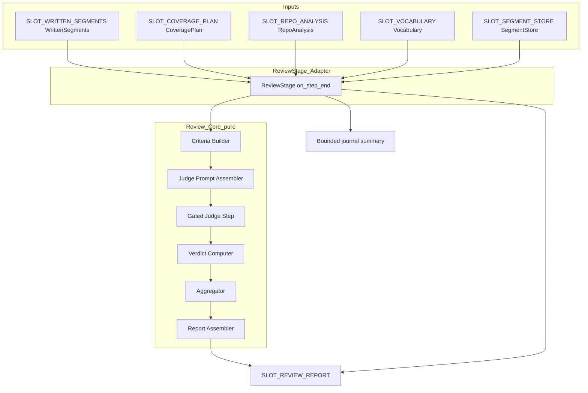
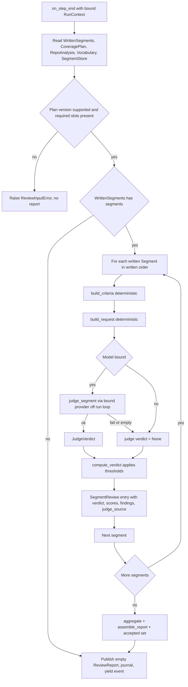

# Design Document

## Overview

**Purpose**: The `quality-review-gate` replaces the no-op `review` stage with a real stage
that evaluates each written ontology `Segment` against the **COBESY validation gate** and
gates which segments proceed to assembly. It judges MECE structure, working-memory fit,
role-fit, clarity, falsifiability/evidence-grounding, and absence of AI-slop per segment,
then emits a frozen `ReviewReport` (per-segment verdict + findings + criterion scores +
aggregate) and the **accepted** segment set.

**Users**: The Wave 3 `mkdocs-site-assembler` consumes the `ReviewReport` and assembles
only the accepted segments; documentation readers ultimately receive content that has
passed the anti-cringe gate.

**Impact**: Changes the current pipeline state by making the `review` stage a real quality
firewall. The stage is a **thin HarnessX adapter over a pure, model-free review core** —
exactly mirroring the merged `PlanStage` and the `cobesy-writer` `WriteStage`. All
structural work (criteria definition, judge-prompt assembly, response parsing, verdict
computation, accept/reject, aggregation, report assembly) is deterministic and
unit-testable without a model; the per-segment judge call is the single model-dependent
step and is credential-free testable through `tests/_fakes.FakeProvider`.

### Goals
- Replace the `review` stub in place (stable `STAGE_NAME` / `ReviewStage` /
  `make_review_stage` / module path); registry and `make_docgen` need zero edits.
- Judge each written `Segment` against the COBESY gate via one bounded model call, compute
  a deterministic verdict, and surface the accepted set + a frozen `ReviewReport` via a new
  `SLOT_REVIEW_REPORT` seam for the assembler.
- Keep the deterministic core (`docuharnessx.review`) fully unit-testable with no model;
  isolate the only model call behind a gated, fault-tolerant step.
- Adapt to the loaded `Vocabulary`; hardcode no roles/intents/subjects.

### Non-Goals
- Generating or rewriting prose (cobesy-writer), MkDocs assembly/deploy, producing the
  `CoveragePlan`/`RepoAnalysis`/written segments, model resolution, or harness composition.
- A write→review remediation loop that re-invokes the writer (deliberately not adopted —
  see "single-pass gate" in research.md and Decisions below).
- Mutating any frozen contract (`CoveragePlan`, `RepoAnalysis`, `Segment`, `Vocabulary`,
  `SegmentStore`, `WrittenSegments`).

## Boundary Commitments

### This Spec Owns
- The real **Review stage adapter** in `docuharnessx/stages/review.py` (replacing the stub
  in place), and the per-segment review orchestration as a `step_end` side effect.
- A new pure, model-free **review core** package `docuharnessx/review/`: the `ReviewReport`
  data model + nested records, the deterministic criteria builder, the judge-prompt
  assembler, the deterministic verdict computation (per-criterion thresholds + combination
  rule), the accept/reject + aggregation logic, the report assembler, and the gated judge
  step contract. The error hierarchy lives here too.
- The new output seam: the `SLOT_REVIEW_REPORT` slot key (append-only to `types.py`) and
  the `review_report()` / `set_review_report()` accessors (append-only to `RunContext`).
  The **shape** of that slot's content (the frozen `ReviewReport` value object) is a
  stabilized contract for the assembler.

### Out of Boundary
- Prose generation / rewriting, composition blueprints, the write loop (owned by
  `cobesy-writer`).
- A write→review remediation loop (not adopted; the report's findings are the forward seam).
- MkDocs rendering, nav, tags-driven views, cross-link HTML, role landing pages (Wave 3).
- The `CoveragePlan` / `RepoAnalysis` / written-segment production, ontology
  schema/validation internals, `Vocabulary` loading, `SegmentStore` adapters, model
  resolution, `make_docgen`, and any sub-harness/`LLMJudgeProcessor` registration.

### Allowed Dependencies
- **Consume verbatim**: `docuharnessx.composition.model` (`WrittenSegments`, `WriteFlag`)
  from `SLOT_WRITTEN_SEGMENTS`; `docuharnessx.planning` (`CoveragePlan`, `PlannedSegment`,
  `EvidenceRef`, `COVERAGE_PLAN_SCHEMA_VERSION`); `docuharnessx.analysis.model`
  (`RepoAnalysis`); `docuharnessx.ontology` (`Segment`, `Subject`, `Vocabulary`,
  `AxisTerm`, `validate_segment`, `emit_tags`, `SCHEMA_VERSION`, `SegmentStore`).
- **Reuse**: `docuharnessx.context.RunContext`, `docuharnessx.types` slot keys,
  `docuharnessx.stages.base` (`NoOpStage`, `PIPELINE_HOOK`, `STAGE_PARTICIPATION_ACTION`,
  `_bind_runtime`/tracer pattern).
- **Model**: the bound `ModelConfig.main` provider obtained from the runtime exactly as
  `PlanStage._relevance_model()` does (`getattr(self, "_model_config", None)`), never
  constructed by this spec.
- **Judge contract lineage** (no import dependency): the per-segment judge reuses the
  prompt/parse/verdict discipline of `harnessx.processors.evaluation`'s `LLMJudgeEvaluator`
  (strict JSON, fenced-code stripping, score clamp, `passed` fallback to a threshold) but
  does NOT register `LLMJudgeProcessor` or a sub-harness (out of boundary; see research.md).

### Revalidation Triggers
- A change to the `WrittenSegments` / `WriteFlag` shape or `SLOT_WRITTEN_SEGMENTS` (the
  upstream seam this spec pins).
- A change to the `CoveragePlan` / `PlannedSegment` shape or `COVERAGE_PLAN_SCHEMA_VERSION`,
  or to the `RepoAnalysis` shape/version.
- A change to the ontology `Segment` schema, `validate_segment` contract, or `SegmentStore`
  semantics.
- **A change to `SLOT_REVIEW_REPORT` or the `ReviewReport` value object (its
  `schema_version` / frozen field set)** forces the `mkdocs-site-assembler` spec to
  re-check integration (it is the consumer).
- A change to how the stage base binds the runtime/model (`_bind_runtime`, `_model_config`)
  or the `step_end` / `task_start` lifecycle.

## Architecture

### Existing Architecture Analysis

The merged foundation and the `cobesy-writer` design establish the exact pattern this spec
follows:

- **Stage adapter pattern** (`docuharnessx/stages/plan.py`): a real stage subclasses
  `NoOpStage`, captures the live run `State` in `on_task_start`, wraps it in a `RunContext`
  in `on_step_end`, reads input slots, runs a **pure core**, writes an output slot, journals
  a **bounded summary**, and yields the `step_end` event unchanged. It raises an input error
  only when a run `State` is bound but a required slot is missing; driven outside a harness
  it forwards the event unchanged.
- **Pure core + gated model** (`docuharnessx/planning/relevance.py`): the deterministic core
  never imports a provider; the model surface is duck-typed over a
  `complete(messages, tools, stream_callback=None)`-returning-`.content` provider, absorbs
  all failures, and is driven off the run loop via `asyncio.to_thread` to avoid nesting
  event loops. The judge step reuses this exact bridge shape; the gate's *default* outcome
  on a model-less / failed judge is a deterministic **reject** (fail-closed firewall).
- **Frozen seams**: `WrittenSegments`, `CoveragePlan`, `RepoAnalysis`, `Segment`,
  `SegmentStore`, `Vocabulary` are consumed as-is. `types.py`/`context.py` are extended
  append-only (analyzer, planner, and writer each did this; this spec adds one more slot +
  accessor pair the same way).

### Architecture Pattern & Boundary Map

Selected pattern: **deterministic review core + thin gated stage adapter** (isomorphic to
`planning` core + `PlanStage`, and to `composition` core + `WriteStage`).



**Domain/feature boundaries**: The `review` package contains zero HarnessX coupling except
the duck-typed provider call in the judge step (mirroring `planning.relevance` and
`composition.prose`). Only `stages/review.py` knows the harness lifecycle. The model is
reached via the runtime-bound `_model_config`; the core never constructs one.

**Existing patterns preserved**: `NoOpStage` lifecycle + tracer; `RunContext` typed slot
accessors; append-only `types.py`/`context.py` extension; pure-core-over-frozen-seams;
duck-typed provider with absorbed failures and `asyncio.to_thread` bridging.

**New components rationale**: a dedicated `review` package keeps the COBESY gate logic out
of the stage and independently unit-testable, exactly as `planning`/`composition` are
separated from their stages.

**Steering compliance**: deterministic core / gated model split; configurable vocabulary
(no hardcoded axes); LLM-judge is gated and logged (the COBESY anti-cringe gate is the
"Evaluate" dimension named in steering); stages communicate through slots and the segment
store, not globals.

### Dependency Direction

`ontology` / `planning.model` / `analysis.model` / `composition.model` (frozen seams)
→ `review` (pure core: model, criteria, prompt, parse, verdict, aggregate, report)
→ `review.judge` (the only model-touching module, duck-typed provider)
→ `stages/review.py` (harness adapter)
→ `context.py` / `types.py` (extended append-only; imported by the adapter).

Each layer imports only from layers to its left. `review` never imports `stages`;
`stages/review.py` imports `review`, `context`, `types`, and the frozen seams.

### Technology Stack

| Layer | Choice / Version | Role in Feature | Notes |
|-------|------------------|-----------------|-------|
| Backend / Services | Python 3.12 (stdlib `dataclasses`, `asyncio`, `json`, `re`, `logging`) | Pure review core + stage adapter | No new third-party deps |
| Agent framework | HarnessX (installed) | Run loop drives `provider.complete()`; stage lifecycle hooks; journal | Provider is duck-typed; bound model via `ModelConfig(main=...).agentic(make_docgen(...))`; judge verdict contract reuses `harnessx.processors.evaluation` discipline (no sub-harness registration) |
| Reused internal | `docuharnessx.ontology`, `.planning`, `.analysis`, `.composition.model`, `.context`, `.types`, `.stages.base` | Frozen seams + adapter base | Consumed verbatim |
| Testing | `pytest`, `tests/_fakes.FakeProvider` | Credential-free judge exercise | Assert gating/report shape, not judge prose |

## File Structure Plan

### Directory Structure
```
docuharnessx/
├── review/                      # NEW pure, model-free COBESY review-gate core
│   ├── __init__.py             # Single public namespace (mirrors planning/__init__.py)
│   ├── model.py                # ReviewReport + SegmentReview + CriterionScore + ReviewAggregate; Verdict/JudgeSource enums-as-str; ReviewError hierarchy; REVIEW_REPORT_SCHEMA_VERSION
│   ├── criteria.py             # build_criteria(segment, planned, analysis, vocab) -> SegmentCriteria (deterministic); COBESY_CRITERIA names + thresholds
│   ├── prompt.py               # build_request(criteria) -> (messages, tools) (deterministic; no model)
│   ├── parse.py                # parse_verdict(content, criteria) -> JudgeVerdict | None (deterministic; reuses LLMJudge JSON discipline)
│   ├── verdict.py              # compute_verdict(judge_verdict | None, criteria) -> SegmentReview (deterministic; applies thresholds + default-reject)
│   ├── aggregate.py            # aggregate(entries) -> ReviewAggregate; assemble_report(entries, accepted) -> ReviewReport (deterministic)
│   └── judge.py                # judge_segment(criteria, *, model, timeout_s) -> JudgeVerdict | None (the ONLY model surface)
└── stages/
    └── review.py               # MODIFIED in place: real ReviewStage adapter (stable names/path)
```

### Modified Files
- `docuharnessx/stages/review.py` — Replace the no-op body with the real `ReviewStage`
  adapter. Keep `STAGE_NAME = "review"`, class `ReviewStage(NoOpStage)`, `make_review_stage`,
  the `make_noop_stage` re-export, and `__all__` stable so the registry/bundle are untouched.
- `docuharnessx/types.py` — Append `SLOT_REVIEW_REPORT` constant and add it to `__all__`
  (append-only; no existing entry changed).
- `docuharnessx/context.py` — Append `set_review_report()` / `review_report()` accessors and
  the `_SLOT_TYPE_REVIEW_REPORT` tag (append-only; TYPE_CHECKING import of `ReviewReport`).

## System Flows

Per-segment review loop inside `on_step_end` (deterministic core in solid path, gated model
in the dashed branch):



Gating notes: a model is consulted only when `_model_config.main` is reachable; the
model-less, failed, timed-out, or unparseable case yields a `None` judge verdict, and
`compute_verdict` applies the documented default — a **reject** with
`judge_source="unavailable"` (fail-closed firewall) — so a credential-free run still
produces a well-formed, deterministic report. A fake judge returning a parseable passing
verdict exercises the accept path credential-free.

## Requirements Traceability

| Requirement | Summary | Components | Interfaces | Flows |
|-------------|---------|------------|------------|-------|
| 1.1–1.4 | In-place stable Review stage; side-effect-only; outside-harness pass-through | ReviewStage | `STAGE_NAME`, `ReviewStage`, `make_review_stage` | Review loop entry |
| 2.1 | Read all five input slots via RunContext | ReviewStage | `RunContext.written_segments/coverage_plan/repo_analysis/vocabulary/segment_store` | Read |
| 2.2 | Pin CoveragePlan version, halt on mismatch | ReviewStage | `COVERAGE_PLAN_SCHEMA_VERSION` | CheckVer |
| 2.3–2.4 | Missing required slot halts with named cause | ReviewStage | `ReviewInputError` | CheckVer→Raise |
| 2.5 | Absent RepoAnalysis still judges from content + evidence | Criteria Builder | `build_criteria` | Crit |
| 2.6 | Inputs treated read-only | All core components | (immutable dataclasses / read-only `Segment`) | Crit |
| 3.1–3.5 | Deterministic COBESY criteria, role-fit from vocab, evidence anchors, per-criterion thresholds + combination rule | Criteria Builder, Model | `build_criteria`, `COBESY_CRITERIA`, `SegmentCriteria` | Crit |
| 4.1–4.4 | Deterministic, fact-only judge prompt with structured-verdict instruction | Judge Prompt Assembler | `build_request` | Assemble |
| 5.1–5.6 | Single gated judge step; verdict only; budgeted; fake-testable; never aborts | Gated Judge Step + ReviewStage | `judge_segment`, `_model_config` | Gate→JudgeCall |
| 6.1–6.6 | Deterministic verdict from scores; accept/reject; default verdict; every segment has an entry; empty set; order | Verdict Computer, Aggregator, ReviewStage | `compute_verdict`, `assemble_report` | Compute/Agg |
| 7.1–7.6 | Surface frozen ReviewReport + accepted set via new slot + accessor; consistent with store; ordered; versioned | types/context additions, Report Assembler, ReviewStage | `SLOT_REVIEW_REPORT`, `review_report()`, `ReviewReport` | Publish |
| 8.1–8.3 | Aggregate counts + per-criterion tally; reproducible | Aggregator | `aggregate`, `ReviewAggregate` | Agg |
| 9.1–9.3 | Bounded journal summary incl. judge-source markers | ReviewStage | `_summary_detail` | Journal |
| 10.1–10.3 | Configurable vocabulary; reproducibility | Criteria Builder, all core | loaded `Vocabulary` accessors | Crit |

## Components and Interfaces

| Component | Domain/Layer | Intent | Req Coverage | Key Dependencies (P0/P1) | Contracts |
|-----------|--------------|--------|--------------|--------------------------|-----------|
| ReviewModel | review (data) | Report + entry + score + aggregate + verdict/source + error types; version authority | 6, 7, 8 | dataclasses (P0) | State |
| Criteria Builder | review (core) | Deterministic COBESY criteria + evidence anchors per segment | 2.5, 3, 10 | planning.model, analysis.model, ontology Vocabulary/Subject/AxisTerm (P0) | Service |
| Judge Prompt Assembler | review (core) | Deterministic judge request from criteria | 4 | ReviewModel (P0); harnessx Message (P1, lazy) | Service |
| Verdict Parser | review (core) | Deterministic parse of judge JSON into a bounded verdict | 4.3, 6.1 | ReviewModel (P0) | Service |
| Verdict Computer | review (core) | Deterministic per-criterion thresholds + combination + default-reject | 3.5, 6.1, 6.3 | ReviewModel (P0) | Service |
| Aggregator | review (core) | Accept/reject set, aggregate counts, report assembly | 6.2, 6.4, 6.5, 7, 8 | ReviewModel (P0) | Service |
| Gated Judge Step | review (model) | The only model call; per-criterion scores + verdict; fault-tolerant | 5 | duck-typed provider (P0) | Service |
| ReviewStage | stages (adapter) | Orchestrate the per-segment review as step_end side effect | 1, 2, 5, 6, 7, 9 | review core (P0), context, ontology store (P0), stages.base (P0) | State, Event |
| types/context additions | skeleton seam | New review-report slot + accessor | 7.1–7.3 | (append-only) | State |

### review (data layer)

#### ReviewModel (`review/model.py`)

| Field | Detail |
|-------|--------|
| Intent | Frozen value objects: the report, the per-segment entry, the criterion score, the aggregate, the judge verdict, the error hierarchy, the version authority |
| Requirements | 6.1, 6.4, 7.1, 7.6, 8.1 |

**Responsibilities & Constraints**
- All report/entry/score/aggregate types are `@dataclass(frozen=True)` with `tuple`
  collection fields (deep immutability + structural equality → deterministic and testable,
  mirroring `planning.model` and `composition.model`).
- `ReviewReport` is the **stabilized seam** the assembler consumes. The `Segment` objects in
  `accepted` are the same identities present in the `WrittenSegments`/`SegmentStore`.
- `REVIEW_REPORT_SCHEMA_VERSION` is the single version authority (Req 7.6); evolution is
  additive (new optional fields with defaults).

**Contracts**: State [x]

##### State Management
- `Verdict`: a `str` value object / `Literal` (`"pass"` | `"fail"`).
- `JudgeSource`: a `str` value object / `Literal` (`"model"` | `"fake"` | `"unavailable"`).
- `CriterionScore`: `name: str` (a `COBESY_CRITERIA` member), `score: float` (clamped
  `[0,1]`), `passed: bool`, `reason: str`.
- `JudgeVerdict`: `scores: tuple[CriterionScore, ...]`, `overall_passed: bool`,
  `reason: str` (the parsed, bounded judge output — produced by `parse.py`/`judge.py`).
- `SegmentReview`: `segment_id: str`, `verdict: Verdict`, `scores: tuple[CriterionScore,
  ...]`, `findings: tuple[str, ...]` (actionable, derived from failing criteria),
  `judge_source: JudgeSource`.
- `ReviewAggregate`: `judged: int`, `accepted: int`, `rejected: int`, `unavailable: int`,
  `criterion_tally: tuple[CriterionTally, ...]` (per-criterion pass/fail counts).
- `CriterionTally`: `name: str`, `passed: int`, `failed: int`.
- `ReviewReport`: `schema_version: int` (== `REVIEW_REPORT_SCHEMA_VERSION`),
  `entries: tuple[SegmentReview, ...]` (written order), `accepted: tuple[Segment, ...]`
  (written order, same identities as stored), `aggregate: ReviewAggregate`.
- Errors: `ReviewError(Exception)` base; `ReviewInputError(ReviewError)` (missing/unset slot
  or unsupported plan version — raised at the stage boundary, kept independent of the
  skeleton-wide error family, matching `PlanningError`/`WriterError`).

#### COBESY criteria definition (`review/criteria.py` constants)

| Field | Detail |
|-------|--------|
| Intent | The fixed COBESY criteria names + per-criterion pass threshold + combination rule |
| Requirements | 3.1, 3.5 |

**Responsibilities & Constraints**
- `COBESY_CRITERIA: tuple[str, ...]` — the named gate: `mece`, `working_memory`,
  `role_fit`, `clarity`, `falsifiability`, `no_ai_slop` (Req 3.1).
- `CRITERION_THRESHOLD: float` — the per-criterion pass threshold (a single named constant,
  reviewable; Req 3.5).
- Combination rule (Req 3.5): a segment **passes** iff every criterion's `passed` is true
  (all-of); documented and applied identically to every segment. (Pinning the rule here, not
  in prose, keeps it deterministic and reviewable.)
- `DEFAULT_UNAVAILABLE_VERDICT = "fail"` — the fail-closed default for an unavailable judge
  (Req 6.3); a single named constant.

### review (core layer)

#### Criteria Builder (`review/criteria.py`)

| Field | Detail |
|-------|--------|
| Intent | Turn one written `Segment` (+ its `PlannedSegment`, analysis, vocab) into a deterministic `SegmentCriteria` |
| Requirements | 2.5, 2.6, 3.1, 3.2, 3.3, 3.4, 10.1, 10.2 |

**Responsibilities & Constraints**
- Pure function, no model. Builds the per-segment criteria context: the named criteria, the
  segment's role/intent **context derived from the loaded `Vocabulary`** (`AxisTerm.label`/
  `description` for each role id and the intent id) for the role-fit criterion — never from
  a hardcoded table (Req 3.2, 10.1, 10.2).
- Evidence anchors come from the matching `PlannedSegment.evidence` (verbatim
  `EvidenceRef.kind`/`detail`) and, when present, the matching `RepoAnalysis` finding for
  that detail; absent analysis is tolerated (anchors fall back to the evidence ref alone)
  for the falsifiability/evidence criterion (Req 2.5, 3.3).
- Matches a written `Segment` to its `PlannedSegment` deterministically (e.g. by the
  segment id derived in writing, or by `segment_key` lookup); a written segment with no
  matching plan entry still gets criteria (evidence anchors empty) — never dropped.
- Reads `Segment` read-only; never mutates inputs (Req 2.6).

**Dependencies**
- Inbound: ReviewStage — supplies one written `Segment` + the plan/analysis/vocab (P0)
- Outbound: `planning.model`, `analysis.model`, ontology `Vocabulary`/`Subject`/`AxisTerm` (P0)

**Contracts**: Service [x]

##### Service Interface
```python
def build_criteria(
    segment: Segment,
    planned: PlannedSegment | None,
    analysis: RepoAnalysis | None,
    vocab: Vocabulary,
) -> SegmentCriteria: ...
```
- Preconditions: `segment.roles`/`intent` are vocabulary members (writer guarantees);
  `planned`/`analysis` may be `None`.
- Postconditions: returns a fully-populated `SegmentCriteria`; equal inputs → equal criteria
  + equal evidence anchors (Req 3.4).
- Invariants: never consults a model; never mutates inputs.

**Implementation Notes**
- Integration: consumed by the prompt assembler and the verdict computer.
- Validation: unit tests assert criteria names, role/intent context from a *custom*
  `Vocabulary`, and evidence anchoring with and without analysis; equal inputs → equal
  criteria.
- Risks: over-coupling to default-profile role ids — mitigated by deriving role-fit context
  from the loaded `Vocabulary` term, not literals.

#### Judge Prompt Assembler (`review/prompt.py`)

| Field | Detail |
|-------|--------|
| Intent | Build the deterministic `(messages, tools)` judge request from a `SegmentCriteria` |
| Requirements | 4.1, 4.2, 4.3, 4.4 |

**Responsibilities & Constraints**
- Pure, model-free. The system prompt instructs the judge to act as an objective COBESY
  evaluator, score each named criterion in `[0,1]` with a one-line reason, and return an
  overall pass/fail — in a strict JSON object (the parse contract reused from
  `LLMJudgeEvaluator`). The user message carries the segment's `title`/`summary`/`body`, its
  role/intent context (vocab labels), and its evidence anchors; no unrelated repository file
  contents (Req 4.2).
- The returned JSON shape (instructed in the prompt): `{"criteria": {<name>: {"score":
  <0..1>, "passed": <bool>, "reason": "<one line>"}}, "passed": <bool>, "reason": "<one
  line>"}` (Req 4.3).
- `tools=[]` (single-shot judgement, not an agentic loop) — mirrors
  `planning.relevance._build_request`. The `harnessx.core.events.Message` import is lazy with
  a plain-dict fallback (same as the planner/writer) so the core never hard-depends on the
  harness at import time.

**Contracts**: Service [x]

##### Service Interface
```python
def build_request(criteria: SegmentCriteria) -> tuple[list[object], list[object]]: ...
```
- Postconditions: equal `SegmentCriteria` → equal request; returns `(messages, tools)` with
  `tools == []` (Req 4.4).

#### Verdict Parser (`review/parse.py`)

| Field | Detail |
|-------|--------|
| Intent | Deterministically parse the judge's JSON content into a bounded `JudgeVerdict`, or `None` |
| Requirements | 4.3, 6.1 |

**Responsibilities & Constraints**
- Pure, model-free, deterministic. Reuses the `LLMJudgeEvaluator` parse discipline: strip
  fenced code (` ```json … ``` `), `json.loads`, clamp each criterion `score` to `[0,1]`,
  coerce `passed` (defaulting to `score >= CRITERION_THRESHOLD` when absent), keep only
  criterion names in `COBESY_CRITERIA`. Any malformed JSON, wrong shape, or a response
  missing all known criteria → `None` (the caller applies the default-reject) — never raises.
- Bounds the verdict: scores outside `[0,1]` are clamped; unknown criterion keys dropped;
  missing known criteria treated as not-passed for that criterion.

**Contracts**: Service [x]

##### Service Interface
```python
def parse_verdict(content: str, criteria: SegmentCriteria) -> JudgeVerdict | None: ...
```
- Returns a `JudgeVerdict` on a parseable, in-bounds response; `None` on
  unparseable/empty/wrong-shape (Req 6.1). Pure and deterministic.

#### Verdict Computer (`review/verdict.py`)

| Field | Detail |
|-------|--------|
| Intent | Deterministically turn a (`JudgeVerdict` | `None`) + criteria into a `SegmentReview` |
| Requirements | 3.5, 6.1, 6.3, 6.4 |

**Responsibilities & Constraints**
- Pure, model-free, deterministic. Applies the per-criterion `CRITERION_THRESHOLD` and the
  all-of combination rule to the judge's per-criterion scores to compute the segment
  `verdict`, independent of any free-form judge prose (Req 6.1, 3.5).
- When the judge verdict is `None` (unavailable), applies `DEFAULT_UNAVAILABLE_VERDICT`
  (reject), sets `judge_source="unavailable"`, and emits a finding noting the segment was
  not judged (Req 6.3). When a parsed verdict is present, `judge_source` is `"model"` (or
  `"fake"` when the stage marks a fake run).
- Derives `findings`: one actionable finding per failing criterion (using the criterion name
  + the judge's reason where present), so the report is a usable feedback channel (Req 6.4).
- Always produces a `SegmentReview` for the segment — no segment is left without an entry
  (Req 6.4).

**Contracts**: Service [x]

##### Service Interface
```python
def compute_verdict(
    judge: JudgeVerdict | None,
    criteria: SegmentCriteria,
    *,
    judge_source: JudgeSource,
) -> SegmentReview: ...
```
- Invariants: deterministic; equal inputs → equal `SegmentReview`; never raises.

#### Aggregator (`review/aggregate.py`)

| Field | Detail |
|-------|--------|
| Intent | Build the accepted set, the aggregate counts/tally, and assemble the frozen `ReviewReport` |
| Requirements | 6.2, 6.4, 6.5, 7.1, 7.4, 7.5, 8.1, 8.2, 8.3 |

**Responsibilities & Constraints**
- Pure, model-free, deterministic. Given the ordered `SegmentReview` entries and a map from
  `segment_id` to the written `Segment`, builds `accepted` as exactly those segments whose
  `verdict == "pass"`, in written order, carrying the same `Segment` identities (Req 6.2,
  7.4, 7.5).
- Computes `ReviewAggregate`: `judged`/`accepted`/`rejected`/`unavailable` counts and the
  per-criterion `criterion_tally` across all entries (Req 8.1, 8.2).
- Assembles the `ReviewReport` with `schema_version = REVIEW_REPORT_SCHEMA_VERSION` (Req
  7.1, 7.6). An empty entries tuple yields a well-formed empty report (zero counts, empty
  accepted) (Req 6.5).

**Contracts**: Service [x]

##### Service Interface
```python
def aggregate(entries: tuple[SegmentReview, ...]) -> ReviewAggregate: ...
def assemble_report(
    entries: tuple[SegmentReview, ...],
    by_id: dict[str, Segment],
) -> ReviewReport: ...
```
- Invariants: deterministic; equal inputs → equal report (Req 8.3, 10.3).

#### Gated Judge Step (`review/judge.py`)

| Field | Detail |
|-------|--------|
| Intent | The single model-dependent step: produce a `JudgeVerdict` for one segment, fault-tolerantly |
| Requirements | 5.1, 5.2, 5.3, 5.4, 5.6 |

**Responsibilities & Constraints**
- The only module that touches a model. Duck-typed over a HarnessX
  `BaseModelProvider`-shaped object: awaitable `complete(messages, tools,
  stream_callback=None)` returning an object with a `.content` string (a
  `ModelResponseEvent` in production; a `FakeProvider` in tests). Never imports a provider
  class or constructs one (mirrors `planning.relevance` / `composition.prose`).
- Bridges sync→async with a private loop under a wall-clock `timeout_s` exactly as
  `relevance._complete_with_timeout` does. Issues exactly one bounded `complete` call per
  segment and adds no loop (Req 5.1, 5.3). Delegates parsing to `parse.parse_verdict`; an
  unparseable/empty/timed-out/raised response yields `None` (caller applies default). All
  failures absorbed + logged at WARNING; never raises (Req 5.4).
- Produces only a `JudgeVerdict` (per-criterion scores + overall + reason); it never touches
  segment content or fields (Req 5.6).

**Dependencies**
- Inbound: ReviewStage — passes the bound provider + criteria (P0)
- Outbound: duck-typed provider (P0); `review.prompt`/`review.parse` (P0);
  `harnessx.core.events.Message` (lazy, P1)

**Contracts**: Service [x]

##### Service Interface
```python
def judge_segment(
    criteria: SegmentCriteria,
    *,
    model: object | None,
    timeout_s: float = DEFAULT_JUDGE_TIMEOUT_S,
) -> JudgeVerdict | None: ...
```
- Returns a `JudgeVerdict` on a clean response; `None` on
  model-less/failure/timeout/empty/unparseable (caller applies the default verdict).
- Invariants: never raises; one `complete` call max; sets no segment field.

### stages (adapter layer)

#### ReviewStage (`stages/review.py`, modified in place)

| Field | Detail |
|-------|--------|
| Intent | Orchestrate the per-segment review as a `step_end` side effect over the pure core |
| Requirements | 1, 2, 5, 6, 7, 9 |

**Responsibilities & Constraints**
- Subclasses `NoOpStage` (inherits `_bind_runtime`, tracer resolution, hook binding).
  Captures the run `State` in `on_task_start` (pure pass-through, like `PlanStage`); does the
  work in `on_step_end` and yields the event unchanged (Req 1.2–1.4).
- Outside a harness (no captured `State`) it forwards the event and writes nothing (Req 1.3).
  With a bound `State`: reads the five input slots (Req 2.1); pins
  `COVERAGE_PLAN_SCHEMA_VERSION` and raises `ReviewInputError` on an unsupported version (Req
  2.2) or any missing required slot — written segments or vocabulary (Req 2.3, 2.4). Empty
  written set → publish empty `ReviewReport`, journal, return (Req 6.5).
- Builds a `segment_key`→`PlannedSegment` (or id→plan) lookup from the `CoveragePlan` once,
  for evidence-anchor matching. Per written `Segment` in written order (Req 6.6):
  `build_criteria` → `build_request` → gated `judge_segment` (off the run loop via
  `asyncio.to_thread` when a model is consulted, mirroring `PlanStage._maybe_apply_relevance`)
  → `compute_verdict` (with `judge_source` `"model"`/`"fake"`/`"unavailable"`). On a `None`
  judge verdict the default-reject path runs deterministically (Req 5.4, 6.3).
- After the loop: `aggregate` + `assemble_report` over the entries and the written-segment
  identities; publishes the frozen `ReviewReport` to `SLOT_REVIEW_REPORT` via
  `RunContext.set_review_report` (Req 7.1, 7.4, 7.5); then journals a bounded summary (Req 9).
- Obtains the model via `getattr(self, "_model_config", None)` then `.main`, exactly as
  `PlanStage._relevance_model()`; any failure to reach a provider degrades to the
  default-reject path so a misconfigured model never aborts the review (Req 5.2, 5.4).
- Distinguishes `"fake"` from `"model"` for the journal/source marker via a documented,
  optional heuristic (e.g. a per-instance test flag the integration test sets); production
  judged segments are `"model"` (Req 9.3). The *gating* logic is identical regardless of
  source.

**Dependencies**
- Inbound: harness run loop (drives `on_task_start`/`on_step_end`) (P0)
- Outbound: `review` core (P0); `RunContext` + slot keys (P0); ontology `Segment`/
  `SegmentStore` (P0, read-only); `stages.base` (P0)

**Contracts**: State [x] / Event [x]

##### State Management
- Reads: `SLOT_WRITTEN_SEGMENTS`, `SLOT_COVERAGE_PLAN`, `SLOT_REPO_ANALYSIS`,
  `SLOT_VOCABULARY`, `SLOT_SEGMENT_STORE`. Writes: `SLOT_REVIEW_REPORT`. Concurrency:
  single-run, single-pass; the written order is the determinism authority.

**Implementation Notes**
- Integration: stable `STAGE_NAME`/`ReviewStage`/`make_review_stage`/module path; `__all__`
  retains `make_noop_stage`. Registry/bundle untouched (Req 1.1).
- Validation: integration test runs `make_docgen` bound to `FakeProvider.agentic(...)` over a
  seeded `WrittenSegments`/`CoveragePlan`/`RepoAnalysis`/`Vocabulary`/`InMemorySegmentStore`,
  asserting a well-formed `SLOT_REVIEW_REPORT` covering every written segment, an accepted
  set consistent with the verdicts, and a bounded journal record — credential-free.
- Risks: nesting `asyncio.run` inside the run loop — mitigated by `asyncio.to_thread` exactly
  as the planner does.

### Skeleton seam additions (append-only)

#### types.py / context.py additions

| Field | Detail |
|-------|--------|
| Intent | Add the new review-report slot key + typed `RunContext` accessor |
| Requirements | 7.1, 7.2, 7.3 |

**Responsibilities & Constraints**
- `types.py`: add `SLOT_REVIEW_REPORT: str = "docuharnessx.review_report"` and add it to
  `__all__`. No existing slot key, `StageName`, or `STAGE_NAMES` entry changes (append-only,
  matching the analyzer/planner/writer extensions).
- `context.py`: add `_SLOT_TYPE_REVIEW_REPORT = "review_report"`, a TYPE_CHECKING import of
  `ReviewReport` from `docuharnessx.review.model`, and the accessor pair
  `set_review_report(value)` / `review_report() -> ReviewReport | None`. An unset slot
  returns `None` (Req 7.3), matching every other accessor.

**Contracts**: State [x]

## Data Models

### Domain Model
- **Aggregate root for this stage's output**: `ReviewReport` (the seam the assembler reads).
  It aggregates the ordered `SegmentReview` entries, the accepted `Segment` tuple, and the
  `ReviewAggregate`. Invariant: every written segment has exactly one `SegmentReview` entry;
  `accepted` is exactly the entries with `verdict == "pass"`, carrying the same `Segment`
  identities as the written set / store.
- **Value objects**: `SegmentReview`, `CriterionScore`, `JudgeVerdict`, `ReviewAggregate`,
  `CriterionTally`, `SegmentCriteria` (+ its nested evidence anchor / role-context records).
  All frozen, all built from frozen/read-only inputs.
- **Business rules**: the segment verdict derives only from per-criterion thresholds + the
  combination rule applied to the judge scores (not free-form prose); an unavailable judge
  is a deterministic default-reject with a marker; no segment is silently dropped — every
  written segment is judged and entered.

### Data Contracts & Integration
- **Consumed (verbatim, pinned)**: `WrittenSegments`/`WriteFlag` at `SLOT_WRITTEN_SEGMENTS`;
  `CoveragePlan` v1 (`schema_version == 1`); `RepoAnalysis` v1 (optional); `Vocabulary`;
  `SegmentStore` port.
- **Produced seam**: `ReviewReport` at `SLOT_REVIEW_REPORT`, carrying
  `REVIEW_REPORT_SCHEMA_VERSION`. Versioning: additive fields with defaults if it evolves;
  any field-set change bumps the version and is a revalidation trigger for
  `mkdocs-site-assembler`.
- **Serialization**: the accepted `Segment`s use the existing ontology serializer (no new
  format). `ReviewReport` is an in-process value object (slot content), not serialized to
  disk by this spec.

## Error Handling

### Error Strategy
Fail fast on missing inputs at the stage boundary; degrade gracefully per segment.

### Error Categories and Responses
- **Input errors** (fatal, halt run, no partial output): unset `SLOT_WRITTEN_SEGMENTS` /
  `SLOT_VOCABULARY`, or unsupported `CoveragePlan` version → raise `ReviewInputError` naming
  the offending slot/version (Req 2.2–2.4). Mirrors `PlanningInputError`/`WriterInputError`.
- **Per-segment judge errors** (absorbed, non-fatal): a raised/timed-out/empty/unparseable
  judge response → `judge_segment` returns `None`, `compute_verdict` applies the
  default-reject with `judge_source="unavailable"` and a finding, and the loop continues (Req
  5.4, 6.3). Logged at WARNING.
- **Absent optional input** (tolerated): missing `RepoAnalysis` → criteria use evidence refs
  alone; review proceeds (Req 2.5). A written segment with no matching `PlannedSegment` still
  gets criteria (empty evidence anchors) and is judged.

### Monitoring
Bounded `ProcessorTriggerEvent` to the run tracer (Req 9): stage name, `judged`, `accepted`,
`rejected`, `unavailable` counts, capped top-priority accepted ids, and a `judge_source`
breakdown marker (`model`/`fake`/`unavailable`) — never full bodies or judge prose (Req 9.2,
9.3). Reuses the `NoOpStage` tracer-resolution pattern; no-op when no tracer is bound.

## Testing Strategy

### Unit Tests (deterministic core — no model)
- `build_criteria`: COBESY criteria names present; role-fit context derived from a *custom*
  `Vocabulary`'s role/intent labels (not literals); evidence anchors built from the matching
  `PlannedSegment` with and without a matching `RepoAnalysis` finding; a written segment with
  no plan match still gets criteria; equal inputs → equal criteria + anchors (Req 3.x, 2.5,
  10.x).
- `build_request`: deterministic `(messages, tools)`; carries the segment body/summary +
  role/intent context + evidence anchors + the structured-verdict instruction, no unrelated
  file contents; `tools == []` (Req 4.1–4.4).
- `parse_verdict`: parses a clean JSON verdict; strips fenced code; clamps out-of-range
  scores to `[0,1]`; defaults missing `passed` to the threshold rule; drops unknown criteria;
  returns `None` on malformed/empty/wrong-shape (Req 4.3, 6.1).
- `compute_verdict`: all-criteria-pass → `pass`; one failing criterion → `fail` with a
  finding; `None` judge → default-reject `fail`, `judge_source="unavailable"`, marker
  finding; deterministic for equal inputs (Req 3.5, 6.1, 6.3, 6.4).
- `aggregate`/`assemble_report`: accepted set = exactly the `pass` entries in written order
  with the same `Segment` identities; correct `judged`/`accepted`/`rejected`/`unavailable`
  counts and per-criterion tally; empty entries → well-formed empty report; equal inputs →
  equal report (Req 6.2, 6.5, 7.4, 7.5, 8.1–8.3).

### Integration Tests (stage + harness, credential-free)
- `ReviewStage` via `make_docgen` bound to `FakeProvider.agentic(...)` over a seeded
  `WrittenSegments`/`CoveragePlan`/`RepoAnalysis`/`Vocabulary`/`InMemorySegmentStore`: a
  well-formed `SLOT_REVIEW_REPORT` covering every written segment; accepted set consistent
  with the per-segment verdicts and with the stored `Segment` identities; bounded journal
  record present (Req 1, 5.5, 6.4, 7.1, 7.4, 9).
- Gated judge: with a stub provider returning a clean passing JSON verdict → entries with
  `judge_source` non-`unavailable` and accepted passes; with `FakeProvider`/no model →
  default-reject entries with `judge_source="unavailable"`, empty accepted set, well-formed
  report, `judge_source` recorded in the journal (Req 5.1, 5.4, 6.3, 9.3).
- Failure handling: an injected judge that raises/times out/returns unparseable content →
  that segment is default-rejected and the others still judged; the run never aborts on a
  judge error (Req 5.4, 6.3). An empty written set yields an empty report with no error (Req
  6.5).
- Stable replaceability: `STAGE_NAME`/`ReviewStage`/`make_review_stage`/module path
  unchanged; `register_stages`/`make_docgen` need no edits; outside-harness `process` is a
  pass-through (Req 1.1, 1.3).

### Reproducibility Tests
- Two review runs over an equal written set with an equal (recorded/default) judge source
  produce an equal `ReviewReport` (equal entries, scores, verdicts, accepted set, aggregate,
  order) (Req 8.3, 10.3, 6.6).
