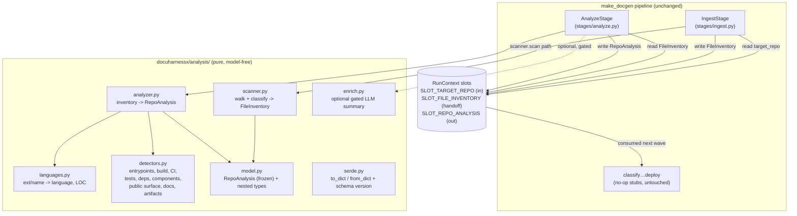

# Design Document

## Overview

**Purpose**: This feature delivers the first real work the DocuHarnessX pipeline
performs: a deterministic scan of a target repository that produces a structured
`RepoAnalysis`. It replaces the `ingest.py` and `analyze.py` no-op stage stubs
with real `Processor` stages.

**Users**: The `classification-coverage-planner` (Wave 1, spec #2) is the direct
consumer — it reads `RepoAnalysis` from the run context to decide which
documentation segments a project needs. The `dhx` CLI operator is the indirect
user; they see ingest/analyze participation and a scan summary in the
HarnessJournal.

**Impact**: Today `dhx <repo>` runs eight no-op stages that touch nothing. After
this spec, the first two stages read the repository at `SLOT_TARGET_REPO`, build a
bounded file inventory, and emit a frozen `RepoAnalysis` at a new
`SLOT_REPO_ANALYSIS` slot. The other six stages remain untouched no-op stubs. No
change is made to `make_docgen`, the stage registry ordering, or the `RunContext`
data seam beyond append-only additions.

### Goals

- Replace the Ingest and Analyze stubs in place with deterministic, model-free
  `Processor` stages that honor the single-stage-replaceability contract.
- Define `RepoAnalysis` as a **frozen, serializable, versioned** seam the planner
  consumes — designed for stability and additive evolution.
- Add `SLOT_REPO_ANALYSIS` to `types.py` append-only and a typed `RunContext`
  accessor pair, without changing any existing slot or accessor.
- Keep the analysis core unit-testable against fixtures and the reference repo
  (`/home/mc/Source/malware_hashes`) with byte-identical results across runs.
- Keep any LLM enrichment optional, gated, and incapable of altering the core.

### Non-Goals

- Mapping the analysis onto the ontology or deciding what to document (planner).
- Writing, reviewing, assembling, or deploying documentation.
- Deep/semantic parsing, AST call graphs, type inference, or cross-file symbol
  resolution. Public-surface detection is lightweight only.
- Remote/VCS fetching or multi-repo aggregation. The repo is already on local
  disk at `SLOT_TARGET_REPO`.

## Boundary Commitments

### This Spec Owns

- The `RepoAnalysis` data model and all its nested record types (the frozen seam),
  its schema version, and its deterministic serialize/deserialize.
- The deterministic scanning core: filesystem walk + inventory + classification +
  language/LOC + structure/entrypoints/build/CI/tests/deps/components/public-
  surface/docs/artifacts detection.
- The real bodies of `docuharnessx/stages/ingest.py` and
  `docuharnessx/stages/analyze.py` (replacing the no-op stubs in place).
- The new `SLOT_REPO_ANALYSIS` constant (added append-only to `types.py`) plus the
  inter-stage handoff slot for the raw file inventory.
- The optional, gated LLM enrichment hook and its placement inside `RepoAnalysis`.

### Out of Boundary

- `RunContext` structure, the existing slot keys, `StageName`/`STAGE_NAMES`, the
  stage base (`NoOpStage`/`PIPELINE_HOOK`), the stage registry ordering, and
  `make_docgen` — all owned by `harness-bundle-skeleton`. This spec extends them
  append-only and edits only the two target stage modules in place.
- The ontology (`Vocabulary`, `Segment`, `SegmentStore`, tags). The raw scan is
  ontology-agnostic; mapping the analysis onto the ontology is the planner's job.
- Any documentation-content generation, review, assembly, or deploy.

### Allowed Dependencies

- `docuharnessx.context.RunContext` (read `target_repo()`; add a `RepoAnalysis`
  accessor pair).
- `docuharnessx.types` (add `SLOT_REPO_ANALYSIS` append-only; reuse existing
  `SLOT_TARGET_REPO`).
- `docuharnessx.stages.base` (`NoOpStage` participation/journaling pattern,
  `PIPELINE_HOOK`).
- Python 3.12 standard library only for the deterministic core (`os`/`pathlib`,
  `tomllib`, `json`, `re`). No third-party parser dependency is required.
- HarnessX Control/Observe are inherited from the composed `make_docgen` config;
  this spec does not import the HarnessX composition surface directly (it lives
  behind the bundle).

### Revalidation Triggers

- Any change to the `RepoAnalysis` field set, nested record shapes, field meanings,
  serialized key names, or `REPO_ANALYSIS_SCHEMA_VERSION` → the planner spec must
  re-validate against the new contract.
- Any change to `SLOT_REPO_ANALYSIS` (key string, slot type) or to the
  `RunContext.repo_analysis()` / `set_repo_analysis()` signatures.
- Any change to the inter-stage inventory handoff slot that the Analyze stage
  relies on from the Ingest stage.
- A change to the stage class names / factory names / module paths of
  `ingest.py` / `analyze.py` (would break the stage registry imports).

## Architecture

### Existing Architecture Analysis

The Wave 0 foundation (merged to `main`) provides the seams this spec plugs into,
all verified against the real implementation:

- **`RunContext`** (`docuharnessx/context.py`) wraps a HarnessX `State` and offers
  typed slot accessors. Pattern to follow for the new accessor: `set_*` calls
  `state.set_slot(KEY, slot_type_tag, content)`; the getter routes through
  `_get_content(KEY)` which returns `slot.content` or `None` for an absent slot.
- **`types.py`** owns slot-key constants (`SLOT_TARGET_REPO`, `SLOT_OUTPUT_DIR`,
  `SLOT_SEGMENT_STORE`, `SLOT_VOCABULARY`) and `StageName`/`STAGE_NAMES`. It is
  owned by `harness-bundle-skeleton`; we ADD `SLOT_REPO_ANALYSIS` append-only and
  add it to `__all__`. **No** existing entry is touched.
- **Stage base** (`docuharnessx/stages/base.py`): `NoOpStage(MultiHookProcessor)`
  binds the runtime via `_bind_runtime`, attaches to `PIPELINE_HOOK = "step_end"`,
  and from `on_step_end` emits a `ProcessorTriggerEvent`
  (`action="stage_participated"`, `detail={"stage": name}`) then yields the
  `StepEndEvent` unchanged. `step_end` is content-free, so a stage cannot mutate
  generated content — the real stages do their work as a side effect (read the
  repo, populate slots) and still yield the event unchanged.
- **Stage registry** (`docuharnessx/stages/__init__.py`): `STAGES` lists
  `(StageName, factory)` in canonical order; `register_stages` appends each on
  `PIPELINE_HOOK` with increasing `order`. The registry imports `IngestStage`,
  `make_ingest_stage`, `AnalyzeStage`, `make_analyze_stage` from the two modules.
  We MUST keep those names and module paths so the registry needs no edit.
- **`make_docgen`** (`docuharnessx/bundle.py`): composes Control + stages +
  journal. We do not touch it. The Control cost/loop guards bound the run.

**Why work happens as a `step_end` side effect.** `StepEndEvent` carries no
message/content window, so stages cannot (and must not) modify generated content.
The real Ingest/Analyze stages therefore read inputs and write outputs through the
`RunContext` slots (a side effect), then yield the event unchanged — identical
lifecycle behavior to `NoOpStage`, just with real work and a richer journal
record. The stages reach the run `State` through the runtime bound at
`_bind_runtime` (the same handle `NoOpStage` already captures).

### Architecture Pattern & Boundary Map

Selected pattern: **deterministic pipeline-stage adapters over a pure scanning
core**. The two stages are thin adapters (HarnessX lifecycle + RunContext I/O +
journaling); all logic lives in a model-free, side-effect-free `analysis` core
package that takes a path / inventory and returns frozen value objects. This keeps
the core unit-testable without a harness and confines HarnessX coupling to the two
stage modules.



**Architecture Integration**:
- Selected pattern: pure-core + stage-adapter, deterministic by construction.
- Domain boundaries: scanning/analysis logic is isolated in `docuharnessx/analysis/`;
  only the two stage modules know about HarnessX. The model is a standalone seam.
- Existing patterns preserved: `NoOpStage` participation/journaling, module-level
  stage classes, append-don't-replace registry, RunContext slot I/O, append-only
  `types.py`.
- New components rationale: a separate `analysis/` package keeps the deterministic
  core testable without a harness and shields the planner-facing model from
  HarnessX changes.
- Steering compliance: deterministic + unit-testable core; LLM optional and gated;
  stages read/write via RunContext slots; vocabulary-agnostic (no hardcoded roles).

### Technology Stack

| Layer | Choice / Version | Role in Feature | Notes |
|-------|------------------|-----------------|-------|
| CLI / Pipeline | HarnessX stages on `PIPELINE_HOOK` | Drive ingest/analyze in the run | No model binding; inherited Control guards |
| Backend / Core | Python 3.12 stdlib (`pathlib`, `os`, `re`, `tomllib`, `json`) | Deterministic walk + parse + LOC | No third-party parser dependency |
| Data / Model | Frozen `@dataclass(frozen=True)` value objects | `RepoAnalysis` seam + serde | JSON-compatible, versioned |
| Optional enrichment | Bound model via HarnessX (gated) | Narrative architecture summary | Off by default; failure-tolerant |
| Observability | HarnessJournal (Observe) | Scan summary + skipped/limit events | Summary only, not full inventory |

## File Structure Plan

### Directory Structure
```
docuharnessx/
├── analysis/                  # NEW — pure, model-free scanning + analysis core
│   ├── __init__.py            # Public exports: scan, analyze, RepoAnalysis, serde fns
│   ├── model.py               # RepoAnalysis (frozen) + nested frozen record types + schema version
│   ├── serde.py               # to_dict / from_dict (deterministic, round-trip)
│   ├── scanner.py             # walk target repo -> FileInventory (binary/text, size, lang tag)
│   ├── languages.py           # deterministic extension/filename -> language + LOC counting
│   ├── detectors.py           # entrypoints, build/config, CI, tests, deps, components, public surface, docs, artifacts
│   ├── analyzer.py            # FileInventory -> RepoAnalysis (composes languages + detectors)
│   └── enrich.py              # OPTIONAL gated LLM enrichment (architecture summary); no-op when disabled
└── stages/
    ├── ingest.py              # MODIFIED — real IngestStage: read target_repo, scan, write FileInventory
    └── analyze.py             # MODIFIED — real AnalyzeStage: read inventory, analyze, write RepoAnalysis
```

### Modified Files
- `docuharnessx/types.py` — ADD `SLOT_REPO_ANALYSIS` and `SLOT_FILE_INVENTORY`
  constants (append-only) and add both to `__all__`. No existing line altered.
- `docuharnessx/context.py` — ADD `set_repo_analysis()` / `repo_analysis()` and
  `set_file_inventory()` / `file_inventory()` accessor pairs (append-only); import
  the two new slot keys. No existing accessor changed.
- `docuharnessx/stages/ingest.py` — REPLACE the no-op `IngestStage.on_step_end`
  body with the real scan; keep `STAGE_NAME`, `IngestStage`, `make_ingest_stage`.
- `docuharnessx/stages/analyze.py` — REPLACE the no-op `AnalyzeStage.on_step_end`
  body with the real analysis; keep `STAGE_NAME`, `AnalyzeStage`,
  `make_analyze_stage`.

> The six other stage modules and `stages/__init__.py` are NOT edited.

## System Flows

```mermaid
sequenceDiagram
    participant CLI as dhx CLI
    participant Run as Harness run loop
    participant Ing as IngestStage.on_step_end
    participant Ana as AnalyzeStage.on_step_end
    participant Core as analysis core
    participant RC as RunContext slots

    CLI->>RC: set_target_repo(path) (pre-run)
    Run->>Ing: step_end event
    Ing->>RC: target_repo()
    alt path missing / not a dir
        Ing-->>Run: raise IngestError (halt, clear cause)
    else valid
        Ing->>Core: scan(path, limits)
        Core-->>Ing: FileInventory (sorted, classified)
        Ing->>RC: set_file_inventory(inventory)
        Ing->>Run: journal stage_participated + scan summary; yield event
    end
    Run->>Ana: step_end event
    Ana->>RC: file_inventory()
    alt inventory missing
        Ana-->>Run: raise AnalyzeError (halt, clear cause)
    else present
        Ana->>Core: analyze(inventory)
        Core-->>Ana: RepoAnalysis (core, deterministic)
        opt enrichment enabled
            Ana->>Core: enrich(analysis, model)
            Core-->>Ana: RepoAnalysis + enrichment (or unchanged on failure)
        end
        Ana->>RC: set_repo_analysis(analysis)
        Ana->>Run: journal stage_participated + analysis summary; yield event
    end
```

Flow notes: Ingest and Analyze are separate stages so each is independently
swappable; the file inventory is the inter-stage handoff (Req 1.7). Both stages do
their work as a side effect of a content-free `step_end` event and then yield the
event unchanged. A scan/analysis error halts the run with an identifiable cause
(Req 8.4) rather than emitting a partial analysis. Enrichment is attempted only
when explicitly enabled and never blocks emission of the core analysis (Req 9.5).

## Requirements Traceability

| Requirement | Summary | Components | Interfaces | Flows |
|-------------|---------|------------|------------|-------|
| 1.1–1.7 | Walk repo, classified inventory, handoff | `scanner`, `IngestStage`, `RunContext` | `scan()`, `set_file_inventory()` | Ingest flow |
| 2.1–2.5 | Bounded/resilient scan | `scanner` (limits, binary, skips) | `scan(path, limits)` | Ingest flow |
| 3.1–3.5 | Language + LOC | `languages` | `detect_language()`, `count_loc()` | Analyze flow |
| 4.1–4.6 | Structure/entrypoints/build/CI/tests | `detectors`, `analyzer` | `analyze()` | Analyze flow |
| 5.1–5.6 | Deps/components/public surface/docs/artifacts | `detectors`, `analyzer` | `analyze()` | Analyze flow |
| 6.1–6.6 | Frozen versioned serializable model | `model`, `serde` | `to_dict()`/`from_dict()` | — |
| 7.1–7.5 | SLOT_REPO_ANALYSIS + accessor | `types`, `context` | `set/get repo_analysis` | both flows |
| 8.1–8.5 | Stage replacement, contract preserved | `IngestStage`, `AnalyzeStage` | factories/classes unchanged | both flows |
| 9.1–9.5 | Deterministic core, optional enrichment | `analyzer`, `enrich` | `analyze()`, `enrich()` | Analyze flow |
| 10.1–10.3 | Journal summary, bounded trace | both stages | journal `detail` | both flows |

## Components and Interfaces

| Component | Domain/Layer | Intent | Req Coverage | Key Dependencies (P0/P1) | Contracts |
|-----------|--------------|--------|--------------|--------------------------|-----------|
| `model` | Data | Frozen `RepoAnalysis` seam + nested types + version | 6 | none (P0: stdlib) | State |
| `serde` | Data | Deterministic to_dict/from_dict | 6 | `model` (P0) | Batch |
| `scanner` | Core | Walk -> classified `FileInventory` | 1, 2 | `model` (P0), `languages` (P1) | Service |
| `languages` | Core | ext/name -> language; LOC | 3 | none (P0) | Service |
| `detectors` | Core | structure/entrypoints/build/CI/tests/deps/components/public/docs/artifacts | 4, 5 | `model` (P0) | Service |
| `analyzer` | Core | `FileInventory` -> `RepoAnalysis` | 3, 4, 5, 9 | `languages`, `detectors`, `model` (P0) | Service |
| `enrich` | Core (gated) | optional LLM architecture summary | 9 | bound model (P1) | Service |
| `IngestStage` | Stage adapter | scan + publish inventory | 1, 8, 10 | `scanner`, `RunContext` (P0) | State |
| `AnalyzeStage` | Stage adapter | analyze + publish RepoAnalysis | 4–10 | `analyzer`, `enrich`, `RunContext` (P0) | State |

### Data Layer

#### `model` — RepoAnalysis (the frozen seam)

| Field | Detail |
|-------|--------|
| Intent | The stable, immutable, versioned contract the planner consumes |
| Requirements | 6.1, 6.2, 6.3, 6.6 |

**Responsibilities & Constraints**
- All types are `@dataclass(frozen=True)`. Collections are exposed as `tuple[...]`
  (never `list`) so instances are deeply immutable and hashable-friendly (Req 6.2).
- `REPO_ANALYSIS_SCHEMA_VERSION: int = 1` is the single version authority (Req 6.3),
  carried on `RepoAnalysis.schema_version`.
- Field names/meanings are stable; evolution is additive (new optional fields with
  defaults) and bumps the version only when the frozen field set changes (Req 6.6).
- Deterministic by construction: every collection is built pre-sorted by the
  analyzer; the model performs no sorting itself.

**State Management**
- State model: a single aggregate root `RepoAnalysis` with nested frozen records.
- Persistence: none here — serialization is in `serde`; runtime placement is in
  the `SLOT_REPO_ANALYSIS` slot.

**The frozen seam (the planner consumes EXACTLY this):**

```python
REPO_ANALYSIS_SCHEMA_VERSION: int = 1

@dataclass(frozen=True)
class LanguageStat:
    language: str          # canonical language name, e.g. "Go", "Python", "Markdown", "Other"
    files: int             # number of files attributed to this language
    loc: int               # total lines of code across those files

@dataclass(frozen=True)
class DirectorySummary:
    path: str              # repo-relative POSIX path, "" for repo root
    file_count: int        # files directly + transitively under this directory
    dominant_language: str # most-LOC language under this directory, or "Other"
    role: str              # heuristic role: "source"|"tests"|"docs"|"config"|"ci"|"build"|"other"

@dataclass(frozen=True)
class Entrypoint:
    path: str              # repo-relative POSIX path
    kind: str              # "main"|"cli"|"script"|"console_script"|"package_bin"|"other"
    name: str              # symbolic name where known (e.g. console-script name), else ""

@dataclass(frozen=True)
class BuildFile:
    path: str              # repo-relative POSIX path
    kind: str              # "pyproject"|"requirements"|"go_mod"|"package_json"|"makefile"|"dockerfile"|"lockfile"|"other"

@dataclass(frozen=True)
class CIWorkflow:
    path: str              # repo-relative POSIX path
    provider: str          # "github_actions"|"gitlab_ci"|"circleci"|"dagger"|"other"

@dataclass(frozen=True)
class TestLayout:
    present: bool          # whether any tests were detected
    frameworks: tuple[str, ...]  # detected frameworks, e.g. ("go_testing","pytest"); sorted
    paths: tuple[str, ...]       # representative test files/dirs (repo-relative); sorted

@dataclass(frozen=True)
class Dependency:
    name: str              # declared dependency name
    version_spec: str      # raw declared version/constraint, or "" if none
    source: str            # repo-relative path of the manifest it came from
    scope: str             # "runtime"|"dev"|"build"|"unknown"

@dataclass(frozen=True)
class Component:
    name: str              # module/package name derived from structure
    path: str              # repo-relative POSIX path
    representative_files: tuple[str, ...]  # small sorted set of repo-relative files

@dataclass(frozen=True)
class PublicSymbol:
    name: str              # symbol or CLI flag/subcommand name
    kind: str              # "cli_flag"|"cli_subcommand"|"exported_symbol"
    source: str            # repo-relative path where detected

@dataclass(frozen=True)
class DocPresence:
    has_readme: bool
    readme_paths: tuple[str, ...]   # sorted repo-relative README paths
    doc_dirs: tuple[str, ...]       # sorted repo-relative doc directories
    other_docs: tuple[str, ...]     # sorted other recognized doc files

@dataclass(frozen=True)
class Artifact:
    path: str              # repo-relative POSIX path
    kind: str              # "license"|"dockerfile"|"schema"|"generated"|"other"

@dataclass(frozen=True)
class ScanStats:
    files_scanned: int
    files_skipped: int      # unreadable / excluded-at-entry
    bytes_scanned: int
    limit_reached: bool     # True if any configured scan limit stopped further detail
    notes: tuple[str, ...]  # sorted human-readable scan notes (e.g. partial-parse, skip reasons)

@dataclass(frozen=True)
class Enrichment:
    architecture_summary: str   # narrative summary; "" when enrichment disabled/failed
    model_id: str               # id of the model that produced it, or ""

@dataclass(frozen=True)
class RepoAnalysis:
    schema_version: int                       # == REPO_ANALYSIS_SCHEMA_VERSION
    repo_path: str                            # absolute path scanned (for provenance)
    languages: tuple[LanguageStat, ...]       # sorted: LOC desc, then language asc
    primary_languages: tuple[str, ...]        # languages tied for max LOC, sorted asc
    total_loc: int
    total_files: int
    structure: tuple[DirectorySummary, ...]   # sorted by path asc
    entrypoints: tuple[Entrypoint, ...]       # sorted by (path, kind)
    build_files: tuple[BuildFile, ...]        # sorted by path
    ci_workflows: tuple[CIWorkflow, ...]      # sorted by path
    tests: TestLayout
    dependencies: tuple[Dependency, ...]      # sorted by (source, name)
    components: tuple[Component, ...]         # sorted by path
    public_surface: tuple[PublicSymbol, ...]  # sorted by (source, kind, name)
    docs: DocPresence
    artifacts: tuple[Artifact, ...]           # sorted by path
    scan_stats: ScanStats
    enrichment: Enrichment | None = None      # None when enrichment disabled (Req 9.4)
```

> Every collection field documents its deterministic sort order. The analyzer is
> responsible for producing pre-sorted tuples so that two runs over an unchanged
> repo yield equal objects (Req 6.4, 9.1).

#### `serde` — deterministic serialization

| Field | Detail |
|-------|--------|
| Intent | JSON-compatible, byte-stable serialize + round-trip deserialize |
| Requirements | 6.4, 6.5 |

##### Service Interface
```python
def to_dict(analysis: RepoAnalysis) -> dict: ...     # ordered, JSON-compatible
def from_dict(data: dict) -> RepoAnalysis: ...        # reconstructs an equal RepoAnalysis
def to_json(analysis: RepoAnalysis) -> str: ...       # json.dumps(to_dict, sort_keys=True, ensure_ascii=False)
```
- Preconditions: `from_dict` requires a `schema_version` it understands; an
  unknown version raises `RepoAnalysisVersionError` (Req 6.3, 6.6).
- Postconditions: `from_dict(to_dict(a)) == a` for any `RepoAnalysis a` (Req 6.5).
  `to_json` is byte-identical across runs for equal inputs (Req 6.4).
- Invariants: tuples serialize to JSON arrays preserving the analyzer's sort order;
  `None` enrichment serializes to `null`. No nondeterministic dict iteration —
  keys are emitted via `dataclasses.fields` order and `sort_keys=True` in JSON.

### Core Layer

#### `scanner` — repository walk and inventory

| Field | Detail |
|-------|--------|
| Intent | Walk the repo into a bounded, classified, deterministically-sorted inventory |
| Requirements | 1.1–1.7, 2.1–2.5 |

##### Service Interface
```python
@dataclass(frozen=True)
class FileEntry:
    path: str          # repo-relative POSIX path
    size: int          # bytes
    is_binary: bool
    language: str      # detected language/file-type tag, "Other" when unknown
    loc: int           # line count for text files within size limit, else 0
    read_truncated: bool  # True if size exceeded max-read and content was not fully read

@dataclass(frozen=True)
class FileInventory:
    repo_path: str
    entries: tuple[FileEntry, ...]   # sorted by path asc
    stats: ScanStats

@dataclass(frozen=True)
class ScanLimits:
    max_file_bytes: int = 1_000_000      # per-file read cap (Req 2.2)
    max_total_files: int = 50_000        # inventory cap (Req 2.3)
    max_total_bytes: int = 500_000_000   # total scanned-bytes cap (Req 2.3)
    excluded_dirs: frozenset[str] = DEFAULT_EXCLUDED_DIRS  # .git, node_modules, vendor, .venv, __pycache__, dist, build, target, .idea

def scan(repo_path: str, limits: ScanLimits = ScanLimits()) -> FileInventory: ...
```
- Preconditions: `repo_path` exists and is a directory; otherwise the caller
  (`IngestStage`) raises `IngestError` before calling (Req 1.2).
- Postconditions: `entries` is sorted by path; binary files have `loc == 0`
  (Req 2.1); over-limit files are present but `read_truncated=True`, `loc == 0`
  (Req 2.2); when a total limit trips, `stats.limit_reached=True` and the walk
  stops adding detail but still returns a well-formed inventory (Req 2.3).
- Invariants: never follows symlinks outside root (`os.walk(followlinks=False)`,
  plus a realpath-within-root guard) (Req 1.5); unreadable entries are counted in
  `stats.files_skipped` with a note, never raised (Req 1.5); empty dirs / zero-byte
  / extensionless / unknown files classify as `language="Other"` without error
  (Req 2.4). No network access (Req 2.5).

**Implementation Notes**
- Binary detection: read a bounded head sample (e.g. first 8 KiB); classify binary
  if it contains a NUL byte or fails UTF-8/Latin-1 decode heuristics. Deterministic.
- LOC: count newline-terminated lines on text files within the read cap; a final
  unterminated line counts as one line. Pure function of bytes.

#### `languages` — language detection and LOC mapping

| Field | Detail |
|-------|--------|
| Intent | Deterministic extension/filename -> canonical language; per-language aggregation |
| Requirements | 3.1–3.5 |

##### Service Interface
```python
def detect_language(rel_path: str) -> str: ...   # extension + special-filename table; "Other" fallback
def aggregate_languages(entries: Iterable[FileEntry]) -> tuple[tuple[LanguageStat, ...], tuple[str, ...]]:
    ...  # returns (sorted language stats, primary languages)
```
- A frozen mapping table (e.g. `.go->Go`, `.py->Python`, `.ts->TypeScript`,
  `.md->Markdown`, `Dockerfile->Dockerfile`, `Makefile->Makefile`). Unknown ->
  `"Other"` (Req 3.4). Aggregation sorts by LOC desc then name asc; primary =
  all languages tied at max LOC (Req 3.3). Pure, deterministic (Req 3.5).

#### `detectors` — signal extraction

| Field | Detail |
|-------|--------|
| Intent | Deterministic detection of structure, entrypoints, build/CI/tests, deps, components, public surface, docs, artifacts |
| Requirements | 4.1–4.6, 5.1–5.6 |

##### Service Interface (one function per concern; all pure)
```python
def summarize_structure(inv: FileInventory) -> tuple[DirectorySummary, ...]: ...
def detect_entrypoints(inv: FileInventory) -> tuple[Entrypoint, ...]: ...
def detect_build_files(inv: FileInventory) -> tuple[BuildFile, ...]: ...
def detect_ci(inv: FileInventory) -> tuple[CIWorkflow, ...]: ...
def detect_tests(inv: FileInventory) -> TestLayout: ...
def extract_dependencies(inv: FileInventory, repo_path: str) -> tuple[Dependency, ...]: ...
def map_components(inv: FileInventory) -> tuple[Component, ...]: ...
def detect_public_surface(inv: FileInventory, repo_path: str) -> tuple[PublicSymbol, ...]: ...
def detect_docs(inv: FileInventory) -> DocPresence: ...
def detect_artifacts(inv: FileInventory) -> tuple[Artifact, ...]: ...
```
- Build/CI/tests/docs/artifacts use filename/path pattern tables that recognize
  nested sub-projects (e.g. both root `go.mod` and `.dagger/go.mod`; `.github/
  workflows/*`; `*_test.go`; `tests/`/`test_*.py`) (Req 4.3–4.5, 5.4, 5.5).
- Dependency extraction reads recognized manifests with stdlib parsers
  (`tomllib` for `pyproject.toml`; line parse for `go.mod` `require` blocks and
  `requirements*.txt`; `json` for `package.json`). A malformed/partial manifest
  yields what is parseable, plus a `scan_stats.notes` "partially parsed" marker —
  it never aborts (Req 5.6).
- Public surface is lightweight only: CLI flags/subcommands via shallow regex on
  argparse/flag declarations; exported symbols via cheap signals (e.g. Go
  capitalized top-level `func`/`type`, Python `__all__`). Anything needing real
  AST/semantic analysis is omitted (Req 5.3).
- Components are derived from directory/package structure (top-level packages and
  significant sub-packages), each with a small sorted representative-file set
  (Req 5.2).

**Implementation Notes**
- Risks: over-eager public-surface regex producing noise — mitigated by keeping
  detection conservative and omitting on doubt (Req 5.3). All detector outputs are
  sorted before return so the analyzer never re-sorts.

#### `analyzer` — inventory to RepoAnalysis

| Field | Detail |
|-------|--------|
| Intent | Compose languages + detectors into a single deterministic `RepoAnalysis` |
| Requirements | 3, 4, 5, 9.1, 9.2 |

##### Service Interface
```python
def analyze(inv: FileInventory) -> RepoAnalysis: ...   # core, model-free, deterministic
```
- Postconditions: returns a fully-populated core `RepoAnalysis` with
  `enrichment=None`; empty detection categories are present as empty tuples
  (Req 4.6); identical across repeated runs (Req 9.1, 9.2). No model, no network.

#### `enrich` — optional gated LLM enrichment

| Field | Detail |
|-------|--------|
| Intent | Add a narrative architecture summary when explicitly enabled, never gating the core |
| Requirements | 9.3, 9.4, 9.5 |

##### Service Interface
```python
def enrich(analysis: RepoAnalysis, *, model=None, enabled: bool = False, timeout_s: float = 30.0) -> RepoAnalysis:
    ...  # returns a copy with enrichment set, or the unchanged analysis
```
- When `enabled is False` or `model is None`: returns the input unchanged
  (`enrichment=None`) — not an error (Req 9.4).
- When enabled and successful: returns `dataclasses.replace(analysis,
  enrichment=Enrichment(...))`; the deterministic core fields are untouched
  (Req 9.3).
- On failure/timeout: logs, returns the input unchanged, run continues (Req 9.5).
- Enrichment is off by default; the gate is a stage-level flag (no env-driven
  hidden behavior). The bound model, if any, is obtained from the runtime — the
  core never imports a model.

### Stage Adapter Layer

#### `IngestStage` (replaces the stub in `stages/ingest.py`)

| Field | Detail |
|-------|--------|
| Intent | Read target repo, run `scan`, publish `FileInventory`, journal a summary |
| Requirements | 1.1, 1.2, 1.7, 8.1–8.5, 10.1–10.3 |

**Responsibilities & Constraints**
- Subclasses `NoOpStage`; keeps `stage_name="ingest"`, class name `IngestStage`,
  factory `make_ingest_stage`, module path unchanged (Req 8.1).
- `on_step_end`: read `RunContext(state).target_repo()`; if unset/missing/not a
  directory raise `IngestError(path)` (Req 1.2, 8.4); else `scan()` and
  `set_file_inventory(...)`; emit the participation `ProcessorTriggerEvent` plus a
  bounded summary detail (`{stage, files, primary_language, limit_reached}`), then
  yield the event unchanged (Req 8.2, 8.3, 10.1, 10.3).
- Reaches the run `State` via the runtime bound at `_bind_runtime` (same handle the
  base captures); wraps it in a `RunContext`.

**Contracts**: State [x]

#### `AnalyzeStage` (replaces the stub in `stages/analyze.py`)

| Field | Detail |
|-------|--------|
| Intent | Read inventory, run `analyze`, optional `enrich`, publish `RepoAnalysis`, journal a summary |
| Requirements | 4–10 |

**Responsibilities & Constraints**
- Subclasses `NoOpStage`; keeps `stage_name="analyze"`, class name `AnalyzeStage`,
  factory `make_analyze_stage`, module path unchanged (Req 8.1).
- `on_step_end`: read `file_inventory()`; if missing raise `AnalyzeError`
  (Req 8.4); else `analyze(inv)`; optionally `enrich(...)` (gated, failure-tolerant,
  Req 9.3–9.5); `set_repo_analysis(analysis)`; emit participation + bounded
  analysis summary detail (`{stage, total_loc, primary_languages, components,
  enriched}`), then yield the event unchanged (Req 7.2, 8.2, 8.3, 10.1, 10.3).

**Contracts**: State [x]

### Harness Integration Layer (extensions to skeleton-owned files)

#### `types.py` additions (append-only)
```python
#: Slot key for the inter-stage file inventory handoff (Ingest -> Analyze).
SLOT_FILE_INVENTORY: str = "docuharnessx.file_inventory"

#: Slot key for the RepoAnalysis produced by the Analyze stage (frozen seam).
SLOT_REPO_ANALYSIS: str = "docuharnessx.repo_analysis"
```
- Both appended after the existing constants and added to `__all__`. No existing
  constant, `StageName`, or `STAGE_NAMES` entry is modified (Req 7.1). Flagged as a
  **shared-seam extension** of a `harness-bundle-skeleton`-owned module.

#### `context.py` additions (append-only)
```python
def set_file_inventory(self, inv) -> None: ...
def file_inventory(self): ...        # None when unset
def set_repo_analysis(self, analysis) -> None: ...
def repo_analysis(self):             # None when unset (Req 7.4)
    return self._get_content(SLOT_REPO_ANALYSIS)
```
- Mirror the existing accessor style (slot-type tag + `_get_content`). No existing
  accessor signature/behavior changes (Req 7.3, 7.5).

## Error Handling

### Error Strategy
A small stage-scoped error hierarchy in `docuharnessx/analysis/` (e.g.
`AnalysisError` base; `IngestError`, `AnalyzeError`, `RepoAnalysisVersionError`).
Stage-level fatal conditions (missing/invalid repo path, missing inventory)
**halt the run with an identifiable cause** (Req 8.4). In-scan recoverable
conditions (unreadable file, partial manifest, limit reached) are **absorbed**:
recorded in `ScanStats.notes`/counters and surfaced in the journal, never raised
(Req 1.5, 2.3, 5.6).

### Error Categories and Responses
- **Input errors** (fatal): repo slot unset, path missing / not a directory →
  `IngestError`; inventory slot unset at Analyze → `AnalyzeError`. Clear message
  naming the offending slot/path; halts the run (no partial `RepoAnalysis`).
- **System/scan errors** (absorbed): per-entry `OSError`/decode failure →
  skip + count + note; per-file/total limit → `limit_reached=True` + note +
  well-formed analysis.
- **Business/contract errors**: unknown `schema_version` on `from_dict` →
  `RepoAnalysisVersionError` (Req 6.3, 6.6).
- **Enrichment errors** (absorbed): any exception/timeout in `enrich` → log, omit
  enrichment, continue (Req 9.5).

### Monitoring
The HarnessJournal records, per stage, the participation trigger plus a bounded
summary detail (counts, primary language(s), `limit_reached`, `enriched`). The
full inventory is **never** written to the trace (Req 10.3). Scan notes
(skips, partial parses, limits) are summarized in the analysis summary so they are
auditable post-run (Req 10.2).

## Testing Strategy

### Unit Tests
- `languages.detect_language` / `aggregate_languages`: extension/special-filename
  mapping, `"Other"` fallback, LOC-desc + name-asc ordering, primary-language ties
  (Req 3.1–3.5).
- `scanner.scan` on crafted fixtures: excluded dirs not descended; symlink-escape
  not followed; binary vs text classification; over-size file truncated
  (`loc==0`, `read_truncated=True`); total-limit trips `limit_reached`; empty
  dirs / zero-byte / extensionless handled (Req 1.3–1.6, 2.1–2.4).
- `serde` round-trip: `from_dict(to_dict(a)) == a`; `to_json` byte-stable for equal
  inputs; unknown `schema_version` raises `RepoAnalysisVersionError` (Req 6.4–6.6).
- `detectors`: nested manifests (root + `.dagger/go.mod`), GitHub Actions + Dagger
  CI, `*_test.go` test detection, malformed `pyproject.toml` partial-parse note,
  conservative public-surface extraction (Req 4.3–4.5, 5.1, 5.3, 5.6).

### Integration Tests
- `analyzer.analyze` over a fixture tree: full `RepoAnalysis` populated, empty
  categories present as empty tuples, two runs equal (Req 4.6, 9.1, 9.2).
- `IngestStage` + `AnalyzeStage` driven via `on_step_end` against a `State`:
  inventory then `RepoAnalysis` appear in the slots; missing repo → `IngestError`;
  missing inventory → `AnalyzeError`; participation triggers emitted (Req 1.7,
  7.2, 8.3, 8.4).
- `enrich` gating: disabled → `enrichment is None`, core unchanged; simulated
  failure → core still emitted, enrichment omitted (Req 9.3–9.5).
- Stage registry/`make_docgen` smoke: `make_docgen()` still composes; `STAGES`
  order unchanged; the six other stages remain no-ops (Req 8.1, 8.2).

### Reference-Repo Tests
- Run `analyze` against `/home/mc/Source/malware_hashes`: assert primary language
  is `Go`, both `go.mod` files detected, GitHub Actions CI detected, `*_test.go`
  tests present, README detected, deterministic across two runs (Req 3.3, 4.3–4.5,
  9.2).

## Optional Sections

### Performance & Scalability
- Targets the 25–40k LOC range; the reference repo is ~2.9k LOC Go. Bounded by
  `ScanLimits` (per-file read cap, total files, total bytes) so a pathological repo
  cannot exhaust memory (Req 2.2, 2.3). A single bounded head-read per file for
  binary detection; LOC counts stream bytes within the read cap. The run is also
  bounded by the inherited HarnessX Control cost/loop guards (Req 2.5).
