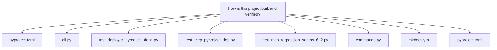
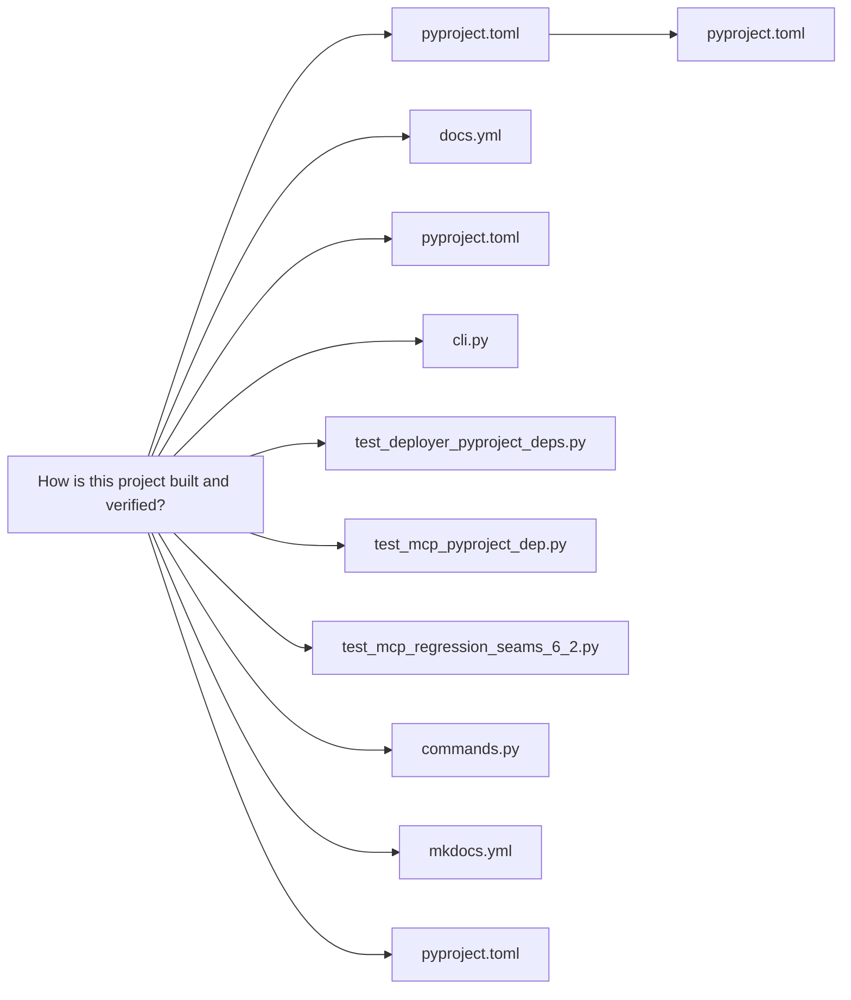
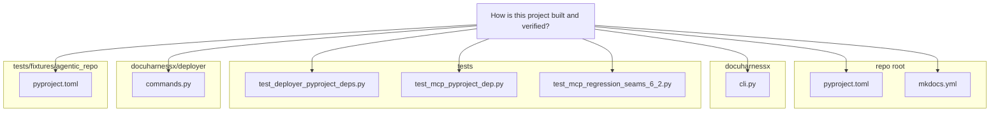

# How is this project built and verified?

# How DocuHarnessX is built and verified

## Packaging: a `hatchling`-built wheel with a pinned direct-URL dependency

`pyproject.toml` is the single build manifest. The build backend is declared at `pyproject.toml:35-37` as `requires = ["hatchling"]` with `build-backend = "hatchling.build"`, and the wheel target packs only the `docuharnessx` package via `[tool.hatch.build.targets.wheel] packages = ["docuharnessx"]` (`pyproject.toml:43-44`). Because the manifest carries a direct-URL dependency — `harnessx @ https://github.com/Darwin-Agent/HarnessX/archive/bf5f199ee65034d55db0c536e582f1e7c8abf669.tar.gz` at `pyproject.toml:11` — `[tool.hatch.metadata] allow-direct-references = true` (`pyproject.toml:39-41`) is required, as the inline comment there explains: HarnessX "is not on PyPI and has no GitHub tags/releases," so a commit archive is pinned instead of a version specifier.

The project requires `>=3.12` (`pyproject.toml:5`) and declares its runtime dependencies with rationale comments: `pyyaml>=6.0` for the optional `--config` file and ontology YAML seam, `python-dotenv>=1.0` for loading the project `.env` at CLI start, `mkdocs>=1.6` and `mkdocs-material>=9.5` because the assembler emits a buildable MkDocs tree and the deploy stage runs `mkdocs build`, and `mcp>=1.28,<2` pinned below v2 because "v2 rewrites that low-level API" (`pyproject.toml:6-24`).

The installable command surface is the console script `dhx = "docuharnessx.cli:main"` (`pyproject.toml:32-33`). `docuharnessx/cli.py` is the CLI boundary: `main` drives the `run` pipeline via `orchestrate_run`/`run_pipeline`, `init` scaffolds ontology, and `mcp` launches the stdio refine server (`docuharnessx/cli.py:1-7`). Scaffold tests pin this contract — `test_package_scaffold.py:36-41` reads `importlib.metadata.entry_points(group="console_scripts")` and asserts `names["dhx"] == "docuharnessx.cli:main"`, and `test_dhx_help_exits_zero` (`test_package_scaffold.py:44-50`) asserts `dhx --help` exits 0 via `argparse`.

## Verification: pytest against the `tests/` tree, including pyproject contract tests

The dev toolchain is declared in `[project.optional-dependencies] dev = ["pytest>=8.0"]` (`pyproject.toml:28-30`), and `[tool.pytest.ini_options] testpaths = ["tests"]` (`pyproject.toml:46-47`) tells pytest where to look. The test suite is large (over 150 test modules under `tests/`, covering `cli`, `analysis`, `planning`, `composition`, `assembler`, `deployer`, `mcp`, `review`, and `ontology` subpackages).

Several tests verify the pyproject itself by parsing it with `tomllib`:

- `tests/test_deployer_pyproject_deps.py:52-57` (`test_mkdocs_dependency_declared`) asserts `mkdocs` and `mkdocs-material` appear in `data["project"]["dependencies"]`; `test_mkdocs_dependency_declared_once_idempotent` (`tests/test_deployer_pyproject_deps.py:60-67`) checks each is declared exactly once, and `test_mkdocs_cli_is_invocable` (`tests/test_deployer_pyproject_deps.py:90-102`) runs `python -m mkdocs --version` and requires exit code 0.
- `tests/test_mcp_pyproject_dep.py:64-104` parses the same section and asserts the `mcp` requirement carries a `>=1.28` floor and a `<2` upper bound via `packaging.requirements.Requirement`, then verifies `mcp.server` imports against the declared floor (`tests/test_mcp_pyproject_dep.py:118-123`).

I ran the suite in the checked-in `.venv` (Python 3.12.3, pytest 9.1.1): `2169 passed, 2 skipped, 1 failed`. The single failure is not a code defect but the git-diff-boundary regression test `test_frozen_seams_stages_assembler_resolver_not_in_diff` (`tests/test_mcp_regression_seams_6_2.py:166`), which asserts that no frozen-seam / stage / assembler / model-resolver module appears in the working-tree diff against `HEAD`. This snapshot's working tree carries uncommitted Mermaid-diagram work that touches `docuharnessx/assembler/home.py` and `docuharnessx/assembler/pages.py` (the new `docuharnessx/assembler/graphs.py` and `tests/test_assembler_graphs.py` are untracked), so the diff-boundary check fires; the module's own docstring says the diff checks "degrade to skips (never false failures) when the test tree is not a git checkout" (`tests/test_mcp_regression_seams_6_2.py:32-33`). The other 2169 tests pass, including the package-scaffold, pyproject-contract, assembler/deployer e2e, and MCP tests.

## CI and docs build: `mkdocs build --strict` → GitHub Pages

The repository's own docs are built and published by `.github/workflows/docs.yml`, which triggers on `push` to `main` and `workflow_dispatch` (`docs.yml:2-6`). The `build` job runs on `ubuntu-latest`, checks out with `actions/checkout@v4`, sets up Python `'3.12'` with `actions/setup-python@v5`, installs `mkdocs-material` via pip, then runs `mkdocs build --strict` (`docs.yml:15-26`) and uploads the resulting `site` directory with `actions/upload-pages-artifact@v3` (`docs.yml:27-30`). The `deploy` job `needs: build`, targets the `github-pages` environment, and deploys with `actions/deploy-pages@v4` (`docs.yml:31-40`).

That workflow is not hand-written: it is the deterministic output of `render_pages_workflow` in `docuharnessx/deployer/workflow.py`, whose module constants match the checked-in YAML exactly — `_CHECKOUT_REF = "actions/checkout@v4"` and `_SETUP_PYTHON_REF = "actions/setup-python@v5"` (`workflow.py:56-57`), `_UPLOAD_PAGES_ARTIFACT_REF = "actions/upload-pages-artifact@v3"` and `_DEPLOY_PAGES_REF = "actions/deploy-pages@v4"` (`workflow.py:58-59`), `_PIP_INSTALL_CMD` with `mkdocs-material` (`workflow.py:71`), `_BUILD_CMD = "mkdocs build --strict"` (`workflow.py:76`), `_PAGES_ARTIFACT_PATH = "site"` (`workflow.py:79`), and `_PAGES_ENVIRONMENT = "github-pages"` (`workflow.py:66`). The renderer is described as "pure ... emits byte-identical YAML for equal inputs" (`workflow.py:23-24`) and is serialized with `yaml.safe_dump(..., sort_keys=False)` for byte-stability (`workflow.py:32-35`). The deploy stage's subprocess boundary is `run_mkdocs_build` in `docuharnessx/deployer/commands.py`, which shells out via the mockable `CommandRunner` protocol and raises `DeployError` on a non-zero exit (`docuharnessx/deployer/commands.py:22-26`).

The repo's own `mkdocs.yml` is the assembled config that build consumes — theme `material`, nav entries generated per question, and a mermaid `custom_fence` via `pymdownx.superfences` (`mkdocs.yml:36-52`). I confirmed the build passes: `.venv/bin/mkdocs build --strict` exits 0 in this tree, and `.venv/bin/dhx --help` lists the `run`, `init`, and `mcp` subcommands.

## The fixture manifest: a portable, scripted-agent test repo

`tests/fixtures/agentic_repo/pyproject.toml` is a deliberately crafted manifest, not a real package: it makes the fixture "read like a small but realistic Python project" for the scripted fake-agent provider, and is "deliberately self-contained and PORTABLE — it pins no machine-specific absolute path" (`tests/fixtures/agentic_repo/pyproject.toml:1-8`). It uses `setuptools>=61` with `build-backend = "setuptools.build_meta"` (`tests/fixtures/agentic_repo/pyproject.toml:10-12`), names the project `agentic-fixture-app` (`:15`), and declares the console script `fixture-app = "app:main"` (`:20-21`). The comment instructs keeping `app.py` / `engine.py` / `config.py` stable "do not move their symbols" (`tests/fixtures/agentic_repo/pyproject.toml:7-8`) — because `tests/test_fixture_agentic_repo.py` pins exact citations: `_CITED_SYMBOLS` requires, for example, that `app.py:11` contains `class Application` and `app.py:17` contains `def run` (`tests/test_fixture_agentic_repo.py:50-55`), and `test_fixture_repo_carries_no_machine_specific_absolute_paths` rejects any `/home/` path in the fixture to keep it deterministic across CI machines (`tests/test_fixture_agentic_repo.py:132-143`).

## Bottom line

Building is declarative: `hatchling` builds a wheel of the `docuharnessx` package with `allow-direct-references` so the unpublishable pinned `harnessx` commit archive installs reproducibly, and the `dhx` console script is the published entry point. Verification is pytest over `tests/` (`pytest>=8.0`, `testpaths = ["tests"]`), including tomllib-based contract tests that re-parse `pyproject.toml`'s dependency section, plus a `mkdocs build --strict`-based docs build that CI runs on push to `main` and publishes to GitHub Pages — a workflow the project renders deterministically from `render_pages_workflow`. In the current snapshot the suite is `2169 passed, 2 skipped`, with the sole failure being the diff-boundary regression test triggered by uncommitted working-tree changes, not by a code-path failure.
