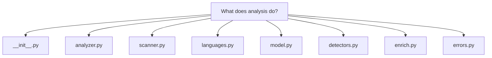
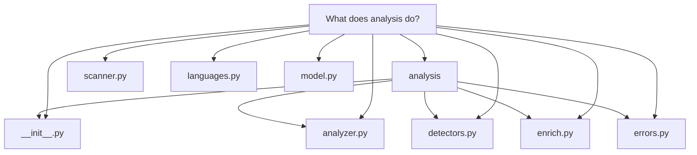

# What does analysis do?

The five evidence files plus the directly-referenced `model.py`, `scanner.py`, and `languages.py` give a complete picture. Here is the finished Markdown body.

---

# What `docuharnessx.analysis` does

`docuharnessx.analysis` is the **pure, model-free repository scanning + analysis core** of DocuHarnessX. Its own package docstring describes it as "the deterministic, side-effect-free core that turns a target repository on local disk into a frozen `RepoAnalysis`" (`docuharnessx/analysis/__init__.py:1`), and stresses that it is stdlib-only, harness-free, and unit-testable without any model — only the stage adapters in `docuharnessx/stages/ingest.py` and `docuharnessx/stages/analyze.py` know about HarnessX (`docuharnessx/analysis/__init__.py:5-7`).

## The pipeline: scan → aggregate → freeze

The core is a three-part composition whose single entry point is `analyze(inv: FileInventory) -> RepoAnalysis` (`docuharnessx/analysis/analyzer.py:84`).

1. **Scan** — `scan(repo_path, limits)` in `docuharnessx/analysis/scanner.py:318` walks a real directory with `os.walk(followlinks=False)`, pruning `limits.excluded_dirs` (e.g. `.git`, `node_modules`, `.venv`; `docuharnessx/analysis/scanner.py:60`), enforcing per-file/total-file/total-byte caps via `ScanLimits` (`docuharnessx/analysis/scanner.py:92`), and emitting a bounded, deterministically-sorted `FileInventory` whose `FileEntry` records carry `path`, `size`, `is_binary`, a coarse `language` tag, `loc`, and a `read_truncated` flag (`docuharnessx/analysis/scanner.py:110-128`). Unreadable files are counted in `ScanStats.files_skipped` with a note, never raised (`docuharnessx/analysis/scanner.py:378-381`).

2. **Aggregate / detect** — the analyzer feeds that inventory through the language layer and every detector. `aggregate_languages(entries)` (`docuharnessx/analysis/analyzer.py:110`) produces the per-language `LanguageStat` records and the `primary_languages` tuple; the module docstring of `docuharnessx/analysis/languages.py:17-21` pins their order "by LOC descending then language name ascending."

3. **Freeze** — the results are slotted into a frozen `RepoAnalysis` aggregate (`docuharnessx/analysis/analyzer.py:142-161`), carrying `schema_version` (`REPO_ANALYSIS_SCHEMA_VERSION = 1`, `docuharnessx/analysis/model.py:56`), `repo_path`, every detection category, `scan_stats`, and `enrichment=None`. All collection types in `model.py` are `@dataclass(frozen=True)` with tuple fields, so `RepoAnalysis` is deeply immutable (`docuharnessx/analysis/model.py:229-257`).

Two things the analyzer adds beyond slotting: it derives project size directly — `total_files = len(entries)` and `total_loc = sum(int(entry.loc) ...)` (`docuharnessx/analysis/analyzer.py:115-116`) — and it folds the dependency parser's partial-parse notes into the scanner's own `ScanStats.notes` via `_merge_notes`, which unions, sorts, and dedupes both note sets so a malformed manifest is auditable in the single `scan_stats.notes` field (`docuharnessx/analysis/analyzer.py:72-81`, `134-140`).

## What the detectors find

`docuharnessx/analysis/detectors.py` is the "signal layer" (`docuharnessx/analysis/detectors.py:1-12`): a family of one-function-per-concern detectors, each a pure function of the inventory returning pre-sorted tuples so the analyzer never re-sorts. The full set, as called in `analyze`:

- `summarize_structure` — one `DirectorySummary` per directory with file count, dominant language, and a heuristic `role` from `_classify_role` (e.g. top segment `tests` → `"tests"`, `.github` → `"ci"`; `docuharnessx/analysis/detectors.py:217-248`, `272-323`).
- `detect_entrypoints` — `main.go`/`__main__.py`/`cli.py` → `"main"`/`"cli"`, plus any direct non-binary file under `bin/`/`scripts/` → `"script"` (`docuharnessx/analysis/detectors.py:347-390`).
- `detect_build_files` — classifies `pyproject.toml`, `go.mod`, `package.json`, `Makefile`, `Dockerfile`, lockfiles, and `requirements*.txt` by case-folded basename at any depth (`docuharnessx/analysis/detectors.py:458-474`).
- `detect_ci` — GitHub Actions only under `.github/workflows/`, CircleCI under `.circleci/`, plus root-level `.gitlab-ci.yml`/`dagger.json` etc., so non-workflow `.github` files never masquerade as CI (`docuharnessx/analysis/detectors.py:517-534`).
- `detect_tests` — rolls per-file conventions (`*_test.go` → `go_testing`, `test_*.py` → `pytest`, `*.test.js` → `jest`) and conventional test dirs into one `TestLayout(present, frameworks, paths)` (`docuharnessx/analysis/detectors.py:605-641`).
- `extract_dependencies` / `extract_dependencies_with_notes` — re-reads recognized manifests (`pyproject.toml` via `tomllib`, `go.mod` by line parse, `requirements*.txt`, `package.json` via `json`) under `repo_path` and records each `Dependency` with name, raw `version_spec`, source manifest, and `scope` (`runtime`/`dev`/`build`); a malformed manifest yields a `"partially parsed"` note rather than aborting (`docuharnessx/analysis/detectors.py:997-1054`).
- `map_components` — a directory that *directly* contains a source-language file becomes a `Component` with up to 5 sorted representative files, and the repo root is named `"root"` (`docuharnessx/analysis/detectors.py:1071-1121`).
- `detect_public_surface` — shallow regexes only: Go capitalized top-level `func`/`type` (minus `Test`/`Benchmark`/`Example`/`Fuzz` prefixes), Go cobra/pflag/flag registration calls, Python `argparse` `add_argument("--flag")`/`add_parser(...)`, and Python `__all__` entries (`docuharnessx/analysis/detectors.py:1201-1292`).
- `detect_docs` — README presence plus sorted README paths, `doc`/`docs` dirs, and recognized standalone docs like `CONTRIBUTING`/`CHANGELOG`/`SECURITY`, collapsed into a `DocPresence` (`docuharnessx/analysis/detectors.py:1357-1392`).
- `detect_artifacts` — license filenames, Dockerfiles, generated markers (`.pb.go`, `_generated.`), and schema/spec files (`*.proto`, `openapi.yaml`) as `Artifact` records (`docuharnessx/analysis/detectors.py:1490-1508`).

A recurring invariant, stated at `docuharnessx/analysis/detectors.py:26-27`, is that "each category is returned as an empty tuple rather than omitted when there are no matches," so the model shape stays stable for any repo.

## Determinism is the design contract

The package treats reproducibility as the core property. `analyzer.py`'s docstring says determinism is achieved "by composition, not by re-sorting": each layer returns its collection in the documented order, and two runs over an unchanged inventory yield equal `RepoAnalysis` objects that serialize byte-identically (`docuharnessx/analysis/analyzer.py:14-22`). Detection is also conservative by design — e.g. the module notes that public-surface detection "omits on doubt" and skips `*_test.go` files entirely (`docuharnessx/analysis/detectors.py:1128-1134`, `1271-1276`). The only disk reads past the scan are bounded re-reads of the small manifest/source files the inventory already lists (`docuharnessx/analysis/detectors.py:44-49`), capped by `_MANIFEST_READ_CAP`/`_SOURCE_READ_CAP` of 2,000,000 bytes (`docuharnessx/analysis/detectors.py:662`, `1138`).

## The optional, gated enrichment hook

`enrich(analysis, *, model=None, enabled=False, timeout_s=DEFAULT_ENRICH_TIMEOUT_S)` (`docuharnessx/analysis/enrich.py:93`) is the *only* place a model may touch the analysis. It is off by default: when `enabled is False` or `model is None` it returns the input object unchanged (`docuharnessx/analysis/enrich.py:123-124`). When enabled with a model, it builds a compact read-only textual brief of the core analysis via `_render_brief` (`docuharnessx/analysis/enrich.py:231-255`), drives the model's awaitable `complete(messages, tools, stream_callback=None)` under `asyncio.wait_for` (`docuharnessx/analysis/enrich.py:183-200`), and on success attaches the narrative summary with `dataclasses.replace(analysis, enrichment=Enrichment(...))` so every deterministic core field stays byte-identical (`docuharnessx/analysis/enrich.py:145-151`). Any failure or timeout is logged at WARNING and absorbed — the unchanged core analysis is returned, so enrichment can never gate or alter the deterministic result (`docuharnessx/analysis/enrich.py:126-142`, `154-180`).

## Error handling

The package owns a deliberately separate, stage-scoped error hierarchy rooted at `AnalysisError` (`docuharnessx/analysis/errors.py:50`), independent of the skeleton-wide errors so the core stays harness-free. Its fatal leaves are `IngestError` (invalid/missing target repository slot, `docuharnessx/analysis/errors.py:60`), `AnalyzeError` (missing file-inventory slot, `docuharnessx/analysis/errors.py:70`), and `RepoAnalysisVersionError` (unsupported `schema_version` in `from_dict`, `docuharnessx/analysis/errors.py:80`). Recoverable in-scan conditions are deliberately *not* error types — they are absorbed into `ScanStats.notes`/counters instead (`docuharnessx/analysis/errors.py:17-20`).

In short: analysis turns a local repository into one frozen, versioned, fully pre-sorted `RepoAnalysis` value object — languages/LOC, structure, entrypoints, build files, CI, tests, dependencies, components, public surface, docs, artifacts, and scan stats — with no model calls and no network access, and an optional LLM layer that is strictly additive to that core.
