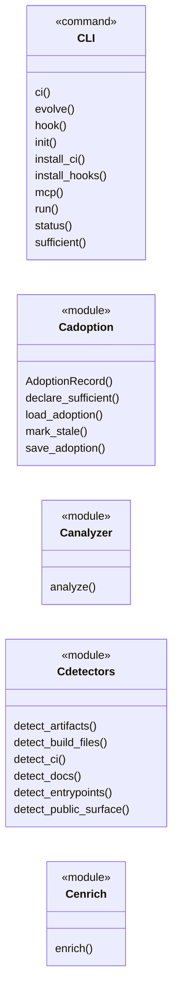
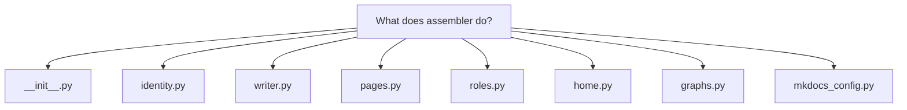
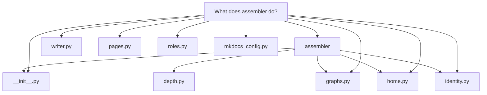

# What does assembler do?

`docuharnessx.assembler` is <a class="dhx-term" href="glossary.md#docuharnessx">DocuHarnessX</a>'s **MkDocs site-assembly core** — the "pure, model-free" stage that turns quality-gated content into a publishable **Material for MkDocs** source tree.

# What `docuharnessx.assembler` does

`docuharnessx.assembler` is <a class="dhx-term" href="glossary.md#docuharnessx">DocuHarnessX</a>'s **MkDocs site-assembly core** — the "pure, model-free" stage that turns quality-gated content into a publishable **Material for MkDocs** source tree. Its own docstring names it the deterministic, harness-free core behind the thin `AssembleStage` adapter: it consumes the accepted <a class="dhx-term" href="glossary.md#ontology">ontology</a> `Segment` set from the frozen `ReviewReport`, the loaded project `Vocabulary`, and an optional `RepoAnalysis`, then "emits a Material for MkDocs source tree under the <a class="dhx-term" href="glossary.md#run">run</a>'s output directory: one `docs/*.md` page per accepted segment, per-role landing <a class="dhx-term" href="glossary.md#pages">pages</a> with structured intent-ordered agendas, a tags index, and a `mkdocs.yml`" (`docuharnessx/assembler/__init__.py:1-13`). Everything downstream imports from this one public namespace rather than the submodules (`docuharnessx/assembler/__init__.py:15-18`).

The package is deliberately pure and deterministic — no model, no network; the only subprocess is the mockable, read-only git read in `identity.py` (`docuharnessx/assembler/__init__.py:12-13`). What it actually does breaks into a few concrete transforms:

## 1. Resolve the per-target site identity

`resolve_site_identity(target_repo, remote_url, overrides)` computes a frozen `SiteIdentity` — display `site_name`, `owner/repo` `repo_name`, `repo_url`, the GitHub project-Pages `site_url`, the `/<repo>/` `base_path`, and the Material `edit_uri` — from the target's git `origin` remote, never from <a class="dhx-term" href="glossary.md#docuharnessx">DocuHarnessX</a>'s own identity (`docuharnessx/assembler/identity.py:237-284`). Three regexes (`_GITHUB_HTTPS`, `_GITHUB_SSH`, `_GITHUB_SSH_URL`) parse GitHub remotes into `(owner, repo)`; a non-GitHub or absent remote falls back to a root base-path with a target-directory-derived `site_name` (`docuharnessx/assembler/identity.py:175-208`). The resolver itself is pure; the one I/O surface is `read_origin_remote`, which runs `git -C <target_repo> remote get-url origin` in a time-bounded subprocess and swallows every failure to `None` so the no-remote fallback applies instead of aborting the <a class="dhx-term" href="glossary.md#run">run</a> (`docuharnessx/assembler/identity.py:73-91`).

## 2. Orchestrate the tree in `assemble_site`

`assemble_site(report, vocab, analysis, out_dir, identity)` in the writer is the single place that wires the renderers together (`docuharnessx/assembler/writer.py:143-250`). Its steps, spelled out in code:

1. builds a **fresh accepted-only** `InMemorySegmentStore` over `report.accepted` so role agendas contain only accepted segments (`_build_accepted_store`, `docuharnessx/assembler/writer.py:96-111`);
2. renders one `docs/<segment>.md` per accepted segment via `render_segment_page`, passing the accepted-id set so cross-links resolve only to accepted <a class="dhx-term" href="glossary.md#pages">pages</a> (`docuharnessx/assembler/writer.py:190-195`);
3. renders `docs/<role>/index.md` for each vocabulary role that has at least one accepted segment, in vocabulary order (`_emitted_roles`, `docuharnessx/assembler/writer.py:200-207`);
4. writes `docs/tags.md` carrying the `<!-- material/tags -->` directive the Material `tags` plugin discovers (`docuharnessx/assembler/writer.py:227`);
5. writes `docs/index.md` via `render_home_page` and the extra CSS stylesheet (`docuharnessx/assembler/writer.py:232-235`);
6. builds `mkdocs.yml` via `build_mkdocs_yaml` and returns a frozen `AssembledSite` carrying the site paths, identity, and page counts (`docuharnessx/assembler/writer.py:238-250`).

The whole tree lands under `<out_dir>/site` — the single write target — written as UTF-8 with verbatim `\n` newlines by `_write_text` so on-disk bytes equal the renderers' byte-stable output (`docuharnessx/assembler/writer.py:81, 130-140`).

## 3. Render each artifact deterministically

The renderers are pure, model-free, byte-stable transforms:

- **Segment <a class="dhx-term" href="glossary.md#pages">pages</a>** — `pages.py`: `page_filename` maps a segment id to `<slug>-<sha256-digest-8>.md` so distinct ids never collide even when slugs do (`docuharnessx/assembler/pages.py:75-88`); `render_segment_page` emits YAML frontmatter whose `tags:` is exactly `emit_tags(segment, vocab)`, the title as H1, the segment body verbatim, and a "Related" section filtered to accepted ids (`docuharnessx/assembler/pages.py:91-120`).
- **Role landing <a class="dhx-term" href="glossary.md#pages">pages</a>** — `roles.py`: `render_role_landing_page` builds a opener (Situation/Complication/Question/Answer) framed only from the role's vocabulary `label`/`description`, an intent-ordered guided agenda of links derived through `build_role_view` (no body duplication), and a Material `!!! info` role-switch admonition listing the other role <a class="dhx-term" href="glossary.md#pages">pages</a> (`docuharnessx/assembler/roles.py:142-243`). `role_page_path` owns the `<role>/index.md` path rule with a filesystem-safe slug from `_slug` (`docuharnessx/assembler/roles.py:63-84`).
- **Home page** — `home.py`: `render_home_page(identity, role_pages)` produces the docs-root `index.md`: a heading naming the *target* project, a "choose your path" index over role <a class="dhx-term" href="glossary.md#pages">pages</a>, and a pointer to the tags index (`docuharnessx/assembler/home.py:33-74`); `render_question_home` is the question-list variant that also embeds `render_home_diagrams` (`docuharnessx/assembler/home.py:77-102`).
- **Mermaid companions** — `graphs.py`: `render_page_diagrams` and `render_home_diagrams` derive small flowcharts from the page record (related <a class="dhx-term" href="glossary.md#pages">pages</a>, cited files, <a class="dhx-term" href="glossary.md#analysis">analysis</a> entrypoints/components/public surface/build/tests) and emit them above question-page prose via a tiny deterministic `_Graph` builder (`docuharnessx/assembler/graphs.py:274-317`).

## 4. Build `mkdocs.yml`

`build_mkdocs_yaml(identity, role_pages, vocab, segments_by_role)` serializes an ordered config: `site_name`, `site_url`/`repo_url`/`edit_uri` only when the identity carries them (empty values omitted so a no-remote fallback still builds), `use_directory_urls: true`, the Material `theme` with features/palette/font, `extra_css`, plugins `["search", {"tags": {}}]`, a deterministic `nav` (home → role sections with `navigation.indexes` → tags), and a `markdown_extensions` block registering a `mermaid` custom fence for `pymdownx.superfences` (`docuharnessx/assembler/mkdocs_config.py:231-305`). Because the fence `format` is the Python function `superfences.fence_code_format`, the module serializes with `_MkDocsYamlDumper`, a `SafeDumper` subclass whose single representer emits the `!!python/name:` tag MkDocs' full loader recognizes (`docuharnessx/assembler/mkdocs_config.py:120-144`). A second builder, `build_question_mkdocs_yaml`, emits the nav for the question-organised site (`docuharnessx/assembler/mkdocs_config.py:308-345`).

## 5. Publish a frozen seam and an explore-first alternative

`model.py` defines the frozen value objects of the output seam: `SiteIdentity`, `AssembledSite` (`schema_version`, absolute `site_dir`/`docs_dir`/`mkdocs_yml_path`, `identity`, `page_count`, `role_page_count`), the single `ASSEMBLED_SITE_SCHEMA_VERSION = 1` authority, and the `AssemblerError`/`AssemblerInputError` family kept independent of the other specs' error families (`docuharnessx/assembler/model.py:59-156`).

Separately, `assemble_question_site(pages, identity, out_dir, analysis)` is the explore-first, question-organised entry point: it writes a Material tree from accepted question `Page` values only — home lists question titles, nav is home + <a class="dhx-term" href="glossary.md#pages">pages</a>, no per-role landings — and returns `None` (writing nothing under `site/`) when no <a class="dhx-term" href="glossary.md#pages">pages</a> are accepted so callers skip deploy (`docuharnessx/assembler/question_site.py:48-99`).

In short: <a class="dhx-term" href="glossary.md#assembler">assembler</a> is the deterministic "renderer + writer" core that takes the frozen <a class="dhx-term" href="glossary.md#review">review</a> output and vocabulary, resolves the target project's site identity from its git remote, renders per-segment <a class="dhx-term" href="glossary.md#pages">pages</a>, per-role landing <a class="dhx-term" href="glossary.md#pages">pages</a>, a home page, tags index, extra CSS, and Mermaid diagrams, generates a byte-stable `mkdocs.yml`, writes the entire Material-for-MkDocs tree under `<out_dir>/site`, and returns an immutable `AssembledSite` seam for the deploy stage — with an alternate question-organised writer (`assemble_question_site`) as the explore-first path.

## Grounding

- `docuharnessx/assembler/__init__.py`
- `docuharnessx/assembler/identity.py`
- `docuharnessx/assembler/writer.py`
- `docuharnessx/assembler/pages.py`
- `docuharnessx/assembler/roles.py`
- `docuharnessx/assembler/home.py`
- `docuharnessx/assembler/graphs.py`
- `docuharnessx/assembler/mkdocs_config.py`
- `docuharnessx/assembler/model.py`
- `docuharnessx/assembler/question_site.py`

