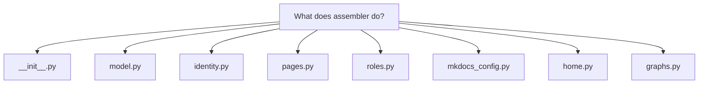
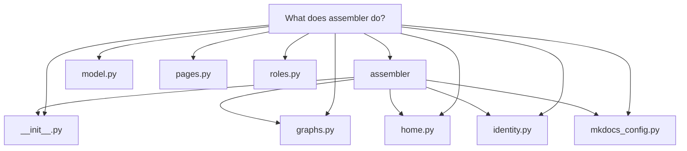

# What does assembler do?

# What does `docuharnessx.assembler` do?

`docuharnessx.assembler` is the **pure, model-free MkDocs site-assembly core** of DocuHarnessX. Its package docstring calls it "the deterministic, harness-free assembly core behind the thin `AssembleStage` adapter" (`docuharnessx/assembler/__init__.py:1-4`). In short: it turns quality-gated content — the accepted `Segment`s from a frozen `ReviewReport`, the project `Vocabulary`, an optional `RepoAnalysis`, an output directory, and a resolved `SiteIdentity` — into a publishable **Material for MkDocs** source tree under the run's output directory: "one `docs/*.md` page per accepted segment, per-role landing pages with COBESY-structured intent-ordered agendas, a tags index, and a `mkdocs.yml`" (`docuharnessx/assembler/__init__.py:8-11`). All of this is deterministic and requires no model or network; the only subprocess in the whole package is the mockable, read-only git remote read in `identity.py`.

## Public namespace and data seam

`__init__.py` is the single public namespace: it re-exports the frozen model types (`AssembledSite`, `SiteIdentity`, `ASSEMBLED_SITE_SCHEMA_VERSION`, `AssemblerError`, `AssemblerInputError`), the identity resolver, all renderers, and the site writer, with `__all__` as the "authoritative, self-consistent contract for the package" (`docuharnessx/assembler/__init__.py:56-86`). The value objects live in `model.py`: `SiteIdentity` carries `site_name`, `repo_name`, `repo_url`, `site_url`, `base_path`, and `edit_uri` as immutable strings, and `AssembledSite` is the frozen output seam with `schema_version`, `site_dir`, `docs_dir`, `mkdocs_yml_path`, `identity`, `page_count`, and `role_page_count` (`docuharnessx/assembler/model.py:67-127`); `ASSEMBLED_SITE_SCHEMA_VERSION = 1` is the single version authority (`docuharnessx/assembler/model.py:59`).

## Identity resolution (`identity.py`)

`resolve_site_identity(target_repo, remote_url, overrides)` is a pure, total resolver: for a GitHub HTTPS/SSH/`ssh://` remote it derives `owner/repo`, the project-Pages `site_url` `https://<owner>.github.io/<repo>/`, base-path `/<repo>/`, and `edit_uri = "edit/main/docs/"` (`docuharnessx/assembler/identity.py:154-172`); non-GitHub and no-remote cases fall back to a target-directory-derived `site_name` with a root base-path and empty `site_url`/`edit_uri` (`docuharnessx/assembler/identity.py:175-208`). Only the keys in `_OVERRIDABLE` (`site_name`, `site_url`, `repo_url`, `edit_uri`) are honored by `_apply_overrides` (`docuharnessx/assembler/identity.py:211-234`). The identity is always the *target* project's — never DocuHarnessX's own. The only process-touching surface is `read_origin_remote`, which runs the read-only command `git -C <target_repo> remote get-url origin` with a 5-second timeout and degrades every failure mode to `None` (`docuharnessx/assembler/identity.py:73-91`).

## The renderers

- **Per-segment pages** (`pages.py`): `page_filename` builds `"<slug>-<digest>.md"` from the segment id, appending 8 hex chars of the SHA-256 of the raw id so distinct ids never collide (`docuharnessx/assembler/pages.py:75-88`). `render_segment_page` emits YAML frontmatter whose `tags:` is exactly `emit_tags(segment, vocab)`, the title as an H1, the body verbatim, and a "Related" section filtered to `accepted_ids` (`docuharnessx/assembler/pages.py:131-165`).
- **Role landing pages** (`roles.py`): `render_role_landing_page` renders `docs/<role>/index.md` (`role_page_path` = `"<role>/index.md"`, `docuharnessx/assembler/roles.py:82-84`) with a COBESY SCQA opener framed from the role's vocabulary `label`/`description`, an intent-ordered agenda from `build_role_view`, and a Material `!!! info` admonition letting readers switch to other roles (`docuharnessx/assembler/roles.py:142-243`).
- **Home page** (`home.py`): `render_home_page` builds `docs/index.md` (`HOME_PAGE_PATH = "index.md"`, `docuharnessx/assembler/mkdocs_config.py:71`) with a "choose your path" index of the role pages and a pointer to the tags index (`docuharnessx/assembler/home.py:33-74`); `render_question_home` is the question-organised variant.
- **Mermaid companions** (`graphs.py`): `render_page_diagrams` / `render_home_diagrams` derive deterministic flowchart companions from the page record and optional `RepoAnalysis` — per `QuestionKind` there are startup, component, public-surface, build, and tests flowcharts plus an evidence flowchart grouped by directory (`docuharnessx/assembler/graphs.py:229-271`).
- **Theme** (`theme.py`): `render_extra_css` returns `stylesheets/extra.css` (`EXTRA_CSS_PATH`, `docuharnessx/assembler/theme.py:22`), a deepwiki-open-inspired skin that overrides Material's per-scheme CSS custom properties for light/dark palettes.
- **MkDocs config** (`mkdocs_config.py`): `build_mkdocs_yaml` assembles `site_name`, the per-target `site_url`, `use_directory_urls: true`, the Material theme with the `_THEME_FEATURES` list, plugins `["search", {"tags": {}}]`, and a deterministic nav of home, role sections, and `TAGS_INDEX_PATH = "tags.md"` (`docuharnessx/assembler/mkdocs_config.py:188-228, 264-305`). It registers a `pymdownx.superfences` custom `mermaid` fence whose `format` is `superfences.fence_code_format`, serialized via `_MkDocsYamlDumper` as a `!!python/name:` YAML tag so MkDocs' full loader resolves the function reference (`docuharnessx/assembler/mkdocs_config.py:120-169`).

## The orchestration (`writer.py`)

`assemble_site(report, vocab, analysis, out_dir, identity)` is the single orchestration boundary (task 4.1). It builds a fresh accepted-only `InMemorySegmentStore` over `report.accepted`, renders and writes one per-segment page per accepted segment, computes the emitted roles (vocabulary roles with at least one accepted segment, in vocabulary order, via `_emitted_roles`), writes one `docs/<role>/index.md` landing page per emitted role, assigns each segment to exactly one role section for the sidebar tree, writes `tags.md` with the `<!-- material/tags -->` directive the tags plugin discovers, writes the home page and `extra.css`, and finally writes `mkdocs.yml` — everything under `<out_dir>/site` (the single write target, `_SITE_SUBDIR = "site"`), returning a frozen `AssembledSite` with the page counts (`docuharnessx/assembler/writer.py:143-250`). The companion `assemble_question_site` in `question_site.py` is the explore-first, question-organised path: it builds the same tree from accepted `Page`s with no role landings, returns `None` when there are no accepted pages so callers skip deploy, and otherwise returns an `AssembledSite` with `role_page_count == 0` (`docuharnessx/assembler/question_site.py:48-99`).

Across every module the stated invariants hold: deterministic and byte-stable output for equal inputs, no model call or network access, segments consumed read-only, and a per-target identity never hardcoded to DocuHarnessX.
