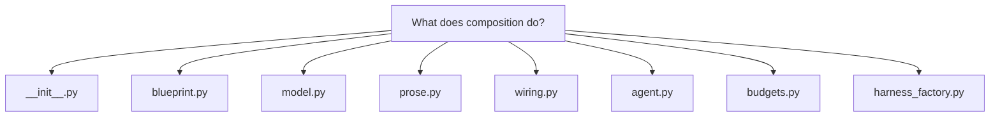
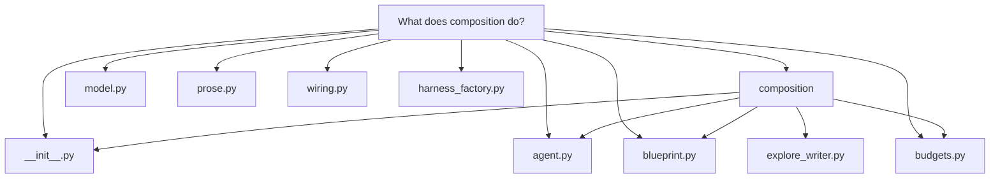

# What does composition do?

## What `docuharnessx.composition` does

`docuharnessx.composition` is the **deterministic, model-free composition core** of DocuHarnessX — the writer pipeline that turns each `PlannedSegment` of the frozen `CoveragePlan` into a finished, ontology `Segment` document. Its own docstring puts it plainly: it is "the deterministic composition core behind the thin `WriteStage` adapter", turning each planned segment "into a COBESY-structured composition blueprint *before* any prose, then render[ing] an ontology `Segment`" (`docuharnessx/composition/__init__.py:1-13`). The package deliberately separates *structure* from *prose*: blueprint building, prompt assembly, wiring, and fallback are all deterministic and unit-testable without a model, while "the single model-touching step lives in `docuharnessx.composition.prose`" (`docuharnessx/composition/__init__.py:6-9`).

The package is a single public namespace: consumers such as the `WriteStage` adapter import from `docuharnessx.composition` rather than reaching into submodules (`docuharnessx/composition/__init__.py:11-13`). It re-exports the frozen data model (`CompositionBlueprint`, `SCQAOpener`, `Chunk`, `EvidenceAnchor`, `ProseResult`, `WrittenSegments`, `WriteFlag`, `WriterError`, `WriterInputError`), the deterministic entry points (`build_blueprint`, `build_request`, `segment_id`, `wire_segment`, `render_fallback_body`, `render_fallback_summary`), the gated single-shot prose step (`generate_prose`, `DEFAULT_PROSE_TIMEOUT_S`), and the newer agentic-writer entry points (`build_agent_task`, `validate_agent_body`, `build_writer_harness`, `AgenticProseRunner`, `AgentRunStats`) (`docuharnessx/composition/__init__.py:73-137`). Every re-export is identity-equal to its submodule definition, and `__all__` is the authoritative contract (`docuharnessx/composition/__init__.py:66-68`).

**Blueprint building — structure before prose.** `build_blueprint(planned, analysis, vocab)` is a pure function that derives the whole COBESY structure — the SCQA opener, the Minto lead-with-conclusion `key_message`, working-memory `chunks`, the REDUCE-barrier `fast_path`, the `andragogy` expert-framing flag, the `title`, and the `evidence_anchors` — from the segment's `roles`/`intent` looked up in the *loaded* `Vocabulary` `AxisTerm` labels, never from hardcoded role/intent/subject literals (`docuharnessx/composition/blueprint.py:356-378`). The builder stays total: an id missing from the vocabulary "degrades to its own string deterministically rather than raising" (`docuharnessx/composition/blueprint.py:372-374`). Andragogy is a documented heuristic over the loaded term's `id`/`label`/`description` matching `_EXPERT_SIGNAL_TOKENS`, so re-describing a role as expert work flips the flag with no code change (`docuharnessx/composition/blueprint.py:91-101`). Evidence anchors copy `planned.evidence` verbatim and are enriched with a note from a matching `RepoAnalysis` finding only when one exists; an absent analysis returns `""` so "no repository fact is invented" (`docuharnessx/composition/blueprint.py:171-228`).

**Frozen data model.** The blueprint records in `model.py` are all `@dataclass(frozen=True)` with `tuple` collection fields, so instances are deeply immutable, compare by value, and are hashable (`docuharnessx/composition/model.py:26-32`). `CompositionBlueprint` carries the segment axis values plus `scqa`, `key_message`, `chunks`, `fast_path`, `andragogy`, `evidence_anchors`, and the resolved `role_labels`/`intent_label` (`docuharnessx/composition/model.py:118-153`). The same module defines `ProseResult` (body/summary with a `source` of `"model"`/`"fallback"`/`"fake"`), the `WriteFlag`/`WrittenSegments` output seam the review gate consumes, and the writer error hierarchy (`docuharnessx/composition/model.py:161-248`).

**Prose — the single model surface.** `generate_prose(blueprint, *, model, timeout_s)` is the only module that may consult a model (`docuharnessx/composition/prose.py:1-9`). It issues exactly one bounded `complete` call under `DEFAULT_PROSE_TIMEOUT_S = 60.0` (`docuharnessx/composition/prose.py:69`), parses the response into a Markdown `body` plus `summary` — accepting a structured `{"body": ..., "summary": ...}` JSON object or falling back to treating the whole content as plain prose — and returns `ProseResult(source="model")` or `None` (`docuharnessx/composition/prose.py:72-137`). Model coupling is minimal and duck-typed: the package never imports a model class, and the request itself is built by the deterministic `build_request` (`docuharnessx/composition/prose.py:32-41`).

**Wiring and fallback.** `segment_id` derives a deterministic, filesystem-safe id by sanitizing the `segment_key` to a `[a-z0-9-]` slug and appending a short blake2b hash of the raw key, and `wire_segment` maps all *non-body* fields from `planned` + `blueprint` into a new ontology `Segment`, taking `body`/`summary` *only* from the `ProseResult` — so "the model contributes only body/summary" (`docuharnessx/composition/wiring.py:78-126`). When no model is bound or the prose call fails, the deterministic `render_fallback_body`/`render_fallback_summary` produce the segment text with `source="fallback"` (re-exported at `docuharnessx/composition/__init__.py:83-86`).

**The agentic writer.** `AgenticProseRunner.run` runs one bounded HarnessX agent per planned segment: it builds a model-free read-only harness via `build_writer_harness(repo_path)`, binds the model with `ModelConfig(main=model).agentic(config)`, builds a scoped `BaseTask` via `build_agent_task`, drives the real agentic loop with `await harness.run(task)`, takes `task_end.final_output` as the body, and runs it through the deterministic structure gate (`docuharnessx/composition/agent.py:138-295`). Every failure — no model, invalid repo, raise, timeout, empty body, rejected body — is absorbed into `(None, AgentRunStats(...))` with `accepted=False` so the runner "never raises" and the stage falls back (`docuharnessx/composition/agent.py:33-37`). `AgentRunStats` carries only scalars (`steps`, `cost_usd`, `exit_reason`, `accepted`) so the journal never leaks the body or transcript (`docuharnessx/composition/agent.py:97-121`).

**Bounds and the structure gate.** The per-segment budget lives in `budgets.py` as auditable module-level constants: `WRITER_MAX_STEPS = 24`, `WRITER_MAX_COST_USD = 5.00`, `WRITER_TOKEN_BUDGET = 1_000_000`, `WRITER_TOKEN_THRESHOLD = 150_000`, `WRITER_LOOP_THRESHOLD = 6`, and `MIN_CITED_FILES = 3`, each overridable via a `DHX_WRITER_*` environment variable read once at import (`docuharnessx/composition/budgets.py:81-124`). `build_writer_harness` composes the behaviour pipeline (`context | make_window_mgmt(...) | make_control(...)`), slots `build_default_tools()` and a read-only `Workspace(agent_id="docuharnessx-writer", root=repo_path, mode="readonly")`, and deliberately embeds no model (`docuharnessx/composition/harness_factory.py:105-201`). Finally, `validate_agent_body` accepts an agent body **iff** it contains at least one fenced `mermaid` block declaring a supported diagram type *and* at least `min_citations` distinct `file:line` citations — pure, total, and deterministic (`docuharnessx/composition/structure_gate.py:198-239`).

A second consumption path shows the same harness in a simpler shape: `write_questions` in `explore_writer.py` drives the read-only writer harness once per planned question via `build_question_task` and `validate_page_body`, and turns ungrounded results into closed-set `Omission`s (`INSPECTION_IMPOSSIBLE`, `NO_MODEL`, `EMPTY`, `NOT_INSPECTED`, `GATE_REJECTED`) rather than inventing a substitute body (`docuharnessx/composition/explore_writer.py:31-128`).

In short, composition is DocuHarnessX's writer: it deterministically builds a COBESY blueprint per planned segment, optionally turns it into prose (single-shot or agentic, always bounded and gated), wires the result into an ontology `Segment` with the model touching only `body`/`summary`, and falls back deterministically whenever no grounded prose is produced.
