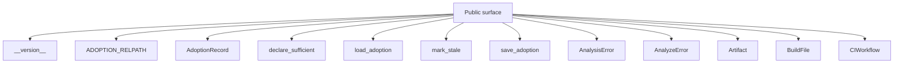
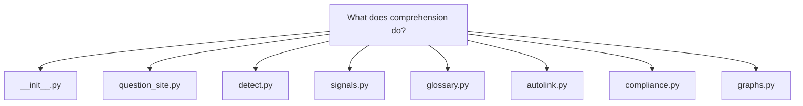
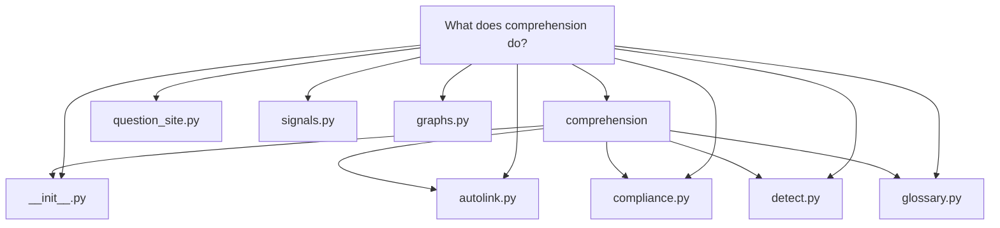
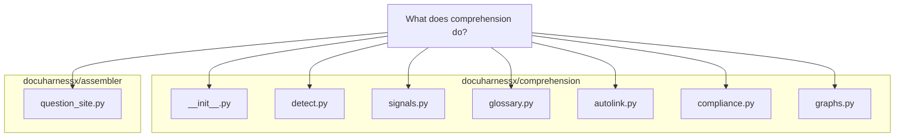

# What does [comprehension]([glossary](glossary.md#glossary).md#comprehension) do?

In [DocuHarnessX]([glossary](glossary.md#glossary).md#docuharnessx), `comprehension` is the `docuharnessx.comprehension` package — its own docstring is "Depth-assigned visuals, [glossary](glossary.md#glossary), and compliance self-assessment." (`docuharnessx/comprehension/__init__.py:1`). It turns a parsed `RepoAnalysis` plus the raw repo path into the *extra* material that makes an assembled docs site explain itself: derived [pipeline](glossary.md#pipeline)/lineage signals, a project [glossary](glossary.md#glossary) with autolinked terms, a compliance self-assessment matrix, and the Mermaid/Markdown visuals that get injected into [pages](glossary.md#pages). The consumer that ties it together is `question_site.py`, which calls `detect_comprehension` when no signals were passed in (`docuharnessx/assembler/question_site.py:96`), writes a `glossary.md` and a `compliance.md`, and pushes every [page](glossary.md#page) through the autolinker (`docuharnessx/assembler/question_site.py:115`, `docuharnessx/assembler/question_site.py:130`, `docuharnessx/assembler/question_site.py:134`).

# What does `comprehension` do?

In [DocuHarnessX]([glossary](glossary.md#glossary).md#docuharnessx), `comprehension` is the `docuharnessx.comprehension` package — its own docstring is "Depth-assigned visuals, [glossary](glossary.md#glossary), and compliance self-assessment." (`docuharnessx/comprehension/__init__.py:1`). It turns a parsed `RepoAnalysis` plus the raw repo path into the *extra* material that makes an assembled docs site explain itself: derived [pipeline](glossary.md#pipeline)/lineage signals, a project [glossary](glossary.md#glossary) with autolinked terms, a compliance self-assessment matrix, and the Mermaid/Markdown visuals that get injected into [pages](glossary.md#pages). The consumer that ties it together is `question_site.py`, which calls `detect_comprehension` when no signals were passed in (`docuharnessx/assembler/question_site.py:96`), writes a `glossary.md` and a `compliance.md`, and pushes every [page](glossary.md#page) through the autolinker (`docuharnessx/assembler/question_site.py:115`, `docuharnessx/assembler/question_site.py:130`, `docuharnessx/assembler/question_site.py:134`).

## 1. Signal detection (what the repo "is doing")

The entry point is `detect_comprehension(analysis, repo_path)` in `docuharnessx/comprehension/detect.py:314`, which returns a `ComprehensionSignals`. Detection is split into independent scanners:

- **GitHub Actions DAGs** — `_github_actions` (`docuharnessx/comprehension/detect.py:52`) only looks at workflows whose provider is `"github_actions"`, parses each workflow YAML, makes a `DagNode` per job, and builds edges from each job's `needs:` entries.
- **Makefile DAGs** — `_makefile` (`docuharnessx/comprehension/detect.py:99`) matches targets with the `_MAKE_TARGET` regex `^([A-Za-z0-9_./-]+)\s*:(.*)$` (`docuharnessx/comprehension/detect.py:26`) and links each target to the targets it lists as prerequisites.
- **Named [pipeline](glossary.md#pipeline) tools** — `_named_files` (`docuharnessx/comprehension/detect.py:136`) fabricates a stub `PipelineDag` per framework detected from paths, keyed on names like `Snakefile`/`snakefile` for snakemake, `dbt_project.yml` or `/models/` for dbt, `catalog.yml`/`pipeline.py` for kedro, `/dags/` or `airflow`, `@flow`/`prefect`, and `dagster`.
- **Coarse fallback** — `_coarse` (`docuharnessx/comprehension/detect.py:192`) is used only when none of the above produced a DAG; it synthesizes a `source="coarse"` graph of `entry:*` → `comp:*` → `art:*` nodes from `analysis.entrypoints`, `analysis.components`, and `analysis.artifacts`.
- **Lineage** — `_lineage` (`docuharnessx/comprehension/detect.py:224`) emits `LineageHop` records; for ML/quant projects it uses the [stages](glossary.md#stages) `raw → features → model → output`, otherwise it chains `input → entrypoint → components → output`.
- **Project kinds** — `_project_kinds` (`docuharnessx/comprehension/detect.py:253`) always includes `"software"` and appends `"ml"` or `"quant"` when tokens such as `notebook`, `.ipynb`, `train`, `mlflow`, `sklearn`, `signal`, or `alpha` appear in the relative paths.
- **Requirement sentences** — `_requirements` (`docuharnessx/comprehension/detect.py:269`) scans `requirements.md`, `.adr.md`, `/adr/`, and `.kiro/specs` files with the `_SHALL` regex `^.+\bshall\b.+$` (`docuharnessx/comprehension/detect.py:20`) and keeps each matching line as a `RequirementHit` (capped at 24 hits).

All of this output is carried in frozen dataclasses defined in `docuharnessx/comprehension/signals.py` — `ComprehensionSignals` has fields `pipelines`, `lineage`, `project_kinds`, and `requirement_sentences` (`docuharnessx/comprehension/signals.py:54`), with supporting `DagNode`, `PipelineDag`, `LineageHop`, `RequirementHit`, and `CoverageCounts`. The module docstring there, "Frozen [comprehension]([glossary](glossary.md#glossary).md#comprehension) signals (design: do not reshape [RepoAnalysis]([glossary](glossary.md#glossary).md#repoanalysis))" (`docuharnessx/comprehension/signals.py:1`), makes the design intent explicit: [comprehension]([glossary](glossary.md#glossary).md#comprehension) derives a read-only view rather than mutating the [analysis]([glossary](glossary.md#glossary).md#analysis) model.

## 2. [Glossary](glossary.md#glossary) and autolinking

`docuharnessx/comprehension/glossary.py` owns the project [glossary](glossary.md#glossary). `seed_glossary(vocab, analysis)` (`docuharnessx/comprehension/glossary.py:54`) proposes terms from the [ontology](glossary.md#ontology) `Vocabulary` — `vocab.roles`, `vocab.intents`, and `vocab.subject_prefixes` — plus each `analysis.components` name and each `analysis.public_surface` symbol, tagging each term with a source such as `ontology:role` or `surface:<path>`. IDs are slugified by `_slug` (`docuharnessx/comprehension/glossary.py:31`). The seeded [glossary](glossary.md#glossary) is then overlaid with the operator-controlled file at `.docuharnessx/glossary.yaml` (`GLOSSARY_RELPATH`, `docuharnessx/comprehension/glossary.py:26`): `load_glossary` (`docuharnessx/comprehension/glossary.py:93`) parses it, and `merge_glossary(seed, operator)` (`docuharnessx/comprehension/glossary.py:131`) lets the operator win on `definition` and `aliases` while unioning `related` and `sources`; `save_glossary` (`docuharnessx/comprehension/glossary.py:150`) persists back to YAML.

`docuharnessx/comprehension/autolink.py` turns the [glossary](glossary.md#glossary) into links. `autolink_markdown(text, glossary)` (`docuharnessx/comprehension/autolink.py:14`) sorts terms/aliases longest-first and replaces whole-word matches with `[name](glossary.md#term-id)` using a boundary-aware, case-insensitive regex (`docuharnessx/comprehension/autolink.py:39-41`). It is fence-aware: the `_FENCE` pattern (`docuharnessx/comprehension/autolink.py:11`) carves out fenced code blocks, inline `` `code` `` spans, and Markdown link destinations so code is never rewritten.

## 3. Compliance self-assessment

`[docuharnessx]([glossary](glossary.md#glossary).md#docuharnessx)/[comprehension]([glossary](glossary.md#glossary).md#comprehension)/compliance.py` implements a compliance *self-assessment* (explicitly not a certification — the interview prompt says "self-assessment, not a certification" at `[docuharnessx]([glossary](glossary.md#glossary).md#docuharnessx)/[comprehension]([glossary](glossary.md#glossary).md#comprehension)/compliance.py:159`, and the rendered page repeats "not … an auditor opinion" at `[docuharnessx]([glossary](glossary.md#glossary).md#docuharnessx)/[comprehension]([glossary](glossary.md#glossary).md#comprehension)/graphs.py:246`). It defines the scopes `[FRAMEWORKS]([glossary](glossary.md#glossary).md#frameworks) = ("iso27001", "pci-dss", "nis2", "cra", "gdpr")` (`[docuharnessx]([glossary](glossary.md#glossary).md#docuharnessx)/[comprehension]([glossary](glossary.md#glossary).md#comprehension)/compliance.py:29`) and 13 `[PILLARS](glossary.md#pillars)` such as `inventory`, `access`, `crypto`, `ssdlc`, `supply`, `privacy`, each with the frozenset of frameworks it applies to (`[docuharnessx]([glossary](glossary.md#glossary).md#docuharnessx)/[comprehension]([glossary](glossary.md#glossary).md#comprehension)/compliance.py:38-52`).

`[score_matrix]([glossary](glossary.md#glossary).md#score-matrix)(selection, [analysis]([glossary](glossary.md#glossary).md#analysis))` (`[docuharnessx]([glossary](glossary.md#glossary).md#docuharnessx)/[comprehension]([glossary](glossary.md#glossary).md#comprehension)/compliance.py:269`) produces one `[ComplianceCell]([glossary](glossary.md#glossary).md#compliancecell)` per framework/pillar, grading each in-scope cell as `na | fail | partial | pass`. Status is derived by `_pillar_evidence` (`[docuharnessx]([glossary](glossary.md#glossary).md#docuharnessx)/[comprehension]([glossary](glossary.md#glossary).md#comprehension)/compliance.py:209`), which path-matches repo files against heuristics per pillar — e.g. `inventory` grades `pass` only if a `codeowners` file is present (`[docuharnessx]([glossary](glossary.md#glossary).md#docuharnessx)/[comprehension]([glossary](glossary.md#glossary).md#comprehension)/compliance.py:210-212`), `ssdlc` requires both CI workflows and tests (`[docuharnessx]([glossary](glossary.md#glossary).md#docuharnessx)/[comprehension]([glossary](glossary.md#glossary).md#comprehension)/compliance.py:234-242`), and `vuln` looks for `dependabot`, `renovate`, `osv-scanner`, `pip-audit`, `govulncheck`, `codeql`, or `snyk` (`[docuharnessx]([glossary](glossary.md#glossary).md#docuharnessx)/[comprehension]([glossary](glossary.md#glossary).md#comprehension)/compliance.py:222-233`). Out-of-scope or non-applying combinations are emitted as `na`. Human overrides from `.[docuharnessx]([glossary](glossary.md#glossary).md#docuharnessx)/compliance.yaml` (`[COMPLIANCE_RELPATH]([glossary](glossary.md#glossary).md#compliance-relpath)`, `[docuharnessx]([glossary](glossary.md#glossary).md#docuharnessx)/[comprehension]([glossary](glossary.md#glossary).md#comprehension)/compliance.py:27`) are applied with `overridden=True`, and the selection is configured through `[prompt_compliance_topics]([glossary](glossary.md#glossary).md#prompt-compliance-topics)` (`[docuharnessx]([glossary](glossary.md#glossary).md#docuharnessx)/[comprehension]([glossary](glossary.md#glossary).md#comprehension)/compliance.py:150`) plus `[load_compliance]([glossary](glossary.md#glossary).md#load-compliance)`/`[save_compliance]([glossary](glossary.md#glossary).md#save-compliance)` (`[docuharnessx]([glossary](glossary.md#glossary).md#docuharnessx)/[comprehension]([glossary](glossary.md#glossary).md#comprehension)/compliance.py:100`, `:133`).

## 4. Rendering: depth-assigned visuals and pages

`[docuharnessx]([glossary](glossary.md#glossary).md#docuharnessx)/[comprehension]([glossary](glossary.md#glossary).md#comprehension)/graphs.py` is where comprehension results become actual site content — "Deterministic extra diagrams. Flowchart fallbacks stay MkDocs-safe." (`[docuharnessx]([glossary](glossary.md#glossary).md#docuharnessx)/[comprehension]([glossary](glossary.md#glossary).md#comprehension)/graphs.py:1`). It renders `mermaid` fences with `_fence_flow` (`[docuharnessx]([glossary](glossary.md#glossary).md#docuharnessx)/[comprehension]([glossary](glossary.md#glossary).md#comprehension)/graphs.py:31`) for the C4 context (`render_c4_context`, `:41`), mindmap (`render_mindmap`, `:56`), sequence diagram (`render_sequence`, `:65`), lineage sankey (`render_sankey`, `:84`), pipeline DAG (`render_dag`, `:103`), and public-surface graph (`render_public_surface`, `:115`). `[render_home_extras]([glossary](glossary.md#glossary).md#render-home-extras)` (`[docuharnessx]([glossary](glossary.md#glossary).md#docuharnessx)/[comprehension]([glossary](glossary.md#glossary).md#comprehension)/graphs.py:174`) and `[render_page_extras]([glossary](glossary.md#glossary).md#render-page-extras)` (`[docuharnessx]([glossary](glossary.md#glossary).md#docuharnessx)/[comprehension]([glossary](glossary.md#glossary).md#comprehension)/graphs.py:139`) slot these blocks at ordered depth positions (e.g. sankey appears at levels 3 and 7 on the home page, `[docuharnessx]([glossary](glossary.md#glossary).md#docuharnessx)/[comprehension]([glossary](glossary.md#glossary).md#comprehension)/graphs.py:194-196`) — that is the "depth-assigned" behavior from the package docstring. `[render_glossary_page]([glossary](glossary.md#glossary).md#render-glossary-page)` (`[docuharnessx]([glossary](glossary.md#glossary).md#docuharnessx)/[comprehension]([glossary](glossary.md#glossary).md#comprehension)/graphs.py:203`) emits `[glossary](glossary.md#glossary).md` with per-term `<h2 id="...">` anchors that `[autolink_markdown]([glossary](glossary.md#glossary).md#autolink-markdown)` targets, and `[render_compliance_page]([glossary](glossary.md#glossary).md#render-compliance-page)` (`[docuharnessx]([glossary](glossary.md#glossary).md#docuharnessx)/[comprehension]([glossary](glossary.md#glossary).md#comprehension)/graphs.py:230`) emits `compliance.md`, coloring cells with CSS classes `dhx-na`, `dhx-fail`, `dhx-partial`, `dhx-pass` (`[docuharnessx]([glossary](glossary.md#glossary).md#docuharnessx)/[comprehension]([glossary](glossary.md#glossary).md#comprehension)/graphs.py:235-240`).

## In one sentence

`[comprehension]([glossary](glossary.md#glossary).md#comprehension)` answers "what is this repo really doing and how well does it say so?" — `[detect_comprehension]([glossary](glossary.md#glossary).md#detect-comprehension)` extracts pipelines, lineage, project kinds, and shall-sentences into frozen `[ComprehensionSignals]([glossary](glossary.md#glossary).md#comprehensionsignals)`; `[glossary](glossary.md#glossary)` + `autolink` build and apply a term glossary; `compliance` scores a framework/pillar self-assessment matrix from repo evidence; and `graphs` renders all of it as depth-ordered Mermaid diagrams, `[glossary](glossary.md#glossary).md`, and `compliance.md` for the assembled site.

## Grounding

- `[docuharnessx]([glossary](glossary.md#glossary).md#docuharnessx)/[comprehension]([glossary](glossary.md#glossary).md#comprehension)/__init__.py`
- `[docuharnessx]([glossary](glossary.md#glossary).md#docuharnessx)/[assembler]([glossary](glossary.md#glossary).md#assembler)/question_site.py`
- `[docuharnessx]([glossary](glossary.md#glossary).md#docuharnessx)/[comprehension]([glossary](glossary.md#glossary).md#comprehension)/detect.py`
- `[docuharnessx]([glossary](glossary.md#glossary).md#docuharnessx)/[comprehension]([glossary](glossary.md#glossary).md#comprehension)/signals.py`
- `[docuharnessx]([glossary](glossary.md#glossary).md#docuharnessx)/[comprehension]([glossary](glossary.md#glossary).md#comprehension)/[glossary](glossary.md#glossary).py`
- `[docuharnessx]([glossary](glossary.md#glossary).md#docuharnessx)/[comprehension]([glossary](glossary.md#glossary).md#comprehension)/autolink.py`
- `[docuharnessx]([glossary](glossary.md#glossary).md#docuharnessx)/[comprehension]([glossary](glossary.md#glossary).md#comprehension)/compliance.py`
- `[docuharnessx]([glossary](glossary.md#glossary).md#docuharnessx)/[comprehension]([glossary](glossary.md#glossary).md#comprehension)/graphs.py`

