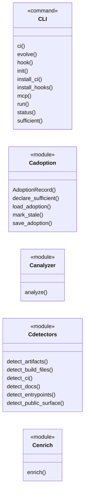
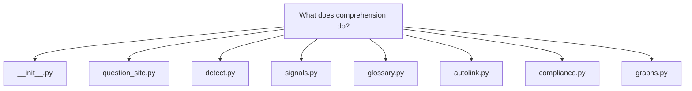
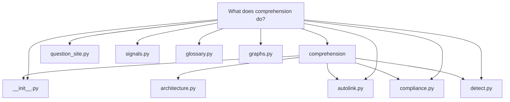
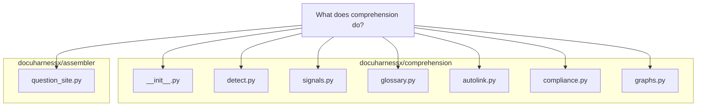

# What does comprehension do?

In <a class="dhx-term" href="glossary.md#docuharnessx">DocuHarnessX</a>, `comprehension` is the `docuharnessx.comprehension` package — its own docstring is "Depth-assigned visuals, glossary, and compliance self-assessment.".

# What does `comprehension` do?

In <a class="dhx-term" href="glossary.md#docuharnessx">DocuHarnessX</a>, `comprehension` is the `docuharnessx.comprehension` package — its own docstring is "Depth-assigned visuals, glossary, and compliance self-assessment." (`docuharnessx/comprehension/__init__.py:1`). It turns a parsed `RepoAnalysis` plus the raw repo path into the *extra* material that makes an assembled docs site explain itself: derived <a class="dhx-term" href="glossary.md#pipeline">pipeline</a>/lineage signals, a project glossary with autolinked terms, a compliance self-assessment matrix, and the Mermaid/Markdown visuals that get injected into <a class="dhx-term" href="glossary.md#pages">pages</a>. The consumer that ties it together is `question_site.py`, which calls `detect_comprehension` when no signals were passed in (`docuharnessx/assembler/question_site.py:96`), writes a `glossary.md` and a `compliance.md`, and pushes every page through the autolinker (`docuharnessx/assembler/question_site.py:115`, `docuharnessx/assembler/question_site.py:130`, `docuharnessx/assembler/question_site.py:134`).

## 1. Signal detection (what the repo "is doing")

The entry point is `detect_comprehension(analysis, repo_path)` in `docuharnessx/comprehension/detect.py:314`, which returns a `ComprehensionSignals`. Detection is split into independent scanners:

- **GitHub Actions DAGs** — `_github_actions` (`docuharnessx/comprehension/detect.py:52`) only looks at workflows whose provider is `"github_actions"`, parses each workflow YAML, makes a `DagNode` per job, and builds edges from each job's `needs:` entries.
- **Makefile DAGs** — `_makefile` (`docuharnessx/comprehension/detect.py:99`) matches targets with the `_MAKE_TARGET` regex `^([A-Za-z0-9_./-]+)\s*:(.*)$` (`docuharnessx/comprehension/detect.py:26`) and links each target to the targets it lists as prerequisites.
- **Named <a class="dhx-term" href="glossary.md#pipeline">pipeline</a> tools** — `_named_files` (`docuharnessx/comprehension/detect.py:136`) fabricates a stub `PipelineDag` per framework detected from paths, keyed on names like `Snakefile`/`snakefile` for snakemake, `dbt_project.yml` or `/models/` for dbt, `catalog.yml`/`pipeline.py` for kedro, `/dags/` or `airflow`, `@flow`/`prefect`, and `dagster`.
- **Coarse fallback** — `_coarse` (`docuharnessx/comprehension/detect.py:192`) is used only when none of the above produced a DAG; it synthesizes a `source="coarse"` graph of `entry:*` → `comp:*` → `art:*` nodes from `analysis.entrypoints`, `analysis.components`, and `analysis.artifacts`.
- **Lineage** — `_lineage` (`docuharnessx/comprehension/detect.py:224`) emits `LineageHop` records; for ML/quant projects it uses the <a class="dhx-term" href="glossary.md#stages">stages</a> `raw → features → model → output`, otherwise it chains `input → entrypoint → components → output`.
- **Project kinds** — `_project_kinds` (`docuharnessx/comprehension/detect.py:253`) always includes `"software"` and appends `"ml"` or `"quant"` when tokens such as `notebook`, `.ipynb`, `train`, `mlflow`, `sklearn`, `signal`, or `alpha` appear in the relative paths.
- **Requirement sentences** — `_requirements` (`docuharnessx/comprehension/detect.py:269`) scans `requirements.md`, `.adr.md`, `/adr/`, and `.kiro/specs` files with the `_SHALL` regex `^.+\bshall\b.+$` (`docuharnessx/comprehension/detect.py:20`) and keeps each matching line as a `RequirementHit` (capped at 24 hits).

All of this output is carried in frozen dataclasses defined in `docuharnessx/comprehension/signals.py` — `ComprehensionSignals` has fields `pipelines`, `lineage`, `project_kinds`, and `requirement_sentences` (`docuharnessx/comprehension/signals.py:54`), with supporting `DagNode`, `PipelineDag`, `LineageHop`, `RequirementHit`, and `CoverageCounts`. The module docstring there, "Frozen <a class="dhx-term" href="glossary.md#comprehension">comprehension</a> signals (design: do not reshape RepoAnalysis)" (`docuharnessx/comprehension/signals.py:1`), makes the design intent explicit: <a class="dhx-term" href="glossary.md#comprehension">comprehension</a> derives a read-only view rather than mutating the <a class="dhx-term" href="glossary.md#analysis">analysis</a> model.

## 2. Glossary and autolinking

`docuharnessx/comprehension/glossary.py` owns the project glossary. `seed_glossary(vocab, analysis)` (`docuharnessx/comprehension/glossary.py:54`) proposes terms from the <a class="dhx-term" href="glossary.md#ontology">ontology</a> `Vocabulary` — `vocab.roles`, `vocab.intents`, and `vocab.subject_prefixes` — plus each `analysis.components` name and each `analysis.public_surface` symbol, tagging each term with a source such as `ontology:role` or `surface:<path>`. IDs are slugified by `_slug` (`docuharnessx/comprehension/glossary.py:31`). The seeded glossary is then overlaid with the operator-controlled file at `.docuharnessx/glossary.yaml` (`GLOSSARY_RELPATH`, `docuharnessx/comprehension/glossary.py:26`): `load_glossary` (`docuharnessx/comprehension/glossary.py:93`) parses it, and `merge_glossary(seed, operator)` (`docuharnessx/comprehension/glossary.py:131`) lets the operator win on `definition` and `aliases` while unioning `related` and `sources`; `save_glossary` (`docuharnessx/comprehension/glossary.py:150`) persists back to YAML.

`docuharnessx/comprehension/autolink.py` turns the glossary into links. `autolink_markdown(text, glossary)` (`docuharnessx/comprehension/autolink.py:14`) sorts terms/aliases longest-first and replaces whole-word matches with `[name](glossary.md#term-id)` using a boundary-aware, case-insensitive regex (`docuharnessx/comprehension/autolink.py:39-41`). It is fence-aware: the `_FENCE` pattern (`docuharnessx/comprehension/autolink.py:11`) carves out fenced code blocks, inline `` `code` `` spans, and Markdown link destinations so code is never rewritten.

## 3. Compliance self-assessment

`<a class="dhx-term" href="glossary.md#docuharnessx">docuharnessx</a>/<a class="dhx-term" href="glossary.md#comprehension">comprehension</a>/compliance.py` implements a compliance *self-assessment* (explicitly not a certification — the interview prompt says "self-assessment, not a certification" at `<a class="dhx-term" href="glossary.md#docuharnessx">docuharnessx</a>/<a class="dhx-term" href="glossary.md#comprehension">comprehension</a>/compliance.py:159`, and the rendered page repeats "not … an auditor opinion" at `<a class="dhx-term" href="glossary.md#docuharnessx">docuharnessx</a>/<a class="dhx-term" href="glossary.md#comprehension">comprehension</a>/graphs.py:246`). It defines the scopes `FRAMEWORKS = ("iso27001", "pci-dss", "nis2", "cra", "gdpr")` (`<a class="dhx-term" href="glossary.md#docuharnessx">docuharnessx</a>/<a class="dhx-term" href="glossary.md#comprehension">comprehension</a>/compliance.py:29`) and 13 `PILLARS` such as `inventory`, `access`, `crypto`, `ssdlc`, `supply`, `privacy`, each with the frozenset of frameworks it applies to (`<a class="dhx-term" href="glossary.md#docuharnessx">docuharnessx</a>/<a class="dhx-term" href="glossary.md#comprehension">comprehension</a>/compliance.py:38-52`).

`score_matrix(selection, <a class="dhx-term" href="glossary.md#analysis">analysis</a>)` (`<a class="dhx-term" href="glossary.md#docuharnessx">docuharnessx</a>/<a class="dhx-term" href="glossary.md#comprehension">comprehension</a>/compliance.py:269`) produces one `ComplianceCell` per framework/pillar, grading each in-scope cell as `na | fail | partial | pass`. Status is derived by `_pillar_evidence` (`<a class="dhx-term" href="glossary.md#docuharnessx">docuharnessx</a>/<a class="dhx-term" href="glossary.md#comprehension">comprehension</a>/compliance.py:209`), which path-matches repo files against heuristics per pillar — e.g. `inventory` grades `pass` only if a `codeowners` file is present (`<a class="dhx-term" href="glossary.md#docuharnessx">docuharnessx</a>/<a class="dhx-term" href="glossary.md#comprehension">comprehension</a>/compliance.py:210-212`), `ssdlc` requires both CI workflows and tests (`<a class="dhx-term" href="glossary.md#docuharnessx">docuharnessx</a>/<a class="dhx-term" href="glossary.md#comprehension">comprehension</a>/compliance.py:234-242`), and `vuln` looks for `dependabot`, `renovate`, `osv-scanner`, `pip-audit`, `govulncheck`, `codeql`, or `snyk` (`<a class="dhx-term" href="glossary.md#docuharnessx">docuharnessx</a>/<a class="dhx-term" href="glossary.md#comprehension">comprehension</a>/compliance.py:222-233`). Out-of-scope or non-applying combinations are emitted as `na`. Human overrides from `.<a class="dhx-term" href="glossary.md#docuharnessx">docuharnessx</a>/compliance.yaml` (`COMPLIANCE_RELPATH`, `<a class="dhx-term" href="glossary.md#docuharnessx">docuharnessx</a>/<a class="dhx-term" href="glossary.md#comprehension">comprehension</a>/compliance.py:27`) are applied with `overridden=True`, and the selection is configured through `prompt_compliance_topics` (`<a class="dhx-term" href="glossary.md#docuharnessx">docuharnessx</a>/<a class="dhx-term" href="glossary.md#comprehension">comprehension</a>/compliance.py:150`) plus `load_compliance`/`save_compliance` (`<a class="dhx-term" href="glossary.md#docuharnessx">docuharnessx</a>/<a class="dhx-term" href="glossary.md#comprehension">comprehension</a>/compliance.py:100`, `:133`).

## 4. Rendering: depth-assigned visuals and pages

`<a class="dhx-term" href="glossary.md#docuharnessx">docuharnessx</a>/<a class="dhx-term" href="glossary.md#comprehension">comprehension</a>/graphs.py` is where comprehension results become actual site content — "Deterministic extra diagrams. Flowchart fallbacks stay MkDocs-safe." (`<a class="dhx-term" href="glossary.md#docuharnessx">docuharnessx</a>/<a class="dhx-term" href="glossary.md#comprehension">comprehension</a>/graphs.py:1`). It renders `mermaid` fences with `_fence_flow` (`<a class="dhx-term" href="glossary.md#docuharnessx">docuharnessx</a>/<a class="dhx-term" href="glossary.md#comprehension">comprehension</a>/graphs.py:31`) for the C4 context (`render_c4_context`, `:41`), mindmap (`render_mindmap`, `:56`), sequence diagram (`render_sequence`, `:65`), lineage sankey (`render_sankey`, `:84`), pipeline DAG (`render_dag`, `:103`), and public-surface graph (`render_public_surface`, `:115`). `render_home_extras` (`<a class="dhx-term" href="glossary.md#docuharnessx">docuharnessx</a>/<a class="dhx-term" href="glossary.md#comprehension">comprehension</a>/graphs.py:174`) and `render_page_extras` (`<a class="dhx-term" href="glossary.md#docuharnessx">docuharnessx</a>/<a class="dhx-term" href="glossary.md#comprehension">comprehension</a>/graphs.py:139`) slot these blocks at ordered depth positions (e.g. sankey appears at levels 3 and 7 on the home page, `<a class="dhx-term" href="glossary.md#docuharnessx">docuharnessx</a>/<a class="dhx-term" href="glossary.md#comprehension">comprehension</a>/graphs.py:194-196`) — that is the "depth-assigned" behavior from the package docstring. `render_glossary_page` (`<a class="dhx-term" href="glossary.md#docuharnessx">docuharnessx</a>/<a class="dhx-term" href="glossary.md#comprehension">comprehension</a>/graphs.py:203`) emits `glossary.md` with per-term `<h2 id="...">` anchors that `autolink_markdown` targets, and `render_compliance_page` (`<a class="dhx-term" href="glossary.md#docuharnessx">docuharnessx</a>/<a class="dhx-term" href="glossary.md#comprehension">comprehension</a>/graphs.py:230`) emits `compliance.md`, coloring cells with CSS classes `dhx-na`, `dhx-fail`, `dhx-partial`, `dhx-pass` (`<a class="dhx-term" href="glossary.md#docuharnessx">docuharnessx</a>/<a class="dhx-term" href="glossary.md#comprehension">comprehension</a>/graphs.py:235-240`).

## In one sentence

`<a class="dhx-term" href="glossary.md#comprehension">comprehension</a>` answers "what is this repo really doing and how well does it say so?" — `detect_comprehension` extracts pipelines, lineage, project kinds, and shall-sentences into frozen `ComprehensionSignals`; `glossary` + `autolink` build and apply a term glossary; `compliance` scores a framework/pillar self-assessment matrix from repo evidence; and `graphs` renders all of it as depth-ordered Mermaid diagrams, `glossary.md`, and `compliance.md` for the assembled site.

## Grounding

- `<a class="dhx-term" href="glossary.md#docuharnessx">docuharnessx</a>/<a class="dhx-term" href="glossary.md#comprehension">comprehension</a>/__init__.py`
- `<a class="dhx-term" href="glossary.md#docuharnessx">docuharnessx</a>/<a class="dhx-term" href="glossary.md#assembler">assembler</a>/question_site.py`
- `<a class="dhx-term" href="glossary.md#docuharnessx">docuharnessx</a>/<a class="dhx-term" href="glossary.md#comprehension">comprehension</a>/detect.py`
- `<a class="dhx-term" href="glossary.md#docuharnessx">docuharnessx</a>/<a class="dhx-term" href="glossary.md#comprehension">comprehension</a>/signals.py`
- `<a class="dhx-term" href="glossary.md#docuharnessx">docuharnessx</a>/<a class="dhx-term" href="glossary.md#comprehension">comprehension</a>/glossary.py`
- `<a class="dhx-term" href="glossary.md#docuharnessx">docuharnessx</a>/<a class="dhx-term" href="glossary.md#comprehension">comprehension</a>/autolink.py`
- `<a class="dhx-term" href="glossary.md#docuharnessx">docuharnessx</a>/<a class="dhx-term" href="glossary.md#comprehension">comprehension</a>/compliance.py`
- `<a class="dhx-term" href="glossary.md#docuharnessx">docuharnessx</a>/<a class="dhx-term" href="glossary.md#comprehension">comprehension</a>/graphs.py`

