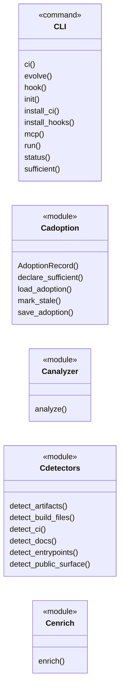
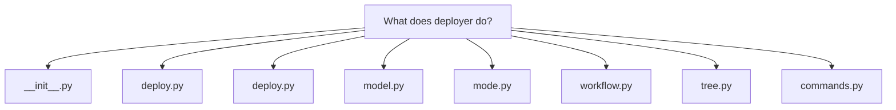
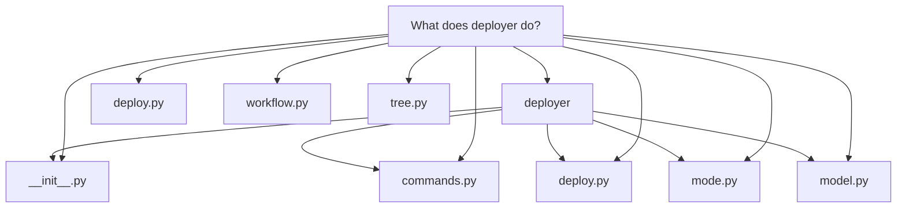
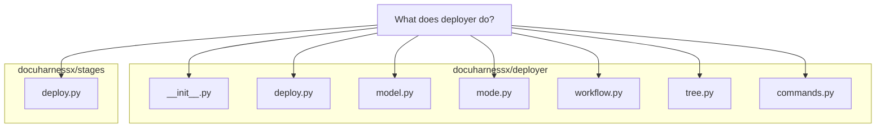

# What does deployer do?

`docuharnessx/deployer` is the **pure, model-free MkDocs deploy core** behind the <a class="dhx-term" href="glossary.md#pipeline">pipeline</a>'s Deploy stage (the "finale" of <a class="dhx-term" href="glossary.md#docuharnessx">DocuHarnessX</a>'s Ingest → … → Assemble → Deploy <a class="dhx-term" href="glossary.md#run">run</a>). Its own docstring calls it "the deterministic, harness-free deploy core behind the thin `DeployStage`

# What `deployer` does

`docuharnessx/deployer` is the **pure, model-free MkDocs deploy core** behind the <a class="dhx-term" href="glossary.md#pipeline">pipeline</a>'s Deploy stage (the "finale" of <a class="dhx-term" href="glossary.md#docuharnessx">DocuHarnessX</a>'s Ingest → … → Assemble → Deploy <a class="dhx-term" href="glossary.md#run">run</a>). Its own docstring calls it "the deterministic, harness-free deploy core behind the thin `DeployStage` adapter" (`docuharnessx/deployer/__init__.py:1`), and the adapter describes it as the place where all the real work — mode resolution, workflow rendering, target-tree writing, build validation, and the isolated `gh-deploy` push — lives (`docuharnessx/stages/deploy.py:5`).

## What it consumes

It never assembles or generates docs itself. `deploy_site` takes the frozen, read-only `AssembledSite` produced by the <a class="dhx-term" href="glossary.md#assembler">assembler</a> (its `mkdocs_yml_path`, `docs_dir`, and resolved `SiteIdentity` whose `site_url` becomes the result's `target_pages_url`), plus the resolved `target_repo` path, the <a class="dhx-term" href="glossary.md#run">run</a> `out_dir`, the already-validated `DeployMode`, and an injected `CommandRunner` (`docuharnessx/deployer/deploy.py:82`). All per-target values are consumed from that site — the <a class="dhx-term" href="glossary.md#deployer">deployer</a> never derives <a class="dhx-term" href="glossary.md#docuharnessx">DocuHarnessX</a>'s own identity and only ever writes against the *target* project (`docuharnessx/deployer/deploy.py:44`).

## The three modes

The mode set is a `Literal` in `model.py`: `"emit-ci-workflow"` (default), `"gh-deploy"`, `"build-only"` (`docuharnessx/deployer/model.py:73`). `resolve_deploy_mode` maps an operator value (or blank/`None`) onto those, defaulting empty input to `"emit-ci-workflow"` and raising `DeployInputError` naming the bad value plus valid modes otherwise (`docuharnessx/deployer/mode.py:46`). `deploy_site` then branches per mode (`docuharnessx/deployer/deploy.py:133`):

- **`emit-ci-workflow`** — reads the target's default branch, renders the GitHub Actions workflow, writes `mkdocs.yml` + `docs/` + `.github/workflows/docs.yml` into the target working tree, then runs `mkdocs build` as validation; returns a result with `status="emitted"`, the written paths, and the built path. No push, no commit (`docuharnessx/deployer/deploy.py:133`).
- **`build-only`** — runs `mkdocs build` validation only, writing nothing into the target tree; `status="built"` (`docuharnessx/deployer/deploy.py:155`).
- **`gh-deploy`** — runs the `mkdocs gh-deploy` push to the target's `gh-pages` branch, the **only network action**, invoked exactly once; `status="published"` with no written paths and no built path (`docuharnessx/deployer/deploy.py:168`).

## The deterministic sub-steps

- **`render_pages_workflow`** (`docuharnessx/deployer/workflow.py:162`) builds the `.github/workflows/docs.yml` content: a `push` trigger on the threaded-in `default_branch` plus `workflow_dispatch`, minimal permissions `contents: read` / `pages: write` / `id-token: write`, a build job using `actions/checkout@v4`, `actions/setup-python@v5`, `pip install mkdocs-material`, `mkdocs build --strict`, and `actions/upload-pages-artifact@v3` with `path: site`, and a deploy job that `needs: build`, runs in the `github-pages` environment, and uses `actions/deploy-pages@v4` (`docuharnessx/deployer/workflow.py:110`). It is pure and byte-stable via `yaml.safe_dump(..., sort_keys=False)` (`docuharnessx/deployer/workflow.py:206`).
- **`write_target_tree`** (`docuharnessx/deployer/tree.py:79`) is pure filesystem I/O: `shutil.copyfile` of the assembled `mkdocs.yml` to `<target_repo>/mkdocs.yml`, `shutil.copytree(dirs_exist_ok=True)` of `docs/`, and verbatim UTF-8 write of the workflow to `<target_repo>/.github/workflows/docs.yml`; it returns the three absolute paths in fixed order and deliberately never invokes git (`docuharnessx/deployer/tree.py:115`).
- **`commands.py`** is the only process-touching surface, isolated behind a mockable seam: `CommandRunner` is a runtime-checkable `Protocol` with `run(args, cwd, timeout=None) -> CompletedResult`, and `DefaultCommandRunner` shells out via `subprocess.run` with `shell=False`, text mode, `check=False`, and a 600 s ceiling (`docuharnessx/deployer/commands.py:107`, `:134`). `read_default_branch` reads `git symbolic-ref --short HEAD` then `git remote show origin`, degrading gracefully to `"main"` (`docuharnessx/deployer/commands.py:179`); `run_mkdocs_build` runs `mkdocs build --strict --config-file … --site-dir <out>/site/site/` and raises `DeployError` on non-zero exit (`docuharnessx/deployer/commands.py:291`); `run_mkdocs_gh_deploy` runs `mkdocs gh-deploy --config-file …` and raises `DeployError` naming the missing prerequisite on failure (`docuharnessx/deployer/commands.py:356`).

## The output seam and errors

`DeployResult` is a frozen dataclass carrying `schema_version` (pinned to `DEPLOY_RESULT_SCHEMA_VERSION = 1`), `mode`, `status`, `target_pages_url`, `written_paths` (a tuple), `built_path`, and a one-line `detail` (`docuharnessx/deployer/model.py:87`), so it is deeply immutable and hashable. `DeployError` is the base error class with `DeployInputError` as its specific input subclass (`docuharnessx/deployer/model.py:129`).

## How it is wired into the pipeline

`__init__.py` is the single public namespace re-exporting `deploy_site`, `resolve_deploy_mode`, `render_pages_workflow`, `write_target_tree`, the command-runner symbols, and the model types (`docuharnessx/deployer/__init__.py:77`). The `DeployStage` adapter (`STAGE_NAME = "deploy"`) captures the <a class="dhx-term" href="glossary.md#run">run</a> `State` on `on_task_start`, and on `on_step_end` reads `SLOT_ASSEMBLED_SITE` / `SLOT_OUTPUT_DIR` / `SLOT_TARGET_REPO`, pins `ASSEMBLED_SITE_SCHEMA_VERSION`, resolves the mode via `resolve_deploy_mode(self._deploy_mode_value())`, runs `deploy_site(...)` through an injected or default `CommandRunner`, publishes the result with `run_context.set_deploy_result(result)` into `SLOT_DEPLOY_RESULT`, and journals only a bounded scalar summary (`docuharnessx/stages/deploy.py:145`, `:184`).

In short: given an already-assembled MkDocs site, `deployer` deterministically either equips the target repo to self-publish to GitHub <a class="dhx-term" href="glossary.md#pages">Pages</a> on push (the default), merely validates a `mkdocs build`, or performs the single network `gh-deploy` push — recording a frozen `DeployResult` as the seam for the rest of the <a class="dhx-term" href="glossary.md#run">run</a>.

## Grounding

- `docuharnessx/deployer/__init__.py`
- `docuharnessx/stages/deploy.py`
- `docuharnessx/deployer/deploy.py`
- `docuharnessx/deployer/model.py`
- `docuharnessx/deployer/mode.py`
- `docuharnessx/deployer/workflow.py`
- `docuharnessx/deployer/tree.py`
- `docuharnessx/deployer/commands.py`

