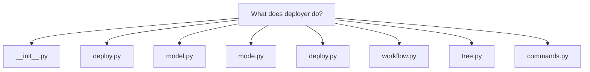
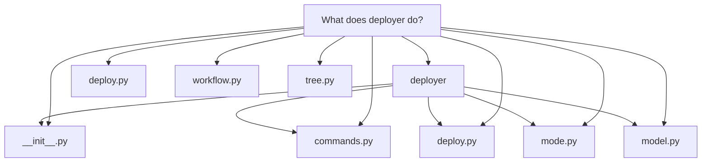
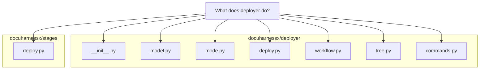

# What does deployer do?

# What `docuharnessx.deployer` does

`docuharnessx/deployer` is the **pure, model-free MkDocs deploy core** of DocuHarnessX: a deterministic, harness-free package that takes an already-assembled MkDocs site and gets it published to a *target project's* GitHub Pages. Its own docstring calls it "the deterministic, harness-free deploy core behind the thin `DeployStage` adapter" (`docuharnessx/deployer/__init__.py:3-4`), and the adapter is explicitly a thin wrapper: "all deterministic work … lives in that package" (`docuharnessx/stages/deploy.py:5-8`).

## Inputs and contract

The core consumes the frozen `AssembledSite` (from `docuharnessx.assembler.model`) *verbatim and read-only* — its `mkdocs_yml_path`, `docs_dir`, and the resolved per-target `SiteIdentity` (`site_url`, `base_path` = `/<repo>/`, `repo_url`, `repo_name`, `edit_uri`, `site_name`) — plus the run output dir and the resolved target repo path (`docuharnessx/deployer/__init__.py:4-10`). All work is directed at the **target project, never DocuHarnessX's own repo/Pages** (`docuharnessx/deployer/__init__.py:10`; `docuharnessx/stages/deploy.py:63-65`).

## Three deploy modes

The whole package is organized around one literal, `DeployMode = Literal["emit-ci-workflow", "gh-deploy", "build-only"]` (`docuharnessx/deployer/model.py:73`):

1. **`emit-ci-workflow`** (default) — writes `mkdocs.yml` + `docs/` + `.github/workflows/docs.yml` into the target working tree, *no push, no commit* (`docuharnessx/deployer/__init__.py:12-13`).
2. **`gh-deploy`** — runs `mkdocs gh-deploy` to push to the target `gh-pages` branch; this is the **only network action** in the core, isolated behind the mockable command runner and never exercised in tests (`docuharnessx/deployer/__init__.py:14-16`).
3. **`build-only`** — runs `mkdocs build` only, no publish (`docuharnessx/deployer/__init__.py:16`).

The mode resolver `resolve_deploy_mode` (`docuharnessx/deployer/mode.py:46-82`) maps the operator-configured value (from `DocgenConfig.deploy_mode` / the `--deploy-mode` flag) onto these literals: `None` or blank → the `_DEFAULT_MODE` of `"emit-ci-workflow"` (`docuharnessx/deployer/mode.py:37`, `mode.py:68-73`), a recognized value is trimmed and passed through (`mode.py:75-76`), and anything else raises `DeployInputError` naming the bad value and the valid modes, performing no deploy (`mode.py:78-82`). The valid set is derived from the literal itself via `typing.get_args(DeployMode)` so there is a single source of truth (`docuharnessx/deployer/mode.py:42-43`).

## The orchestrator: `deploy_site`

`deploy_site` (`docuharnessx/deployer/deploy.py:82-185`) is the "orchestration boundary" that wires the renderer, tree writer, and command runner together per mode (`docuharnessx/deployer/deploy.py:3-12`):

- **`emit-ci-workflow`**: `read_default_branch(target_repo, active_runner)` → `render_pages_workflow(site.identity, default_branch)` → `write_target_tree(site, target_repo, workflow_yaml)` → `run_mkdocs_build(site, active_runner)`, returning a `DeployResult` with `status="emitted"` plus the three written paths and the built path (`docuharnessx/deployer/deploy.py:133-153`).
- **`build-only`**: only `run_mkdocs_build`, returning `status="built"` with empty `written_paths` (`docuharnessx/deployer/deploy.py:155-166`).
- **`gh-deploy`**: only `run_mkdocs_gh_deploy`, returning `status="published"` with no written paths and no built path (`docuharnessx/deployer/deploy.py:168-180`).
- An unknown mode is defensive-raised as `ValueError(f"Unsupported deploy mode reached the orchestrator: {mode!r}")` (`docuharnessx/deployer/deploy.py:184`).

The runner argument defaults to a production `DefaultCommandRunner`; tests inject a fake so no real `git`/`mkdocs` process is spawned and the push is never exercised (`docuharnessx/deployer/deploy.py:130`, `deploy.py:108-113`).

## The three deterministic components

- **Workflow renderer** — `render_pages_workflow(identity, default_branch)` (`docuharnessx/deployer/workflow.py:162-214`) emits byte-stable YAML for `.github/workflows/docs.yml`: a `push` trigger on the target's default branch plus `workflow_dispatch` (`workflow.py:82-93`), minimal permissions `contents: read` / `pages: write` / `id-token: write` (`workflow.py:96-107`), a build job that checks out, sets up Python `"3.12"`, `pip install`s `mkdocs-material`, runs `mkdocs build --strict`, and uploads `site/` via `actions/upload-pages-artifact@v3` (`workflow.py:110-134`), and a deploy job that `needs` build, runs in the `github-pages` environment, and deploys via `actions/deploy-pages@v4` (`workflow.py:137-159`). Byte-stability comes from `yaml.safe_dump(..., sort_keys=False)` (`workflow.py:206-211`). Per-target values intentionally live in the assembled `mkdocs.yml`, never in the workflow (`workflow.py:186-189`).
- **Target-tree writer** — `write_target_tree(site, target_repo, workflow_yaml)` (`docuharnessx/deployer/tree.py:79-137`) copies the assembled `mkdocs.yml` to `<target>/mkdocs.yml` (`tree.py:119-120`), recursively copies `docs/` to `<target>/docs/` with `dirs_exist_ok=True` (`tree.py:125-126`), and writes the workflow to `<target>/.github/workflows/docs.yml` via `_write_text` with verbatim newlines (`tree.py:129-130`, `tree.py:67-76`). It returns the three absolute paths in a fixed deterministic order (`tree.py:132-137`). It is "pure filesystem I/O" — `shutil`/`pathlib`, no git, no subprocess; files are left staged for the operator to commit (`tree.py:31-35`, `tree.py:109-114`).
- **Command runner** — the "only process-touching surface" (`docuharnessx/deployer/commands.py:3-9`). `CommandRunner` is a runtime-checkable `Protocol` with a single `run(args, cwd, timeout=None) -> CompletedResult` method (`commands.py:106-131`); `CompletedResult` is a frozen dataclass carrying `returncode`/`stdout`/`stderr` (`commands.py:92-103`); `DefaultCommandRunner` shells out via `subprocess.run` with `shell=False`, text mode, `check=False`, and a 600 s ceiling (`commands.py:134-171`). `read_default_branch` tries `git symbolic-ref --short HEAD`, then `git remote show origin` parsed for the `HEAD branch:` line, and falls back to `"main"` when git is missing or fails (`commands.py:179-232`, `_safe_run` at `commands.py:235-253`, `_parse_remote_head_branch` at `commands.py:256-269`). `run_mkdocs_build` runs `mkdocs build --strict` with `-f <mkdocs_yml_path>` and `-d <out>/site/site/` (a nested `site` subdir under the run output tree, never the target repo), raising `DeployError` on non-zero exit or missing tooling (`commands.py:291-348`, `_built_site_dir` at `commands.py:277-288`). `run_mkdocs_gh_deploy` runs `mkdocs gh-deploy` — the one network action — and raises `DeployError` naming the missing prerequisite on failure (`commands.py:356-393`).

## The output seam

Every mode returns a frozen `DeployResult` (`docuharnessx/deployer/model.py:87-121`): `schema_version` (= `DEPLOY_RESULT_SCHEMA_VERSION`, the single version authority, `model.py:64`), `mode`, `status`, `target_pages_url` (the per-target `AssembledSite.identity.site_url`), `written_paths` (a tuple of absolute paths), `built_path`, and a one-line `detail`. `DeployStatus = Literal["emitted", "built", "published", "failed"]` (`model.py:79`). The error family is `DeployError` with subclass `DeployInputError` (`model.py:129-154`), kept independent of the other specs' error families.

## Where it plugs into the pipeline

The `DeployStage` adapter (`docuharnessx/stages/deploy.py:116-198`) is the last pipeline stage (Ingest → … → Assemble → Deploy, `stages/deploy.py:3-4`). It captures the run `State` at `on_task_start` (`stages/deploy.py:135-143`), and at `on_step_end` it reads `SLOT_ASSEMBLED_SITE`, `SLOT_OUTPUT_DIR`, and `SLOT_TARGET_REPO` through typed `RunContext` accessors, pins `ASSEMBLED_SITE_SCHEMA_VERSION`, raises `DeployInputError` on missing/unsupported inputs (`stages/deploy.py:216-263`), resolves the mode, calls `deploy_site` with an injected runner (`stages/deploy.py:184-186`), publishes the result via `run_context.set_deploy_result(result)` to `SLOT_DEPLOY_RESULT` (`stages/deploy.py:189`), and journals a *bounded* participation summary — stage, mode, status, `target_pages_url`, written-path count, built flag — never page bodies (`stages/deploy.py:296-345`).

In short: **deployer takes the assembled MkDocs site and, per the operator-chosen mode, either emits a self-publishing GitHub Actions workflow plus the site source into the target repo (default), builds the static site only, or pushes it to the target's `gh-pages` branch — with all `git`/`mkdocs` process access isolated behind one injectable command runner.**
