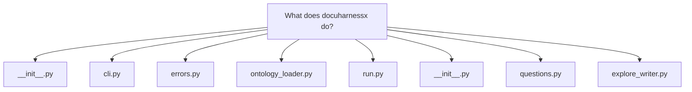
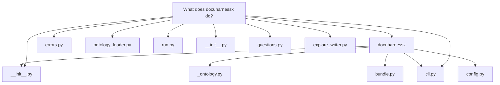
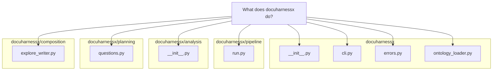

# What does docuharnessx do?

## What docuharnessx does

DocuHarnessX is a Python package whose one-line mission is stated in its own `__init__.py`: *"generate grounded developer documentation from a software repository"* (`docuharnessx/__init__.py:1`), currently at version `1.1.0` (`docuharnessx/__init__.py:5`). It turns a target repository on disk into question-answer documentation pages that must cite real source files, and it refuses to invent content that is not grounded in the code.

### The `dhx` CLI

The entry point is the `dhx` console script. `build_parser()` in `docuharnessx/cli.py:185` defines three subcommands — `run`, `init`, and `mcp` — recognized in the `_SUBCOMMANDS` set (`docuharnessx/cli.py:97`). The spec's bare form `dhx <target-repo> --out DIR --config YAML` is supported by `_normalize_argv` (`docuharnessx/cli.py:129`), which silently prepends `run` when the first token is a positional path rather than a known subcommand.

`main()` (`docuharnessx/cli.py:1032`) loads `.env` files, parses args, calls `_require_harnessx()` (`docuharnessx/cli.py:161`) which raises a typed `DependencyError` naming the exact HarnessX install command if the runtime dependency is missing, then dispatches. Every boundary failure is a subclass of `DocuHarnessXError` (`docuharnessx/errors.py:38`) — `ConfigError`, `ModelResolutionError`, `TargetRepoError`, `DependencyError`, `OntologyConfigError` — and `main` catches the whole family, prints `<ErrorType>: <message>` to stderr, and returns exit code 1 (`docuharnessx/cli.py:1099`).

### The `run` pipeline: analyze → plan → write/gate → assemble/report

`prepare_run` (`docuharnessx/cli.py:431`) validates the target is an existing directory *first* (raising `TargetRepoError`, `docuharnessx/cli.py:411`), resolves the output directory, loads the project vocabulary via `load_project_vocabulary` (`docuharnessx/ontology_loader.py:54`), builds a `DocgenConfig` via `load_config`, and optionally resolves a writer model. No model is an *honest-empty* run — zero accepted pages plus a report — not a hard failure and never outline substitution (`docuharnessx/cli.py:500`).

`orchestrate_run` (`docuharnessx/cli.py:582`) delegates to `run_pipeline` in `docuharnessx/pipeline/run.py:86`, which owns step order:

1. `scan(repo_path)` builds a `FileInventory`, and `analyze(inventory)` produces a frozen, model-free `RepoAnalysis` — the deterministic core lives in `docuharnessx/analysis/__init__.py:33` and is stdlib-only by design.
2. `plan_questions(analysis)` (`docuharnessx/planning/questions.py:166`) deterministically turns scan signals into a bounded list of software questions (startup, per-component, public surface, build/CI, tests), capped by `MAX_QUESTIONS`; no roles or models are consulted.
3. `write_questions(plan.questions, ...)` (`docuharnessx/composition/explore_writer.py:31`) runs one bounded, read-only agent harness *per question* and either returns an accepted `Page` or records a closed-set `Omission`. Missing repo → `inspection_impossible`; `model is None` → `no_model`; an empty body, a single-step run that never inspected, or a rejected substance gate become `EMPTY`, `NOT_INSPECTED`, or `GATE_REJECTED` (`docuharnessx/composition/explore_writer.py:107`). The module docstring is explicit: "The adapter never substitutes an outline body."
4. A `RunReport` is always written as `report.json` and `report.md` (`docuharnessx/pipeline/report.py:117`) containing only counts, question ids, and omission reasons — never page bodies.
5. Accepted pages are persisted under `<out>/pages/` and a question-organised MkDocs site is assembled only when accepted ≥ 1 (`_assemble_if_accepted`, `docuharnessx/pipeline/run.py:58`).

### Configuration surface

`DocgenConfig` (`docuharnessx/config.py:93`) is the frozen value object holding every operator setting: `target_repo`, `out_dir`, `roles`, `model`, `max_cost_usd`, `max_steps`, and `deploy_mode`. `load_config` (`docuharnessx/config.py:238`) reads a `--config` YAML file first (rejecting unknown keys, non-mapping roots, and malformed budgets with `ConfigError`) and then overlays CLI overrides so a command-line value wins (`_merged_value`, `docuharnessx/config.py:157`). Valid roles are never hardcoded — they come from the loaded project `Vocabulary`, defaulting to all its role ids when unselected (`docuharnessx/config.py:289`).

### Ontology and the `ontology-engine` seam

Per-project roles/intents/subjects live in `.docuharnessx/ontology.yaml` (`ONTOLOGY_CONFIG_RELPATH`, `docuharnessx/ontology_loader.py:51`). `load_project_vocabulary` (`docuharnessx/ontology_loader.py:54`) returns `(vocabulary, False)` for a valid file, `(default_profile(), True)` for a missing file, or raises `OntologyConfigError` for a present-but-invalid file. All `ontology-engine` symbols are consumed through the single shim `docuharnessx/_ontology.py:50`, which re-exports `SegmentStore`, `AxisFilter`, `Segment`, `Vocabulary`, `load_vocabulary`, `vocabulary_to_config`, and `default_profile` — so contract drift has one blast radius.

The `init` subcommand scaffolds that file: `_init_command` (`docuharnessx/cli.py:850`) delegates to `ontology_setup.run_init`, either seeding the default profile with `--default` or interactively prompting for roles, intents, and subject prefixes (`_gather_init_answers`, `docuharnessx/cli.py:834`), refusing to overwrite without `--force`.

### Harness composition and stages

The pipeline can also be expressed as a HarnessX composition. `make_docgen` (`docuharnessx/bundle.py:73`) builds a *model-free* `HarnessConfig` from three pieces: the baseline Control bundle from `harnessx.bundles.control.make_control` (cost guard + loop detection with thresholds tuned for 25–40k LOC repos, `docuharnessx/bundle.py:69`), the eight pipeline stages appended via `stages_builder()` using the `|` composition operator, and a `HarnessJournal` tracer rooted at the output directory. The canonical stage order is defined once in `STAGES` (`docuharnessx/stages/__init__.py:60`): ingest → analyze → classify → plan → write → review → assemble → deploy; `register_stages` (`docuharnessx/stages/__init__.py:108`) appends each with strictly positive `order` 1…8 so stages sort after pre-existing control processors (append-don't-replace).

### Model resolution

`resolve_model` (`docuharnessx/model_resolver.py:246`) resolves a `ModelConfig` with config-then-env precedence: a configured model id routes `claude-*`/`anthropic/*` to `AnthropicProvider`, OpenAI-shaped ids (with an `OPENAI_API_KEY`) to the native `OpenAIProvider` (chosen because it coerces empty tool-call content and fixes tool-call pairing, per the module docstring), and everything else to `LiteLLMProvider`; otherwise provider env vars (`ANTHROPIC_API_KEY`, `OPENAI_API_KEY`, `LITELLM_API_KEY` with their `*_DEFAULT_MAIN_MODEL` counterparts) are tried in that order, and a total absence raises `ModelResolutionError` (`docuharnessx/model_resolver.py:273`). The model is bound only at run time via `ModelConfig(main=...).agentic(...)` — never stored in a `HarnessConfig` (`docuharnessx/bundle.py:15`).

### Publish and refine

After a run with at least one accepted page, `_publish_if_accepted` (`docuharnessx/cli.py:523`) invokes `deploy_site` with the configured deploy mode — `emit-ci-workflow` (the default, writing `mkdocs.yml` + `docs/` + a Pages workflow without pushing, `docuharnessx/config.py:89`), `gh-deploy`, or `build-only`. Finally, `dhx mcp` (`_mcp_command`, `docuharnessx/cli.py:719`) validates the target, resolves a `RefineSession` via `resolve_session`, and serves a stdio MCP refine server over `asyncio.run(run_stdio(session))` (`docuharnessx/cli.py:704`) so an author can interactively refine the generated segments in an MCP client — with stdout kept clean as the MCP protocol channel and all logs going to stderr.

In short: DocuHarnessX scans a repo with a pure, deterministic core, plans bounded software questions, writes each answer with a read-only agent harness that must cite real files or be omitted, always emits a report, assembles a docs site only from accepted pages, optionally deploys it to GitHub Pages, and offers `init`/`mcp` commands to scaffold per-project ontology and refine the results interactively.
