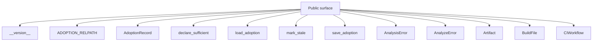
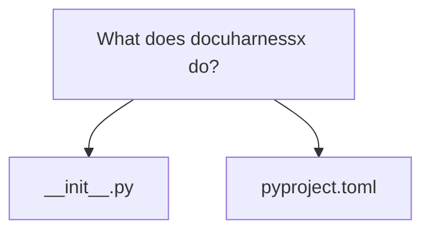
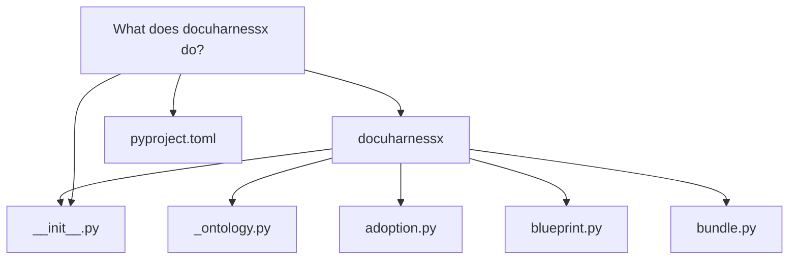
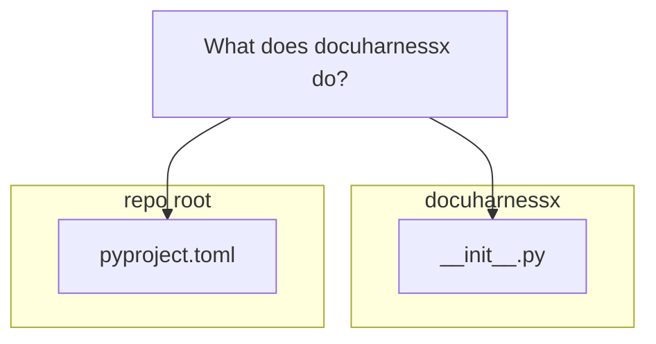

# What does [docuharnessx](glossary.md#docuharnessx) do?

[DocuHarnessX](glossary.md#docuharnessx) is a Python package — version `2.0.0` (`docuharnessx/__init__.py:5`) — whose own docstring describes it as a tool to "generate grounded [developer](glossary.md#developer) documentation from a software repository" (`docuharnessx/__init__.py:1`). In practice it is a CLI-driven [pipeline](glossary.md#pipeline) that scans a target repo, decides which software questions deserve documentation, runs bounded model agents to write those [pages](glossary.md#pages), and assembles the accepted ones into an MkDocs site. Its pyproject entry point is the console script `dhx = "docuharnessx.cli:main"` (`pyproject.toml:33`).

# What does [DocuHarnessX](glossary.md#docuharnessx) do?

[DocuHarnessX](glossary.md#docuharnessx) is a Python package — version `2.0.0` (`docuharnessx/__init__.py:5`) — whose own docstring describes it as a tool to "generate grounded [developer](glossary.md#developer) documentation from a software repository" (`docuharnessx/__init__.py:1`). In practice it is a CLI-driven [pipeline](glossary.md#pipeline) that scans a target repo, decides which software questions deserve documentation, runs bounded model agents to write those [pages](glossary.md#pages), and assembles the accepted ones into an MkDocs site. Its pyproject entry point is the console script `dhx = "docuharnessx.cli:main"` (`pyproject.toml:33`).

## The `dhx` command surface

The CLI boundary is `docuharnessx.cli` (`cli.py:1`). `main()` (`cli.py:1446`) dispatches the subcommands registered in `_SUBCOMMANDS`: `run`, `init`, `mcp`, `status`, `sufficient`, `evolve`, `hook`, `ci`, `install-hooks`, and `install-ci` (`cli.py:98-111`). It also supports the bare form `dhx <target-repo> --out DIR --config YAML` by rewriting the first positional into an implicit `run` (`cli.py:143-172`). Boundary failures are typed `DocuHarnessXError`s that `main` prints as `<ErrorType>: <message>` and maps to a non-zero exit (`cli.py:1528-1532`).

## What `dhx run` actually does

`dhx run` validates the target directory first (`cli.py:570-587`), loads the project vocabulary and a YAML config, then hands off through `orchestrate_run` to `docuharnessx.pipeline.run.run_pipeline` (`cli.py:765`, `pipeline/run.py:87`). The [pipeline](glossary.md#pipeline) is a sequential, explore-first flow (`pipeline/run.py:109-121`):

1. `scan(repo_path)` builds a bounded, deterministic `FileInventory` (`analysis/scanner.py:44-50`), excluding noise dirs like `.git`, `node_modules`, and `__pycache__` by name (`analysis/scanner.py:60-80`).
2. `analyze(inventory)` turns that inventory into a `RepoAnalysis`.
3. `plan_questions(analysis)` deterministically produces a `QuestionPlan` — bounded, model-free software questions such as "How does this program start?" and "How is this project built and verified?" (`planning/questions.py:36-41`).
4. `write_questions(...)` in `docuharnessx.composition.explore_writer` runs **one bounded writer harness per question**; a missing model omits every question with reason `no_model` rather than substituting an outline (`composition/explore_writer.py:54-58`). Accepted [pages](glossary.md#pages) go into the project's **living page store** via `store.put(page)` (`pipeline/run.py:124-125`).
5. `assemble_question_site` writes a Material-for-MkDocs source tree under `<out>/site` **only when at least one page was accepted** (`pipeline/run.py:59-84`); otherwise the [run](glossary.md#run) is an "honest-empty" zero-page report that still exits 0.

The living [pages](glossary.md#pages) persist as Markdown with YAML front-matter under `<project>/.docuharnessx/pages/`, keyed by `page_filename` (`pages/store.py:33-34, 59-97`). Accepted [pages](glossary.md#pages) live alongside MkDocs and journals inside `.docuharnessx/`, and these files are meant to be committed so docs stay versioned with the code.

## Adoption: `init`, [ontology](glossary.md#ontology), and sufficiency

`dhx init` is the onboarding path. `docuharnessx.ontology_setup.run_init` (`ontology_setup.py:142`) refuses to overwrite an existing config without `--force` (`ontology_setup.py:169-174`), builds a `Vocabulary` from either the shipped `default_profile()` or interactive answers, serializes it with `vocabulary_to_config`, writes `.docuharnessx/ontology.yaml` (`ontology_setup.py:65, 166`), round-trip validates it via `load_vocabulary`, and seeds an `AdoptionRecord` (`ontology_setup.py:202-213`). The vocabulary model itself — `roles`, `intents`, and `subject_prefixes` as frozen tuples with id-based membership checks (`ontology/vocabulary.py:53-70`) — and the default profile (10 roles, 13 intents, prefixes `component:`, `tech:`, `artifact:`, `topic:`) live in the bundled [ontology](glossary.md#ontology) engine, which `docuharnessx._ontology` deliberately re-exports as a single import site to limit contract drift (`_ontology.py:50-58`).

The adoption record is a separate file, `.docuharnessx/adoption.yaml` (`ADOPTION_RELPATH`, `adoption.py:33`), holding blueprint name/version, timestamps, a `sufficient` flag, and an optional `harness_snapshot` pointer (`adoption.py:36-51`). `load_adoption` returns `None` for a missing file rather than raising (`adoption.py:82-99`), and `mark_stale` flips a true sufficiency declaration stale whenever a living page is written (`adoption.py:135-140`; called from `pages/store.py:92-94`). The shipped blueprint identity is `docuharnessx-default` / `2.0.0` (`blueprint.py:14-15`), and `dhx sufficient` records an operator's sufficiency declaration via `declare_sufficient` (`adoption.py:115-132`; `cli.py:1199-1212`). `dhx status` computes coverage — planned vs. living question ids, omissions, and staleness — without any model (`status.py:22-40`).

## Harness [composition](glossary.md#composition) and the [pipeline](glossary.md#pipeline) [stages](glossary.md#stages)

`docuharnessx.bundle.make_docgen` (`bundle.py:73`) is the single [composition](glossary.md#composition) seam: it builds a HarnessX `HarnessConfig` by starting from the Control bundle (`make_control`, with loop-detection thresholds raised to 12/8 for 25–40k-LOC repos, `bundle.py:69-70, 117-121`), appending the eight [pipeline](glossary.md#pipeline) [stages](glossary.md#stages) with the `|` operator (`control | stages_builder()`, `bundle.py:131`), and rooting a `HarnessJournal` tracer at the output dir (`bundle.py:137`). The stage registry `STAGES` in `docuharnessx.stages` fixes the canonical order ingest → [analyze](glossary.md#analyze) → classify → plan → write → [review](glossary.md#review) → assemble → deploy (`stages/__init__.py:60-69`), each stage added with strictly positive `order` so [stages](glossary.md#stages) sort after pre-existing control processors ("append-don't-replace", `stages/__init__.py:108-132`). The config stays model-free; the CLI binds the model separately via a `ModelConfig` (`bundle.py:16-17`).

## Publication, hooks, CI, and evolution

After at least one accepted page, `_publish_if_accepted` invokes `deploy_site` with a resolved deploy mode — `emit-ci-workflow` (default), `gh-deploy`, or `build-only` (`cli.py:247-258, 687-743`). `dhx init` also installs the fail-open pre-commit [hook](glossary.md#hook) and CI wiring via `install_onboarding` (`cli.py:1176-1179`), and `dhx hook` / `dhx ci` are the incremental entry points that skip bot `[dhx]` commits and runs without credentials (`cli.py:1257-1290`; `hooks.py`, `ci_policy.py`). `dhx evolve` is the meta loop: it reads traces from `.docuharnessx/journals/`, only accepts candidates that keep the `substance_gate`, and writes the evolved processor set to `.docuharnessx/harnesses/current.yaml`, recording the snapshot on the adoption record (`evolve.py:27-60`). Finally, `dhx mcp` launches a stdio [MCP](glossary.md#mcp) server (`cli.py:885-945`) built on `docuharnessx.mcp`, letting an [MCP](glossary.md#mcp) client refine generated docs segment-by-segment through tools such as `open_workspace`.

In one sentence: [DocuHarnessX](glossary.md#docuharnessx) turns a repository into a question-organized, gate-checked, human-readable living documentation site under `.docuharnessx/`, keeps that documentation in sync through git hooks and CI, and can adapt its own generation harness from [run](glossary.md#run) journals — with the actual document writing delegated to per-question model agents on the HarnessX runtime.

## Grounding

- `docuharnessx/__init__.py`
- `pyproject.toml`

