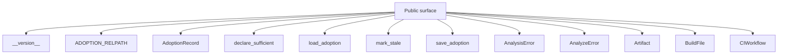
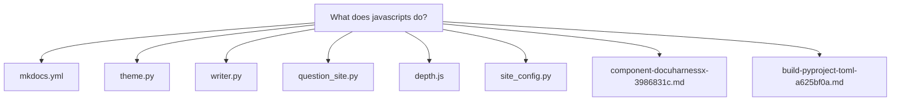
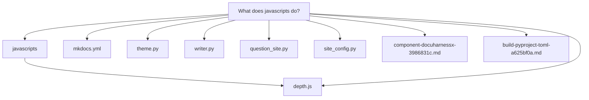
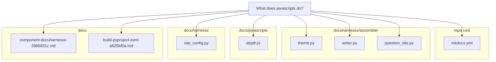

# What does [javascripts]([glossary](glossary.md#glossary).md#javascripts) do?

<div class="dhx-layer" data-min="1" markdown="1">

In this repository, `javascripts` is the single client-side script folder of the generated MkDocs site: it contains exactly one file, `docs/javascripts/depth.js`, which powers an **engineering-depth slider** that progressively discloses each documentation [page](glossary.md#page) by reader expertise.

</div>

<div class="dhx-layer" data-min="4" markdown="1">



</div>

<div class="dhx-layer" data-min="5" markdown="1">







</div>

<div class="dhx-layer" data-min="5" markdown="1">

# What does [javascripts]([glossary](glossary.md#glossary).md#javascripts) do?

In this repository, `javascripts` is the single client-side script folder of the generated MkDocs site: it contains exactly one file, `docs/javascripts/depth.js`, which powers an **engineering-depth slider** that progressively discloses each documentation [page](glossary.md#page) by reader expertise.

## How the script gets onto the [page](glossary.md#page)

`mkdocs.yml:38-39` registers it globally under `extra_javascript`:

```yaml
extra_javascript:
- javascripts/depth.js
```

so Material-for-MkDocs injects `depth.js` into every [page](glossary.md#page), not just one. The script is not hand-edited; it is a deterministic [artifact]([glossary](glossary.md#glossary).md#artifact) of the [assembler]([glossary](glossary.md#glossary).md#assembler). `docuharnessx/assembler/theme.py:20` defines `EXTRA_JS_PATH: str = "javascripts/depth.js"`, and `render_depth_js()` at `theme.py:189-191` substitutes the configured project depth into the `%DEPTH%` placeholder of the `_DEPTH_JS` template (`theme.py:126-179`). The write happens during site assembly, e.g. `docuharnessx/assembler/writer.py:243` and `docuharnessx/assembler/question_site.py:95` both call `_write_text(docs_dir / EXTRA_JS_PATH, render_depth_js(look.depth))`. The checked-in `docs/javascripts/depth.js:2` (`var DEFAULT_DEPTH = 5;`) is that template rendered with the project default `DEFAULT_DEPTH = 5` from `docuharnessx/site_config.py:36`.

## What the slider does at runtime

The whole file is an IIFE (`docs/javascripts/depth.js:1`) built around two functions.

**`apply(depth)`** (`depth.js:14-24`) is the disclosure engine:

- it clamps the choice into `1..7` (`depth.js:15`), mirroring `MIN_DEPTH = 1` / `MAX_DEPTH = 7` in `docuharnessx/site_config.py:34-35`;
- it stamps `data-dhx-depth` on `<html>` (`depth.js:16`);
- it walks every element with class `.dhx-layer` and hides each one whose `data-min` attribute is greater than the chosen depth — `el.hidden = min > n` (`depth.js:17-20`);
- it writes `n/7 <label>` into `#dhx-depth-label`, where the label comes from the `LABELS` map `1: "Adopter"` through `7: "Internals"` (`depth.js:4-12, 21-22`);
- it persists the choice under `STORAGE_KEY = "dhx-depth"` in `localStorage` (`depth.js:3, 23`).

**`mount()`** (`depth.js:26-46`) builds the control. It looks for the Material header via `.md-header__inner` and refuses to double-mount if `#dhx-depth` already exists (`depth.js:27-28`), then injects a `<label>Depth</label>`, an `<input type="range" min="1" max="7" step="1">`, and a value `<span>` (`depth.js:32-35`), appending the block to the header (`depth.js:36`). It restores the saved value from `localStorage` (`depth.js:39-42`), seeds the slider (`depth.js:43`), wires the `input` listener to `apply` (`depth.js:44`), and calls `apply(start)` once for the initial paint (`depth.js:45`). Finally it registers on `DOMContentLoaded` and — because the site enables `navigation.instant` (`mkdocs.yml:9`) — on Material's `document$` subscription stream, so the control is re-mounted after client-side navigation swaps in a new header (`depth.js:48-51`).

## What it acts on

The layered content exists on every generated [question](glossary.md#question) [page](glossary.md#page): each [page](glossary.md#page) is split into `<div class="dhx-layer" data-min="1">`, `data-min="3"`, `data-min="5"`, and `data-min="7"` sections. For example `docs/component-docuharnessx-3986831c.md:17,23,49,89` carries those four bands, from a one-paragraph adopter summary, through the `## The dhx command surface` operator-level prose at depth 5, down to the `## Grounding` file list at depth 7. `docs/build-pyproject-toml-a625bf0a.md:15,21,90,129` uses the same ladder. Setting the slider to depth 5 therefore keeps the `data-min="1"`, `"3"`, and `"5"` sections visible while hiding the `data-min="7"` internals.

The companion stylesheet makes the mechanism effective: `docs/stylesheets/extra.css:5-20` styles `.dhx-depth`, `.dhx-depth__range`, and `.dhx-depth__value` inside the header, and `extra.css:21-23` (`render_extra_css` in `theme.py:182-186`) enforces `.dhx-layer[hidden] { display: none !important; }` so the `hidden` attribute set by `apply` actually removes the deep layers from the [page](glossary.md#page).

## Verified by [tests](glossary.md#tests)

The emission is tested in `tests/test_assembler_theme.py:95-97`, which builds an assembled site and asserts `docs/javascripts/depth.js` exists and contains `dhx-depth`, and `test_depth_js_bakes_default` (`tests/test_assembler_theme.py:111-113`) checks that `render_depth_js(3)` bakes `var DEFAULT_DEPTH = 3;` — confirming the repo's checked-in `depth.js` and the generated per-project script are byte-template outputs of `docuharnessx.assembler.theme`.

In short: `javascripts/depth.js` is the depth-slider progressive disclosure widget — a header range control (1–7) that toggles the `hidden` state of each [page](glossary.md#page)'s `.dhx-layer[data-min]` sections, labels the selected band with names such as Adopter/Programmer/Internals, and remembers the reader's choice across visits.

</div>

<div class="dhx-layer" data-min="7" markdown="1">

## Grounding

- `mkdocs.yml`
- `docuharnessx/assembler/theme.py`
- `docuharnessx/assembler/writer.py`
- `docuharnessx/assembler/question_site.py`
- `docs/javascripts/depth.js`
- `docuharnessx/site_config.py`
- `docs/component-docuharnessx-3986831c.md`
- `docs/build-pyproject-toml-a625bf0a.md`
- `docs/stylesheets/extra.css`
- `tests/test_assembler_theme.py`

</div>
