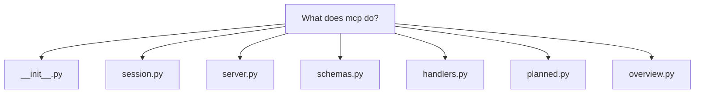
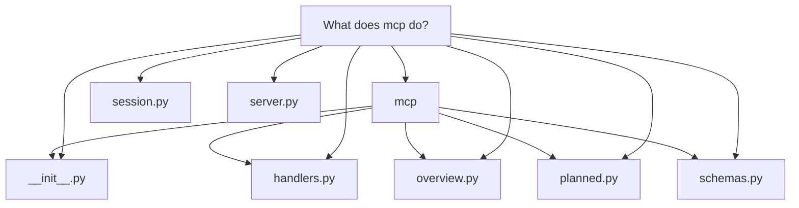

# What does mcp do?

# What `docuharnessx.mcp` does

`docuharnessx.mcp` is the **stdio MCP refine server** for DocuHarnessX: the single public namespace for an interactive, conversational documentation-refinement server. Its own module docstring says it directly: "The stdio MCP refine server" (`docuharnessx/mcp/__init__.py:1`). The workflow it supports is a second, human-in-the-loop pass after the batch pipeline: once a `dhx` run produces the role-based draft — segments persisted as `<id>.md` under `<out>/segments` and a built Material site under `<out>/site` — a human opens that output in an MCP client (opencode / Claude Code / Cursor) and refines the documentation through the tools this package exposes (`docuharnessx/mcp/__init__.py:4-9`).

## It is a thin composition layer, not a second engine

The package deliberately builds **no** second-generation engine and no RAG / embedding / vector index (`docuharnessx/mcp/__init__.py:9-16`). Every capability reuses existing core modules: the bounded agentic writer `AgenticProseRunner`, the deterministic structure gate `validate_agent_body`, `assemble_site`, and the model resolver. The public contract is the `__all__` list, which re-exports the whole surface from one namespace: `RefineSession`, `resolve_session`, `planned_from_segment`, `build_overview_blueprint`, the eight tool handlers, `build_refine_server`, and `run_stdio` (`docuharnessx/mcp/__init__.py:74-89`).

## A per-target session carries the state

The tools operate on a `RefineSession`, a dataclass holding the output dir, target repo, loaded `Vocabulary`, a `FilesystemSegmentStore` rooted at `<out>/segments`, the resolved model config (or `None`), the per-target `SiteIdentity`, optional `RepoAnalysis`, and a `min_citations` bar (`docuharnessx/mcp/session.py:66-84`). `resolve_session` validates the target directory first, defaults `out` to `<target>/.docuharnessx/out`, loads the project vocabulary, and swallows a no-model `ModelResolutionError` to `None` so the server still starts and model-touching tools degrade explicitly (`docuharnessx/mcp/session.py:99-163`).

## The tools

The server registers **nine** tools (`docuharnessx/mcp/server.py:5-14`):

- **`open_workspace`** — the agent points the server at a repo + output dir; every other tool acts on the open workspace and returns a structured `no_workspace_error` until one is open (`docuharnessx/mcp/server.py:106-126`, `docuharnessx/mcp/schemas.py:120-134`).
- **Read-only, model-free** — `list_segments`, `get_segment`, `validate_segment`, `reassemble_site`, `get_overview`. These never consult a model; they read only the session's on-disk store (`docuharnessx/mcp/handlers.py:198-252`).
- **Model-touching, gated** — `rewrite_segment`, `draft_overview`, `refine_overview`, which run the bounded `AgenticProseRunner` plus the structure gate.

Handler discipline matters: a handler never raises for an expected domain condition; it returns a structured result, e.g. `_missing_segment_error` naming the missing id (`docuharnessx/mcp/handlers.py:94-106`) or `_no_model_result` with `"no_model": True` (`docuharnessx/mcp/handlers.py:109-128`).

`rewrite_segment` is the anti-slop core: it reconstructs the stored segment's deterministic blueprint via `planned_from_segment` → `build_blueprint`, re-runs `AgenticProseRunner().run(blueprint, repo_path=session.target_repo, model=model, guidance=guidance, min_citations=...)` off the async loop via `asyncio.to_thread`, and persists the new body **only** when `validate_agent_body` accepts it — writing in place through `_replace_segment_in_place` because the store has no update method and `put` rejects an existing id (`docuharnessx/mcp/handlers.py:298-393`). The stable-id round-trip that makes this work — `segment_id(planned_from_segment(seg)) == seg.id` — is implemented in `docuharnessx/mcp/planned.py:116-142`, which re-derives the planner's `"<roles>__<intent>__<subjects-digest>"` key.

The overview capability (`draft_overview` / `refine_overview` / `get_overview`) builds an overview-shaped `CompositionBlueprint` whose four chunk headings are `Purpose / Use cases / Features / Design choices` (`OVERVIEW_SECTION_HEADINGS`, `docuharnessx/mcp/overview.py:107-112`), persists the reserved first-class entry `overview` to `<out>/segments/overview.md` via `persist_overview` / `load_overview` (`docuharnessx/mcp/overview.py:375-440`), and `reassemble_site` folds that entry back into a `ReviewReport` and calls the reused `assemble_site`, writing only under `<out>/site` (`docuharnessx/mcp/handlers.py:670-736`).

## The server factory and stdio launcher

`build_refine_server` constructs a low-level `mcp.server.Server` named `docuharnessx-refine`, registers a `@server.list_tools()` advertiser returning the typed descriptors from `schemas.tool_descriptors()`, and a single `@server.call_tool(validate_input=False)` dispatcher that validates arguments (`_str_argument`), dispatches to handlers, wraps results as MCP content, and turns unknown tools / missing arguments / unexpected exceptions into structured `CallToolResult` errors so the loop never crashes (`docuharnessx/mcp/server.py:88-203`). The typed descriptors themselves live in `docuharnessx/mcp/schemas.py:120-212`, with `TOOL_NAMES` as the name set the dispatcher checks (`docuharnessx/mcp/schemas.py:216`) and error envelopes `make_tool_error`, `unknown_tool_error`, `missing_argument_error` (`docuharnessx/mcp/schemas.py:238-271`).

`run_stdio` drives that server over the SDK's `stdio_server` transport, awaiting `Server.run` over the inherited stdin/stdout streams; it logs to stderr so stdout stays the clean MCP protocol channel, and the `dhx mcp` CLI launcher calls it via `asyncio.run` (`docuharnessx/mcp/server.py:206-233`).

In short: `mcp` turns a completed DocuHarnessX batch output into a live, model-touching refinement workspace — letting an agent open a repo, inspect and validate stored segments, rewrite them (and the project overview) with human guidance under a deterministic structure gate, and reassemble the themed Material site — all while reusing the existing core and never inventing its own generation stack.
