# Diagrams

Every picture this site assembled, in one catalog. Each also lives on the linked page, often behind the depth slider.

## Contents

- [System context](#system-context)
- [Start-here path](#start-here-path)
- [Coverage](#coverage)
- [Question map](#question-map)
- [Lineage](#lineage)
- [Pipeline](#pipeline)
- [Public surface](#public-surface)
- [How does this program start? · Question and files](#how-does-this-program-start-question-and-files)
- [How does this program start? · Structure](#how-does-this-program-start-structure)
- [How does this program start? · Files by directory](#how-does-this-program-start-files-by-directory)
- [What does docuharnessx do? · Question and files](#what-does-docuharnessx-do-question-and-files)
- [What does docuharnessx do? · Structure](#what-does-docuharnessx-do-structure)
- [What does docuharnessx do? · Files by directory](#what-does-docuharnessx-do-files-by-directory)
- [How is this project built and verified? · Question and files](#how-is-this-project-built-and-verified-question-and-files)
- [How is this project built and verified? · Structure](#how-is-this-project-built-and-verified-structure)
- [How is this project built and verified? · Files by directory](#how-is-this-project-built-and-verified-files-by-directory)
- [How are tests organized? · Question and files](#how-are-tests-organized-question-and-files)
- [How are tests organized? · Structure](#how-are-tests-organized-structure)
- [How are tests organized? · Files by directory](#how-are-tests-organized-files-by-directory)
- [How is the public surface used or extended? · Question and files](#how-is-the-public-surface-used-or-extended-question-and-files)
- [How is the public surface used or extended? · Structure](#how-is-the-public-surface-used-or-extended-structure)
- [How is the public surface used or extended? · Files by directory](#how-is-the-public-surface-used-or-extended-files-by-directory)
- [What does analysis do? · Question and files](#what-does-analysis-do-question-and-files)
- [What does analysis do? · Structure](#what-does-analysis-do-structure)
- [What does assembler do? · Question and files](#what-does-assembler-do-question-and-files)
- [What does assembler do? · Structure](#what-does-assembler-do-structure)
- [What does composition do? · Question and files](#what-does-composition-do-question-and-files)
- [What does composition do? · Structure](#what-does-composition-do-structure)
- [What does composition do? · Files by directory](#what-does-composition-do-files-by-directory)
- [What does comprehension do? · Question and files](#what-does-comprehension-do-question-and-files)
- [What does comprehension do? · Structure](#what-does-comprehension-do-structure)
- [What does comprehension do? · Files by directory](#what-does-comprehension-do-files-by-directory)
- [What does javascripts do? · Question and files](#what-does-javascripts-do-question-and-files)
- [What does javascripts do? · Structure](#what-does-javascripts-do-structure)
- [What does javascripts do? · Files by directory](#what-does-javascripts-do-files-by-directory)
- [Glossary related-term graphs](#glossary-related-term-graphs)

## System

<h3 id="system-context">System context</h3>

On [What does docuharnessx do?](component-docuharnessx-3986831c.md) at depth 1.

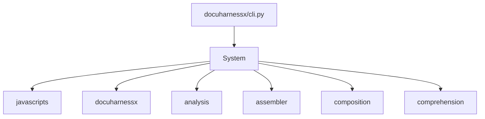

## Reading path

<h3 id="start-here-path">Start-here path</h3>

On [Home](index.md) at depth 3.

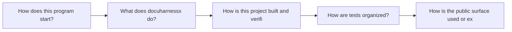

## Coverage

<h3 id="coverage">Coverage</h3>

On [Home](index.md) at depth 2.

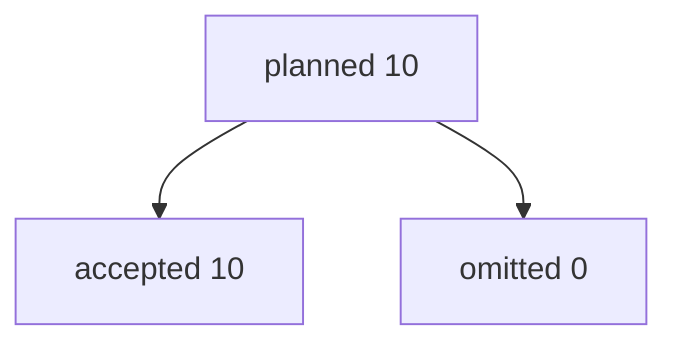

## Reading path

<h3 id="question-map">Question map</h3>

On [Home](index.md) at depth 5.

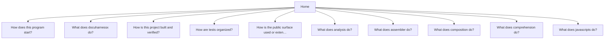

## Lineage

<h3 id="lineage">Lineage</h3>

On [Home](index.md) at depth 5.

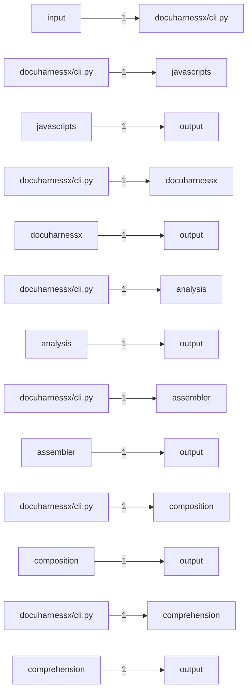

## Pipeline

<h3 id="pipeline">Pipeline</h3>

On [Home](index.md) at depth 5.

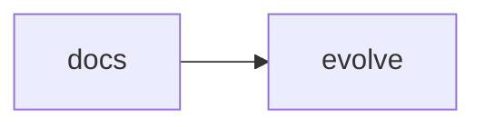

## Public surface

<h3 id="public-surface">Public surface</h3>

On [How is the public surface used or extended?](public-surface-init-py-a3934091.md) at depth 4.

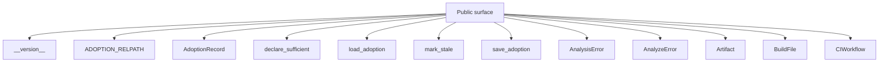

## Per question

<h3 id="how-does-this-program-start-question-and-files">How does this program start? · Question and files</h3>

On [How does this program start?](startup-cli-py-126eba90.md) at depth 5.

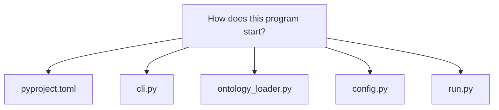

<h3 id="how-does-this-program-start-structure">How does this program start? · Structure</h3>

On [How does this program start?](startup-cli-py-126eba90.md) at depth 5.

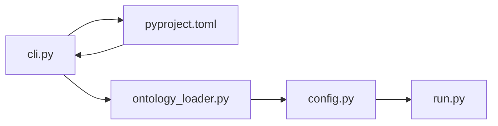

<h3 id="how-does-this-program-start-files-by-directory">How does this program start? · Files by directory</h3>

On [How does this program start?](startup-cli-py-126eba90.md) at depth 5.

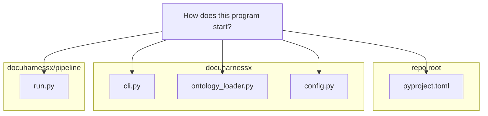

<h3 id="what-does-docuharnessx-do-question-and-files">What does docuharnessx do? · Question and files</h3>

On [What does docuharnessx do?](component-docuharnessx-3986831c.md) at depth 5.

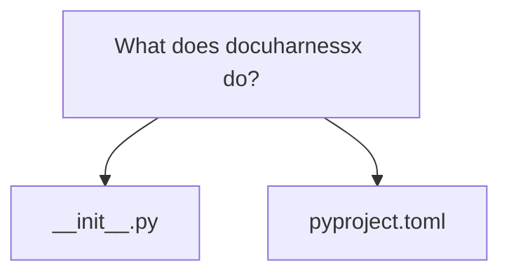

<h3 id="what-does-docuharnessx-do-structure">What does docuharnessx do? · Structure</h3>

On [What does docuharnessx do?](component-docuharnessx-3986831c.md) at depth 5.

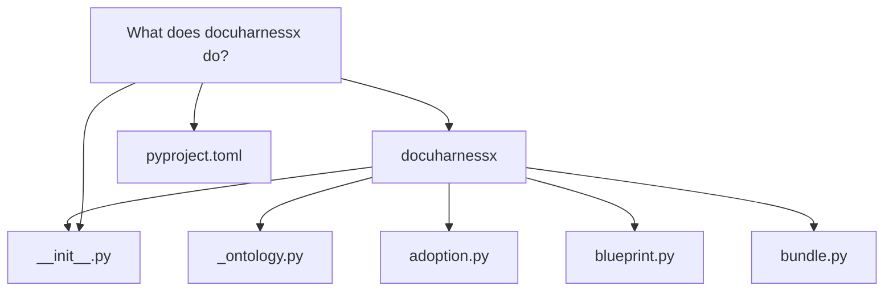

<h3 id="what-does-docuharnessx-do-files-by-directory">What does docuharnessx do? · Files by directory</h3>

On [What does docuharnessx do?](component-docuharnessx-3986831c.md) at depth 5.

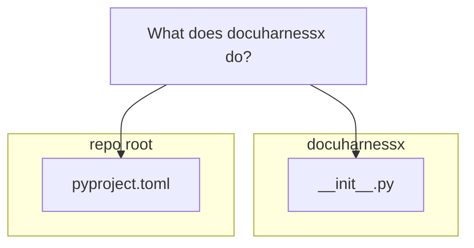

<h3 id="how-is-this-project-built-and-verified-question-and-files">How is this project built and verified? · Question and files</h3>

On [How is this project built and verified?](build-pyproject-toml-a625bf0a.md) at depth 5.

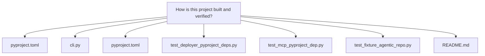

<h3 id="how-is-this-project-built-and-verified-structure">How is this project built and verified? · Structure</h3>

On [How is this project built and verified?](build-pyproject-toml-a625bf0a.md) at depth 5.

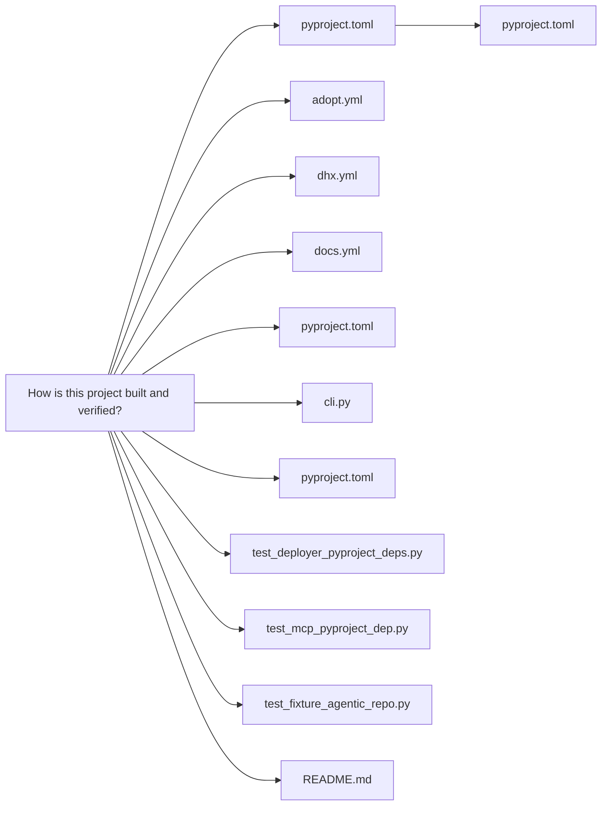

<h3 id="how-is-this-project-built-and-verified-files-by-directory">How is this project built and verified? · Files by directory</h3>

On [How is this project built and verified?](build-pyproject-toml-a625bf0a.md) at depth 5.

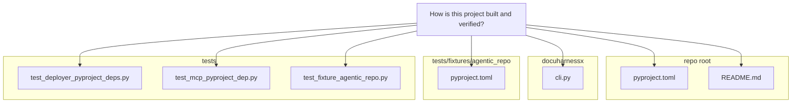

<h3 id="how-are-tests-organized-question-and-files">How are tests organized? · Question and files</h3>

On [How are tests organized?](tests-tests-37e0cc9c.md) at depth 5.

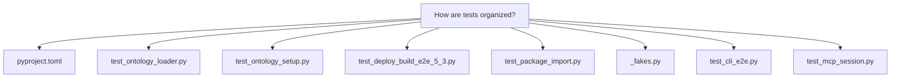

<h3 id="how-are-tests-organized-structure">How are tests organized? · Structure</h3>

On [How are tests organized?](tests-tests-37e0cc9c.md) at depth 5.

```mermaid
flowchart TB
  n0["How are tests organized?"]
  n1["tests"]
  n2["tests/ontology/test_errors.py"]
  n3["tests/ontology/test_hardening.py"]
  n4["tests/ontology/test_model.py"]
  n5["tests/ontology/test_normalize_prefix.py"]
  n6["tests/ontology/test_package_import.py"]
  n7["tests/ontology/test_public_api.py"]
  n8["tests/ontology/test_schema.py"]
  n9["pytest"]
  n10["pyproject.toml"]
  n11["test_ontology_loader.py"]
  n12["test_ontology_setup.py"]
  n13["test_deploy_build_e2e_5_3.py"]
  n14["test_package_import.py"]
  n15["_fakes.py"]
  n16["test_cli_e2e.py"]
  n17["test_mcp_session.py"]
  n0 --> n1
  n0 --> n2
  n0 --> n3
  n0 --> n4
  n0 --> n5
  n0 --> n6
  n0 --> n7
  n0 --> n8
  n0 --> n9
  n0 --> n10
  n0 --> n11
  n0 --> n12
  n0 --> n13
  n0 --> n14
  n0 --> n15
  n0 --> n16
  n0 --> n17
```

<h3 id="how-are-tests-organized-files-by-directory">How are tests organized? · Files by directory</h3>

On [How are tests organized?](tests-tests-37e0cc9c.md) at depth 5.

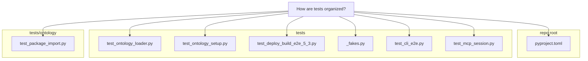

<h3 id="how-is-the-public-surface-used-or-extended-question-and-files">How is the public surface used or extended? · Question and files</h3>

On [How is the public surface used or extended?](public-surface-init-py-a3934091.md) at depth 5.

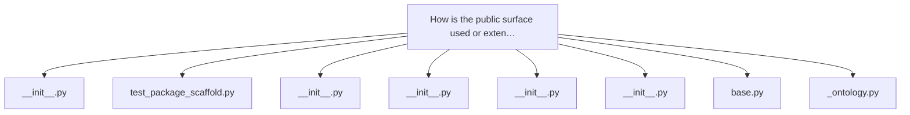

<h3 id="how-is-the-public-surface-used-or-extended-structure">How is the public surface used or extended? · Structure</h3>

On [How is the public surface used or extended?](public-surface-init-py-a3934091.md) at depth 5.

```mermaid
flowchart TB
  n0["How is the public surface used or exten…"]
  n1["__version__"]
  n2["AnalysisError"]
  n3["AnalyzeError"]
  n4["Artifact"]
  n5["BuildFile"]
  n6["CIWorkflow"]
  n7["Component"]
  n8["DEFAULT_EXCLUDED_DIRS"]
  n0 --> n1
  n0 --> n2
  n0 --> n3
  n0 --> n4
  n0 --> n5
  n0 --> n6
  n0 --> n7
  n0 --> n8
```

<h3 id="how-is-the-public-surface-used-or-extended-files-by-directory">How is the public surface used or extended? · Files by directory</h3>

On [How is the public surface used or extended?](public-surface-init-py-a3934091.md) at depth 5.

```mermaid
flowchart TB
  page["How is the public surface used or exten…"]
  subgraph d0["docuharnessx"]
    e0["__init__.py"]
    e1["_ontology.py"]
  end
  subgraph d1["tests"]
    e2["test_package_scaffold.py"]
  end
  subgraph d2["docuharnessx/mcp"]
    e3["__init__.py"]
  end
  subgraph d3["docuharnessx/analysis"]
    e4["__init__.py"]
  end
  subgraph d4["docuharnessx/ontology"]
    e5["__init__.py"]
  end
  subgraph d5["docuharnessx/planning"]
    e6["__init__.py"]
  end
  subgraph d6["docuharnessx/stages"]
    e7["base.py"]
  end
  page --> e0
  page --> e1
  page --> e2
  page --> e3
  page --> e4
  page --> e5
  page --> e6
  page --> e7
```

<h3 id="what-does-analysis-do-question-and-files">What does analysis do? · Question and files</h3>

On [What does analysis do?](component-analysis-5fb37dc2.md) at depth 5.

```mermaid
flowchart TB
  n0["What does analysis do?"]
  n1["__init__.py"]
  n2["analyzer.py"]
  n3["scanner.py"]
  n4["languages.py"]
  n5["model.py"]
  n6["detectors.py"]
  n7["enrich.py"]
  n8["errors.py"]
  n0 --> n1
  n0 --> n2
  n0 --> n3
  n0 --> n4
  n0 --> n5
  n0 --> n6
  n0 --> n7
  n0 --> n8
```

<h3 id="what-does-analysis-do-structure">What does analysis do? · Structure</h3>

On [What does analysis do?](component-analysis-5fb37dc2.md) at depth 5.

```mermaid
flowchart TB
  n0["What does analysis do?"]
  n1["analysis"]
  n2["__init__.py"]
  n3["analyzer.py"]
  n4["detectors.py"]
  n5["enrich.py"]
  n6["errors.py"]
  n7["scanner.py"]
  n8["languages.py"]
  n9["model.py"]
  n0 --> n1
  n1 --> n2
  n1 --> n3
  n1 --> n4
  n1 --> n5
  n1 --> n6
  n0 --> n2
  n0 --> n3
  n0 --> n7
  n0 --> n8
  n0 --> n9
  n0 --> n4
  n0 --> n5
  n0 --> n6
```

<h3 id="what-does-assembler-do-question-and-files">What does assembler do? · Question and files</h3>

On [What does assembler do?](component-assembler-d9228a8c.md) at depth 5.

```mermaid
flowchart TB
  n0["What does assembler do?"]
  n1["__init__.py"]
  n2["identity.py"]
  n3["writer.py"]
  n4["pages.py"]
  n5["roles.py"]
  n6["home.py"]
  n7["graphs.py"]
  n8["mkdocs_config.py"]
  n0 --> n1
  n0 --> n2
  n0 --> n3
  n0 --> n4
  n0 --> n5
  n0 --> n6
  n0 --> n7
  n0 --> n8
```

<h3 id="what-does-assembler-do-structure">What does assembler do? · Structure</h3>

On [What does assembler do?](component-assembler-d9228a8c.md) at depth 5.

```mermaid
flowchart TB
  n0["What does assembler do?"]
  n1["assembler"]
  n2["__init__.py"]
  n3["depth.py"]
  n4["graphs.py"]
  n5["home.py"]
  n6["identity.py"]
  n7["writer.py"]
  n8["pages.py"]
  n9["roles.py"]
  n10["mkdocs_config.py"]
  n0 --> n1
  n1 --> n2
  n1 --> n3
  n1 --> n4
  n1 --> n5
  n1 --> n6
  n0 --> n2
  n0 --> n6
  n0 --> n7
  n0 --> n8
  n0 --> n9
  n0 --> n5
  n0 --> n4
  n0 --> n10
```

<h3 id="what-does-composition-do-question-and-files">What does composition do? · Question and files</h3>

On [What does composition do?](component-composition-e6f778c7.md) at depth 5.

```mermaid
flowchart TB
  n0["What does composition do?"]
  n1["__init__.py"]
  n2["write.py"]
  n3["blueprint.py"]
  n4["model.py"]
  n5["prompt.py"]
  n6["prose.py"]
  n7["fallback.py"]
  n8["wiring.py"]
  n0 --> n1
  n0 --> n2
  n0 --> n3
  n0 --> n4
  n0 --> n5
  n0 --> n6
  n0 --> n7
  n0 --> n8
```

<h3 id="what-does-composition-do-structure">What does composition do? · Structure</h3>

On [What does composition do?](component-composition-e6f778c7.md) at depth 5.

```mermaid
flowchart TB
  n0["What does composition do?"]
  n1["composition"]
  n2["__init__.py"]
  n3["agent.py"]
  n4["blueprint.py"]
  n5["budgets.py"]
  n6["explore_writer.py"]
  n7["write.py"]
  n8["model.py"]
  n9["prompt.py"]
  n10["prose.py"]
  n11["fallback.py"]
  n12["wiring.py"]
  n0 --> n1
  n1 --> n2
  n1 --> n3
  n1 --> n4
  n1 --> n5
  n1 --> n6
  n0 --> n2
  n0 --> n7
  n0 --> n4
  n0 --> n8
  n0 --> n9
  n0 --> n10
  n0 --> n11
  n0 --> n12
```

<h3 id="what-does-composition-do-files-by-directory">What does composition do? · Files by directory</h3>

On [What does composition do?](component-composition-e6f778c7.md) at depth 5.

```mermaid
flowchart TB
  page["What does composition do?"]
  subgraph d0["docuharnessx/composition"]
    e0["__init__.py"]
    e1["blueprint.py"]
    e2["model.py"]
    e3["prompt.py"]
    e4["prose.py"]
    e5["fallback.py"]
    e6["wiring.py"]
  end
  subgraph d1["docuharnessx/stages"]
    e7["write.py"]
  end
  page --> e0
  page --> e1
  page --> e2
  page --> e3
  page --> e4
  page --> e5
  page --> e6
  page --> e7
```

<h3 id="what-does-comprehension-do-question-and-files">What does comprehension do? · Question and files</h3>

On [What does comprehension do?](component-comprehension-87225edb.md) at depth 5.

```mermaid
flowchart TB
  n0["What does comprehension do?"]
  n1["__init__.py"]
  n2["question_site.py"]
  n3["detect.py"]
  n4["signals.py"]
  n5["glossary.py"]
  n6["autolink.py"]
  n7["compliance.py"]
  n8["graphs.py"]
  n0 --> n1
  n0 --> n2
  n0 --> n3
  n0 --> n4
  n0 --> n5
  n0 --> n6
  n0 --> n7
  n0 --> n8
```

<h3 id="what-does-comprehension-do-structure">What does comprehension do? · Structure</h3>

On [What does comprehension do?](component-comprehension-87225edb.md) at depth 5.

```mermaid
flowchart TB
  n0["What does comprehension do?"]
  n1["comprehension"]
  n2["__init__.py"]
  n3["autolink.py"]
  n4["compliance.py"]
  n5["detect.py"]
  n6["glossary.py"]
  n7["question_site.py"]
  n8["signals.py"]
  n9["graphs.py"]
  n0 --> n1
  n1 --> n2
  n1 --> n3
  n1 --> n4
  n1 --> n5
  n1 --> n6
  n0 --> n2
  n0 --> n7
  n0 --> n5
  n0 --> n8
  n0 --> n6
  n0 --> n3
  n0 --> n4
  n0 --> n9
```

<h3 id="what-does-comprehension-do-files-by-directory">What does comprehension do? · Files by directory</h3>

On [What does comprehension do?](component-comprehension-87225edb.md) at depth 5.

```mermaid
flowchart TB
  page["What does comprehension do?"]
  subgraph d0["docuharnessx/comprehension"]
    e0["__init__.py"]
    e1["detect.py"]
    e2["signals.py"]
    e3["glossary.py"]
    e4["autolink.py"]
    e5["compliance.py"]
    e6["graphs.py"]
  end
  subgraph d1["docuharnessx/assembler"]
    e7["question_site.py"]
  end
  page --> e0
  page --> e1
  page --> e2
  page --> e3
  page --> e4
  page --> e5
  page --> e6
  page --> e7
```

<h3 id="what-does-javascripts-do-question-and-files">What does javascripts do? · Question and files</h3>

On [What does javascripts do?](component-javascripts-2aa9650e.md) at depth 5.

```mermaid
flowchart TB
  n0["What does javascripts do?"]
  n1["mkdocs.yml"]
  n2["theme.py"]
  n3["writer.py"]
  n4["question_site.py"]
  n5["depth.js"]
  n6["site_config.py"]
  n7["component-docuharnessx-3986831c.md"]
  n8["build-pyproject-toml-a625bf0a.md"]
  n0 --> n1
  n0 --> n2
  n0 --> n3
  n0 --> n4
  n0 --> n5
  n0 --> n6
  n0 --> n7
  n0 --> n8
```

<h3 id="what-does-javascripts-do-structure">What does javascripts do? · Structure</h3>

On [What does javascripts do?](component-javascripts-2aa9650e.md) at depth 5.

```mermaid
flowchart TB
  n0["What does javascripts do?"]
  n1["javascripts"]
  n2["depth.js"]
  n3["mkdocs.yml"]
  n4["theme.py"]
  n5["writer.py"]
  n6["question_site.py"]
  n7["site_config.py"]
  n8["component-docuharnessx-3986831c.md"]
  n9["build-pyproject-toml-a625bf0a.md"]
  n0 --> n1
  n1 --> n2
  n0 --> n3
  n0 --> n4
  n0 --> n5
  n0 --> n6
  n0 --> n2
  n0 --> n7
  n0 --> n8
  n0 --> n9
```

<h3 id="what-does-javascripts-do-files-by-directory">What does javascripts do? · Files by directory</h3>

On [What does javascripts do?](component-javascripts-2aa9650e.md) at depth 5.

```mermaid
flowchart TB
  page["What does javascripts do?"]
  subgraph d0["repo root"]
    e0["mkdocs.yml"]
  end
  subgraph d1["docuharnessx/assembler"]
    e1["theme.py"]
    e2["writer.py"]
    e3["question_site.py"]
  end
  subgraph d2["docs/javascripts"]
    e4["depth.js"]
  end
  subgraph d3["docuharnessx"]
    e5["site_config.py"]
  end
  subgraph d4["docs"]
    e6["component-docuharnessx-3986831c.md"]
    e7["build-pyproject-toml-a625bf0a.md"]
  end
  page --> e0
  page --> e1
  page --> e2
  page --> e3
  page --> e4
  page --> e5
  page --> e6
  page --> e7
```

<h2 id="glossary-related-term-graphs">Glossary related-term graphs</h2>

Small related-term pictures live on the glossary entries:

- [aggregate](glossary.md#aggregate)
- [analysis](glossary.md#analysis)
- [analyze](glossary.md#analyze)
- [assembler](glossary.md#assembler)
- [composition](glossary.md#composition)
- [comprehension](glossary.md#comprehension)
- [--config](glossary.md#config)
- [--default](glossary.md#default)
- [deployer](glossary.md#deployer)
- [docuharnessx](glossary.md#docuharnessx)
- [enrich](glossary.md#enrich)
- [--force](glossary.md#force)
- [hook](glossary.md#hook)
- [init](glossary.md#init)
- [install-ci](glossary.md#install-ci)
- [install-hooks](glossary.md#install-hooks)
- [javascripts](glossary.md#javascripts)
- [main](glossary.md#main)
- [mcp](glossary.md#mcp)
- [ontology](glossary.md#ontology)
- [--out](glossary.md#out)
- [pages](glossary.md#pages)
- [pipeline](glossary.md#pipeline)
- [planning](glossary.md#planning)
- [review](glossary.md#review)
- [run](glossary.md#run)
- [scan](glossary.md#scan)
- [stages](glossary.md#stages)
- [status](glossary.md#status)
- [sufficient](glossary.md#sufficient)
