# Diagrams

Every picture this site assembled, in one catalog. Each also lives on the linked page, often behind the depth slider.

<h2 id="conceptual-map">Conceptual map</h2>

On [What does docuharnessx do?](component-docuharnessx-3986831c.md) at depth 1.

<div class="dhx-jit" markdown="0">
<p class="dhx-jit__hint">Click a node to recenter the map.</p>
<textarea class="dhx-jit__data" hidden readonly>{"children": [{"children": [{"children": [], "data": {"kind": "actor", "level": "context"}, "id": "actor:operator", "name": "Operator"}], "data": {"kind": "group"}, "id": "group:people", "name": "People"}, {"children": [{"children": [], "data": {"kind": "container", "level": "container"}, "id": "container:CLI", "name": "CLI"}, {"children": [], "data": {"kind": "container", "level": "container"}, "id": "container:mcp", "name": "mcp"}], "data": {"kind": "band"}, "id": "band:interface", "name": "Interface"}, {"children": [{"children": [], "data": {"kind": "container", "level": "container"}, "id": "container:assembler", "name": "assembler"}, {"children": [], "data": {"kind": "container", "level": "container"}, "id": "container:composition", "name": "composition"}, {"children": [], "data": {"kind": "container", "level": "container"}, "id": "container:deployer", "name": "deployer"}, {"children": [], "data": {"kind": "container", "level": "container"}, "id": "container:pipeline", "name": "pipeline"}, {"children": [], "data": {"kind": "container", "level": "container"}, "id": "container:planning", "name": "planning"}, {"children": [], "data": {"kind": "container", "level": "container"}, "id": "container:review", "name": "review"}], "data": {"kind": "band"}, "id": "band:application", "name": "Application"}, {"children": [{"children": [], "data": {"kind": "container", "level": "container"}, "id": "container:analysis", "name": "analysis"}, {"children": [], "data": {"kind": "container", "level": "container"}, "id": "container:comprehension", "name": "comprehension"}, {"children": [], "data": {"kind": "container", "level": "container"}, "id": "container:ontology", "name": "ontology"}], "data": {"kind": "band"}, "id": "band:domain", "name": "Domain"}, {"children": [{"children": [], "data": {"kind": "external", "level": "context"}, "id": "external:ci", "name": "GitHub Actions"}, {"children": [], "data": {"kind": "store", "level": "context"}, "id": "external:docs", "name": "Documentation site"}, {"children": [], "data": {"kind": "store", "level": "context"}, "id": "external:repo", "name": "norandom/DocuHarnessX"}], "data": {"kind": "group"}, "id": "group:external", "name": "External"}], "data": {"kind": "system"}, "id": "system", "name": "DocuHarnessX"}</textarea>
<div id="dhx-jit-conceptual" class="dhx-jit__stage"></div>
</div>

## Contents

- [Conceptual map](#conceptual-map)
- [System context](#system-context)
- [Containers](#containers)
- [Layered architecture](#layered-architecture)
- [Typical run](#typical-run)
- [Use cases](#use-cases)
- [Deployment](#deployment)
- [Public surface](#public-surface)
- [Lineage](#lineage)
- [Pipeline](#pipeline)
- [Requirements](#requirements)
- [Start-here path](#start-here-path)
- [Question map](#question-map)
- [Coverage](#coverage)
- [How are tests organized? · Files by directory](#how-are-tests-organized-files-by-directory)
- [How are tests organized? · Question and files](#how-are-tests-organized-question-and-files)
- [How are tests organized? · Structure](#how-are-tests-organized-structure)
- [How does this program start? · Files by directory](#how-does-this-program-start-files-by-directory)
- [How does this program start? · Question and files](#how-does-this-program-start-question-and-files)
- [How does this program start? · Structure](#how-does-this-program-start-structure)
- [How is the public surface used or extended? · Files by directory](#how-is-the-public-surface-used-or-extended-files-by-directory)
- [How is the public surface used or extended? · Question and files](#how-is-the-public-surface-used-or-extended-question-and-files)
- [How is the public surface used or extended? · Structure](#how-is-the-public-surface-used-or-extended-structure)
- [How is this project built and verified? · Files by directory](#how-is-this-project-built-and-verified-files-by-directory)
- [How is this project built and verified? · Question and files](#how-is-this-project-built-and-verified-question-and-files)
- [How is this project built and verified? · Structure](#how-is-this-project-built-and-verified-structure)
- [What does analysis do? · Question and files](#what-does-analysis-do-question-and-files)
- [What does analysis do? · Structure](#what-does-analysis-do-structure)
- [What does assembler do? · Question and files](#what-does-assembler-do-question-and-files)
- [What does assembler do? · Structure](#what-does-assembler-do-structure)
- [What does composition do? · Files by directory](#what-does-composition-do-files-by-directory)
- [What does composition do? · Question and files](#what-does-composition-do-question-and-files)
- [What does composition do? · Structure](#what-does-composition-do-structure)
- [What does comprehension do? · Files by directory](#what-does-comprehension-do-files-by-directory)
- [What does comprehension do? · Question and files](#what-does-comprehension-do-question-and-files)
- [What does comprehension do? · Structure](#what-does-comprehension-do-structure)
- [What does deployer do? · Files by directory](#what-does-deployer-do-files-by-directory)
- [What does deployer do? · Question and files](#what-does-deployer-do-question-and-files)
- [What does deployer do? · Structure](#what-does-deployer-do-structure)
- [What does docuharnessx do? · Files by directory](#what-does-docuharnessx-do-files-by-directory)
- [What does docuharnessx do? · Question and files](#what-does-docuharnessx-do-question-and-files)
- [What does docuharnessx do? · Structure](#what-does-docuharnessx-do-structure)
- [What does javascripts do? · Files by directory](#what-does-javascripts-do-files-by-directory)
- [What does javascripts do? · Question and files](#what-does-javascripts-do-question-and-files)
- [What does javascripts do? · Structure](#what-does-javascripts-do-structure)
- [What does mcp do? · Question and files](#what-does-mcp-do-question-and-files)
- [What does mcp do? · Structure](#what-does-mcp-do-structure)
- [Glossary related-term graphs](#glossary-related-term-graphs)

## Architecture

<h3 id="system-context">System context</h3>

On [What does docuharnessx do?](component-docuharnessx-3986831c.md) at depth 2.

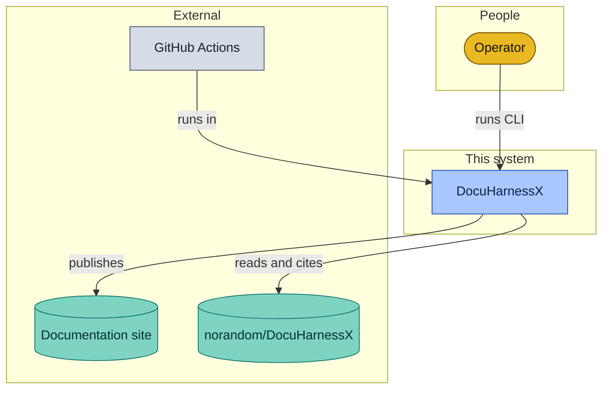

<h3 id="containers">Containers</h3>

On [What does docuharnessx do?](component-docuharnessx-3986831c.md) at depth 2.

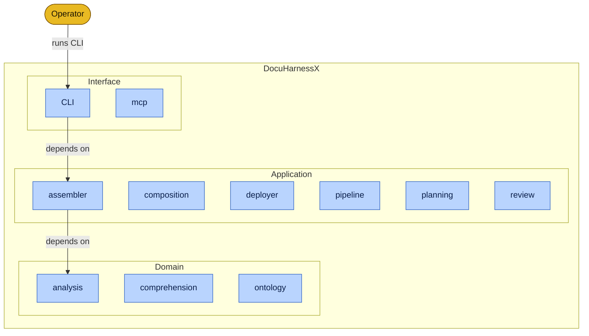

<h3 id="layered-architecture">Layered architecture</h3>

On [What does docuharnessx do?](component-docuharnessx-3986831c.md) at depth 2. Detected from entrypoint:CLI, analysis:domain, assembler:application, composition:application, comprehension:domain, deployer:application, mcp:interface, ontology:domain.

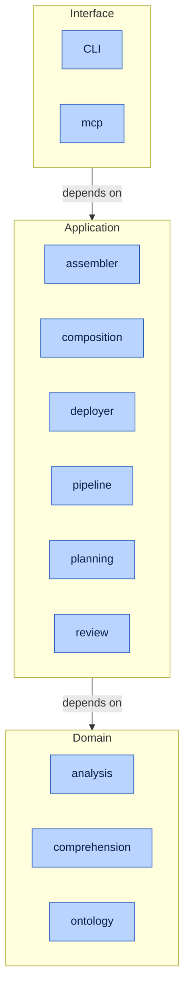

<h3 id="typical-run">Typical run</h3>

On [How does this program start?](startup-cli-py-126eba90.md) at depth 3.

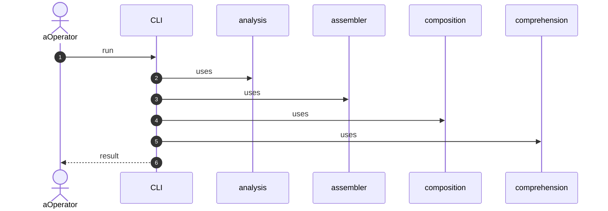

<h3 id="use-cases">Use cases</h3>

On [What does docuharnessx do?](component-docuharnessx-3986831c.md) at depth 3.

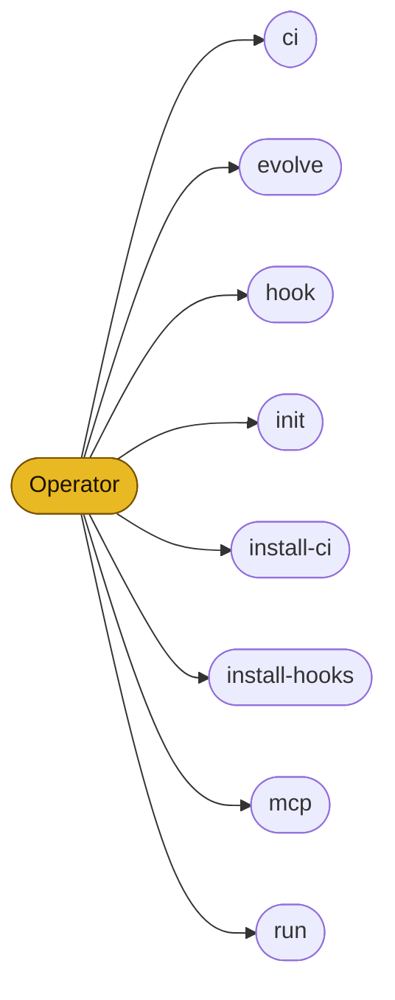

<h3 id="deployment">Deployment</h3>

On [What does docuharnessx do?](component-docuharnessx-3986831c.md) at depth 3.

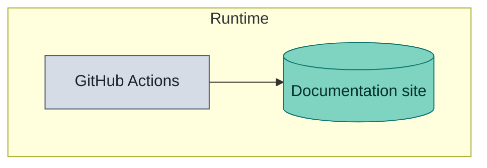

<h3 id="public-surface">Public surface</h3>

On [How is the public surface used or extended?](public-surface-init-py-a3934091.md) at depth 4.

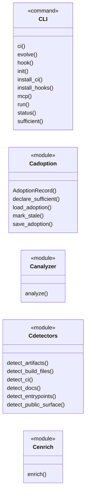

<h3 id="lineage">Lineage</h3>

On [Home](index.md) at depth 5.

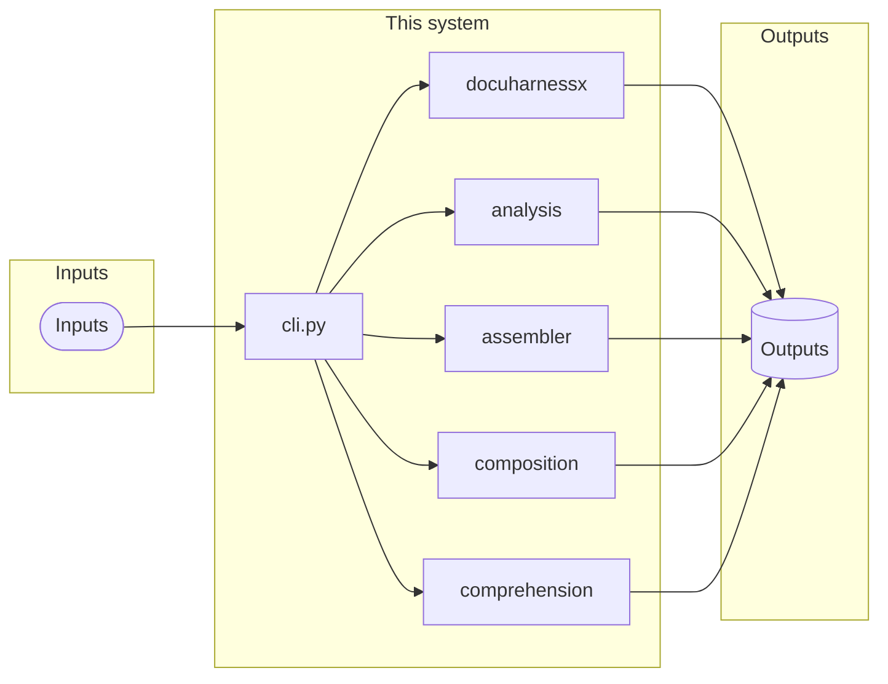

<h3 id="pipeline">Pipeline</h3>

On [Home](index.md) at depth 5.

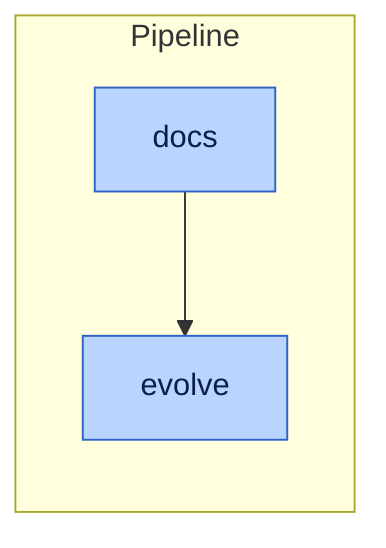

## Requirements

Harvested requirement sentences from the repository. A card is linked when a name overlaps a part of the architecture; otherwise it stays unlinked. This is not a certification.

- 1. For each planned segment, the Write stage shall run a real HarnessX agentic loop that — unlinked
 From `.kiro/specs/agentic-codebase-writer/requirements.md`.
- 1. The Write stage module shall keep the stable `STAGE_NAME` value `"write"`, the — unlinked
 From `.kiro/specs/agentic-codebase-writer/requirements.md`.
- 1. The Write stage shall read the `CoveragePlan`, the optional repository analysis, the — analysis
 From `.kiro/specs/agentic-codebase-writer/requirements.md`.
- 1. The Write stage shall seed each agentic run's prompt with the existing deterministic — unlinked
 From `.kiro/specs/agentic-codebase-writer/requirements.md`.
- 2. If the coverage-plan slot is unset when a run state is bound, the Write stage shall raise — unlinked
 From `.kiro/specs/agentic-codebase-writer/requirements.md`.
- 2. The Write stage shall give the agent a file-system view rooted at the target repository in — unlinked
 From `.kiro/specs/agentic-codebase-writer/requirements.md`.
- 2. The Write stage's task prompt shall instruct the agent to include at least one valid — unlinked
 From `.kiro/specs/agentic-codebase-writer/requirements.md`.
- 2. When the Write stage participates in the pipeline, the Write stage shall do its work as a — pipeline
 From `.kiro/specs/agentic-codebase-writer/requirements.md`.
- 3. The Write stage shall scope each agentic run's task prompt to the segment's planner — unlinked
 From `.kiro/specs/agentic-codebase-writer/requirements.md`.
- 3. The Write stage's task prompt shall instruct the agent to cite real `file:line` sources so — unlinked
 From `.kiro/specs/agentic-codebase-writer/requirements.md`.
- 4. The Write stage shall obtain the live run state from the task-start event and read its — unlinked
 From `.kiro/specs/agentic-codebase-writer/requirements.md`.
- 4. When the agent returns a body, the Write stage shall validate that the body contains at — unlinked
 From `.kiro/specs/agentic-codebase-writer/requirements.md`.
- 4. While the agent runs, the Write stage shall make the tool outputs (read/grep/glob/bash — unlinked
 From `.kiro/specs/agentic-codebase-writer/requirements.md`.
- 5. The Write stage shall use the final agent answer as the source of the segment body. — unlinked
 From `.kiro/specs/agentic-codebase-writer/requirements.md`.
- 5. The agentic-codebase-writer shall not modify the stage registry, the `make_docgen` bundle — unlinked
 From `.kiro/specs/agentic-codebase-writer/requirements.md`.
- 5. When a body passes structure validation, the Write stage shall use it verbatim as the — unlinked
 From `.kiro/specs/agentic-codebase-writer/requirements.md`.
- 5. Where the repository-analysis slot is unset, the Write stage shall tolerate the absence — analysis
 From `.kiro/specs/agentic-codebase-writer/requirements.md`.
- 6. The agentic-codebase-writer shall not build or rely on any embedding, vector index, or — unlinked
 From `.kiro/specs/agentic-codebase-writer/requirements.md`.
- Write stage shall raise a writer input error naming the missing slot and produce no — unlinked
 From `.kiro/specs/agentic-codebase-writer/requirements.md`.
- Write stage shall raise a writer input error naming the unsupported version and produce no — unlinked
 From `.kiro/specs/agentic-codebase-writer/requirements.md`.
- Write stage shall record a deterministic flag and fall back to the deterministic body for — unlinked
 From `.kiro/specs/agentic-codebase-writer/requirements.md`.
- `file:line` citations, and shall treat a body that fails this validation as an unusable — unlinked
 From `.kiro/specs/agentic-codebase-writer/requirements.md`.
- retrieval-augmented store; repository context shall be obtained agentically through the — unlinked
 From `.kiro/specs/agentic-codebase-writer/requirements.md`.
- shall forward the event unchanged and write nothing, exactly like the prior no-op base. — unlinked
 From `.kiro/specs/agentic-codebase-writer/requirements.md`.

## Reading path

<h3 id="start-here-path">Start-here path</h3>

On [Home](index.md) at depth 3.

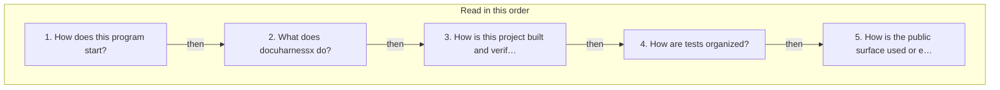

<h3 id="question-map">Question map</h3>

On [Home](index.md) at depth 5.

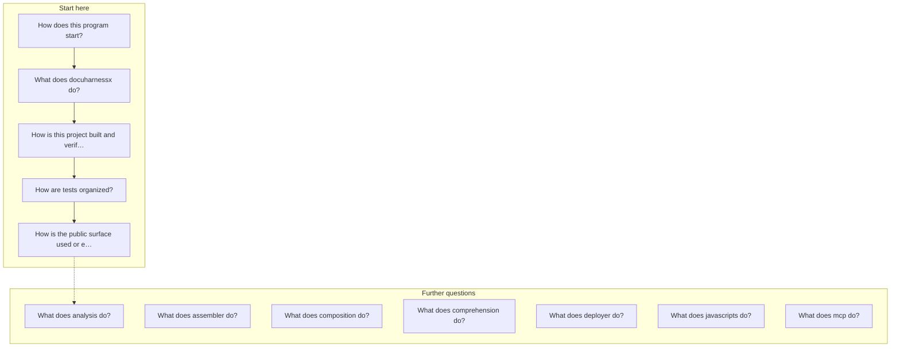

## Coverage

<h3 id="coverage">Coverage</h3>

On [Home](index.md) at depth 2.

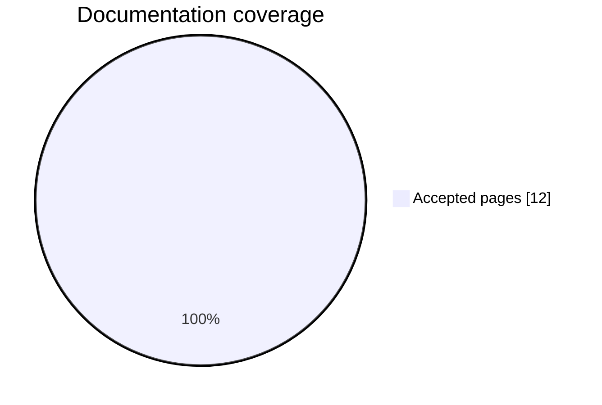

## Per question

<h3 id="how-are-tests-organized-files-by-directory">How are tests organized? · Files by directory</h3>

On [How are tests organized?](tests-tests-37e0cc9c.md) at depth 5.

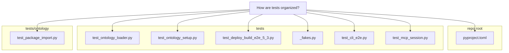

<h3 id="how-are-tests-organized-question-and-files">How are tests organized? · Question and files</h3>

On [How are tests organized?](tests-tests-37e0cc9c.md) at depth 5.

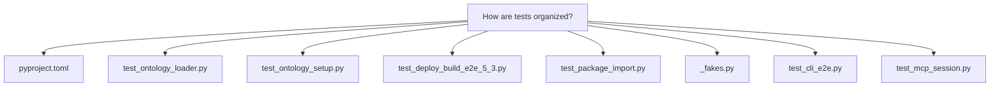

<h3 id="how-are-tests-organized-structure">How are tests organized? · Structure</h3>

On [How are tests organized?](tests-tests-37e0cc9c.md) at depth 5.

```mermaid
flowchart TB
  n0["How are tests organized?"]
  n1["tests"]
  n2["tests/ontology/test_errors.py"]
  n3["tests/ontology/test_hardening.py"]
  n4["tests/ontology/test_model.py"]
  n5["tests/ontology/test_normalize_prefix.py"]
  n6["tests/ontology/test_package_import.py"]
  n7["tests/ontology/test_public_api.py"]
  n8["tests/ontology/test_schema.py"]
  n9["pytest"]
  n10["pyproject.toml"]
  n11["test_ontology_loader.py"]
  n12["test_ontology_setup.py"]
  n13["test_deploy_build_e2e_5_3.py"]
  n14["test_package_import.py"]
  n15["_fakes.py"]
  n16["test_cli_e2e.py"]
  n17["test_mcp_session.py"]
  n0 --> n1
  n0 --> n2
  n0 --> n3
  n0 --> n4
  n0 --> n5
  n0 --> n6
  n0 --> n7
  n0 --> n8
  n0 --> n9
  n0 --> n10
  n0 --> n11
  n0 --> n12
  n0 --> n13
  n0 --> n14
  n0 --> n15
  n0 --> n16
  n0 --> n17
```

<h3 id="how-does-this-program-start-files-by-directory">How does this program start? · Files by directory</h3>

On [How does this program start?](startup-cli-py-126eba90.md) at depth 5.

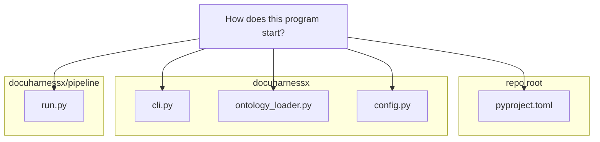

<h3 id="how-does-this-program-start-question-and-files">How does this program start? · Question and files</h3>

On [How does this program start?](startup-cli-py-126eba90.md) at depth 5.

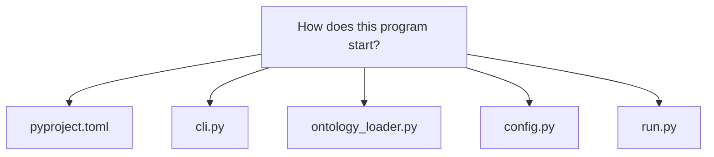

<h3 id="how-does-this-program-start-structure">How does this program start? · Structure</h3>

On [How does this program start?](startup-cli-py-126eba90.md) at depth 5.

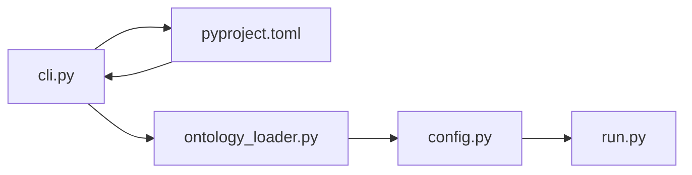

<h3 id="how-is-the-public-surface-used-or-extended-files-by-directory">How is the public surface used or extended? · Files by directory</h3>

On [How is the public surface used or extended?](public-surface-init-py-a3934091.md) at depth 5.

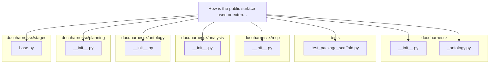

<h3 id="how-is-the-public-surface-used-or-extended-question-and-files">How is the public surface used or extended? · Question and files</h3>

On [How is the public surface used or extended?](public-surface-init-py-a3934091.md) at depth 5.

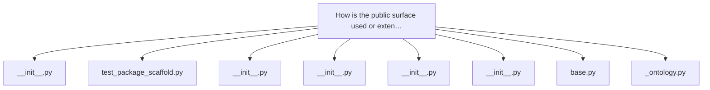

<h3 id="how-is-the-public-surface-used-or-extended-structure">How is the public surface used or extended? · Structure</h3>

On [How is the public surface used or extended?](public-surface-init-py-a3934091.md) at depth 5.

```mermaid
flowchart TB
 n0["How is the public surface used or exten…"]
 n1["__version__"]
 n2["AnalysisError"]
 n3["AnalyzeError"]
 n4["Artifact"]
 n5["BuildFile"]
 n6["CIWorkflow"]
 n7["Component"]
 n8["DEFAULT_EXCLUDED_DIRS"]
 n0 --> n1
 n0 --> n2
 n0 --> n3
 n0 --> n4
 n0 --> n5
 n0 --> n6
 n0 --> n7
 n0 --> n8
```

<h3 id="how-is-this-project-built-and-verified-files-by-directory">How is this project built and verified? · Files by directory</h3>

On [How is this project built and verified?](build-pyproject-toml-a625bf0a.md) at depth 5.

```mermaid
flowchart TB
 page["How is this project built and verified?"]
 subgraph d0["repo root"]
 e0["pyproject.toml"]
 e1["README.md"]
 end
 subgraph d1["docuharnessx"]
 e2["cli.py"]
 end
 subgraph d2["tests/fixtures/agentic_repo"]
 e3["pyproject.toml"]
 end
 subgraph d3["tests"]
 e4["test_deployer_pyproject_deps.py"]
 e5["test_mcp_pyproject_dep.py"]
 e6["test_fixture_agentic_repo.py"]
 end
 page --> e0
 page --> e1
 page --> e2
 page --> e3
 page --> e4
 page --> e5
 page --> e6
```

<h3 id="how-is-this-project-built-and-verified-question-and-files">How is this project built and verified? · Question and files</h3>

On [How is this project built and verified?](build-pyproject-toml-a625bf0a.md) at depth 5.

```mermaid
flowchart TB
 n0["How is this project built and verified?"]
 n1["pyproject.toml"]
 n2["cli.py"]
 n3["pyproject.toml"]
 n4["test_deployer_pyproject_deps.py"]
 n5["test_mcp_pyproject_dep.py"]
 n6["test_fixture_agentic_repo.py"]
 n7["README.md"]
 n0 --> n1
 n0 --> n2
 n0 --> n3
 n0 --> n4
 n0 --> n5
 n0 --> n6
 n0 --> n7
```

<h3 id="how-is-this-project-built-and-verified-structure">How is this project built and verified? · Structure</h3>

On [How is this project built and verified?](build-pyproject-toml-a625bf0a.md) at depth 5.

```mermaid
flowchart LR
 n0["How is this project built and verified?"]
 n1["pyproject.toml"]
 n2["pyproject.toml"]
 n3["adopt.yml"]
 n4["dhx.yml"]
 n5["docs.yml"]
 n6["pyproject.toml"]
 n7["cli.py"]
 n8["pyproject.toml"]
 n9["test_deployer_pyproject_deps.py"]
 n10["test_mcp_pyproject_dep.py"]
 n11["test_fixture_agentic_repo.py"]
 n12["README.md"]
 n0 --> n1
 n1 --> n2
 n0 --> n3
 n0 --> n4
 n0 --> n5
 n0 --> n6
 n0 --> n7
 n0 --> n8
 n0 --> n9
 n0 --> n10
 n0 --> n11
 n0 --> n12
```

<h3 id="what-does-analysis-do-question-and-files">What does analysis do? · Question and files</h3>

On [What does analysis do?](component-analysis-5fb37dc2.md) at depth 5.

```mermaid
flowchart TB
 n0["What does analysis do?"]
 n1["__init__.py"]
 n2["analyzer.py"]
 n3["scanner.py"]
 n4["languages.py"]
 n5["model.py"]
 n6["detectors.py"]
 n7["enrich.py"]
 n8["errors.py"]
 n0 --> n1
 n0 --> n2
 n0 --> n3
 n0 --> n4
 n0 --> n5
 n0 --> n6
 n0 --> n7
 n0 --> n8
```

<h3 id="what-does-analysis-do-structure">What does analysis do? · Structure</h3>

On [What does analysis do?](component-analysis-5fb37dc2.md) at depth 5.

```mermaid
flowchart TB
 n0["What does analysis do?"]
 n1["analysis"]
 n2["__init__.py"]
 n3["analyzer.py"]
 n4["detectors.py"]
 n5["enrich.py"]
 n6["errors.py"]
 n7["scanner.py"]
 n8["languages.py"]
 n9["model.py"]
 n0 --> n1
 n1 --> n2
 n1 --> n3
 n1 --> n4
 n1 --> n5
 n1 --> n6
 n0 --> n2
 n0 --> n3
 n0 --> n7
 n0 --> n8
 n0 --> n9
 n0 --> n4
 n0 --> n5
 n0 --> n6
```

<h3 id="what-does-assembler-do-question-and-files">What does assembler do? · Question and files</h3>

On [What does assembler do?](component-assembler-d9228a8c.md) at depth 5.

```mermaid
flowchart TB
 n0["What does assembler do?"]
 n1["__init__.py"]
 n2["identity.py"]
 n3["writer.py"]
 n4["pages.py"]
 n5["roles.py"]
 n6["home.py"]
 n7["graphs.py"]
 n8["mkdocs_config.py"]
 n0 --> n1
 n0 --> n2
 n0 --> n3
 n0 --> n4
 n0 --> n5
 n0 --> n6
 n0 --> n7
 n0 --> n8
```

<h3 id="what-does-assembler-do-structure">What does assembler do? · Structure</h3>

On [What does assembler do?](component-assembler-d9228a8c.md) at depth 5.

```mermaid
flowchart TB
 n0["What does assembler do?"]
 n1["assembler"]
 n2["__init__.py"]
 n3["depth.py"]
 n4["graphs.py"]
 n5["home.py"]
 n6["identity.py"]
 n7["writer.py"]
 n8["pages.py"]
 n9["roles.py"]
 n10["mkdocs_config.py"]
 n0 --> n1
 n1 --> n2
 n1 --> n3
 n1 --> n4
 n1 --> n5
 n1 --> n6
 n0 --> n2
 n0 --> n6
 n0 --> n7
 n0 --> n8
 n0 --> n9
 n0 --> n5
 n0 --> n4
 n0 --> n10
```

<h3 id="what-does-composition-do-files-by-directory">What does composition do? · Files by directory</h3>

On [What does composition do?](component-composition-e6f778c7.md) at depth 5.

```mermaid
flowchart TB
 page["What does composition do?"]
 subgraph d0["docuharnessx/composition"]
 e0["__init__.py"]
 e1["blueprint.py"]
 e2["model.py"]
 e3["prompt.py"]
 e4["prose.py"]
 e5["fallback.py"]
 e6["wiring.py"]
 end
 subgraph d1["docuharnessx/stages"]
 e7["write.py"]
 end
 page --> e0
 page --> e1
 page --> e2
 page --> e3
 page --> e4
 page --> e5
 page --> e6
 page --> e7
```

<h3 id="what-does-composition-do-question-and-files">What does composition do? · Question and files</h3>

On [What does composition do?](component-composition-e6f778c7.md) at depth 5.

```mermaid
flowchart TB
 n0["What does composition do?"]
 n1["__init__.py"]
 n2["write.py"]
 n3["blueprint.py"]
 n4["model.py"]
 n5["prompt.py"]
 n6["prose.py"]
 n7["fallback.py"]
 n8["wiring.py"]
 n0 --> n1
 n0 --> n2
 n0 --> n3
 n0 --> n4
 n0 --> n5
 n0 --> n6
 n0 --> n7
 n0 --> n8
```

<h3 id="what-does-composition-do-structure">What does composition do? · Structure</h3>

On [What does composition do?](component-composition-e6f778c7.md) at depth 5.

```mermaid
flowchart TB
 n0["What does composition do?"]
 n1["composition"]
 n2["__init__.py"]
 n3["agent.py"]
 n4["blueprint.py"]
 n5["blueprint_question.py"]
 n6["budgets.py"]
 n7["write.py"]
 n8["model.py"]
 n9["prompt.py"]
 n10["prose.py"]
 n11["fallback.py"]
 n12["wiring.py"]
 n0 --> n1
 n1 --> n2
 n1 --> n3
 n1 --> n4
 n1 --> n5
 n1 --> n6
 n0 --> n2
 n0 --> n7
 n0 --> n4
 n0 --> n8
 n0 --> n9
 n0 --> n10
 n0 --> n11
 n0 --> n12
```

<h3 id="what-does-comprehension-do-files-by-directory">What does comprehension do? · Files by directory</h3>

On [What does comprehension do?](component-comprehension-87225edb.md) at depth 5.

```mermaid
flowchart TB
 page["What does comprehension do?"]
 subgraph d0["docuharnessx/comprehension"]
 e0["__init__.py"]
 e1["detect.py"]
 e2["signals.py"]
 e3["glossary.py"]
 e4["autolink.py"]
 e5["compliance.py"]
 e6["graphs.py"]
 end
 subgraph d1["docuharnessx/assembler"]
 e7["question_site.py"]
 end
 page --> e0
 page --> e1
 page --> e2
 page --> e3
 page --> e4
 page --> e5
 page --> e6
 page --> e7
```

<h3 id="what-does-comprehension-do-question-and-files">What does comprehension do? · Question and files</h3>

On [What does comprehension do?](component-comprehension-87225edb.md) at depth 5.

```mermaid
flowchart TB
 n0["What does comprehension do?"]
 n1["__init__.py"]
 n2["question_site.py"]
 n3["detect.py"]
 n4["signals.py"]
 n5["glossary.py"]
 n6["autolink.py"]
 n7["compliance.py"]
 n8["graphs.py"]
 n0 --> n1
 n0 --> n2
 n0 --> n3
 n0 --> n4
 n0 --> n5
 n0 --> n6
 n0 --> n7
 n0 --> n8
```

<h3 id="what-does-comprehension-do-structure">What does comprehension do? · Structure</h3>

On [What does comprehension do?](component-comprehension-87225edb.md) at depth 5.

```mermaid
flowchart TB
 n0["What does comprehension do?"]
 n1["comprehension"]
 n2["__init__.py"]
 n3["architecture.py"]
 n4["autolink.py"]
 n5["compliance.py"]
 n6["detect.py"]
 n7["question_site.py"]
 n8["signals.py"]
 n9["glossary.py"]
 n10["graphs.py"]
 n0 --> n1
 n1 --> n2
 n1 --> n3
 n1 --> n4
 n1 --> n5
 n1 --> n6
 n0 --> n2
 n0 --> n7
 n0 --> n6
 n0 --> n8
 n0 --> n9
 n0 --> n4
 n0 --> n5
 n0 --> n10
```

<h3 id="what-does-deployer-do-files-by-directory">What does deployer do? · Files by directory</h3>

On [What does deployer do?](component-deployer-f8b1b75f.md) at depth 5.

```mermaid
flowchart TB
 page["What does deployer do?"]
 subgraph d0["docuharnessx/deployer"]
 e0["__init__.py"]
 e1["deploy.py"]
 e2["model.py"]
 e3["mode.py"]
 e4["workflow.py"]
 e5["tree.py"]
 e6["commands.py"]
 end
 subgraph d1["docuharnessx/stages"]
 e7["deploy.py"]
 end
 page --> e0
 page --> e1
 page --> e2
 page --> e3
 page --> e4
 page --> e5
 page --> e6
 page --> e7
```

<h3 id="what-does-deployer-do-question-and-files">What does deployer do? · Question and files</h3>

On [What does deployer do?](component-deployer-f8b1b75f.md) at depth 5.

```mermaid
flowchart TB
 n0["What does deployer do?"]
 n1["__init__.py"]
 n2["deploy.py"]
 n3["deploy.py"]
 n4["model.py"]
 n5["mode.py"]
 n6["workflow.py"]
 n7["tree.py"]
 n8["commands.py"]
 n0 --> n1
 n0 --> n2
 n0 --> n3
 n0 --> n4
 n0 --> n5
 n0 --> n6
 n0 --> n7
 n0 --> n8
```

<h3 id="what-does-deployer-do-structure">What does deployer do? · Structure</h3>

On [What does deployer do?](component-deployer-f8b1b75f.md) at depth 5.

```mermaid
flowchart TB
 n0["What does deployer do?"]
 n1["deployer"]
 n2["__init__.py"]
 n3["commands.py"]
 n4["deploy.py"]
 n5["mode.py"]
 n6["model.py"]
 n7["deploy.py"]
 n8["workflow.py"]
 n9["tree.py"]
 n0 --> n1
 n1 --> n2
 n1 --> n3
 n1 --> n4
 n1 --> n5
 n1 --> n6
 n0 --> n2
 n0 --> n7
 n0 --> n4
 n0 --> n6
 n0 --> n5
 n0 --> n8
 n0 --> n9
 n0 --> n3
```

<h3 id="what-does-docuharnessx-do-files-by-directory">What does docuharnessx do? · Files by directory</h3>

On [What does docuharnessx do?](component-docuharnessx-3986831c.md) at depth 5.

```mermaid
flowchart TB
 page["What does docuharnessx do?"]
 subgraph d0["docuharnessx"]
 e0["__init__.py"]
 end
 subgraph d1["repo root"]
 e1["pyproject.toml"]
 end
 page --> e0
 page --> e1
```

<h3 id="what-does-docuharnessx-do-question-and-files">What does docuharnessx do? · Question and files</h3>

On [What does docuharnessx do?](component-docuharnessx-3986831c.md) at depth 5.

```mermaid
flowchart TB
 n0["What does docuharnessx do?"]
 n1["__init__.py"]
 n2["pyproject.toml"]
 n0 --> n1
 n0 --> n2
```

<h3 id="what-does-docuharnessx-do-structure">What does docuharnessx do? · Structure</h3>

On [What does docuharnessx do?](component-docuharnessx-3986831c.md) at depth 5.

```mermaid
flowchart TB
 n0["What does docuharnessx do?"]
 n1["docuharnessx"]
 n2["__init__.py"]
 n3["_ontology.py"]
 n4["adoption.py"]
 n5["blueprint.py"]
 n6["bundle.py"]
 n7["pyproject.toml"]
 n0 --> n1
 n1 --> n2
 n1 --> n3
 n1 --> n4
 n1 --> n5
 n1 --> n6
 n0 --> n2
 n0 --> n7
```

<h3 id="what-does-javascripts-do-files-by-directory">What does javascripts do? · Files by directory</h3>

On [What does javascripts do?](component-javascripts-2aa9650e.md) at depth 5.

```mermaid
flowchart TB
 page["What does javascripts do?"]
 subgraph d0["repo root"]
 e0["mkdocs.yml"]
 end
 subgraph d1["docuharnessx/assembler"]
 e1["theme.py"]
 e2["writer.py"]
 e3["question_site.py"]
 end
 subgraph d2["docs/javascripts"]
 e4["depth.js"]
 end
 subgraph d3["docuharnessx"]
 e5["site_config.py"]
 end
 subgraph d4["docs"]
 e6["component-docuharnessx-3986831c.md"]
 e7["build-pyproject-toml-a625bf0a.md"]
 end
 page --> e0
 page --> e1
 page --> e2
 page --> e3
 page --> e4
 page --> e5
 page --> e6
 page --> e7
```

<h3 id="what-does-javascripts-do-question-and-files">What does javascripts do? · Question and files</h3>

On [What does javascripts do?](component-javascripts-2aa9650e.md) at depth 5.

```mermaid
flowchart TB
 n0["What does javascripts do?"]
 n1["mkdocs.yml"]
 n2["theme.py"]
 n3["writer.py"]
 n4["question_site.py"]
 n5["depth.js"]
 n6["site_config.py"]
 n7["component-docuharnessx-3986831c.md"]
 n8["build-pyproject-toml-a625bf0a.md"]
 n0 --> n1
 n0 --> n2
 n0 --> n3
 n0 --> n4
 n0 --> n5
 n0 --> n6
 n0 --> n7
 n0 --> n8
```

<h3 id="what-does-javascripts-do-structure">What does javascripts do? · Structure</h3>

On [What does javascripts do?](component-javascripts-2aa9650e.md) at depth 5.

```mermaid
flowchart TB
 n0["What does javascripts do?"]
 n1["javascripts"]
 n2["conceptual.js"]
 n3["depth.js"]
 n4["jit.js"]
 n5["mermaid-boot.js"]
 n6["mermaid.min.js"]
 n7["mkdocs.yml"]
 n8["theme.py"]
 n9["writer.py"]
 n10["question_site.py"]
 n11["site_config.py"]
 n12["component-docuharnessx-3986831c.md"]
 n13["build-pyproject-toml-a625bf0a.md"]
 n0 --> n1
 n1 --> n2
 n1 --> n3
 n1 --> n4
 n1 --> n5
 n1 --> n6
 n0 --> n7
 n0 --> n8
 n0 --> n9
 n0 --> n10
 n0 --> n3
 n0 --> n11
 n0 --> n12
 n0 --> n13
```

<h3 id="what-does-mcp-do-question-and-files">What does mcp do? · Question and files</h3>

On [What does mcp do?](component-mcp-bdf519de.md) at depth 5.

```mermaid
flowchart TB
 n0["What does mcp do?"]
 n1["__init__.py"]
 n2["server.py"]
 n3["session.py"]
 n4["schemas.py"]
 n5["overview.py"]
 n6["planned.py"]
 n0 --> n1
 n0 --> n2
 n0 --> n3
 n0 --> n4
 n0 --> n5
 n0 --> n6
```

<h3 id="what-does-mcp-do-structure">What does mcp do? · Structure</h3>

On [What does mcp do?](component-mcp-bdf519de.md) at depth 5.

```mermaid
flowchart TB
 n0["What does mcp do?"]
 n1["mcp"]
 n2["__init__.py"]
 n3["handlers.py"]
 n4["overview.py"]
 n5["planned.py"]
 n6["schemas.py"]
 n7["server.py"]
 n8["session.py"]
 n0 --> n1
 n1 --> n2
 n1 --> n3
 n1 --> n4
 n1 --> n5
 n1 --> n6
 n0 --> n2
 n0 --> n7
 n0 --> n8
 n0 --> n6
 n0 --> n4
 n0 --> n5
```

<h2 id="glossary-related-term-graphs">Glossary related-term graphs</h2>

Small related-term pictures live on the glossary entries:

- [aggregate](glossary.md#aggregate)
- [analysis](glossary.md#analysis)
- [analyze](glossary.md#analyze)
- [assembler](glossary.md#assembler)
- [composition](glossary.md#composition)
- [comprehension](glossary.md#comprehension)
- [--config](glossary.md#config)
- [--default](glossary.md#default)
- [deployer](glossary.md#deployer)
- [docuharnessx](glossary.md#docuharnessx)
- [enrich](glossary.md#enrich)
- [--force](glossary.md#force)
- [hook](glossary.md#hook)
- [init](glossary.md#init)
- [install-ci](glossary.md#install-ci)
- [install-hooks](glossary.md#install-hooks)
- [javascripts](glossary.md#javascripts)
- [main](glossary.md#main)
- [mcp](glossary.md#mcp)
- [ontology](glossary.md#ontology)
- [--out](glossary.md#out)
- [pages](glossary.md#pages)
- [pipeline](glossary.md#pipeline)
- [planning](glossary.md#planning)
- [review](glossary.md#review)
- [run](glossary.md#run)
- [scan](glossary.md#scan)
- [stages](glossary.md#stages)
- [status](glossary.md#status)
- [sufficient](glossary.md#sufficient)
