# Glossary

Highlighted words in the docs link here. Related terms are other glossary entries that appear on the same page.

<h2 id="aggregate">aggregate</h2>

_No definition in the repository yet._

Related: [analysis](#analysis), [analyze](#analyze), [composition](#composition), [docuharnessx](#docuharnessx), [enrich](#enrich), [hook](#hook), [main](#main), [pipeline](#pipeline)

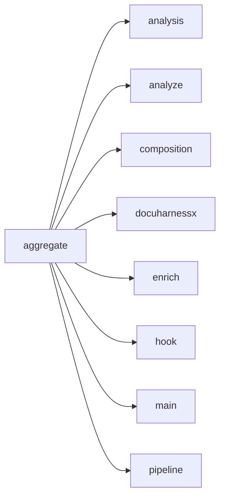

Appears on:

- [What does analysis do?](component-analysis-5fb37dc2.md)

Sources: `surface:docuharnessx/review/aggregate.py`

<h2 id="analysis">analysis</h2>

_No definition in the repository yet._

Related: [aggregate](#aggregate), [analyze](#analyze), [composition](#composition), [docuharnessx](#docuharnessx), [enrich](#enrich), [hook](#hook), [main](#main), [pipeline](#pipeline)

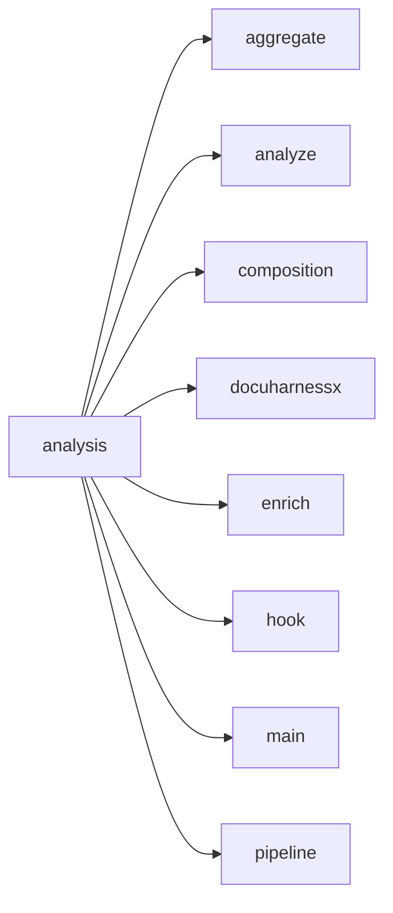

Appears on:

- [How does this program start?](startup-cli-py-126eba90.md)
- [What does docuharnessx do?](component-docuharnessx-3986831c.md)
- [How are tests organized?](tests-tests-37e0cc9c.md)
- [How is the public surface used or extended?](public-surface-init-py-a3934091.md)
- [What does analysis do?](component-analysis-5fb37dc2.md)
- [What does assembler do?](component-assembler-d9228a8c.md)
- [What does composition do?](component-composition-e6f778c7.md)
- [What does comprehension do?](component-comprehension-87225edb.md)
- [DocuHarnessX](index.md)

Sources: `component:docuharnessx/analysis`

<h2 id="analyze">analyze</h2>

_No definition in the repository yet._

Related: [aggregate](#aggregate), [analysis](#analysis), [composition](#composition), [docuharnessx](#docuharnessx), [enrich](#enrich), [hook](#hook), [main](#main), [pipeline](#pipeline)

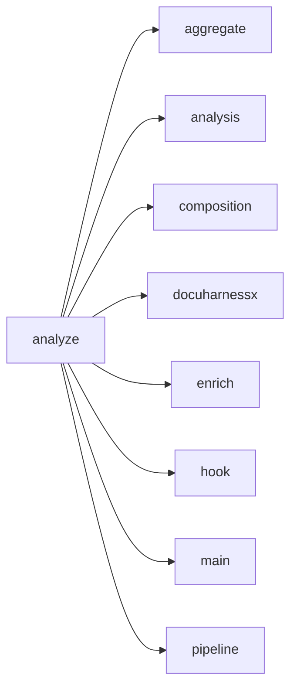

Appears on:

- [How does this program start?](startup-cli-py-126eba90.md)
- [What does docuharnessx do?](component-docuharnessx-3986831c.md)
- [How are tests organized?](tests-tests-37e0cc9c.md)
- [How is the public surface used or extended?](public-surface-init-py-a3934091.md)
- [What does analysis do?](component-analysis-5fb37dc2.md)

Sources: `surface:docuharnessx/analysis/__init__.py`, `surface:docuharnessx/analysis/analyzer.py`

<h2 id="apex">--apex</h2>

_No definition in the repository yet._

Sources: `surface:tests/test_analysis_detectors_components_surface.py`

<h2 id="assembler">assembler</h2>

_No definition in the repository yet._

Related: [analysis](#analysis), [analyze](#analyze), [composition](#composition), [deployer](#deployer), [docuharnessx](#docuharnessx), [mcp](#mcp), [ontology](#ontology), [pipeline](#pipeline)

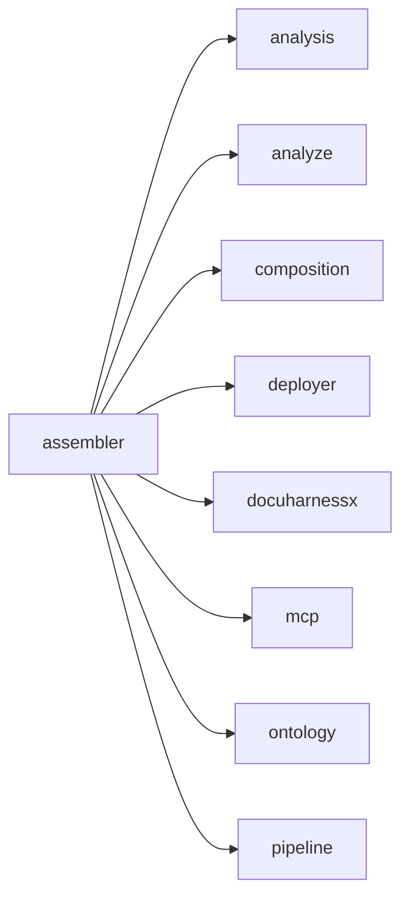

Appears on:

- [How are tests organized?](tests-tests-37e0cc9c.md)
- [What does assembler do?](component-assembler-d9228a8c.md)
- [What does comprehension do?](component-comprehension-87225edb.md)
- [What does javascripts do?](component-javascripts-2aa9650e.md)
- [DocuHarnessX](index.md)

Sources: `component:docuharnessx/assembler`

<h2 id="ci">ci</h2>

_No definition in the repository yet._

Sources: `surface:docuharnessx/cli.py`

<h2 id="composition">composition</h2>

_No definition in the repository yet._

Related: [aggregate](#aggregate), [analysis](#analysis), [analyze](#analyze), [docuharnessx](#docuharnessx), [enrich](#enrich), [hook](#hook), [main](#main), [pipeline](#pipeline)

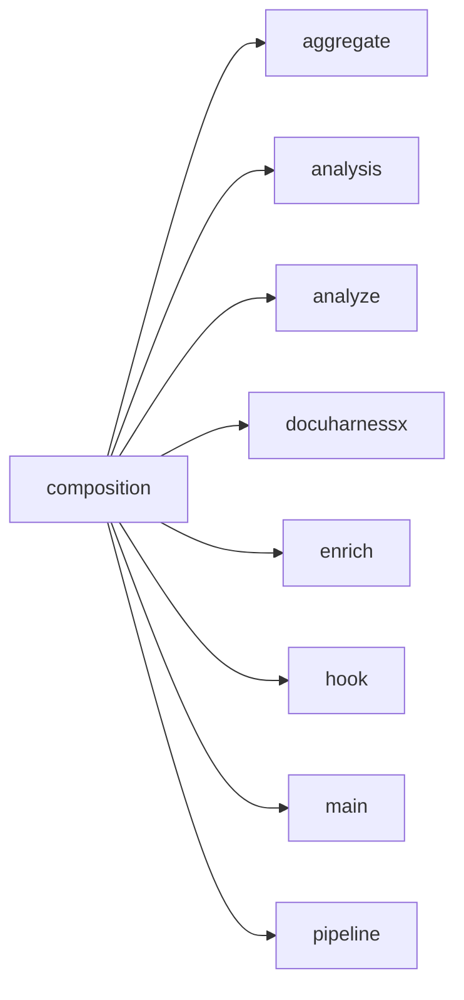

Appears on:

- [What does docuharnessx do?](component-docuharnessx-3986831c.md)
- [How are tests organized?](tests-tests-37e0cc9c.md)
- [How is the public surface used or extended?](public-surface-init-py-a3934091.md)
- [What does analysis do?](component-analysis-5fb37dc2.md)
- [What does composition do?](component-composition-e6f778c7.md)
- [DocuHarnessX](index.md)

Sources: `component:docuharnessx/composition`

<h2 id="comprehension">comprehension</h2>

_No definition in the repository yet._

Related: [analysis](#analysis), [assembler](#assembler), [docuharnessx](#docuharnessx), [ontology](#ontology), [pages](#pages), [pipeline](#pipeline), [stages](#stages), [status](#status)

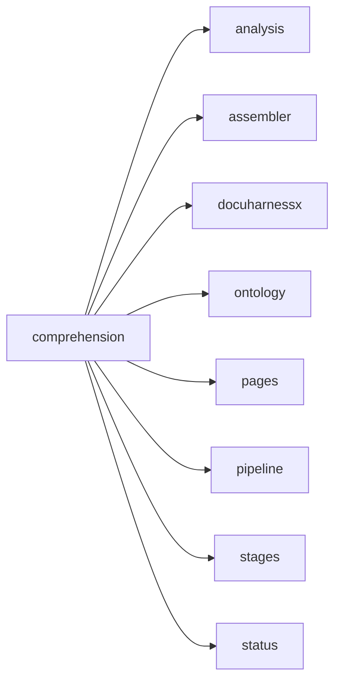

Appears on:

- [What does comprehension do?](component-comprehension-87225edb.md)
- [DocuHarnessX](index.md)

Sources: `component:docuharnessx/comprehension`

<h2 id="config">--config</h2>

_No definition in the repository yet._

Related: [analysis](#analysis), [analyze](#analyze), [--default](#default), [docuharnessx](#docuharnessx), [--force](#force), [hook](#hook), [init](#init), [install-ci](#install-ci)

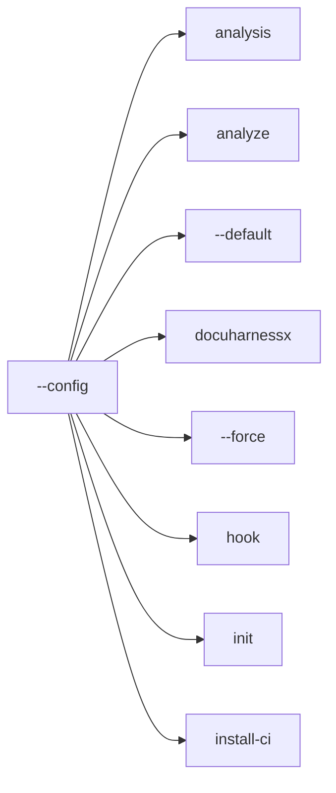

Appears on:

- [How does this program start?](startup-cli-py-126eba90.md)
- [What does docuharnessx do?](component-docuharnessx-3986831c.md)

Sources: `surface:docuharnessx/cli.py`, `surface:tests/test_analysis_detectors_components_surface.py`

<h2 id="default">--default</h2>

_No definition in the repository yet._

Related: [analysis](#analysis), [analyze](#analyze), [--config](#config), [docuharnessx](#docuharnessx), [--force](#force), [hook](#hook), [init](#init), [install-ci](#install-ci)

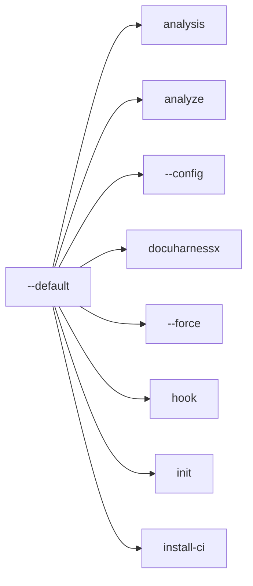

Appears on:

- [How does this program start?](startup-cli-py-126eba90.md)

Sources: `surface:docuharnessx/cli.py`

<h2 id="deploy-mode">--deploy-mode</h2>

_No definition in the repository yet._

Sources: `surface:docuharnessx/cli.py`

<h2 id="deployer">deployer</h2>

_No definition in the repository yet._

Related: [analysis](#analysis), [analyze](#analyze), [assembler](#assembler), [composition](#composition), [docuharnessx](#docuharnessx), [mcp](#mcp), [ontology](#ontology), [pipeline](#pipeline)

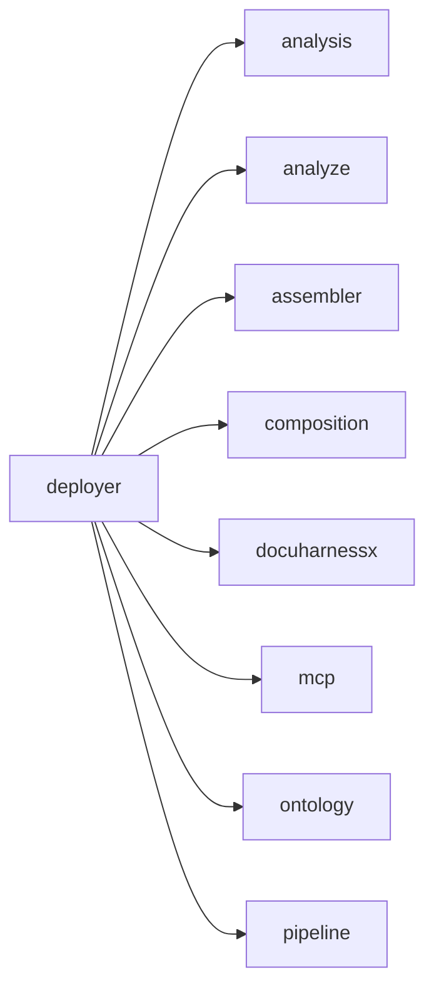

Appears on:

- [How are tests organized?](tests-tests-37e0cc9c.md)

Sources: `component:docuharnessx/deployer`

<h2 id="docuharnessx">docuharnessx</h2>

_No definition in the repository yet._

Related: [aggregate](#aggregate), [analysis](#analysis), [analyze](#analyze), [composition](#composition), [enrich](#enrich), [hook](#hook), [main](#main), [pipeline](#pipeline)

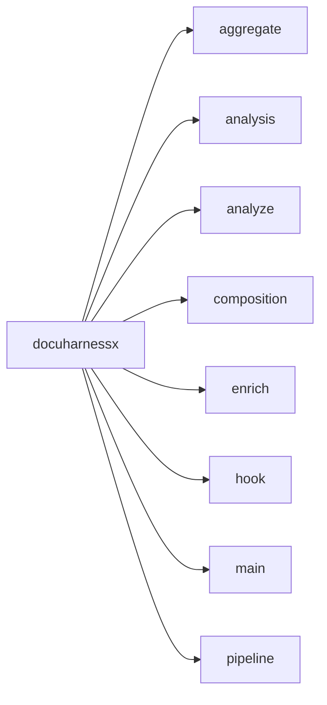

Appears on:

- [How does this program start?](startup-cli-py-126eba90.md)
- [What does docuharnessx do?](component-docuharnessx-3986831c.md)
- [How is this project built and verified?](build-pyproject-toml-a625bf0a.md)
- [How are tests organized?](tests-tests-37e0cc9c.md)
- [How is the public surface used or extended?](public-surface-init-py-a3934091.md)
- [What does analysis do?](component-analysis-5fb37dc2.md)
- [What does assembler do?](component-assembler-d9228a8c.md)
- [What does composition do?](component-composition-e6f778c7.md)
- [What does comprehension do?](component-comprehension-87225edb.md)
- [What does javascripts do?](component-javascripts-2aa9650e.md)
- [DocuHarnessX](index.md)

Sources: `component:docuharnessx`

<h2 id="enrich">enrich</h2>

_No definition in the repository yet._

Related: [aggregate](#aggregate), [analysis](#analysis), [analyze](#analyze), [composition](#composition), [docuharnessx](#docuharnessx), [hook](#hook), [main](#main), [pipeline](#pipeline)

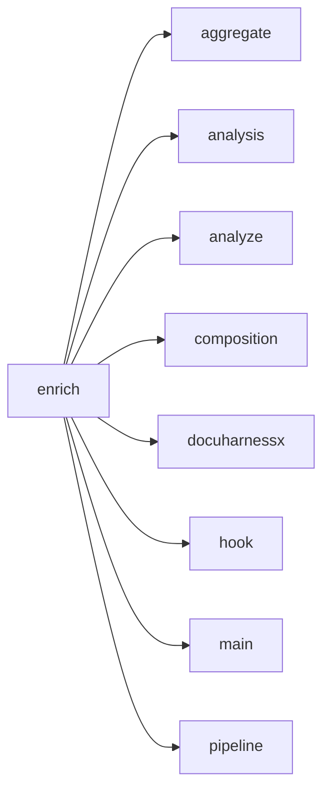

Appears on:

- [How is the public surface used or extended?](public-surface-init-py-a3934091.md)
- [What does analysis do?](component-analysis-5fb37dc2.md)

Sources: `surface:docuharnessx/analysis/__init__.py`, `surface:docuharnessx/analysis/enrich.py`

<h2 id="evolve">--evolve</h2>

_No definition in the repository yet._

Sources: `surface:docuharnessx/cli.py`

<h2 id="force">--force</h2>

_No definition in the repository yet._

Related: [analysis](#analysis), [analyze](#analyze), [--config](#config), [--default](#default), [docuharnessx](#docuharnessx), [hook](#hook), [init](#init), [install-ci](#install-ci)

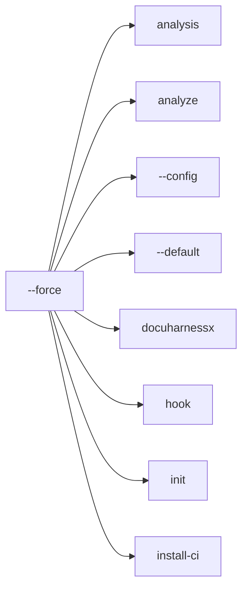

Appears on:

- [How does this program start?](startup-cli-py-126eba90.md)
- [What does docuharnessx do?](component-docuharnessx-3986831c.md)

Sources: `surface:docuharnessx/cli.py`

<h2 id="git">--git</h2>

_No definition in the repository yet._

Sources: `surface:docuharnessx/cli.py`

<h2 id="hook">hook</h2>

_No definition in the repository yet._

Related: [aggregate](#aggregate), [analysis](#analysis), [analyze](#analyze), [composition](#composition), [docuharnessx](#docuharnessx), [enrich](#enrich), [main](#main), [pipeline](#pipeline)

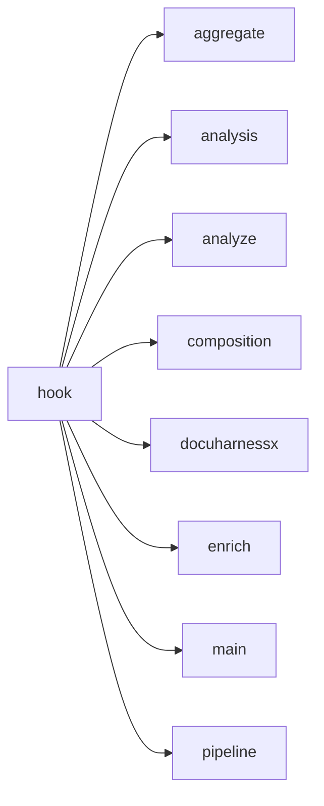

Appears on:

- [How does this program start?](startup-cli-py-126eba90.md)
- [What does docuharnessx do?](component-docuharnessx-3986831c.md)
- [How is this project built and verified?](build-pyproject-toml-a625bf0a.md)
- [How is the public surface used or extended?](public-surface-init-py-a3934091.md)
- [What does analysis do?](component-analysis-5fb37dc2.md)

Sources: `surface:docuharnessx/cli.py`

<h2 id="init">init</h2>

_No definition in the repository yet._

Related: [analysis](#analysis), [analyze](#analyze), [--config](#config), [--default](#default), [docuharnessx](#docuharnessx), [--force](#force), [hook](#hook), [install-ci](#install-ci)

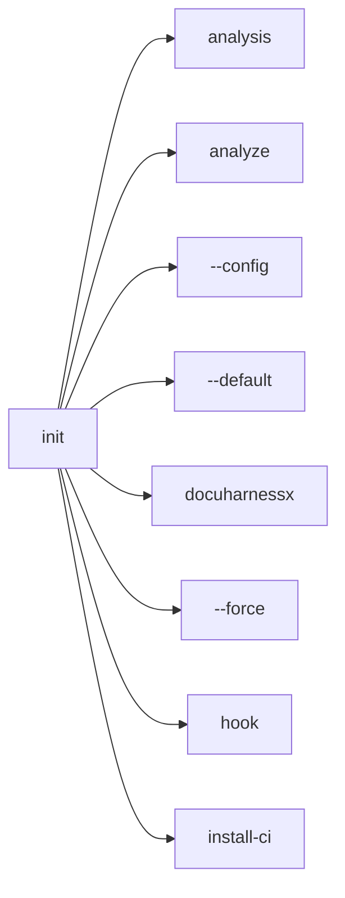

Appears on:

- [How does this program start?](startup-cli-py-126eba90.md)
- [What does docuharnessx do?](component-docuharnessx-3986831c.md)
- [How is this project built and verified?](build-pyproject-toml-a625bf0a.md)

Sources: `surface:docuharnessx/cli.py`

<h2 id="install-ci">install-ci</h2>

_No definition in the repository yet._

Related: [analysis](#analysis), [analyze](#analyze), [--config](#config), [--default](#default), [docuharnessx](#docuharnessx), [--force](#force), [hook](#hook), [init](#init)

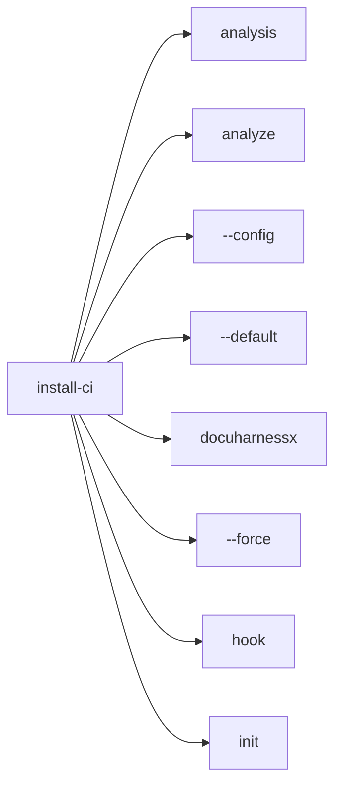

Appears on:

- [How does this program start?](startup-cli-py-126eba90.md)
- [What does docuharnessx do?](component-docuharnessx-3986831c.md)
- [How is this project built and verified?](build-pyproject-toml-a625bf0a.md)

Sources: `surface:docuharnessx/cli.py`

<h2 id="install-hooks">install-hooks</h2>

_No definition in the repository yet._

Related: [analysis](#analysis), [analyze](#analyze), [--config](#config), [--default](#default), [docuharnessx](#docuharnessx), [--force](#force), [hook](#hook), [init](#init)

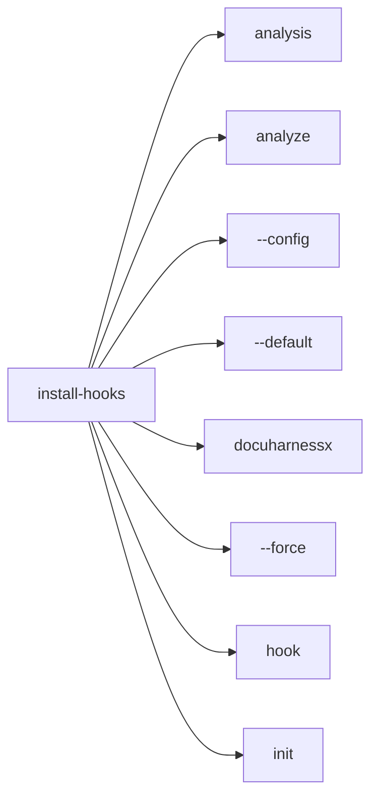

Appears on:

- [How does this program start?](startup-cli-py-126eba90.md)
- [What does docuharnessx do?](component-docuharnessx-3986831c.md)
- [How is this project built and verified?](build-pyproject-toml-a625bf0a.md)

Sources: `surface:docuharnessx/cli.py`

<h2 id="javascripts">javascripts</h2>

_No definition in the repository yet._

Related: [analysis](#analysis), [assembler](#assembler), [composition](#composition), [comprehension](#comprehension), [docuharnessx](#docuharnessx)

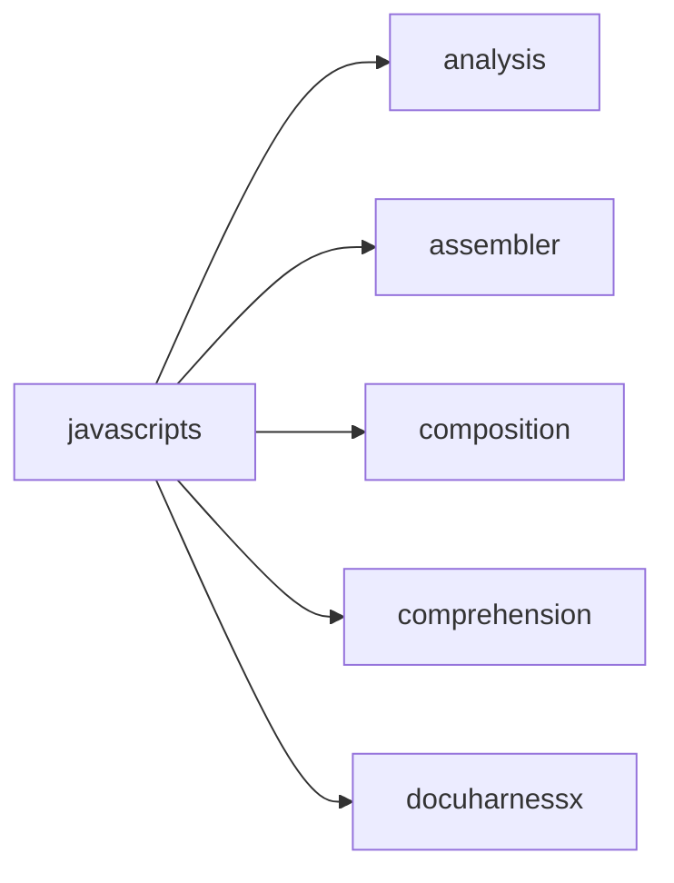

Appears on:

- [What does javascripts do?](component-javascripts-2aa9650e.md)
- [DocuHarnessX](index.md)

Sources: `component:docs/javascripts`

<h2 id="main">main</h2>

_No definition in the repository yet._

Related: [aggregate](#aggregate), [analysis](#analysis), [analyze](#analyze), [composition](#composition), [docuharnessx](#docuharnessx), [enrich](#enrich), [hook](#hook), [pipeline](#pipeline)


Appears on:

- [How does this program start?](startup-cli-py-126eba90.md)
- [What does docuharnessx do?](component-docuharnessx-3986831c.md)
- [How is this project built and verified?](build-pyproject-toml-a625bf0a.md)
- [How is the public surface used or extended?](public-surface-init-py-a3934091.md)
- [What does analysis do?](component-analysis-5fb37dc2.md)
- [What does composition do?](component-composition-e6f778c7.md)

Sources: `surface:docuharnessx/cli.py`

<h2 id="manage">--manage</h2>

_No definition in the repository yet._

Sources: `surface:docuharnessx/cli.py`

<h2 id="mcp">mcp</h2>

_No definition in the repository yet._

Related: [analysis](#analysis), [analyze](#analyze), [--config](#config), [--default](#default), [docuharnessx](#docuharnessx), [--force](#force), [hook](#hook), [init](#init)

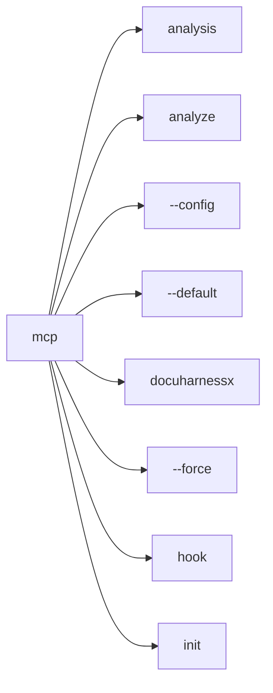

Appears on:

- [How does this program start?](startup-cli-py-126eba90.md)
- [What does docuharnessx do?](component-docuharnessx-3986831c.md)
- [How is this project built and verified?](build-pyproject-toml-a625bf0a.md)
- [How are tests organized?](tests-tests-37e0cc9c.md)
- [How is the public surface used or extended?](public-surface-init-py-a3934091.md)

Sources: `component:docuharnessx/mcp`, `surface:docuharnessx/cli.py`

<h2 id="not">--not</h2>

_No definition in the repository yet._

Sources: `surface:docuharnessx/cli.py`

<h2 id="ontology">ontology</h2>

_No definition in the repository yet._

Related: [analysis](#analysis), [analyze](#analyze), [--config](#config), [--default](#default), [docuharnessx](#docuharnessx), [--force](#force), [hook](#hook), [init](#init)

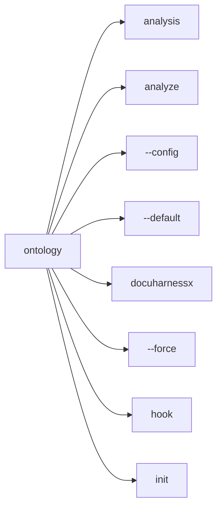

Appears on:

- [How does this program start?](startup-cli-py-126eba90.md)
- [What does docuharnessx do?](component-docuharnessx-3986831c.md)
- [How are tests organized?](tests-tests-37e0cc9c.md)
- [How is the public surface used or extended?](public-surface-init-py-a3934091.md)
- [What does assembler do?](component-assembler-d9228a8c.md)
- [What does composition do?](component-composition-e6f778c7.md)
- [What does comprehension do?](component-comprehension-87225edb.md)

Sources: `component:docuharnessx/ontology`

<h2 id="out">--out</h2>

_No definition in the repository yet._

Related: [analysis](#analysis), [analyze](#analyze), [--config](#config), [--default](#default), [docuharnessx](#docuharnessx), [--force](#force), [hook](#hook), [init](#init)

```mermaid
flowchart LR
  here["--out"]
  r0["analysis"]
  here --> r0
  r1["analyze"]
  here --> r1
  r2["--config"]
  here --> r2
  r3["--default"]
  here --> r3
  r4["docuharnessx"]
  here --> r4
  r5["--force"]
  here --> r5
  r6["hook"]
  here --> r6
  r7["init"]
  here --> r7
```

Appears on:

- [How does this program start?](startup-cli-py-126eba90.md)
- [What does docuharnessx do?](component-docuharnessx-3986831c.md)

Sources: `surface:docuharnessx/cli.py`

<h2 id="pages">pages</h2>

_No definition in the repository yet._

Related: [analysis](#analysis), [analyze](#analyze), [--config](#config), [--default](#default), [docuharnessx](#docuharnessx), [--force](#force), [hook](#hook), [init](#init)

```mermaid
flowchart LR
  here["pages"]
  r0["analysis"]
  here --> r0
  r1["analyze"]
  here --> r1
  r2["--config"]
  here --> r2
  r3["--default"]
  here --> r3
  r4["docuharnessx"]
  here --> r4
  r5["--force"]
  here --> r5
  r6["hook"]
  here --> r6
  r7["init"]
  here --> r7
```

Appears on:

- [How does this program start?](startup-cli-py-126eba90.md)
- [What does docuharnessx do?](component-docuharnessx-3986831c.md)
- [What does assembler do?](component-assembler-d9228a8c.md)
- [What does comprehension do?](component-comprehension-87225edb.md)

Sources: `component:docuharnessx/pages`

<h2 id="pipeline">pipeline</h2>

_No definition in the repository yet._

Related: [aggregate](#aggregate), [analysis](#analysis), [analyze](#analyze), [composition](#composition), [docuharnessx](#docuharnessx), [enrich](#enrich), [hook](#hook), [main](#main)

```mermaid
flowchart LR
  here["pipeline"]
  r0["aggregate"]
  here --> r0
  r1["analysis"]
  here --> r1
  r2["analyze"]
  here --> r2
  r3["composition"]
  here --> r3
  r4["docuharnessx"]
  here --> r4
  r5["enrich"]
  here --> r5
  r6["hook"]
  here --> r6
  r7["main"]
  here --> r7
```

Appears on:

- [How does this program start?](startup-cli-py-126eba90.md)
- [What does docuharnessx do?](component-docuharnessx-3986831c.md)
- [How is this project built and verified?](build-pyproject-toml-a625bf0a.md)
- [How are tests organized?](tests-tests-37e0cc9c.md)
- [How is the public surface used or extended?](public-surface-init-py-a3934091.md)
- [What does analysis do?](component-analysis-5fb37dc2.md)
- [What does composition do?](component-composition-e6f778c7.md)
- [What does comprehension do?](component-comprehension-87225edb.md)

Sources: `component:docuharnessx/pipeline`

<h2 id="planning">planning</h2>

_No definition in the repository yet._

Related: [analysis](#analysis), [analyze](#analyze), [composition](#composition), [--config](#config), [docuharnessx](#docuharnessx), [--force](#force), [hook](#hook), [init](#init)

```mermaid
flowchart LR
  here["planning"]
  r0["analysis"]
  here --> r0
  r1["analyze"]
  here --> r1
  r2["composition"]
  here --> r2
  r3["--config"]
  here --> r3
  r4["docuharnessx"]
  here --> r4
  r5["--force"]
  here --> r5
  r6["hook"]
  here --> r6
  r7["init"]
  here --> r7
```

Appears on:

- [What does docuharnessx do?](component-docuharnessx-3986831c.md)
- [How are tests organized?](tests-tests-37e0cc9c.md)
- [How is the public surface used or extended?](public-surface-init-py-a3934091.md)

Sources: `component:docuharnessx/planning`

<h2 id="pre-commit">--pre-commit</h2>

_No definition in the repository yet._

Sources: `surface:docuharnessx/cli.py`

<h2 id="regenerate">--regenerate</h2>

_No definition in the repository yet._

Sources: `surface:docuharnessx/cli.py`

<h2 id="regenerate-id">--regenerate-id</h2>

_No definition in the repository yet._

Sources: `surface:docuharnessx/cli.py`

<h2 id="review">review</h2>

_No definition in the repository yet._

Related: [analysis](#analysis), [analyze](#analyze), [composition](#composition), [--config](#config), [docuharnessx](#docuharnessx), [--force](#force), [hook](#hook), [init](#init)

```mermaid
flowchart LR
  here["review"]
  r0["analysis"]
  here --> r0
  r1["analyze"]
  here --> r1
  r2["composition"]
  here --> r2
  r3["--config"]
  here --> r3
  r4["docuharnessx"]
  here --> r4
  r5["--force"]
  here --> r5
  r6["hook"]
  here --> r6
  r7["init"]
  here --> r7
```

Appears on:

- [What does docuharnessx do?](component-docuharnessx-3986831c.md)
- [How are tests organized?](tests-tests-37e0cc9c.md)
- [What does assembler do?](component-assembler-d9228a8c.md)
- [What does composition do?](component-composition-e6f778c7.md)

Sources: `component:docuharnessx/review`

<h2 id="roles">--roles</h2>

_No definition in the repository yet._

Sources: `surface:docuharnessx/cli.py`

<h2 id="run">run</h2>

_No definition in the repository yet._

Related: [analysis](#analysis), [analyze](#analyze), [--config](#config), [--default](#default), [docuharnessx](#docuharnessx), [--force](#force), [hook](#hook), [init](#init)

```mermaid
flowchart LR
  here["run"]
  r0["analysis"]
  here --> r0
  r1["analyze"]
  here --> r1
  r2["--config"]
  here --> r2
  r3["--default"]
  here --> r3
  r4["docuharnessx"]
  here --> r4
  r5["--force"]
  here --> r5
  r6["hook"]
  here --> r6
  r7["init"]
  here --> r7
```

Appears on:

- [How does this program start?](startup-cli-py-126eba90.md)
- [What does docuharnessx do?](component-docuharnessx-3986831c.md)
- [How is this project built and verified?](build-pyproject-toml-a625bf0a.md)
- [How are tests organized?](tests-tests-37e0cc9c.md)
- [What does assembler do?](component-assembler-d9228a8c.md)
- [What does composition do?](component-composition-e6f778c7.md)

Sources: `surface:docuharnessx/cli.py`, `surface:tests/test_analysis_detectors_components_surface.py`

<h2 id="scan">scan</h2>

_No definition in the repository yet._

Related: [aggregate](#aggregate), [analysis](#analysis), [analyze](#analyze), [composition](#composition), [docuharnessx](#docuharnessx), [enrich](#enrich), [hook](#hook), [main](#main)

```mermaid
flowchart LR
  here["scan"]
  r0["aggregate"]
  here --> r0
  r1["analysis"]
  here --> r1
  r2["analyze"]
  here --> r2
  r3["composition"]
  here --> r3
  r4["docuharnessx"]
  here --> r4
  r5["enrich"]
  here --> r5
  r6["hook"]
  here --> r6
  r7["main"]
  here --> r7
```

Appears on:

- [How does this program start?](startup-cli-py-126eba90.md)
- [What does docuharnessx do?](component-docuharnessx-3986831c.md)
- [How are tests organized?](tests-tests-37e0cc9c.md)
- [How is the public surface used or extended?](public-surface-init-py-a3934091.md)
- [What does analysis do?](component-analysis-5fb37dc2.md)

Sources: `surface:docuharnessx/analysis/__init__.py`, `surface:docuharnessx/analysis/scanner.py`

<h2 id="stages">stages</h2>

_No definition in the repository yet._

Related: [aggregate](#aggregate), [analysis](#analysis), [analyze](#analyze), [composition](#composition), [docuharnessx](#docuharnessx), [enrich](#enrich), [hook](#hook), [main](#main)

```mermaid
flowchart LR
  here["stages"]
  r0["aggregate"]
  here --> r0
  r1["analysis"]
  here --> r1
  r2["analyze"]
  here --> r2
  r3["composition"]
  here --> r3
  r4["docuharnessx"]
  here --> r4
  r5["enrich"]
  here --> r5
  r6["hook"]
  here --> r6
  r7["main"]
  here --> r7
```

Appears on:

- [What does docuharnessx do?](component-docuharnessx-3986831c.md)
- [How is the public surface used or extended?](public-surface-init-py-a3934091.md)
- [What does analysis do?](component-analysis-5fb37dc2.md)
- [What does composition do?](component-composition-e6f778c7.md)
- [What does comprehension do?](component-comprehension-87225edb.md)

Sources: `component:docuharnessx/stages`

<h2 id="status">status</h2>

_No definition in the repository yet._

Related: [analysis](#analysis), [analyze](#analyze), [--config](#config), [--default](#default), [docuharnessx](#docuharnessx), [--force](#force), [hook](#hook), [init](#init)

```mermaid
flowchart LR
  here["status"]
  r0["analysis"]
  here --> r0
  r1["analyze"]
  here --> r1
  r2["--config"]
  here --> r2
  r3["--default"]
  here --> r3
  r4["docuharnessx"]
  here --> r4
  r5["--force"]
  here --> r5
  r6["hook"]
  here --> r6
  r7["init"]
  here --> r7
```

Appears on:

- [How does this program start?](startup-cli-py-126eba90.md)
- [What does docuharnessx do?](component-docuharnessx-3986831c.md)
- [How is this project built and verified?](build-pyproject-toml-a625bf0a.md)
- [What does comprehension do?](component-comprehension-87225edb.md)

Sources: `surface:docuharnessx/cli.py`

<h2 id="sufficient">sufficient</h2>

_No definition in the repository yet._

Related: [analysis](#analysis), [analyze](#analyze), [--config](#config), [--default](#default), [docuharnessx](#docuharnessx), [--force](#force), [hook](#hook), [init](#init)

```mermaid
flowchart LR
  here["sufficient"]
  r0["analysis"]
  here --> r0
  r1["analyze"]
  here --> r1
  r2["--config"]
  here --> r2
  r3["--default"]
  here --> r3
  r4["docuharnessx"]
  here --> r4
  r5["--force"]
  here --> r5
  r6["hook"]
  here --> r6
  r7["init"]
  here --> r7
```

Appears on:

- [How does this program start?](startup-cli-py-126eba90.md)
- [What does docuharnessx do?](component-docuharnessx-3986831c.md)
- [How is this project built and verified?](build-pyproject-toml-a625bf0a.md)

Sources: `surface:docuharnessx/cli.py`

<h2 id="verbose">--verbose</h2>

_No definition in the repository yet._

Sources: `surface:tests/test_analysis_detectors_components_surface.py`

<h2 id="zoom">--zoom</h2>

_No definition in the repository yet._

Sources: `surface:tests/test_analysis_detectors_components_surface.py`
