# Glossary

Highlighted words in the docs link here. Related terms are other glossary entries that appear on the same page.

<h2 id="aggregate">aggregate</h2>

_No definition in the repository yet._

Related: [analysis](#analysis), [analyze](#analyze), [artifact](#artifact), [component](#component), [composition](#composition), [docuharnessx](#docuharnessx), [enrich](#enrich), [hook](#hook)

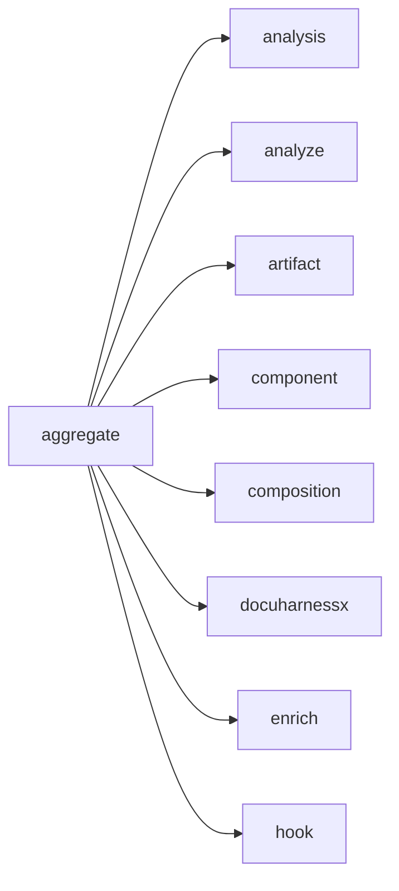

Appears on:

- [What does analysis do?](component-analysis-5fb37dc2.md)

Sources: `surface:docuharnessx/review/aggregate.py`

<h2 id="analysis">analysis</h2>

_No definition in the repository yet._

Related: [aggregate](#aggregate), [analyze](#analyze), [artifact](#artifact), [component](#component), [composition](#composition), [docuharnessx](#docuharnessx), [enrich](#enrich), [hook](#hook)


Appears on:

- [What does analysis do?](component-analysis-5fb37dc2.md)
- [What does assembler do?](component-assembler-d9228a8c.md)
- [What does composition do?](component-composition-e6f778c7.md)
- [What does comprehension do?](component-comprehension-87225edb.md)
- [What does docuharnessx do?](component-docuharnessx-3986831c.md)
- [How is the public surface used or extended?](public-surface-init-py-a3934091.md)
- [How does this program start?](startup-cli-py-126eba90.md)
- [How are tests organized?](tests-tests-37e0cc9c.md)
- [DocuHarnessX](index.md)

Sources: `component:docuharnessx/analysis`

<h2 id="analyze">analyze</h2>

_No definition in the repository yet._

Related: [aggregate](#aggregate), [analysis](#analysis), [artifact](#artifact), [component](#component), [composition](#composition), [docuharnessx](#docuharnessx), [enrich](#enrich), [hook](#hook)

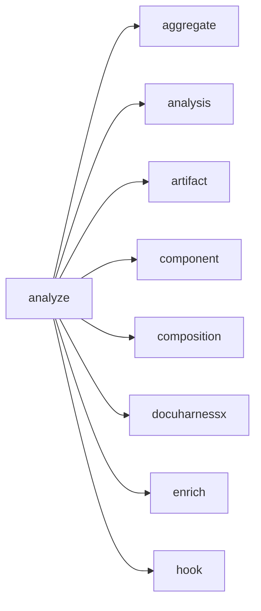

Appears on:

- [What does analysis do?](component-analysis-5fb37dc2.md)
- [What does docuharnessx do?](component-docuharnessx-3986831c.md)
- [How is the public surface used or extended?](public-surface-init-py-a3934091.md)
- [How does this program start?](startup-cli-py-126eba90.md)
- [How are tests organized?](tests-tests-37e0cc9c.md)

Sources: `surface:docuharnessx/analysis/__init__.py`, `surface:docuharnessx/analysis/analyzer.py`

<h2 id="apex">--apex</h2>

_No definition in the repository yet._

Sources: `surface:tests/test_analysis_detectors_components_surface.py`

<h2 id="artifact">artifact</h2>

_No definition in the repository yet._

Related: [aggregate](#aggregate), [analysis](#analysis), [analyze](#analyze), [component](#component), [composition](#composition), [docuharnessx](#docuharnessx), [enrich](#enrich), [hook](#hook)

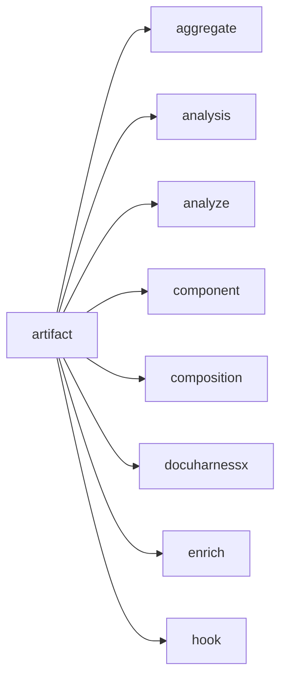

Appears on:

- [How is this project built and verified?](build-pyproject-toml-a625bf0a.md)
- [What does analysis do?](component-analysis-5fb37dc2.md)
- [What does assembler do?](component-assembler-d9228a8c.md)
- [What does docuharnessx do?](component-docuharnessx-3986831c.md)
- [What does javascripts do?](component-javascripts-2aa9650e.md)
- [How are tests organized?](tests-tests-37e0cc9c.md)

Sources: `ontology:subject`

<h2 id="assembler">assembler</h2>

_No definition in the repository yet._

Related: [analysis](#analysis), [artifact](#artifact), [docuharnessx](#docuharnessx), [ontology](#ontology), [pages](#pages), [review](#review), [run](#run), [comprehension](#comprehension)

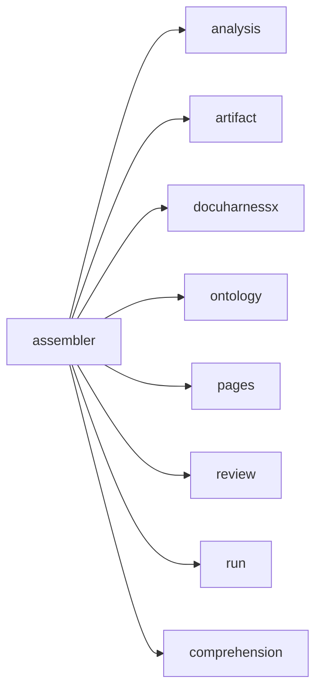

Appears on:

- [What does assembler do?](component-assembler-d9228a8c.md)
- [What does comprehension do?](component-comprehension-87225edb.md)
- [What does deployer do?](component-deployer-f8b1b75f.md)
- [What does javascripts do?](component-javascripts-2aa9650e.md)
- [How are tests organized?](tests-tests-37e0cc9c.md)
- [DocuHarnessX](index.md)

Sources: `component:docuharnessx/assembler`

<h2 id="assess-quality">Assess Quality</h2>

Judge quality, security, and compliance.

Sources: `ontology:intent`

<h2 id="ci">ci</h2>

_No definition in the repository yet._

Sources: `surface:docuharnessx/cli.py`

<h2 id="component">component</h2>

_No definition in the repository yet._

Related: [aggregate](#aggregate), [analysis](#analysis), [analyze](#analyze), [artifact](#artifact), [composition](#composition), [docuharnessx](#docuharnessx), [enrich](#enrich), [hook](#hook)

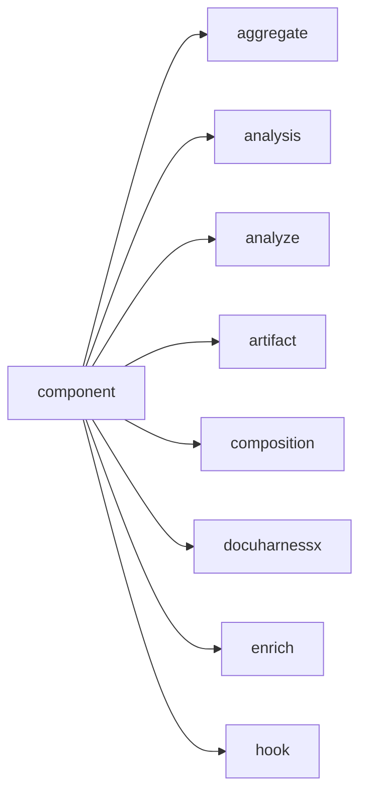

Appears on:

- [What does analysis do?](component-analysis-5fb37dc2.md)
- [What does docuharnessx do?](component-docuharnessx-3986831c.md)
- [How are tests organized?](tests-tests-37e0cc9c.md)

Sources: `ontology:subject`

<h2 id="composition">composition</h2>

_No definition in the repository yet._

Related: [aggregate](#aggregate), [analysis](#analysis), [analyze](#analyze), [artifact](#artifact), [component](#component), [docuharnessx](#docuharnessx), [enrich](#enrich), [hook](#hook)

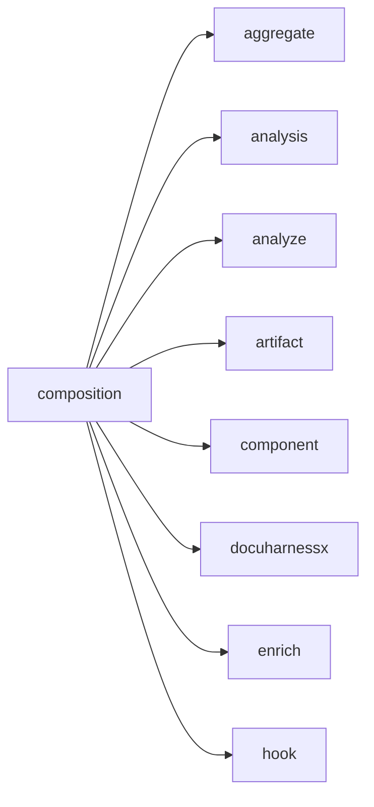

Appears on:

- [What does analysis do?](component-analysis-5fb37dc2.md)
- [What does composition do?](component-composition-e6f778c7.md)
- [What does docuharnessx do?](component-docuharnessx-3986831c.md)
- [What does mcp do?](component-mcp-bdf519de.md)
- [How is the public surface used or extended?](public-surface-init-py-a3934091.md)
- [How are tests organized?](tests-tests-37e0cc9c.md)
- [DocuHarnessX](index.md)

Sources: `component:docuharnessx/composition`

<h2 id="comprehension">comprehension</h2>

_No definition in the repository yet._

Related: [analysis](#analysis), [assembler](#assembler), [docuharnessx](#docuharnessx), [ontology](#ontology), [pages](#pages), [pipeline](#pipeline), [stages](#stages), [status](#status)

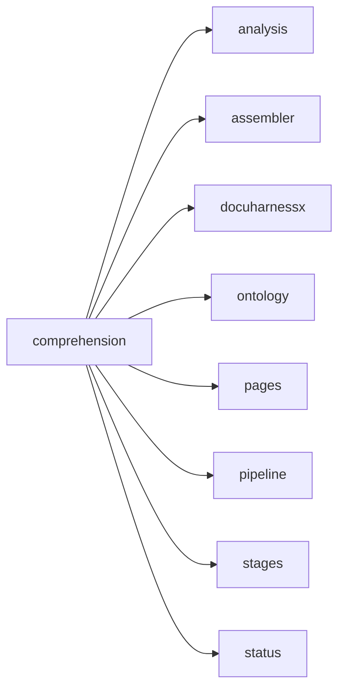

Appears on:

- [What does comprehension do?](component-comprehension-87225edb.md)
- [DocuHarnessX](index.md)

Sources: `component:docuharnessx/comprehension`

<h2 id="config">--config</h2>

_No definition in the repository yet._

Related: [analysis](#analysis), [analyze](#analyze), [artifact](#artifact), [component](#component), [composition](#composition), [Developer](#developer), [docuharnessx](#docuharnessx), [--force](#force)

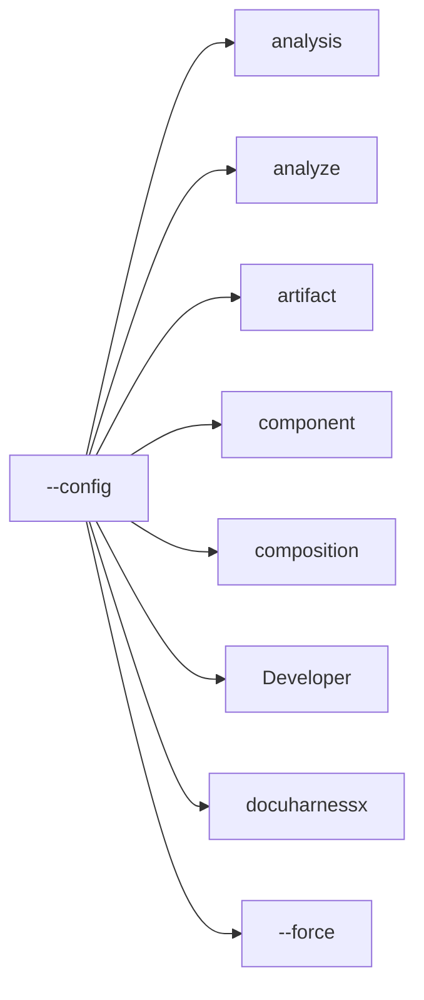

Appears on:

- [What does docuharnessx do?](component-docuharnessx-3986831c.md)
- [How does this program start?](startup-cli-py-126eba90.md)

Sources: `surface:docuharnessx/cli.py`, `surface:tests/test_analysis_detectors_components_surface.py`

<h2 id="configure">Configure</h2>

Configure the project for a context.

Sources: `ontology:intent`

<h2 id="contribute">Contribute</h2>

Contribute changes back.

Sources: `ontology:intent`

<h2 id="contributor">Contributor</h2>

Contributes changes back to the project.

Sources: `ontology:role`

<h2 id="default">--default</h2>

_No definition in the repository yet._

Related: [analysis](#analysis), [analyze](#analyze), [--config](#config), [docuharnessx](#docuharnessx), [--force](#force), [hook](#hook), [init](#init), [Install](#install)


Appears on:

- [How does this program start?](startup-cli-py-126eba90.md)

Sources: `surface:docuharnessx/cli.py`

<h2 id="deliver">Deliver</h2>

Ship outcomes that depend on the project.

Sources: `ontology:intent`

<h2 id="deploy-mode">--deploy-mode</h2>

_No definition in the repository yet._

Sources: `surface:docuharnessx/cli.py`

<h2 id="deployer">deployer</h2>

_No definition in the repository yet._

Related: [analysis](#analysis), [analyze](#analyze), [artifact](#artifact), [assembler](#assembler), [component](#component), [composition](#composition), [Developer](#developer), [docuharnessx](#docuharnessx)

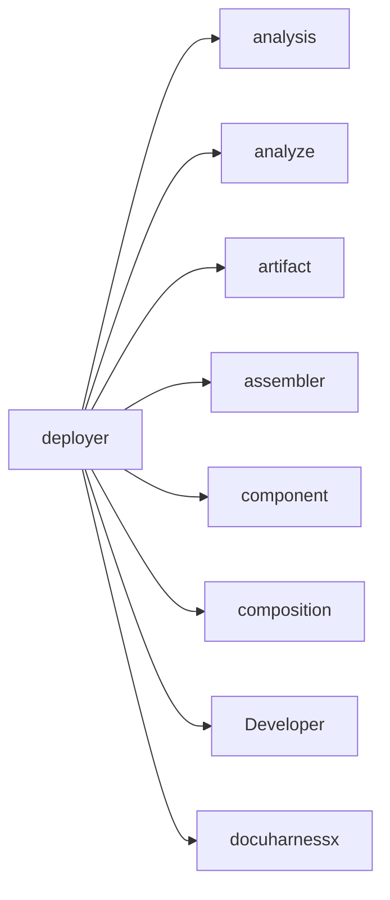

Appears on:

- [What does deployer do?](component-deployer-f8b1b75f.md)
- [How are tests organized?](tests-tests-37e0cc9c.md)
- [DocuHarnessX](index.md)

Sources: `component:docuharnessx/deployer`

<h2 id="developer">Developer</h2>

Builds on or with the project's code.

Related: [analysis](#analysis), [analyze](#analyze), [artifact](#artifact), [component](#component), [composition](#composition), [--config](#config), [docuharnessx](#docuharnessx), [--force](#force)

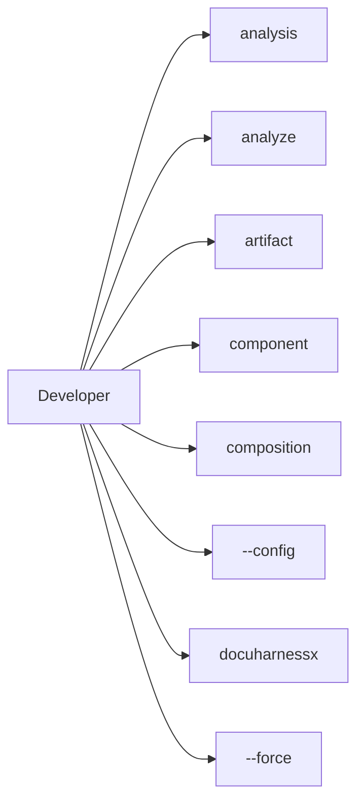

Appears on:

- [What does docuharnessx do?](component-docuharnessx-3986831c.md)
- [How are tests organized?](tests-tests-37e0cc9c.md)

Sources: `ontology:role`

<h2 id="devops-admin">DevOps/Admin</h2>

Deploys, configures, and administers the project.

Sources: `ontology:role`

<h2 id="docuharnessx">docuharnessx</h2>

_No definition in the repository yet._

Related: [aggregate](#aggregate), [analysis](#analysis), [analyze](#analyze), [artifact](#artifact), [component](#component), [composition](#composition), [enrich](#enrich), [hook](#hook)

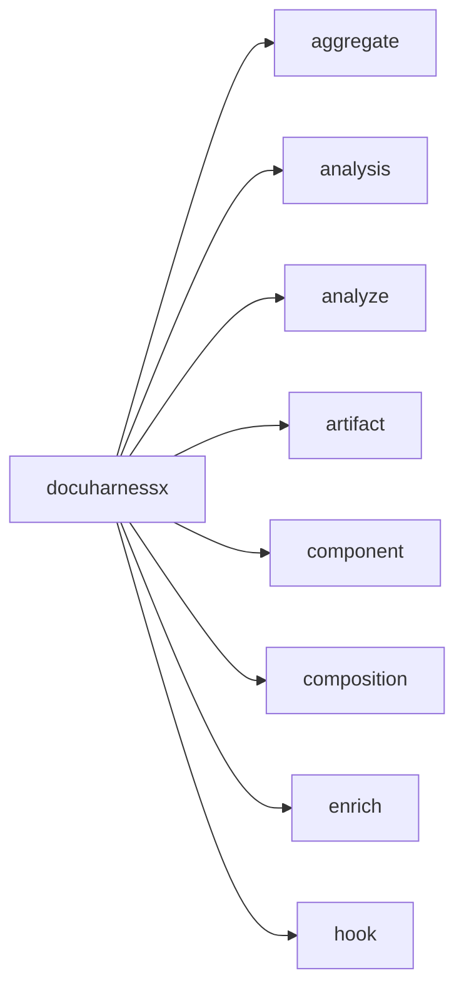

Appears on:

- [How is this project built and verified?](build-pyproject-toml-a625bf0a.md)
- [What does analysis do?](component-analysis-5fb37dc2.md)
- [What does assembler do?](component-assembler-d9228a8c.md)
- [What does composition do?](component-composition-e6f778c7.md)
- [What does comprehension do?](component-comprehension-87225edb.md)
- [What does deployer do?](component-deployer-f8b1b75f.md)
- [What does docuharnessx do?](component-docuharnessx-3986831c.md)
- [What does javascripts do?](component-javascripts-2aa9650e.md)
- [What does mcp do?](component-mcp-bdf519de.md)
- [How is the public surface used or extended?](public-surface-init-py-a3934091.md)
- [How does this program start?](startup-cli-py-126eba90.md)
- [How are tests organized?](tests-tests-37e0cc9c.md)

Sources: `component:docuharnessx`

<h2 id="enrich">enrich</h2>

_No definition in the repository yet._

Related: [aggregate](#aggregate), [analysis](#analysis), [analyze](#analyze), [artifact](#artifact), [component](#component), [composition](#composition), [docuharnessx](#docuharnessx), [hook](#hook)

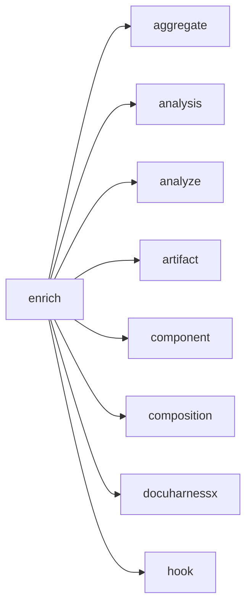

Appears on:

- [What does analysis do?](component-analysis-5fb37dc2.md)
- [How is the public surface used or extended?](public-surface-init-py-a3934091.md)

Sources: `surface:docuharnessx/analysis/__init__.py`, `surface:docuharnessx/analysis/enrich.py`

<h2 id="evaluate">Evaluate</h2>

Assess fit before adopting.

Sources: `ontology:intent`

<h2 id="evolve">--evolve</h2>

_No definition in the repository yet._

Sources: `surface:docuharnessx/cli.py`

<h2 id="extend">Extend</h2>

Add capabilities or customize behavior.

Sources: `ontology:intent`

<h2 id="force">--force</h2>

_No definition in the repository yet._

Related: [analysis](#analysis), [analyze](#analyze), [artifact](#artifact), [component](#component), [composition](#composition), [--config](#config), [Developer](#developer), [docuharnessx](#docuharnessx)

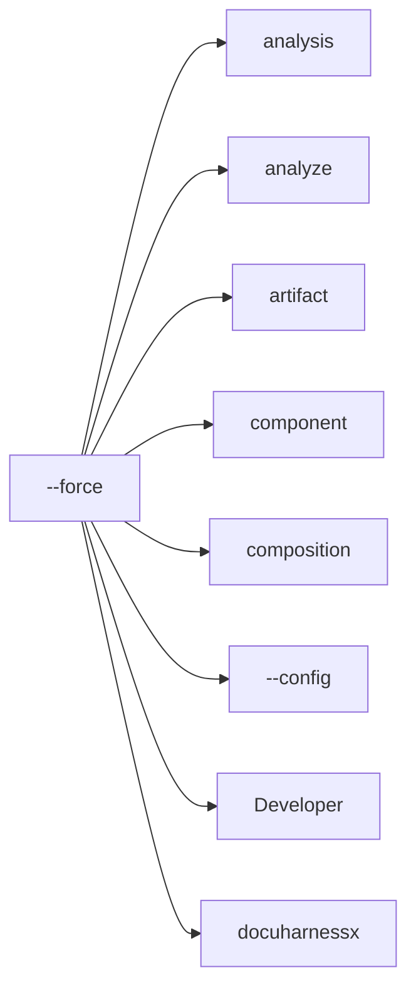

Appears on:

- [What does docuharnessx do?](component-docuharnessx-3986831c.md)
- [How does this program start?](startup-cli-py-126eba90.md)

Sources: `surface:docuharnessx/cli.py`

<h2 id="git">--git</h2>

_No definition in the repository yet._

Sources: `surface:docuharnessx/cli.py`

<h2 id="hook">hook</h2>

_No definition in the repository yet._

Related: [aggregate](#aggregate), [analysis](#analysis), [analyze](#analyze), [artifact](#artifact), [component](#component), [composition](#composition), [docuharnessx](#docuharnessx), [enrich](#enrich)

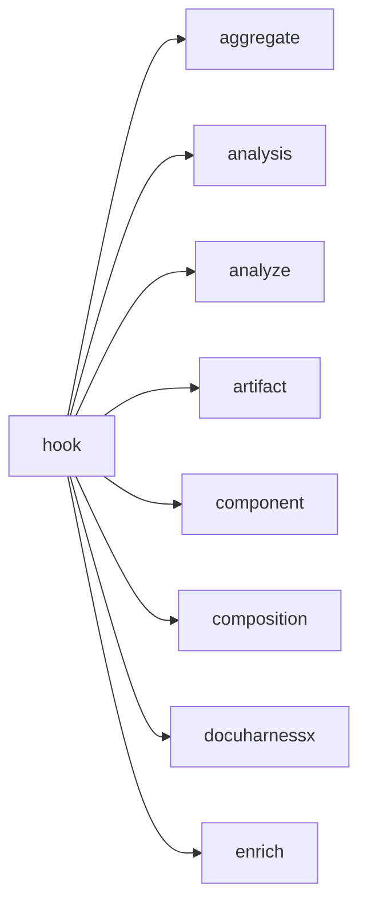

Appears on:

- [How is this project built and verified?](build-pyproject-toml-a625bf0a.md)
- [What does analysis do?](component-analysis-5fb37dc2.md)
- [What does docuharnessx do?](component-docuharnessx-3986831c.md)
- [How is the public surface used or extended?](public-surface-init-py-a3934091.md)
- [How does this program start?](startup-cli-py-126eba90.md)

Sources: `surface:docuharnessx/cli.py`

<h2 id="init">init</h2>

_No definition in the repository yet._

Related: [analysis](#analysis), [analyze](#analyze), [artifact](#artifact), [component](#component), [composition](#composition), [--config](#config), [Developer](#developer), [docuharnessx](#docuharnessx)

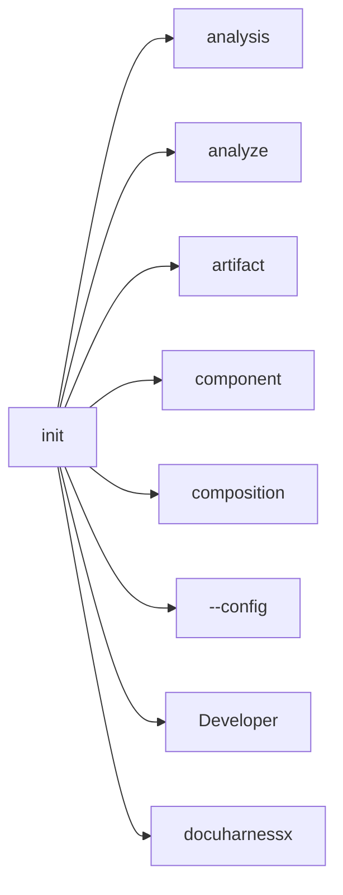

Appears on:

- [How is this project built and verified?](build-pyproject-toml-a625bf0a.md)
- [What does docuharnessx do?](component-docuharnessx-3986831c.md)
- [How does this program start?](startup-cli-py-126eba90.md)

Sources: `surface:docuharnessx/cli.py`

<h2 id="install">Install</h2>

Get the project installed.

Related: [analysis](#analysis), [analyze](#analyze), [--config](#config), [--default](#default), [docuharnessx](#docuharnessx), [--force](#force), [hook](#hook), [init](#init)

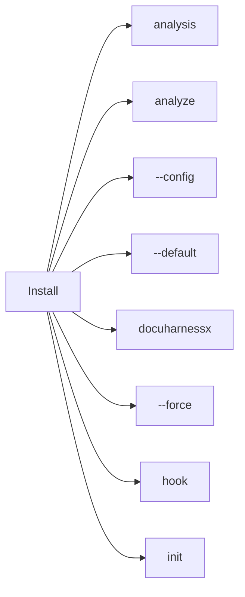

Appears on:

- [How is this project built and verified?](build-pyproject-toml-a625bf0a.md)
- [What does deployer do?](component-deployer-f8b1b75f.md)
- [How does this program start?](startup-cli-py-126eba90.md)

Sources: `ontology:intent`

<h2 id="install-ci">install-ci</h2>

_No definition in the repository yet._

Related: [analysis](#analysis), [analyze](#analyze), [artifact](#artifact), [component](#component), [composition](#composition), [--config](#config), [Developer](#developer), [docuharnessx](#docuharnessx)

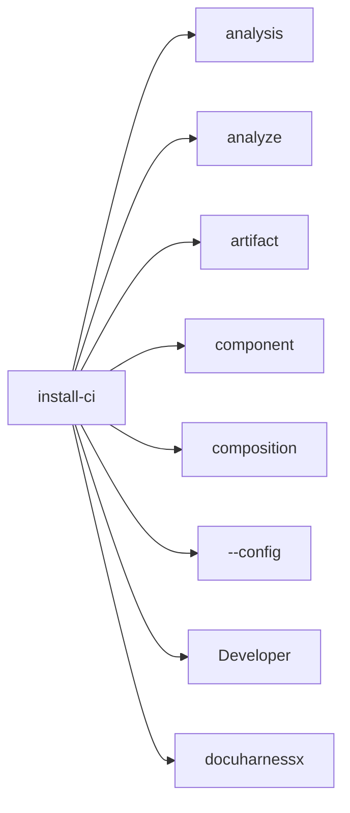

Appears on:

- [How is this project built and verified?](build-pyproject-toml-a625bf0a.md)
- [What does docuharnessx do?](component-docuharnessx-3986831c.md)
- [How does this program start?](startup-cli-py-126eba90.md)

Sources: `surface:docuharnessx/cli.py`

<h2 id="install-hooks">install-hooks</h2>

_No definition in the repository yet._

Related: [analysis](#analysis), [analyze](#analyze), [artifact](#artifact), [component](#component), [composition](#composition), [--config](#config), [Developer](#developer), [docuharnessx](#docuharnessx)

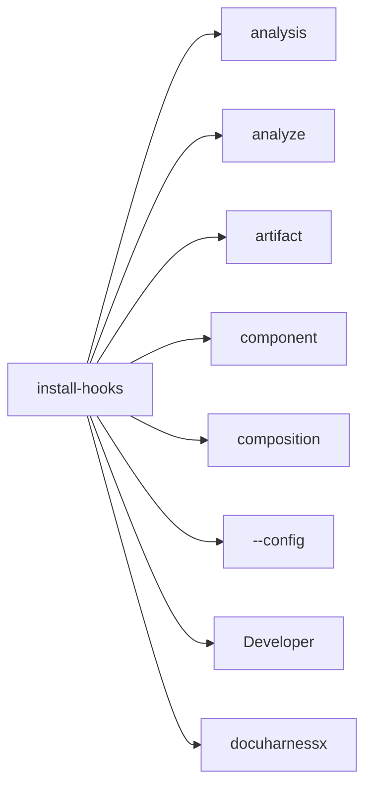

Appears on:

- [How is this project built and verified?](build-pyproject-toml-a625bf0a.md)
- [What does docuharnessx do?](component-docuharnessx-3986831c.md)
- [How does this program start?](startup-cli-py-126eba90.md)

Sources: `surface:docuharnessx/cli.py`

<h2 id="integrate">Integrate</h2>

Connect the project to other systems.

Sources: `ontology:intent`

<h2 id="integrator-api-consumer">Integrator/API consumer</h2>

Integrates the project via its APIs or interfaces.

Sources: `ontology:role`

<h2 id="javascripts">javascripts</h2>

_No definition in the repository yet._

Related: [analysis](#analysis), [assembler](#assembler), [composition](#composition), [comprehension](#comprehension), [deployer](#deployer), [docuharnessx](#docuharnessx), [mcp](#mcp), [artifact](#artifact)

```mermaid
flowchart LR
  here["javascripts"]
  r0["analysis"]
  here --> r0
  r1["assembler"]
  here --> r1
  r2["composition"]
  here --> r2
  r3["comprehension"]
  here --> r3
  r4["deployer"]
  here --> r4
  r5["docuharnessx"]
  here --> r5
  r6["mcp"]
  here --> r6
  r7["artifact"]
  here --> r7
```

Appears on:

- [What does javascripts do?](component-javascripts-2aa9650e.md)
- [DocuHarnessX](index.md)

Sources: `component:docs/javascripts`

<h2 id="main">main</h2>

_No definition in the repository yet._

Related: [aggregate](#aggregate), [analysis](#analysis), [analyze](#analyze), [artifact](#artifact), [component](#component), [composition](#composition), [docuharnessx](#docuharnessx), [enrich](#enrich)

```mermaid
flowchart LR
  here["main"]
  r0["aggregate"]
  here --> r0
  r1["analysis"]
  here --> r1
  r2["analyze"]
  here --> r2
  r3["artifact"]
  here --> r3
  r4["component"]
  here --> r4
  r5["composition"]
  here --> r5
  r6["docuharnessx"]
  here --> r6
  r7["enrich"]
  here --> r7
```

Appears on:

- [How is this project built and verified?](build-pyproject-toml-a625bf0a.md)
- [What does analysis do?](component-analysis-5fb37dc2.md)
- [What does composition do?](component-composition-e6f778c7.md)
- [What does deployer do?](component-deployer-f8b1b75f.md)
- [What does docuharnessx do?](component-docuharnessx-3986831c.md)
- [How is the public surface used or extended?](public-surface-init-py-a3934091.md)
- [How does this program start?](startup-cli-py-126eba90.md)

Sources: `surface:docuharnessx/cli.py`

<h2 id="manage">--manage</h2>

_No definition in the repository yet._

Sources: `surface:docuharnessx/cli.py`

<h2 id="manager">Manager</h2>

Owns outcomes, budget, and direction.

Sources: `ontology:role`

<h2 id="mcp">mcp</h2>

_No definition in the repository yet._

Related: [analysis](#analysis), [analyze](#analyze), [artifact](#artifact), [component](#component), [composition](#composition), [--config](#config), [Developer](#developer), [docuharnessx](#docuharnessx)

```mermaid
flowchart LR
  here["mcp"]
  r0["analysis"]
  here --> r0
  r1["analyze"]
  here --> r1
  r2["artifact"]
  here --> r2
  r3["component"]
  here --> r3
  r4["composition"]
  here --> r4
  r5["--config"]
  here --> r5
  r6["Developer"]
  here --> r6
  r7["docuharnessx"]
  here --> r7
```

Appears on:

- [How is this project built and verified?](build-pyproject-toml-a625bf0a.md)
- [What does docuharnessx do?](component-docuharnessx-3986831c.md)
- [What does mcp do?](component-mcp-bdf519de.md)
- [How is the public surface used or extended?](public-surface-init-py-a3934091.md)
- [How does this program start?](startup-cli-py-126eba90.md)
- [How are tests organized?](tests-tests-37e0cc9c.md)
- [DocuHarnessX](index.md)

Sources: `component:docuharnessx/mcp`, `surface:docuharnessx/cli.py`

<h2 id="monitor">Monitor</h2>

Observe health and behavior.

Sources: `ontology:intent`

<h2 id="not">--not</h2>

_No definition in the repository yet._

Sources: `surface:docuharnessx/cli.py`

<h2 id="ontology">ontology</h2>

_No definition in the repository yet._

Related: [analysis](#analysis), [artifact](#artifact), [assembler](#assembler), [docuharnessx](#docuharnessx), [pages](#pages), [review](#review), [run](#run), [composition](#composition)

```mermaid
flowchart LR
  here["ontology"]
  r0["analysis"]
  here --> r0
  r1["artifact"]
  here --> r1
  r2["assembler"]
  here --> r2
  r3["docuharnessx"]
  here --> r3
  r4["pages"]
  here --> r4
  r5["review"]
  here --> r5
  r6["run"]
  here --> r6
  r7["composition"]
  here --> r7
```

Appears on:

- [What does assembler do?](component-assembler-d9228a8c.md)
- [What does composition do?](component-composition-e6f778c7.md)
- [What does comprehension do?](component-comprehension-87225edb.md)
- [What does docuharnessx do?](component-docuharnessx-3986831c.md)
- [How is the public surface used or extended?](public-surface-init-py-a3934091.md)
- [How does this program start?](startup-cli-py-126eba90.md)
- [How are tests organized?](tests-tests-37e0cc9c.md)

Sources: `component:docuharnessx/ontology`

<h2 id="operate">Operate</h2>

Run the project day to day.

Sources: `ontology:intent`

<h2 id="out">--out</h2>

_No definition in the repository yet._

Related: [analysis](#analysis), [analyze](#analyze), [artifact](#artifact), [component](#component), [composition](#composition), [--config](#config), [Developer](#developer), [docuharnessx](#docuharnessx)

```mermaid
flowchart LR
  here["--out"]
  r0["analysis"]
  here --> r0
  r1["analyze"]
  here --> r1
  r2["artifact"]
  here --> r2
  r3["component"]
  here --> r3
  r4["composition"]
  here --> r4
  r5["--config"]
  here --> r5
  r6["Developer"]
  here --> r6
  r7["docuharnessx"]
  here --> r7
```

Appears on:

- [What does docuharnessx do?](component-docuharnessx-3986831c.md)
- [How does this program start?](startup-cli-py-126eba90.md)

Sources: `surface:docuharnessx/cli.py`

<h2 id="pages">pages</h2>

_No definition in the repository yet._

Related: [analysis](#analysis), [artifact](#artifact), [assembler](#assembler), [docuharnessx](#docuharnessx), [ontology](#ontology), [review](#review), [run](#run), [comprehension](#comprehension)

```mermaid
flowchart LR
  here["pages"]
  r0["analysis"]
  here --> r0
  r1["artifact"]
  here --> r1
  r2["assembler"]
  here --> r2
  r3["docuharnessx"]
  here --> r3
  r4["ontology"]
  here --> r4
  r5["review"]
  here --> r5
  r6["run"]
  here --> r6
  r7["comprehension"]
  here --> r7
```

Appears on:

- [What does assembler do?](component-assembler-d9228a8c.md)
- [What does comprehension do?](component-comprehension-87225edb.md)
- [What does deployer do?](component-deployer-f8b1b75f.md)
- [What does docuharnessx do?](component-docuharnessx-3986831c.md)
- [How does this program start?](startup-cli-py-126eba90.md)

Sources: `component:docuharnessx/pages`

<h2 id="pipeline">pipeline</h2>

_No definition in the repository yet._

Related: [aggregate](#aggregate), [analysis](#analysis), [analyze](#analyze), [artifact](#artifact), [component](#component), [composition](#composition), [docuharnessx](#docuharnessx), [enrich](#enrich)

```mermaid
flowchart LR
  here["pipeline"]
  r0["aggregate"]
  here --> r0
  r1["analysis"]
  here --> r1
  r2["analyze"]
  here --> r2
  r3["artifact"]
  here --> r3
  r4["component"]
  here --> r4
  r5["composition"]
  here --> r5
  r6["docuharnessx"]
  here --> r6
  r7["enrich"]
  here --> r7
```

Appears on:

- [How is this project built and verified?](build-pyproject-toml-a625bf0a.md)
- [What does analysis do?](component-analysis-5fb37dc2.md)
- [What does composition do?](component-composition-e6f778c7.md)
- [What does comprehension do?](component-comprehension-87225edb.md)
- [What does deployer do?](component-deployer-f8b1b75f.md)
- [What does docuharnessx do?](component-docuharnessx-3986831c.md)
- [How is the public surface used or extended?](public-surface-init-py-a3934091.md)
- [How does this program start?](startup-cli-py-126eba90.md)
- [How are tests organized?](tests-tests-37e0cc9c.md)

Sources: `component:docuharnessx/pipeline`

<h2 id="planning">planning</h2>

_No definition in the repository yet._

Related: [analysis](#analysis), [analyze](#analyze), [artifact](#artifact), [component](#component), [composition](#composition), [--config](#config), [Developer](#developer), [docuharnessx](#docuharnessx)

```mermaid
flowchart LR
  here["planning"]
  r0["analysis"]
  here --> r0
  r1["analyze"]
  here --> r1
  r2["artifact"]
  here --> r2
  r3["component"]
  here --> r3
  r4["composition"]
  here --> r4
  r5["--config"]
  here --> r5
  r6["Developer"]
  here --> r6
  r7["docuharnessx"]
  here --> r7
```

Appears on:

- [What does docuharnessx do?](component-docuharnessx-3986831c.md)
- [How is the public surface used or extended?](public-surface-init-py-a3934091.md)
- [How are tests organized?](tests-tests-37e0cc9c.md)

Sources: `component:docuharnessx/planning`

<h2 id="possible-adopter">Possible Adopter</h2>

Evaluating whether to adopt the project.

Sources: `ontology:role`

<h2 id="pre-commit">--pre-commit</h2>

_No definition in the repository yet._

Sources: `surface:docuharnessx/cli.py`

<h2 id="regenerate">--regenerate</h2>

_No definition in the repository yet._

Sources: `surface:docuharnessx/cli.py`

<h2 id="regenerate-id">--regenerate-id</h2>

_No definition in the repository yet._

Sources: `surface:docuharnessx/cli.py`

<h2 id="researcher">Researcher</h2>

Studies, benchmarks, or extends the project's ideas.

Sources: `ontology:role`

<h2 id="review">review</h2>

_No definition in the repository yet._

Related: [analysis](#analysis), [artifact](#artifact), [assembler](#assembler), [docuharnessx](#docuharnessx), [ontology](#ontology), [pages](#pages), [run](#run), [composition](#composition)

```mermaid
flowchart LR
  here["review"]
  r0["analysis"]
  here --> r0
  r1["artifact"]
  here --> r1
  r2["assembler"]
  here --> r2
  r3["docuharnessx"]
  here --> r3
  r4["ontology"]
  here --> r4
  r5["pages"]
  here --> r5
  r6["run"]
  here --> r6
  r7["composition"]
  here --> r7
```

Appears on:

- [What does assembler do?](component-assembler-d9228a8c.md)
- [What does composition do?](component-composition-e6f778c7.md)
- [What does docuharnessx do?](component-docuharnessx-3986831c.md)
- [How are tests organized?](tests-tests-37e0cc9c.md)

Sources: `component:docuharnessx/review`

<h2 id="roles">--roles</h2>

_No definition in the repository yet._

Sources: `surface:docuharnessx/cli.py`

<h2 id="run">run</h2>

_No definition in the repository yet._

Related: [analysis](#analysis), [artifact](#artifact), [assembler](#assembler), [docuharnessx](#docuharnessx), [ontology](#ontology), [pages](#pages), [review](#review), [composition](#composition)

```mermaid
flowchart LR
  here["run"]
  r0["analysis"]
  here --> r0
  r1["artifact"]
  here --> r1
  r2["assembler"]
  here --> r2
  r3["docuharnessx"]
  here --> r3
  r4["ontology"]
  here --> r4
  r5["pages"]
  here --> r5
  r6["review"]
  here --> r6
  r7["composition"]
  here --> r7
```

Appears on:

- [How is this project built and verified?](build-pyproject-toml-a625bf0a.md)
- [What does assembler do?](component-assembler-d9228a8c.md)
- [What does composition do?](component-composition-e6f778c7.md)
- [What does deployer do?](component-deployer-f8b1b75f.md)
- [What does docuharnessx do?](component-docuharnessx-3986831c.md)
- [What does mcp do?](component-mcp-bdf519de.md)
- [How does this program start?](startup-cli-py-126eba90.md)
- [How are tests organized?](tests-tests-37e0cc9c.md)

Sources: `surface:docuharnessx/cli.py`, `surface:tests/test_analysis_detectors_components_surface.py`

<h2 id="scan">scan</h2>

_No definition in the repository yet._

Related: [aggregate](#aggregate), [analysis](#analysis), [analyze](#analyze), [artifact](#artifact), [component](#component), [composition](#composition), [docuharnessx](#docuharnessx), [enrich](#enrich)

```mermaid
flowchart LR
  here["scan"]
  r0["aggregate"]
  here --> r0
  r1["analysis"]
  here --> r1
  r2["analyze"]
  here --> r2
  r3["artifact"]
  here --> r3
  r4["component"]
  here --> r4
  r5["composition"]
  here --> r5
  r6["docuharnessx"]
  here --> r6
  r7["enrich"]
  here --> r7
```

Appears on:

- [What does analysis do?](component-analysis-5fb37dc2.md)
- [What does docuharnessx do?](component-docuharnessx-3986831c.md)
- [How is the public surface used or extended?](public-surface-init-py-a3934091.md)
- [How does this program start?](startup-cli-py-126eba90.md)
- [How are tests organized?](tests-tests-37e0cc9c.md)

Sources: `surface:docuharnessx/analysis/__init__.py`, `surface:docuharnessx/analysis/scanner.py`

<h2 id="security-compliance-officer">Security/Compliance Officer</h2>

Assesses security, privacy, and compliance posture.

Sources: `ontology:role`

<h2 id="stages">stages</h2>

_No definition in the repository yet._

Related: [aggregate](#aggregate), [analysis](#analysis), [analyze](#analyze), [artifact](#artifact), [component](#component), [composition](#composition), [docuharnessx](#docuharnessx), [enrich](#enrich)

```mermaid
flowchart LR
  here["stages"]
  r0["aggregate"]
  here --> r0
  r1["analysis"]
  here --> r1
  r2["analyze"]
  here --> r2
  r3["artifact"]
  here --> r3
  r4["component"]
  here --> r4
  r5["composition"]
  here --> r5
  r6["docuharnessx"]
  here --> r6
  r7["enrich"]
  here --> r7
```

Appears on:

- [What does analysis do?](component-analysis-5fb37dc2.md)
- [What does composition do?](component-composition-e6f778c7.md)
- [What does comprehension do?](component-comprehension-87225edb.md)
- [What does deployer do?](component-deployer-f8b1b75f.md)
- [What does docuharnessx do?](component-docuharnessx-3986831c.md)
- [How is the public surface used or extended?](public-surface-init-py-a3934091.md)

Sources: `component:docuharnessx/stages`

<h2 id="status">status</h2>

_No definition in the repository yet._

Related: [analysis](#analysis), [assembler](#assembler), [comprehension](#comprehension), [docuharnessx](#docuharnessx), [ontology](#ontology), [pages](#pages), [pipeline](#pipeline), [stages](#stages)

```mermaid
flowchart LR
  here["status"]
  r0["analysis"]
  here --> r0
  r1["assembler"]
  here --> r1
  r2["comprehension"]
  here --> r2
  r3["docuharnessx"]
  here --> r3
  r4["ontology"]
  here --> r4
  r5["pages"]
  here --> r5
  r6["pipeline"]
  here --> r6
  r7["stages"]
  here --> r7
```

Appears on:

- [How is this project built and verified?](build-pyproject-toml-a625bf0a.md)
- [What does comprehension do?](component-comprehension-87225edb.md)
- [What does deployer do?](component-deployer-f8b1b75f.md)
- [What does docuharnessx do?](component-docuharnessx-3986831c.md)
- [How does this program start?](startup-cli-py-126eba90.md)

Sources: `surface:docuharnessx/cli.py`

<h2 id="sufficient">sufficient</h2>

_No definition in the repository yet._

Related: [analysis](#analysis), [analyze](#analyze), [artifact](#artifact), [component](#component), [composition](#composition), [--config](#config), [Developer](#developer), [docuharnessx](#docuharnessx)

```mermaid
flowchart LR
  here["sufficient"]
  r0["analysis"]
  here --> r0
  r1["analyze"]
  here --> r1
  r2["artifact"]
  here --> r2
  r3["component"]
  here --> r3
  r4["composition"]
  here --> r4
  r5["--config"]
  here --> r5
  r6["Developer"]
  here --> r6
  r7["docuharnessx"]
  here --> r7
```

Appears on:

- [How is this project built and verified?](build-pyproject-toml-a625bf0a.md)
- [What does docuharnessx do?](component-docuharnessx-3986831c.md)
- [How does this program start?](startup-cli-py-126eba90.md)

Sources: `surface:docuharnessx/cli.py`

<h2 id="support-on-call-sre">Support/On-call (SRE)</h2>

Operates and supports the project in production.

Sources: `ontology:role`

<h2 id="tech">tech</h2>

_No definition in the repository yet._

Related: [analysis](#analysis), [analyze](#analyze), [artifact](#artifact), [component](#component), [composition](#composition), [--config](#config), [Developer](#developer), [docuharnessx](#docuharnessx)

```mermaid
flowchart LR
  here["tech"]
  r0["analysis"]
  here --> r0
  r1["analyze"]
  here --> r1
  r2["artifact"]
  here --> r2
  r3["component"]
  here --> r3
  r4["composition"]
  here --> r4
  r5["--config"]
  here --> r5
  r6["Developer"]
  here --> r6
  r7["docuharnessx"]
  here --> r7
```

Appears on:

- [What does docuharnessx do?](component-docuharnessx-3986831c.md)
- [How are tests organized?](tests-tests-37e0cc9c.md)

Sources: `ontology:subject`

<h2 id="tech-savvy-user">Tech-savvy User</h2>

Uses the project competently without developing it.

Sources: `ontology:role`

<h2 id="topic">topic</h2>

_No definition in the repository yet._

Related: [analysis](#analysis), [analyze](#analyze), [artifact](#artifact), [component](#component), [composition](#composition), [--config](#config), [Developer](#developer), [docuharnessx](#docuharnessx)

```mermaid
flowchart LR
  here["topic"]
  r0["analysis"]
  here --> r0
  r1["analyze"]
  here --> r1
  r2["artifact"]
  here --> r2
  r3["component"]
  here --> r3
  r4["composition"]
  here --> r4
  r5["--config"]
  here --> r5
  r6["Developer"]
  here --> r6
  r7["docuharnessx"]
  here --> r7
```

Appears on:

- [What does docuharnessx do?](component-docuharnessx-3986831c.md)
- [How are tests organized?](tests-tests-37e0cc9c.md)

Sources: `ontology:subject`

<h2 id="troubleshoot">Troubleshoot</h2>

Diagnose and fix problems.

Sources: `ontology:intent`

<h2 id="understand">Understand</h2>

Build a mental model of the project.

Sources: `ontology:intent`

<h2 id="use">Use</h2>

Use the project for its primary purpose.

Related: [composition](#composition), [docuharnessx](#docuharnessx), [mcp](#mcp), [run](#run)

```mermaid
flowchart LR
  here["Use"]
  r0["composition"]
  here --> r0
  r1["docuharnessx"]
  here --> r1
  r2["mcp"]
  here --> r2
  r3["run"]
  here --> r3
```

Appears on:

- [What does mcp do?](component-mcp-bdf519de.md)

Sources: `ontology:intent`

<h2 id="verbose">--verbose</h2>

_No definition in the repository yet._

Sources: `surface:tests/test_analysis_detectors_components_surface.py`

<h2 id="zoom">--zoom</h2>

_No definition in the repository yet._

Sources: `surface:tests/test_analysis_detectors_components_surface.py`
