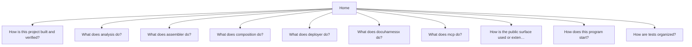

# DocuHarnessX

Documentation for [`norandom/DocuHarnessX`](https://github.com/norandom/DocuHarnessX).

## Questions

- [How is this project built and verified?](build-pyproject-toml-a625bf0a.md)
- [What does analysis do?](component-analysis-5fb37dc2.md)
- [What does assembler do?](component-assembler-d9228a8c.md)
- [What does composition do?](component-composition-e6f778c7.md)
- [What does deployer do?](component-deployer-f8b1b75f.md)
- [What does docuharnessx do?](component-docuharnessx-3986831c.md)
- [What does mcp do?](component-mcp-bdf519de.md)
- [How is the public surface used or extended?](public-surface-init-py-a3934091.md)
- [How does this program start?](startup-cli-py-126eba90.md)
- [How are tests organized?](tests-tests-37e0cc9c.md)
