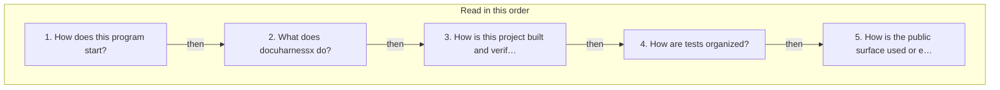
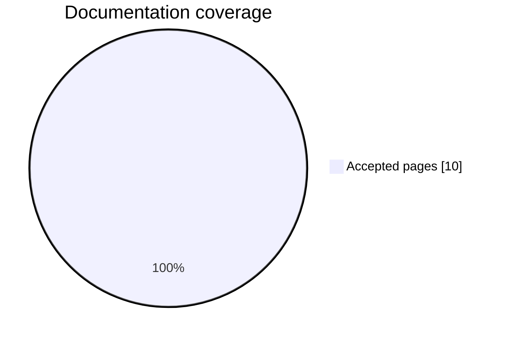
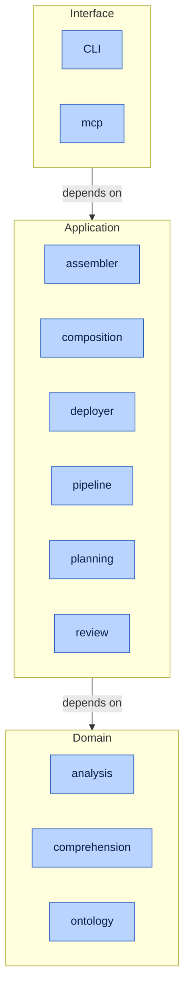
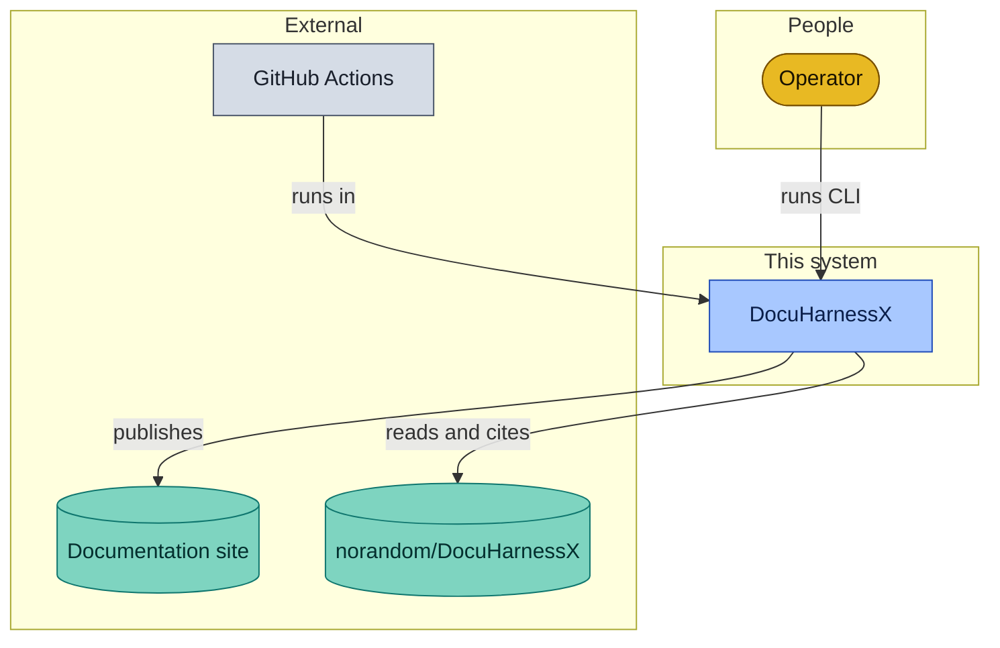
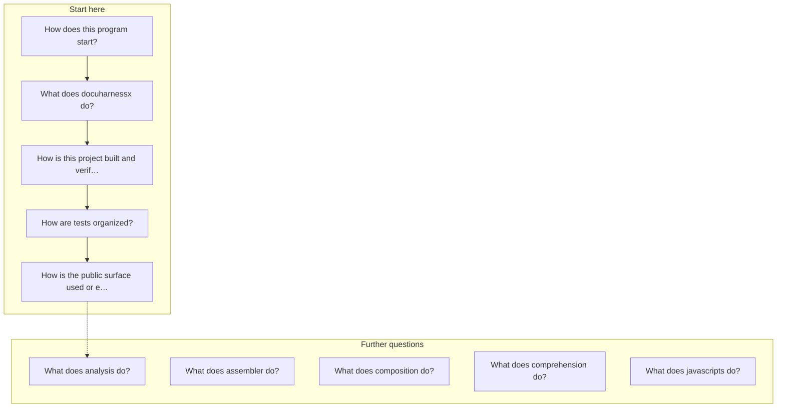
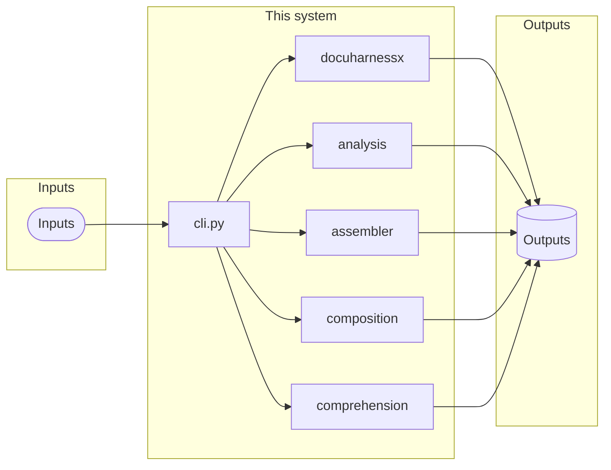
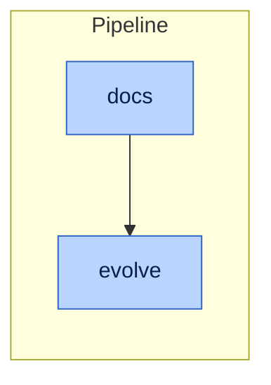

# DocuHarnessX

A short path through [`norandom/DocuHarnessX`](https://github.com/norandom/DocuHarnessX), in the order you would actually learn the project.

Read the numbered list first. Later questions cover individual modules.

<textarea class="dhx-jit__data" hidden readonly>{"children": [{"children": [{"children": [], "data": {"kind": "actor", "level": "context"}, "id": "actor:operator", "name": "Operator"}], "data": {"kind": "group", "level": "context"}, "id": "group:people", "name": "People"}, {"children": [{"children": [], "data": {"href": "startup-cli-py-126eba90/", "kind": "container", "level": "container"}, "id": "container:CLI", "name": "CLI"}, {"children": [], "data": {"href": "component-mcp-bdf519de/", "kind": "container", "level": "container"}, "id": "container:mcp", "name": "mcp"}], "data": {"kind": "band", "level": "container"}, "id": "band:interface", "name": "Interface"}, {"children": [{"children": [], "data": {"href": "component-assembler-d9228a8c/", "kind": "container", "level": "container"}, "id": "container:assembler", "name": "assembler"}, {"children": [], "data": {"href": "component-composition-e6f778c7/", "kind": "container", "level": "container"}, "id": "container:composition", "name": "composition"}, {"children": [], "data": {"href": "component-deployer-f8b1b75f/", "kind": "container", "level": "container"}, "id": "container:deployer", "name": "deployer"}, {"children": [], "data": {"kind": "container", "level": "container"}, "id": "container:pipeline", "name": "pipeline"}, {"children": [], "data": {"kind": "container", "level": "container"}, "id": "container:planning", "name": "planning"}, {"children": [], "data": {"kind": "container", "level": "container"}, "id": "container:review", "name": "review"}], "data": {"kind": "band", "level": "container"}, "id": "band:application", "name": "Application"}, {"children": [{"children": [], "data": {"href": "component-analysis-5fb37dc2/", "kind": "container", "level": "container"}, "id": "container:analysis", "name": "analysis"}, {"children": [], "data": {"href": "component-comprehension-87225edb/", "kind": "container", "level": "container"}, "id": "container:comprehension", "name": "comprehension"}, {"children": [], "data": {"kind": "container", "level": "container"}, "id": "container:ontology", "name": "ontology"}], "data": {"kind": "band", "level": "container"}, "id": "band:domain", "name": "Domain"}, {"children": [{"children": [], "data": {"kind": "external", "level": "context"}, "id": "external:ci", "name": "GitHub Actions"}, {"children": [], "data": {"kind": "store", "level": "context"}, "id": "external:docs", "name": "Documentation site"}, {"children": [], "data": {"kind": "store", "level": "context"}, "id": "external:repo", "name": "norandom/DocuHarnessX"}], "data": {"kind": "group", "level": "context"}, "id": "group:external", "name": "External"}], "data": {"href": "component-docuharnessx-3986831c/", "kind": "system", "level": "context"}, "id": "system", "name": "DocuHarnessX"}</textarea>

Click a name to open its page. Click a dot to recenter.

<button type="button" class="dhx-jit__reset">Center</button>

## Read in this order

1. [How does this program start?](startup-cli-py-126eba90.md)
2. [What does docuharnessx do?](component-docuharnessx-3986831c.md)
3. [How is this project built and verified?](build-pyproject-toml-a625bf0a.md)
4. [How are tests organized?](tests-tests-37e0cc9c.md)
5. [How is the public surface used or extended?](public-surface-init-py-a3934091.md)

## More questions

- [What does analysis do?](component-analysis-5fb37dc2.md)
- [What does assembler do?](component-assembler-d9228a8c.md)
- [What does composition do?](component-composition-e6f778c7.md)
- [What does comprehension do?](component-comprehension-87225edb.md)
- [What does javascripts do?](component-javascripts-2aa9650e.md)

