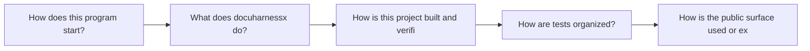
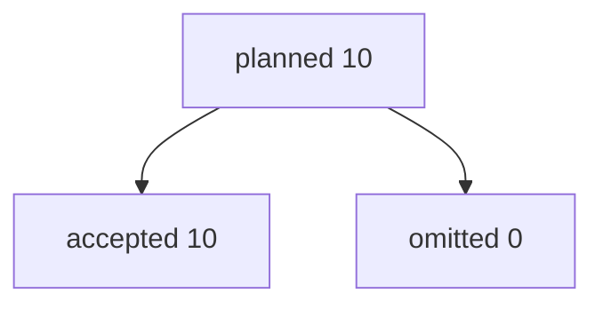
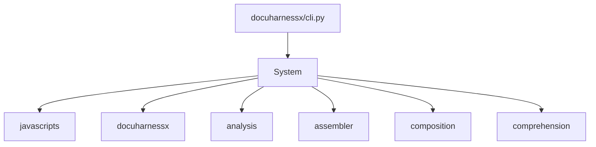
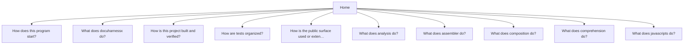
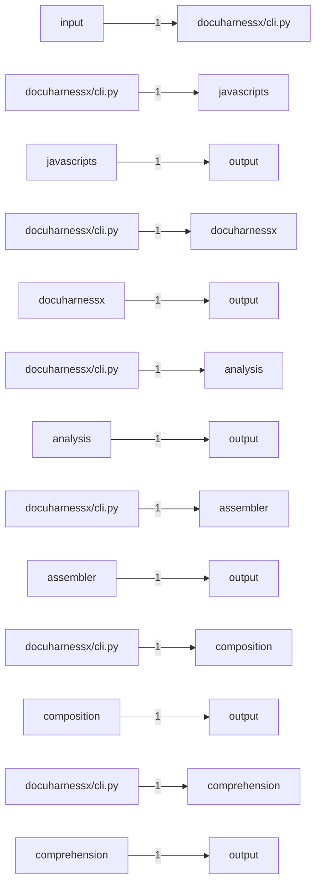
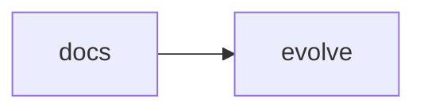

# DocuHarnessX

This site walks through 10 questions about [`norandom/DocuHarnessX`](https://github.com/norandom/DocuHarnessX), in the order you would actually learn the project.

Read the numbered list first. Later questions cover individual modules.

## Read in this order

1. [How does this program start?](startup-cli-py-126eba90.md)
2. [What does docuharnessx do?](component-docuharnessx-3986831c.md)
3. [How is this project built and verified?](build-pyproject-toml-a625bf0a.md)
4. [How are tests organized?](tests-tests-37e0cc9c.md)
5. [How is the public surface used or extended?](public-surface-init-py-a3934091.md)

## More questions

- [What does analysis do?](component-analysis-5fb37dc2.md)
- [What does assembler do?](component-assembler-d9228a8c.md)
- [What does composition do?](component-composition-e6f778c7.md)
- [What does comprehension do?](component-comprehension-87225edb.md)
- [What does javascripts do?](component-javascripts-2aa9650e.md)

