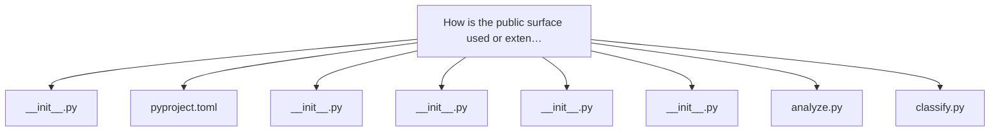
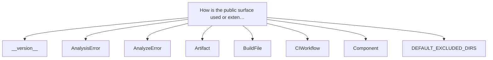
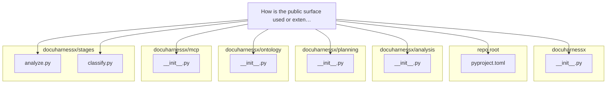

# How is the public surface used or extended?

All surface tests pass (65 passed). Here is the finished answer.

---

# How the public surface is used or extended

DocuHarnessX's `__init__.py` files are not thin "welcome" stubs: each one is the **single public namespace contract** for its package, and the repository treats `__all__` as an authoritative, machine-checked surface. The top-level `docuharnessx/__init__.py` is the one deliberately minimal case — it exports nothing but the version constant, `__version__ = "1.1.0"` with `__all__ = ["__version__"]` (`docuharnessx/__init__.py:5-7`), mirroring `version = "1.1.0"` in `pyproject.toml:3`. Every subpackage `__init__.py`, by contrast, is a dense re-export site that both *serves* downstream consumers and is *extended* additively as tasks land.

## The pattern: one namespace, identity-equal re-exports

Each pure-core package root imports names from its submodules and lists them in `__all__`. `docuharnessx/analysis/__init__.py:33-82` re-exports the whole deterministic analysis core — `analyze`, every detector (`detect_entrypoints`, `detect_public_surface`, `extract_dependencies`, `map_components`, …), the error hierarchy (`AnalysisError`, `IngestError`, `RepoAnalysisVersionError`), the frozen records (`RepoAnalysis`, `PublicSymbol`, `ScanStats`), the scanner (`scan`, `FileInventory`, `ScanLimits`, `DEFAULT_EXCLUDED_DIRS`), and the optional gated `enrich`. Its docstring states the design intent explicitly: downstream consumers "import from the single `docuharnessx.analysis` namespace rather than reaching into submodules" (`docuharnessx/analysis/__init__.py:10-14`). The same contract appears in `docuharnessx/planning/__init__.py:40-57` (classify/plan entry points plus `COVERAGE_PLAN_SCHEMA_VERSION`), `docuharnessx/ontology/__init__.py:19-69` (the `Vocabulary`/`SegmentStore` seams), `docuharnessx/mcp/__init__.py:51-64` (the eight MCP tool handlers plus `RefineSession`, `build_refine_server`, `run_stdio`), and the assembler/review/composition/deployer/pages/pipeline roots.

## How the surface is used

The stage adapters and pipeline code import from these package roots rather than submodules, which is exactly what the `__init__.py` contract exists to enable:

- `docuharnessx/stages/analyze.py:63` — `from docuharnessx.analysis import analyze, enrich`; `AnalyzeStage.on_step_end` calls `analyze(inventory)` and `enrich(...)` (`docuharnessx/stages/analyze.py:163-170`).
- `docuharnessx/stages/classify.py:68` — `from docuharnessx.planning import Classification, classify_repo`.
- `docuharnessx/stages/plan.py:71` — `from docuharnessx.planning import CoveragePlan, apply_relevance, plan_coverage`.
- `docuharnessx/pipeline/run.py:19` — `from docuharnessx.analysis import analyze, scan`.
- `docuharnessx/cli.py:699` and `cli.py:714` — `from docuharnessx.mcp import resolve_session` and `from docuharnessx.mcp import run_stdio`.
- `docuharnessx/bundle.py:53` — `from docuharnessx.stages import stages_builder`.

The ontology surface is the most heavily re-used: `docuharnessx/assembler/pages.py:37`, `docuharnessx/assembler/writer.py:65`, `docuharnessx/planning/classifier.py:36`, `docuharnessx/composition/blueprint.py:49`, and `docuharnessx/mcp/handlers.py:54` all pull `Segment`, `Vocabulary`, `AxisTerm`, `Subject`, and friends from `docuharnessx.ontology`. The skeleton even pins a dedicated re-export shim, `docuharnessx/_ontology.py:50-58`, that imports the frozen `SegmentStore`/`Vocabulary`/`load_vocabulary`/`vocabulary_to_config` seams from the package root so contract drift has "a single file" blast radius (`docuharnessx/_ontology.py:3-8`). Its docstring notes a subtlety: because Python resolves a package over a same-named module, a literal `docuharnessx/ontology.py` would be shadowed, so the shim name is the single import site (`docuharnessx/_ontology.py:17-25`).

## How the surface is extended

Extension is **additive re-export, never shadowing**. Every package `__init__.py` documents its growth task-by-task in the docstring — e.g. `docuharnessx/analysis/__init__.py:15-28` ("Task 1.2 adds the deterministic serde surface … Task 3.3 adds the remaining detectors … Task 4.2 adds the optional, gated enrichment surface") — and `docuharnessx/mcp/__init__.py:66-73` spells out the rule: "Each re-export is identity-equal to its submodule definition (no shadow copies)."

Two concrete extension mechanisms worth naming:

1. **Tests pin the contract.** `tests/test_planning_package_surface.py:38-55` asserts identity equality — `pkg.classify_repo is classifier.classify_repo`, `pkg.CoveragePlan is model.CoveragePlan`, `pkg.to_dict is serde.to_dict` — and `tests/test_planning_package_surface.py:95-101` verifies that `from docuharnessx.planning import *` binds *exactly* `__all__`. The same star-import/self-consistency checks exist for `docuharnessx.assembler` (`tests/test_assembler_package_surface.py:99-112`) and `docuharnessx.mcp` (`tests/test_mcp_package_surface.py:36-51`). The analysis surface is covered too: `tests/test_analysis_detectors_components_surface.py:127-136` (`test_task33_detectors_reexported_from_package`) asserts `map_components`, `detect_public_surface`, `detect_docs`, and `detect_artifacts` are both `hasattr(pkg, ...)` and in `pkg.__all__`. I ran these files: 65 passed.

2. **`docuharnessx/stages/__init__.py` is itself an extendable registry.** Rather than re-exporting names, it exposes `STAGES`, an ordered `(StageName, factory)` list (`docuharnessx/stages/__init__.py:60-69`), plus `register_stages(builder)` which appends the eight stage processors onto `PIPELINE_HOOK` with "append-don't-replace" semantics and increasing `order` (`docuharnessx/stages/__init__.py:108-132`), `stage_class_for(name)` mapping stage names to their `NoOpStage` subclasses (`docuharnessx/stages/__init__.py:88-105`), and `stages_builder()` for `control | stages_builder()` composition (`docuharnessx/stages/__init__.py:135-148`).

## The literal "public surface" symbol

Worth distinguishing from the package-surface machinery: `detect_public_surface(inv, repo_path)` is the analysis core's detector for a *target repo's* public API — Go exported `func`/`type` plus cobra/flag flags, and Python `__all__` entries plus argparse flags/subcommands, via shallow regexes (`docuharnessx/analysis/detectors.py:1244-1292`). It is re-exported by the package root (`docuharnessx/analysis/__init__.py:46`), composed into `RepoAnalysis.public_surface` by `analyze` (`docuharnessx/analysis/analyzer.py:130`), declared on the frozen model (`docuharnessx/analysis/model.py:253`), and round-tripped by serde through `_TUPLE_RECORD_FIELDS["public_surface"]` (`docuharnessx/analysis/serde.py:98`). Its contract — sorted by `(source, kind, name)`, conservative, "omits on doubt" — is exercised at length in `tests/test_analysis_detectors_components_surface.py:244-395`. So the `__init__.py` surface exposes a detector that itself detects surfaces: the package root advertises `detect_public_surface`, and that function is what harvests `PublicSymbol` records for whatever repository is being analyzed.
