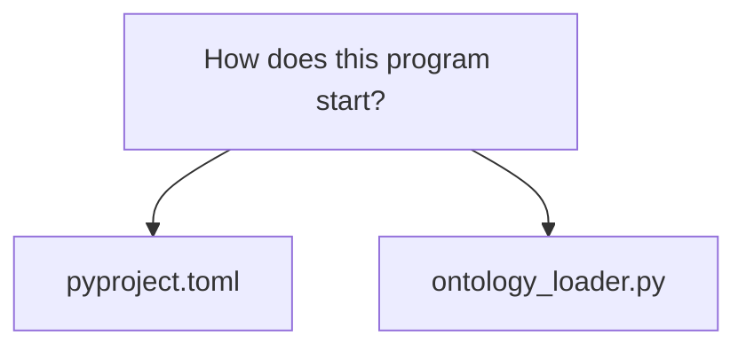
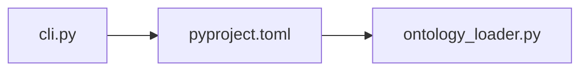
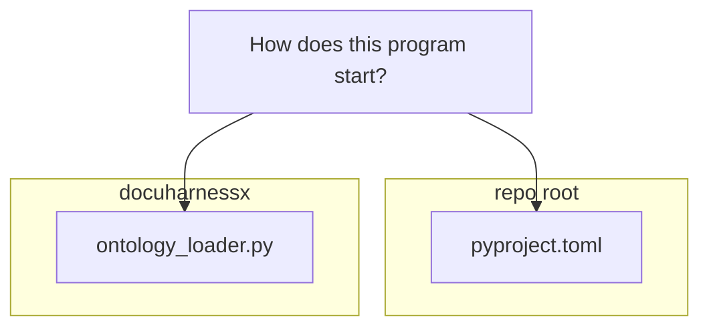

# How does this program start?

## How `dhx` starts: from console script to `cli.main` to the dispatched command

### Entry points

The program is installed as the `dhx` console script. `pyproject.toml:33` declares `dhx = "docuharnessx.cli:main"`, so a shell invocation of `dhx` (or `dhx --help`, `dhx run …`, etc.) is a direct call into `main()` in `docuharnessx/cli.py`. The module also supports running the file directly: `cli.py:1106-1107` has the guard `if __name__ == "__main__": raise SystemExit(main())`. There is no `docuharnessx/__main__.py`, so `python -m docuharnessx` is not an entry point — only the `dhx` script and `python docuharnessx/cli.py`.

`main(argv=None, *, model_config=None, max_steps=None, init_input=None)` is defined at `cli.py:1032`. Its production callers pass nothing; `model_config`, `max_steps`, and `init_input` are test seams (a fake `ModelConfig` provider, `max_steps=0` to force `budget_exceeded`, and a scripted line-reader for `dhx init` respectively — `cli.py:1033-1037`).

### Startup sequence inside `main`

1. **Load `.env` files** — `main` first calls `_load_env_files()` (`cli.py:1060`). That helper (`cli.py:112-127`) loads `.env` from the current working directory and then the project root (`_env_file_paths`, `cli.py:102-109`) via `python-dotenv`'s `load_dotenv(path, override=False)`, never overriding existing environment variables. It is skipped while pytest is running (`PYTEST_CURRENT_TEST` check, `cli.py:118`) so the credential-free suite cannot pick up local secrets.

2. **Build and run the argument parser** — `parser = build_parser()` (`cli.py:1061`). `build_parser` (`cli.py:185-328`) creates an `argparse.ArgumentParser` with `prog="dhx"` and three subcommands via `add_subparsers(dest="command", ...)` (`cli.py:201`): `run` (`cli.py:204-254`, with `target_repo`, `--out`, `--config`, `--roles`, `--deploy-mode`, `-v/--verbose`), `init` (`cli.py:257-283`, with `project_dir`, `--default`, `--force`, `-v`), and `mcp` (`cli.py:292-326`, mirroring `run`'s `target_repo`/`--out`/`--config`/`-v`).

3. **Normalize the bare invocation form** — before parsing, `main` resolves `argv = sys.argv[1:]` when `None` (`cli.py:1069-1070`) and passes it through `_normalize_argv(argv)` (`cli.py:1071`). `_normalize_argv` (`cli.py:129-158`) implements the spec's bare form `dhx <target-repo> --out DIR --config YAML` (Req 4.1, 4.8): if the first token is a positional that is *not* one of the recognised subcommands in `_SUBCOMMANDS = frozenset({"run", "init", "mcp"})` (`cli.py:97`), it prepends `"run"` and returns `["run", *args]` (`cli.py:158`). Leading flags and explicit subcommands pass through unchanged (`cli.py:154-155`).

4. **Handle the no-command case** — after `parser.parse_args(...)`, if `args.command is None` (e.g. bare `dhx` with no arguments), `main` prints help and returns exit code `2` (`cli.py:1073-1075`).

5. **Guard the runtime dependency** — for any real command, `_require_harnessx()` (`cli.py:1079`) is called before dispatch. It defers `import harnessx` to call time (`cli.py:172-173`) so `dhx --help` does not require it, and on `ImportError` raises `DependencyError` naming the exact install command (`cli.py:174-182`). The `mcp` command has a parallel guard `_require_mcp()` (`cli.py:665-687`) that checks `mcp.server` / `mcp.server.stdio`.

6. **Configure logging** — `_configure_run_logging(getattr(args, "verbose", False))` (`cli.py:1082`) sets the console level to `INFO` with `-v` or `WARNING` otherwise via `harnessx.logging.configure_logging` (`cli.py:974-978`), configures `structlog` (`cli.py:988-997`), installs two noise-suppressing filters — `_DropHarnessSerializationNoise` (`cli.py:920-935`) and `_DropEventLoopClosedNoise` (`cli.py:938-958`) — and, when not verbose, silences LiteLLM's loggers (`cli.py:1017-1029`).

7. **Dispatch on `args.command`** (`cli.py:1084-1098`):
   - `"run"` → `_run_command(args, model_config=model_config, max_steps=max_steps)` (`cli.py:1085-1088`);
   - `"init"` → `_init_command(args, input_fn=init_input)` (`cli.py:1089-1090`);
   - `"mcp"` → `_mcp_command(args)` (`cli.py:1091-1092`);
   - anything else → stderr message and exit `1` (`cli.py:1094-1098`).

   The whole dispatch is wrapped in `except DocuHarnessXError` (`cli.py:1099-1103`), which prints `<ErrorType>: <message>` to stderr and returns exit code `1` — the single non-zero failure contract for every typed boundary error.

### What the `run` path does once started

`_run_command` (`cli.py:633-662`) calls `prepare_run(args, model_config=model_config)` (`cli.py:646`), then `orchestrate_run(prepared, max_steps=max_steps)` (`cli.py:647`), and finally prints the `report.json` location (`cli.py:648-661`), returning the outcome's exit code.

`prepare_run` (`cli.py:431-520`) validates in order:
1. **Target first** — `_validate_target_repo(args.target_repo)` (`cli.py:460`) raises `TargetRepoError` for a missing path, a non-directory, or no path at all (`cli.py:411-428`).
2. **Output directory** — `--out` absolutized, or the documented default `<target>/.docuharnessx/out` (`cli.py:463-467`, `_DEFAULT_OUT_RELPATH` at `cli.py:374`).
3. **Ontology** — `load_project_vocabulary(target_repo)` from `docuharnessx/ontology_loader.py:471` (`cli.py:471`); an absent `.docuharnessx/ontology.yaml` yields the default profile plus a printed `dhx init` hint (`cli.py:472-479`).
4. **Config** — `load_config(config_path=args.config, cli_overrides=..., vocabulary=vocabulary)` (`cli.py:494-498`) overlays CLI overrides (`out_dir`, `roles` from `_split_roles`, `deploy_mode`) on the YAML file.
5. **Model** — unless a `ModelConfig` was injected, `resolve_model(config.model)` from `docuharnessx/model_resolver.py` is tried, and a `ModelResolutionError` is swallowed to `None` (`cli.py:503-509`) — a no-model run is an honest-empty run, not a failure. The product is a frozen `PreparedRun` (`cli.py:513-520`, dataclass at `cli.py:331-353`).

`orchestrate_run` (`cli.py:582-630`) imports the pipeline under an alias so as not to shadow this module's `RunOutcome` — `from docuharnessx.pipeline.run import run_pipeline as run_explore_pipeline` (`cli.py:601`) — makes `prepared.out_dir` (`cli.py:603`), then calls `run_explore_pipeline(repo_path=..., out_dir=..., model=..., deploy_mode=...)` (`cli.py:604-609`). If the outcome has at least one accepted page, `_publish_if_accepted` (`cli.py:611-616`, defined at `cli.py:523-579`) invokes `docuharnessx.deployer.deploy_site` with a `_PythonMkdocsRunner` that rewrites `mkdocs` to `sys.executable -m mkdocs` (`cli.py:551-556`). A completed run — including zero accepted pages — returns `exit_reason="done"`, `exit_code=EXIT_OK` (0) (`cli.py:625-630`); `exit_code_for_reason` (`cli.py:386-396`) maps only `"done"` to 0 and every other reason to `EXIT_RUN_FAILED` (1).

Downstream, `run_pipeline` itself (`pipeline/run.py:86`) sequences `scan(repo_path)` → `analyze(inventory)` → `plan_questions(analysis)` → `write_questions(plan.questions, repo_path=..., model=...)`, then writes the `RunReport`, persists accepted pages, and assembles a site only when accepted ≥ 1 (`pipeline/run.py:94-108`, `RunOutcome` return at `pipeline/run.py:110`).

### The other two commands' startup

- **`init`** — `_init_command` (`cli.py:850-917`) decides interactivity from an injected `input_fn` or `sys.stdin.isatty()` (`cli.py:885`), gathers roles/intents/subjects via `_prompt_axis_terms`/`_prompt_subjects` (`cli.py:782-847`), then dispatches to `docuharnessx.ontology_setup.run_init` (`cli.py:880`, `ontology_setup.py:129`) which writes `<project>/.docuharnessx/ontology.yaml` (refusing overwrite without `--force` via `FileExistsError`, `cli.py:906-914`). Note `init` runs without the `_require_harnessx` gate — no harness is run.
- **`mcp`** — `_mcp_command` (`cli.py:719-779`) runs `_require_mcp()` first (`cli.py:750`), validates the optional `target_repo` with the same `_validate_target_repo` (`cli.py:761`), resolves a `RefineSession` via `resolve_session` (`cli.py:763`, defined at `mcp/session.py:99`), and then blocks serving the stdio protocol through `_run_stdio_blocking(session)` (`cli.py:778`), which wraps the async `docuharnessx.mcp.run_stdio` in `asyncio.run(...)` (`cli.py:714-716`; `run_stdio` itself lives at `mcp/server.py:206`). Its launcher notes go to stderr so stdout stays the MCP channel (`cli.py:764-774`).

In short: the `dhx` console script (`pyproject.toml:33`) lands in `main()` (`cli.py:1032`), which loads `.env`, parses and normalizes argv, guards the `harnessx` dependency, configures logging, and dispatches to `_run_command` / `_init_command` / `_mcp_command` (`cli.py:1084-1092`) — with every typed boundary failure caught at `cli.py:1099-1103` and mapped to a non-zero exit.
