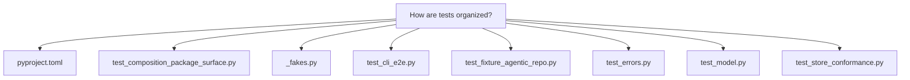
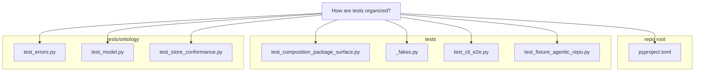

```mermaid
flowchart TB
  n0["How are tests organized?"]
  n1["tests"]
  n2["tests/ontology/test_errors.py"]
  n3["tests/ontology/test_hardening.py"]
  n4["tests/ontology/test_model.py"]
  n5["tests/ontology/test_normalize_prefix.py"]
  n6["tests/ontology/test_package_import.py"]
  n7["tests/ontology/test_public_api.py"]
  n8["tests/ontology/test_schema.py"]
  n9["pytest"]
  n10["pyproject.toml"]
  n11["test_composition_package_surface.py"]
  n12["_fakes.py"]
  n13["test_cli_e2e.py"]
  n14["test_fixture_agentic_repo.py"]
  n15["test_errors.py"]
  n16["test_model.py"]
  n17["test_store_conformance.py"]
  n0 --> n1
  n0 --> n2
  n0 --> n3
  n0 --> n4
  n0 --> n5
  n0 --> n6
  n0 --> n7
  n0 --> n8
  n0 --> n9
  n0 --> n10
  n0 --> n11
  n0 --> n12
  n0 --> n13
  n0 --> n14
  n0 --> n15
  n0 --> n16
  n0 --> n17
```

# How are tests organized?

# How are tests organized?

## One `tests/` tree, pytest discovery via `pyproject.toml`

All tests live in a single `tests/` directory at the repo root. The only pytest configuration in the project is in `pyproject.toml:46-47`, which sets `testpaths = ["tests"]`, and the `dev` extra declares the one test dependency, `pytest>=8.0` (`pyproject.toml:28-30`). There is no `conftest.py` anywhere in the tree, and `tests/` has no `__init__.py`; running `.venv/bin/python -m pytest --collect-only -q` in the repo root collects **2172 tests**. The suite is flat at the top level — 113 `test_*.py` modules — with a single nested subdirectory, `tests/ontology/`, holding 16 more modules for the ontology engine.

## Filenames mirror `docuharnessx` module layout

The naming convention maps one test file to exactly one package module or boundary:

- `tests/test_analysis_analyzer.py` → `docuharnessx/analysis/analyzer.py`
- `tests/test_planning_planner.py` → `docuharnessx/planning/planner.py`
- `tests/test_review_judge.py` → `docuharnessx/review/judge.py`
- `tests/test_mcp_session.py` → `docuharnessx/mcp/session.py`
- `tests/test_deployer_workflow.py` → `docuharnessx/deployer/workflow.py`

The subsystem prefixes form recognizable groups: 14 `planning`, 14 `composition`, 14 `assembler`, 13 `mcp`, 12 `analysis`, 9 `review`, 8 `deployer`, 8 `cli`, 3 `pipeline`, plus one-offs like `test_config.py`, `test_context.py`, `test_pages_model.py`, and `test_model_resolver.py`. A recurring boundary variant is the package-surface suite (e.g. `tests/test_composition_package_surface.py`), which asserts that namespace re-exports are *identity-equal* to their submodule definitions, e.g. `pkg.build_blueprint is blueprint.build_blueprint` (`tests/test_composition_package_surface.py:24-56`).

The one structural deviation is `tests/ontology/`, which mirrors the `docuharnessx/ontology/` package module-for-module: `test_errors.py`, `test_model.py`, `test_schema.py`, `test_serializer.py`, `test_vocabulary.py`, `test_validation.py`, the two store suites (`test_store_inmemory.py`, `test_store_filesystem.py`), and the shared conformance suite `test_store_conformance.py`.

## Shared infrastructure instead of conftest

Two plain modules/directories provide shared setup:

1. **`tests/_fakes.py`** — the test-only fake module for credential-free runs. Its docstring states CI has no live API keys, so any test that binds a model injects `FakeProvider` instead of a real provider (`tests/_fakes.py:1-8`). Its `__all__` (`tests/_fakes.py:44-54`) exports `FakeProvider`, `RoutingFakeProvider`, `ScriptedAgentProvider`, `ScriptedReviewAgentProvider`, `ReplacementStage`, `make_replacement_stage`, `PyMkdocsNoPushRunner`, and the constants `SCRIPTED_AGENT_BODY` / `SCRIPTED_AGENT_READS`. `FakeProvider` subclasses `harnessx.providers.base.BaseModelProvider` and returns a single end-turn `ModelResponseEvent`, so a real HarnessX run loop reaches `exit_reason='done'` without a network call (`tests/_fakes.py:57-81`). Tests import it both ways — `from _fakes import FakeProvider` in `tests/test_cli_e2e.py:15` and `from tests._fakes import ...` in `tests/test_mcp_session.py` / `tests/test_pipeline_run.py`.

2. **`tests/fixtures/agentic_repo/`** — a small realistic fixture repository (`README.md`, `app.py`, `config.py`, `engine.py`, `pyproject.toml`). It is rooted from test files as `_FIXTURE_REPO = Path(__file__).parent / "fixtures" / "agentic_repo"` (`tests/test_fixture_agentic_repo.py:41`) and `shutil.copytree`'d into `tmp_path` before being driven through real harness runs (`tests/test_fixture_agentic_repo.py:97`). That file doubles as a unit test of the fixture itself, checking that the scripted agent body's `path:line` citations actually resolve to symbols like `class Application` / `def start`.

## Suites are anchored to spec tasks and requirement numbers

Module docstrings open by naming the SDLC task and the "Req" numbers they pin. `tests/ontology/test_errors.py:1-10` opens with "Tests for the typed error and result model (task 1.2)" and covers the `errors` component's discriminated error types; `tests/test_planning_planner.py` pins `plan_coverage` "Observable completion (tasks.md 3.2)" with `Requirements: 5.1, 5.2, 5.3, 5.4, 5.5, 6.1, 8.1`. Inside a module, `# --- #` banner comments group tests by contract area — e.g. "Base / discriminated-error contract", "Config-level error (Req 1.6)", "ValidationResult (per-segment) — Req 6.6" in `tests/ontology/test_errors.py:19-21,63-65,168-170`. Some suites go further and group into classes: `tests/test_analysis_core_validation.py` defines `TestScannerEdgeCases` (line 193), `TestLanguageOrdering` (316), `TestSerdeContract` (458), `TestDetectorSignals` (506), and `TestEndToEndDeterminism` (612).

## Depth is layered: unit → conformance → integration → e2e

- **Unit**: one file per module, mostly self-contained, using `tmp_path` for file-touching tests. The parametrize style is visible in `tests/ontology/test_model.py:67-72` (`@pytest.mark.parametrize("prefix", ["component", "tech", "artifact", "topic"])`).
- **Cross-adapter conformance**: `tests/ontology/test_store_conformance.py:83-94` runs a single set of scenario bodies against *both* store adapters via `@pytest.fixture(params=["in_memory", "filesystem"])`, so the same assertions exercise `InMemorySegmentStore` and `FilesystemSegmentStore` with no copy-pasted second suite.
- **Integration**: `tests/test_pipeline_run.py` pins `PipelineRunner` (analyze → plan → write/gate → assemble → report) with a no-model run against `tests/fixtures/agentic_repo`; `tests/test_pipeline_integration.py` wires the real planner, writer, and assembler together, substituting only the model.
- **End-to-end, still offline**: `tests/test_deploy_build_e2e_5_3.py` runs a real `mkdocs build` through `_NoPushRealRunner`, a `DefaultCommandRunner` subclass that fails loudly if the orchestrator ever reaches the `gh-deploy` push (line 79), guarding optional deps with `pytest.importorskip("mkdocs")` / `importorskip("material")` (lines 61-62). `tests/test_mcp_refine_loop_e2e.py` drives the whole MCP refine loop over a throwaway copy of the fixture repo with `ScriptedAgentProvider`.
- **Reference repository**: `tests/test_analysis_reference_repo.py:54` sets `REFERENCE_REPO = "/home/mc/Source/malware_hashes"` and runs `scan() -> analyze()` against that real polyglot Go project to assert analysis shape and run-to-run determinism.
- **Seam tests**: files named `*_seam.py` (`test_assembled_site_seam.py`, `test_review_report_seam.py`, `test_written_segments_seam.py`, `test_deploy_result_seam.py`) pin the append-only slot-key constants and `set_*()/get_*()` accessor pairs added to `docuharnessx/types.py` and `docuharnessx/context.py`. `tests/test_mcp_regression_seams_6_2.py` is a cross-feature regression suite that asserts the MCP-refine feature stayed inside its declared blast radius (diff boundary vs `HEAD`, frozen data seams untouched).

## Determinism and no-network/no-LLM are first-class concerns

The suite enforces the project's core constraints directly. `tests/ontology/test_store_conformance.py:384` (`test_ontology_imports_no_network_or_llm_library`) re-imports every `docuharnessx.ontology.*` module in a fresh subprocess and asserts no network/LLM library leaks into `sys.modules`, and `:415` (`test_ontology_third_party_imports_limited_to_yaml`) pins that the only permitted third-party top-level import is `yaml`. `tests/test_deploy_build_e2e_5_3.py:465` (`test_emit_ci_workflow_orchestrator_opens_no_socket`) monkeypatches `socket.socket` to prove the deploy orchestrator opens no socket of its own. Robustness regressions in `tests/ontology/test_hardening.py:38-45` pin that malformed inputs surface as typed `OntologyError` subclasses (e.g. `MalformedFrontmatterError`), never raw `ValueError` / `FileNotFoundError`.

In short: pytest-driven with `testpaths = ["tests"]`, no conftest, one-file-per-module naming that mirrors `docuharnessx` (with `tests/ontology/` as the one nested mirror), shared fakes (`tests/_fakes.py`) and a fixture repo (`tests/fixtures/agentic_repo`) in place of conftest fixtures, docstrings tracing each suite to a spec task and requirement numbers, and a deliberate ladder from unit through conformance/integration to offline end-to-end runs that keeps every test credential-free and deterministic.
